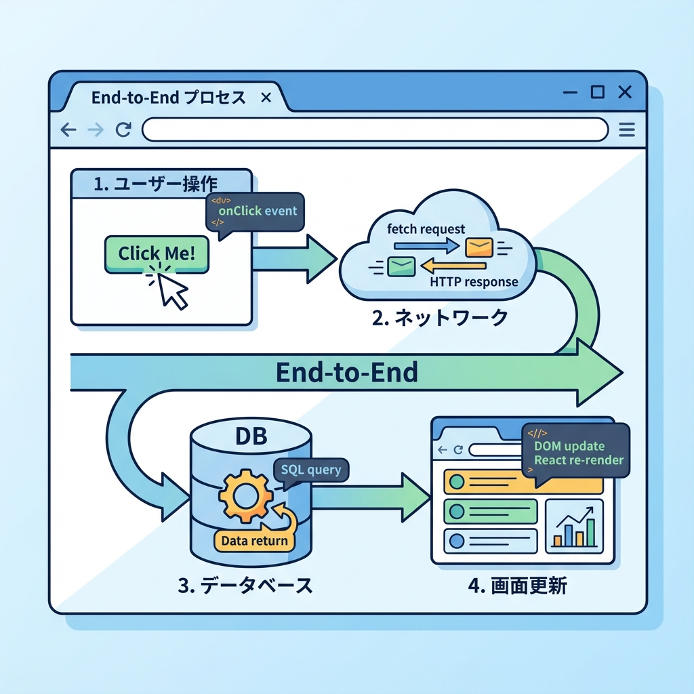
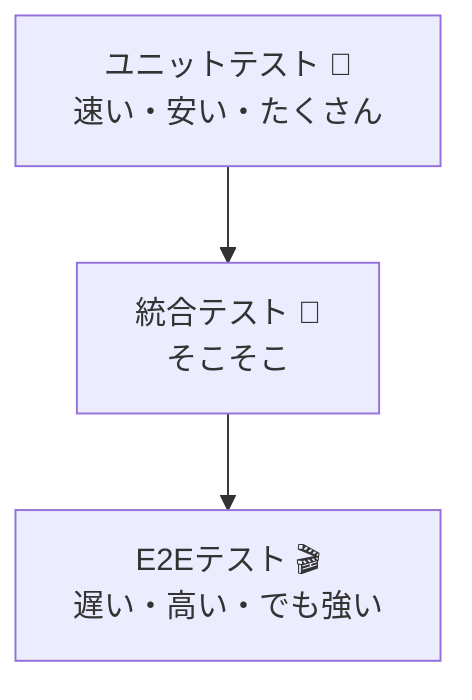

# 第212章：E2E（Playwright等）の価値（本番に近い）🎬

### この章でわかること 🎯

* **E2Eテストってなに？**（ざっくり理解）🧠
* **なんで価値が高いの？**（本番に近い＝強い理由）💪
* **どこまでやるのがちょうどいい？**（やりすぎ注意⚠️）
* **Next.jsアプリで“効く”E2Eの考え方**（テストの選び方）🧭

---

## 1) E2Eってなに？🤔✨

E2E（End-to-End）テストは、超ざっくり言うと…

**「ユーザーが実際にやる操作を、ブラウザでそのまま再現するテスト」**です！🧑‍💻➡️🖱️➡️🌐

たとえば👇

* ログインする🔐
* 画面遷移する🛣️
* フォーム送信する📨
* データが画面に表示される👀
* エラー時にちゃんと案内が出る🧯

みたいな「最初から最後まで」を通します 🎬✨

---

## 2) E2Eが“強い”最大の理由 💥（本番に近いから！）

E2Eの価値はココです👇

### ✅ 「結局、動く？」を保証しやすい 🙆‍♀️🎉

ユニットテストやコンポーネントテストが全部OKでも、
**画面遷移や認証、API、Cookie、環境差分**みたいなところで「本番だけ壊れる」って起きがち…😇

E2Eはそこをまとめて確認できるので、
**“ユーザー体験として成立してる？”**を守りやすいです🫶✨

### ✅ “接着剤”が壊れてるのに気づける 🧩💔

アプリって、だいたいこんな感じでつながってます👇
UI ↔ ルーティング ↔ 認証 ↔ API ↔ DB

どれか1個がズレると、全体としては破綻します😵‍💫
E2Eはこの「つなぎ目」の事故を見つけるのが得意です🔍✨

---

## 3) テスト全体の中でのE2Eの立ち位置 🏔️🧪

E2Eは万能じゃなくて、**コスト高め**です💰💦
だから「量を増やす」より「重要な数本を通す」が正義になりやすいです😌✨

（イメージ図👇）

* **ユニット**：細かいロジックを高速チェック⚡
* **統合**：部品同士のつながりチェック🧩
* **E2E**：ユーザー操作として成立してるかチェック🎬

---

## 4) E2Eが特に効くポイント（Next.jsあるある）🧠✨

Next.js（App Router）だと、E2Eが刺さりやすいのはこのへん👇

* **ルーティング＆画面遷移が正しいか**🛣️
* **認証が絡む動線**（ログイン→保護ページ→ログアウト）🔐
* **フォーム送信**（Server Actions / Route Handlers）📨
* **エラー時の導線**（not-found / error / 失敗メッセージ）🧯
* **本番っぽい環境差分**（環境変数、Cookie、リダイレクト）🌍

---

## 5) 「E2Eで何をテストする？」の選び方 🗺️✨

E2Eは、**全部やろうとすると死にます**😇（時間も手間も…）

おすすめの考え方は👇

### 🌟 “代表的なユーザー動線”だけ通す

* 例：

  * 新規登録→ログイン→マイページを見る👤
  * 記事一覧→記事詳細→検索する🔎
  * TODO追加→一覧に反映→削除🗑️

### 🌟 “売りの機能”を守る

あなたのアプリの価値の中心だけは、E2Eで守ると安心です💎✨

### 🌟 壊れたら致命傷なところ

* 課金導線💳
* ログイン🔐
* データ保存💾
  ここはE2Eの優先度が高いです📌

---

## 6) E2Eの弱点も知っておこう（でも怖がらない）🧸⚠️

### 😵‍💫 弱点1：遅い

ブラウザ操作だから時間がかかりがち⏳
→ **本数を絞る**のがコツ！

### 😵‍💫 弱点2：壊れやすい（フレーク）

ネットワークやタイミングで「たまに落ちる」ことがある😢
→ **待ち方・選び方**が大事！

### 😵‍💫 弱点3：原因特定が難しい

落ちた時に「どこが悪い？」が分かりにくいことも🌀
→ **スクショ/動画/ログ**が助けになります📸🎥

---

## 7) 壊れにくいE2Eにするコツ（価値を最大化）🧷✨

ここ超大事です！💡

* **見た目（文言）に依存しすぎない**🧊

  * 文言は変わりやすいので、頼りすぎ注意⚠️
* **“安定した目印”を用意する**（例：`data-testid`）🏷️
* **1テストで欲張りすぎない**🍰

  * 1本が長いと壊れた時つらい
* **本番に近い環境で回す**（できればCI/プレビュー）🚀
* **ログインは使い回す工夫**（テスト時間短縮）⏱️

---

## 8) E2Eが入ると、開発の安心感がこう変わる 🫶✨

「変更しても大丈夫かな…」の不安が減ります😌🌸
特に、画面やルーティングや認証って、触るの怖いですよね…🥺

E2Eが数本あるだけで👇

* リファクタしやすい🧼
* 機能追加が怖くない🚀
* 本番事故が減りやすい🛡️

“安心を買う”ってこういう感じです💰✅

---

## まとめ 🎀

* E2Eは **「ユーザー操作をブラウザで再現するテスト」**🎬
* 価値は **「本番に近い形で、動線が成立してるか守れる」**こと💪
* ただし **遅い＆壊れやすい**ので、**重要な動線を数本だけ**が最強🔥
* Next.jsだと **認証・画面遷移・フォーム・エラー導線**が特にE2E向き🔐🛣️📨🧯

次の章（第213章）で、実際に「ログイン→TODO追加」みたいな動線をE2Eで通す練習に入ると、めちゃ気持ちいいです🎮✨
