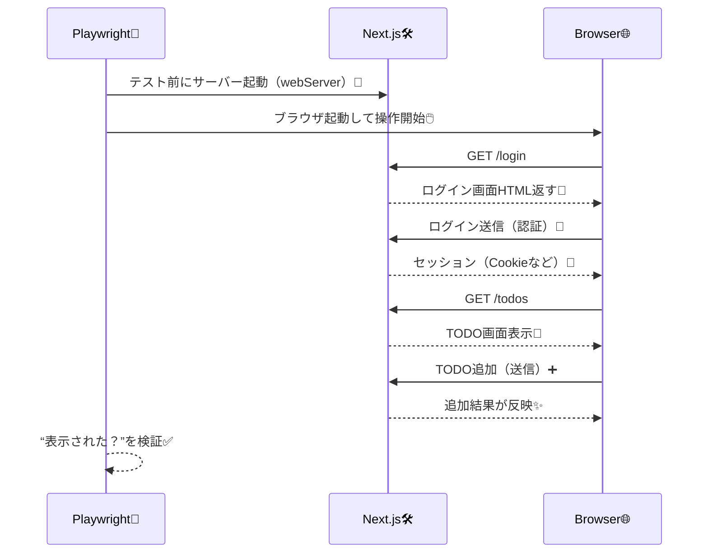

# 第213章：練習：ログイン→TODO追加までE2Eで通す🔐

今日は **E2Eテスト（本物のブラウザ操作）** で、**「ログイン → TODO追加」** を最後まで自動で通します🎬✨
ツールは **Playwright** を使うよ〜🧪🖱️（Next.js公式も Playwright でのセットアップガイドを出してるよ📘） ([Next.js][1])

---

### 今日できるようになること🎯✨

* ✅ ブラウザを自動で動かして「ログイン→TODO追加」を再現できる
* ✅ “動いた！”をテストで保証できる（安心感が爆上がり🫶）
* ✅ 失敗した時にUIでデバッグできる（PlaywrightのUIモード便利👀） ([Playwright][2])

---

### 図解：E2Eが通る流れ（ざっくり）🧠➡️🖥️




---

## 1) Playwrightを入れる（WindowsでOK）🪟✨

ターミナル（PowerShell）でプロジェクト直下にて👇

```bash
npm i -D @playwright/test
npx playwright install
```

* `npx playwright install` は **Chromium/Firefox/WebKit** などの実行に必要なものを入れてくれるよ🧰 ([Playwright][3])

---

## 2) テスト置き場を作る📁✨

プロジェクト直下に `e2e` フォルダを作るよ〜📦

```bash
mkdir e2e
```

---

## 3) Playwrightの設定（Next.jsを自動で起動させる）⚙️🚀

`playwright.config.ts` をプロジェクト直下に作って👇
（ポイント：`webServer` で Next.js を立ち上げてからテストを走らせる💡） ([Playwright][4])

```ts
import { defineConfig, devices } from '@playwright/test';
import 'dotenv/config';

export default defineConfig({
  testDir: './e2e',
  use: {
    baseURL: 'http://127.0.0.1:3000',
    trace: 'on-first-retry',
  },
  webServer: {
    command: 'npm run dev -- -p 3000',
    url: 'http://127.0.0.1:3000',
    reuseExistingServer: !process.env.CI,
    timeout: 120 * 1000,
  },
  projects: [
    { name: 'chromium', use: { ...devices['Desktop Chrome'] } },
  ],
});
```

ついでに `dotenv` も入れよ（テスト用ログイン情報を環境変数で扱える🙂）

```bash
npm i -D dotenv
```

---

## 4) テスト用ログイン情報（例）を用意する🔐🧪

プロジェクト直下に `.env.e2e` を作って、こんな感じでOK👇
（※本物の秘密情報は入れないでね🙅‍♀️ ここはローカル練習用で！）

```env
E2E_EMAIL=test@example.com
E2E_PASSWORD=testpass
```

> もし実アプリが「テスト用ユーザー」を持ってない場合は、DBに1件だけ作っておく（seed）か、開発環境だけログインできるユーザーを用意するのが定番だよ🌱✨

---

## 5) 画面側に“テストしやすい目印”を付ける（超重要）👀✨

Playwrightは **ラベル（label）やrole** を頼りに要素を探すのが安定だよ🧸
最低限、ログインフォームとTODO入力に **ラベル** がある状態にしてね✅

例（イメージ）：

* ログイン画面：`メールアドレス` / `パスワード` / `ログイン` ボタン
* TODO画面：見出し `TODO`、入力ラベル `新しいTODO`、`追加` ボタン

（ここが揃ってると、テストがめっちゃ書きやすい☺️✨）

---

## 6) E2Eテストを書く（ログイン→TODO追加）📝✅

`e2e/login-and-add-todo.spec.ts` を作って👇

```ts
import { test, expect } from '@playwright/test';

test('ログインしてTODOを追加できる🔐➕', async ({ page }) => {
  const email = process.env.E2E_EMAIL ?? 'test@example.com';
  const password = process.env.E2E_PASSWORD ?? 'testpass';
  const todoText = `E2E Todo ${Date.now()}`;

  // 1) ログイン画面へ
  await page.goto('/login');

  // 2) 入力してログイン
  await page.getByLabel('メールアドレス').fill(email);
  await page.getByLabel('パスワード').fill(password);
  await page.getByRole('button', { name: 'ログイン' }).click();

  // 3) TODOページに来たことを確認
  await expect(page).toHaveURL(/\/todos/);
  await expect(page.getByRole('heading', { name: 'TODO' })).toBeVisible();

  // 4) TODO追加
  await page.getByLabel('新しいTODO').fill(todoText);
  await page.getByRole('button', { name: '追加' }).click();

  // 5) 追加されたことを確認（リストに出てる？）
  await expect(page.getByRole('listitem', { name: todoText })).toBeVisible();

  // 6) おまけ：リロードしても残る？（永続化してるなら強い✅）
  await page.reload();
  await expect(page.getByRole('listitem', { name: todoText })).toBeVisible();
});
```

💡もし `getByRole('listitem', { name: todoText })` が上手く拾えないUIなら、`data-testid` を付けるのが最強の保険だよ🛟✨
（例：`<li data-testid="todo-item">...</li>` みたいに）

---

## 7) 実行してみる🏃‍♀️💨

```bash
npx playwright test
```

UIでデバッグしたいならこれ👇（超おすすめ👀✨） ([Playwright][2])

```bash
npx playwright test --ui
```

---

## よくあるコケポイント集🧯（ここ見ると救われる🥹）

* 😵 **要素が見つからない**
  → ラベル（`label`）を付ける / ボタン文言を安定させる / `data-testid` を付ける✨
* 😵 **ログイン後の遷移が遅くて落ちる**
  → `expect(page).toHaveURL(...)` の前後に余計な `wait` は置かず、**期待値で待つ**のが基本✅
* 😵 **テストがたまに落ちる（不安定）**
  → `trace: 'on-first-retry'` が効くよ！失敗時に状況が見える🕵️‍♀️✨ ([Playwright][5])
* 😵 **サーバー起動が面倒**
  → `webServer` 設定で “勝手に起動→終わったら閉じる” ができるよ🚀 ([Playwright][4])

---

## 今日のゴール達成チェック✅🎉

* [ ] `npx playwright test` でテストが通った✨
* [ ] 「ログイン→TODO追加→表示確認」まで自動でできた🔐➕
* [ ] `--ui` で失敗時に追える感覚が掴めた👀🧠

ここまで通せたら、もう **“アプリとして動く保証”** を1本持てたってことだよ〜🥳🫶

[1]: https://nextjs.org/docs/pages/guides/testing/playwright?utm_source=chatgpt.com "Testing: Playwright"
[2]: https://playwright.dev/docs/test-cli?utm_source=chatgpt.com "Command line"
[3]: https://playwright.dev/docs/intro?utm_source=chatgpt.com "Installation"
[4]: https://playwright.dev/docs/test-webserver?utm_source=chatgpt.com "Web server"
[5]: https://playwright.dev/docs/test-configuration?utm_source=chatgpt.com "Configuration"
