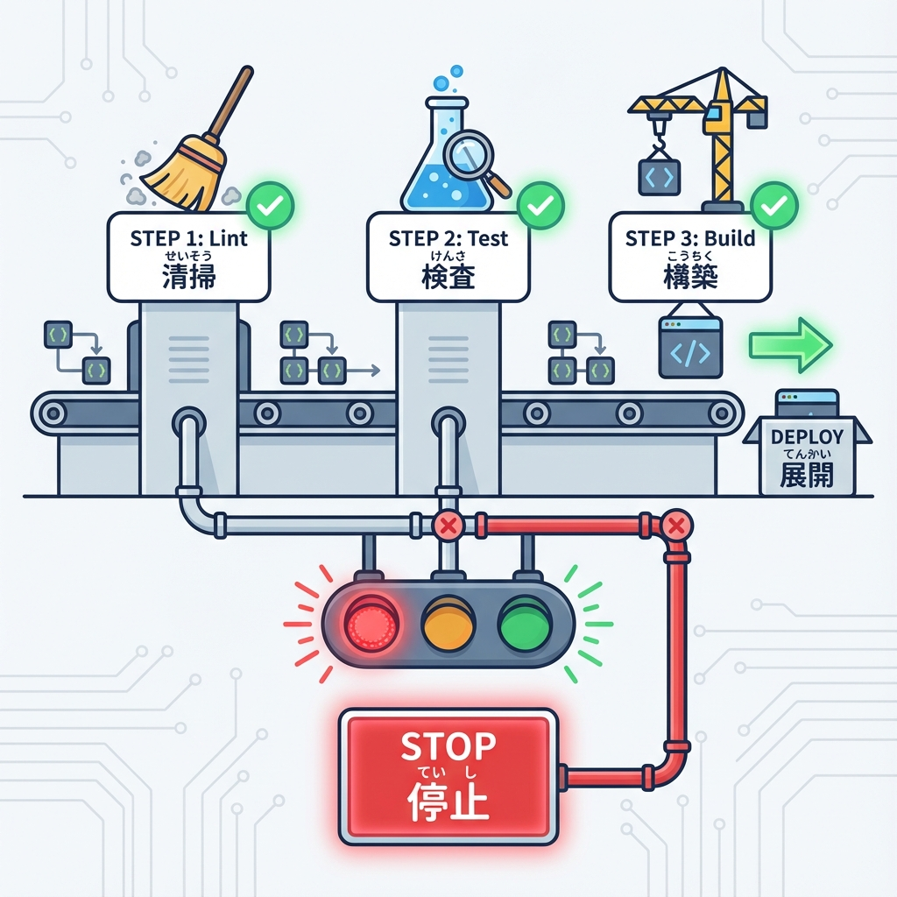
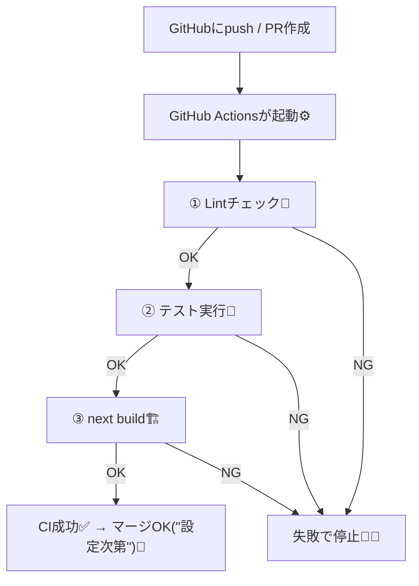

# 第214章：CIで回すイメージ（失敗したら止める）🚦

CI（シーアイ）って一言でいうと、**「GitHubにpush / PRしたら、自動でテストやビルドを実行して、ダメなら赤信号で止めてくれる仕組み」**だよ〜🚥💥
人間の「うっかりミス」を機械が先に見つけてくれるから、チームでも一人開発でもめっちゃ安心です🫶😊 ([GitHub Docs][1])

---

## 1) 今日のゴール🎯💖

* ✅ push / PR のたびに **lint → test → build** が自動で走る
* ✅ どれか1つでも失敗したら **そこで止まって「失敗」扱いになる**
* ✅（できれば）PRを**「CIが通らないとマージできない」**状態にする🔒

---

## 2) CIの流れを図でつかむ🗺️✨（まずはイメージ）





ポイントはこれ👇
**「順番にチェックして、どこかで失敗したら即終了」**＝🚦ストップ！

---

## 3) 最低限のCIを作ろう🧩💻（GitHub Actions）

ここでは一番よく使われる **GitHub Actions** で作るよ〜✨

### 3-1. まず package.json の scripts を確認👀

だいたいこうなってればOK（すでにあるはず）👇

* `npm run lint`
* `npm run test`
* `npm run build`

※ Next.jsのlintは `next lint` が中身だよ🧹 ([Next.js][2])

---

### 3-2. ワークフローを作る📁✨

プロジェクト直下に、このファイルを作ってね👇

* `.github/workflows/ci.yml`

中身はこれ（コピペOK）👇

```yaml
name: CI

on:
  push:
    branches: [ main ]
  pull_request:

jobs:
  test-and-build:
    runs-on: ubuntu-latest

    steps:
      - name: Checkout
        uses: actions/checkout@v4

      - name: Setup Node
        uses: actions/setup-node@v4
        with:
          node-version: 22
          cache: npm

      - name: Install
        run: npm ci

      - name: Lint
        run: npm run lint

      - name: Test
        run: npm run test

      - name: Build
        run: npm run build
```

* `npm ci` はCI向けの「きっちり同じ依存関係を入れる」コマンドで安定しやすいよ📦✨ ([GitHub Docs][3])
* `actions/setup-node@v4` の `cache: npm` で、npmのキャッシュも使えるよ⚡ ([GitHub][4])

作ったら **commit → push** してね🚀
すると GitHub の **Actions** タブで実行ログが見られるよ👀✨

---

## 4) 「失敗したら止める」ってどういうこと？🚦💥

GitHub Actionsは、基本こう動くよ👇

* 各 step（Lint/Test/Build）はコマンドを実行する
* **失敗するとコマンドが“エラー終了（終了コードが0じゃない）”**になる
* するとその時点で **ジョブがFailedになって、それ以降のstepは実行されない** 🚦🛑

つまり、テストが落ちたら **buildまで行かない**！
ムダな時間を使わない賢い仕組み〜😳✨

---

## 5) （重要💡）CIが通らないとマージできないようにする🔒✅

「赤いのにうっかりマージ」って、たまに起きるのね🥲💦
それを防ぐには GitHub の設定で、

* **Branch protection**
* **Require status checks to pass**

みたいなのをONにするよ（リポジトリ設定から）🔐✨
これで **CIが緑✅にならないとマージボタンが押せない**状態にできる！

---

## 6) ちょい速くする小技：Next.jsのビルドキャッシュ🧊⚡（任意）

Next.js はビルドで `.next/cache` を使うんだけど、CIでもこれを保存しておくと速くなることがあるよ🚀
（保存してないと “No Cache Detected” みたいな話が出ることもある） ([Next.js][5])

追加するなら、`Setup Node` の後あたりにこれを足すイメージ👇

```yaml
      - name: Cache Next.js build cache
        uses: actions/cache@v4
        with:
          path: .next/cache
          key: ${{ runner.os }}-nextcache-${{ hashFiles('package-lock.json') }}-${{ hashFiles('next.config.*', 'app/**', 'src/**') }}
          restore-keys: |
            ${{ runner.os }}-nextcache-${{ hashFiles('package-lock.json') }}-
            ${{ runner.os }}-nextcache-
```

※ “速くなる” はプロジェクト次第だから、まずは最低限CIでOKだよ〜😊🫶

---

## 7) ミニ練習🎓✨（わざと失敗→直す！）

1. 何かを変更してPRを作る💌
2. わざとテストが落ちる変更を入れる（例：テストで期待される文言を変えちゃう）😈🧪
3. PRのチェックが **赤❌** になるのを確認👀
4. 直してpushすると **緑✅** に戻るのを確認🎉

これやると「CIってこう止まるんだ！」が一気に腑に落ちるよ😆✨

---

## まとめ💖

* CIは「push/PRのたびに自動チェック」🧪⚙️ ([GitHub Docs][1])
* **Lint → Test → Build** みたいに順番に回して、失敗したら🚦で止める
* GitHub Actionsなら `.github/workflows/ci.yml` でサクッと作れる✨ ([GitHub Docs][3])
* 余裕が出たら `.next/cache` のキャッシュも検討🧊⚡ ([Next.js][5])

次にやるなら、**「PRでだけE2Eを走らせる」「mainにマージされたらデプロイ」**みたいに育てていくと超それっぽくなるよ〜🌱🚀💕

[1]: https://docs.github.com/en/actions/get-started/continuous-integration?utm_source=chatgpt.com "Continuous integration"
[2]: https://nextjs.org/docs/app/api-reference/config/eslint?utm_source=chatgpt.com "Configuration: ESLint"
[3]: https://docs.github.com/ja/actions/tutorials/build-and-test-code/nodejs?utm_source=chatgpt.com "Node.js のビルドとテスト - GitHub Actions"
[4]: https://github.com/actions/setup-node?utm_source=chatgpt.com "actions/setup-node"
[5]: https://nextjs.org/docs/pages/guides/ci-build-caching?utm_source=chatgpt.com "Guides: CI Build Caching"
