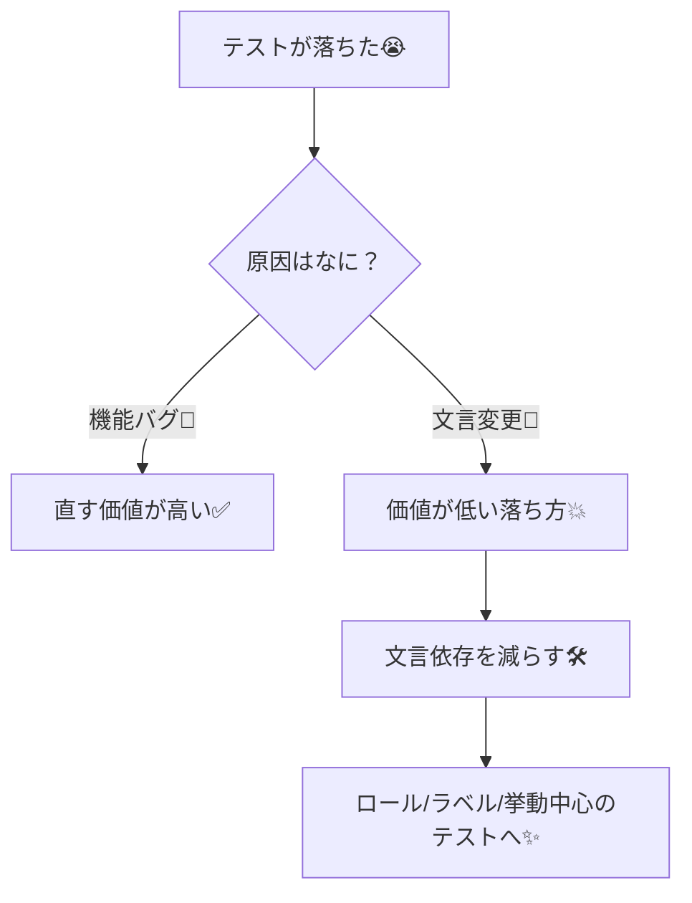
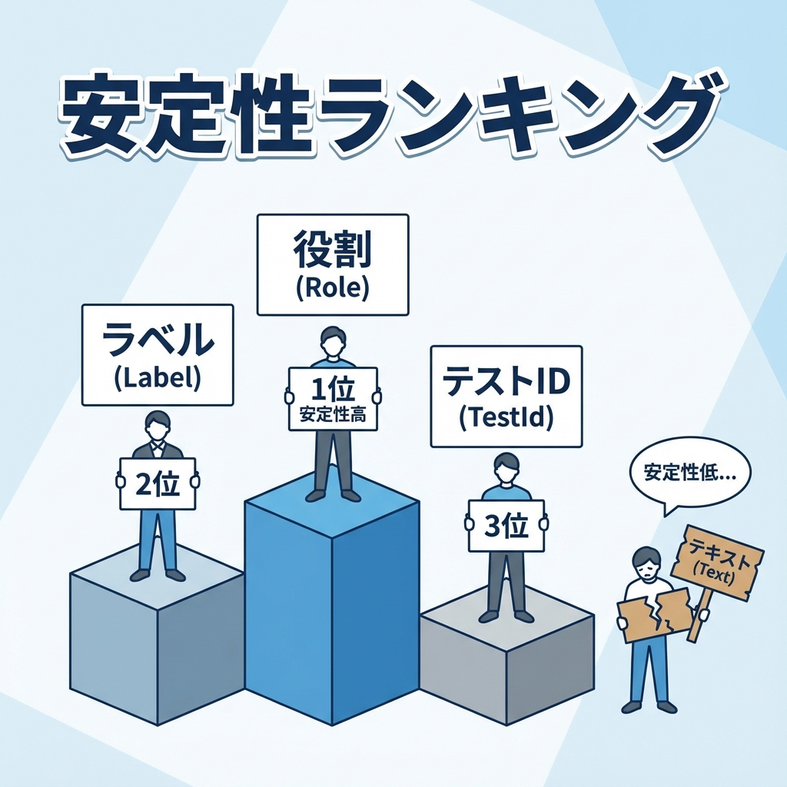

# 第215章：壊れやすいテストを避けるコツ（文言依存しすぎない）🧊

## 今日のゴール🎯

* **「UIの文章がちょっと変わっただけ」で落ちるテスト**を減らす🙅‍♀️💥
* **ユーザーの操作・体験**に近い形で、安定したテストを書く🧑‍💻🫶
* どうしても文言を見る時は、**“依存しすぎない”工夫**を入れる🌱✨

---

## あるある：テストが壊れる瞬間😇🧨

* デザイナーさんがボタン文言を「追加」→「登録」に変えた📝
  → **機能はOKなのにテストだけ落ちる**😭
* 文言の句読点や絵文字が増えた（「保存」→「保存✨」）
  → **全部落ちる**😵‍💫
* i18n対応で言語が変わった
  → **getByText が全滅**🫠

---

## 図で理解：落ちるテストの正体🧊💥（Mermaid）



---

## まず大原則🧠✨

### ✅ “ユーザーができること”をテストする

* クリックできる🖱️
* 入力できる⌨️
* 追加された/消えた/無効になった✅
* エラーが出た（でも文言はガチガチにしない）🧯

### ❌ “実装の細部”をテストしすぎない

* class名で探す（CSS変えただけで死亡）😵
* DOM構造を決め打ち（divが1個増えただけで死亡）🧱💥
* 文言の完全一致だけに頼る（今回のテーマ）📝💥

---

## 文言依存を減らす「探し方」ランキング🏆



React Testing Library（RTL）では、だいたいこの優先度が強いよ💪✨

1. **getByRole**（いちばんおすすめ）🥇

* ボタンなら `role=button`、入力なら `textbox` みたいに探せる
* アクセシビリティ的にも良い方向👏

2. **getByLabelText**（フォーム系に強い）🥈

* ラベル（`<label>`）や `aria-label` で探す
* 見た目の文言に寄せずに、**安定したラベル**を付けられる✨

3. **getByTestId**（最終手段）🥉

* `data-testid` は便利だけど、増やしすぎ注意⚠️
* 「ユーザー視点」からは遠くなるので、ここぞの場面だけ🧩

---

## ミニ例：壊れやすいテスト → 安定テストへ🧪✨

### 例のコンポーネント（Client Component想定）🧸

```tsx
"use client";

import { useState } from "react";

export function TodoMini() {
  const [text, setText] = useState("");
  const [items, setItems] = useState<string[]>([]);

  return (
    <section aria-label="todo">
      <h2>TODO</h2>

      <label htmlFor="todo-input">新しいTODO</label>
      <input
        id="todo-input"
        value={text}
        onChange={(e) => setText(e.target.value)}
      />

      <button
        type="button"
        aria-label="todo-add"
        onClick={() => {
          if (!text.trim()) return;
          setItems((prev) => [...prev, text.trim()]);
          setText("");
        }}
      >
        追加
      </button>

      <ul aria-label="todo-list">
        {items.map((t, i) => (
          <li key={`${t}-${i}`}>{t}</li>
        ))}
      </ul>
    </section>
  );
}
```

### ❌ 壊れやすい例（文言完全一致に依存）🧊💥

```ts
import { render, screen } from "@testing-library/react";
import userEvent from "@testing-library/user-event";
import { TodoMini } from "./TodoMini";

test("ボタン文言が『追加』なら押せる", async () => {
  render(<TodoMini />);
  const user = userEvent.setup();

  // 文言が「登録」になった瞬間に死亡…😇
  await user.click(screen.getByText("追加"));
});
```

### ✅ 安定しやすい例（役割＋ラベル＋挙動）✨

```ts
import { render, screen } from "@testing-library/react";
import userEvent from "@testing-library/user-event";
import { TodoMini } from "./TodoMini";

test("TODOを追加できて、入力が空に戻る", async () => {
  render(<TodoMini />);
  const user = userEvent.setup();

  // 入力は label で探す（見た目変更にそこそこ強い）🧼
  const input = screen.getByLabelText("新しいTODO");
  await user.type(input, "レポート出す");

  // ボタンは role で探して、安定ラベル(aria-label)で指定✨
  const addButton = screen.getByRole("button", { name: "todo-add" });
  await user.click(addButton);

  // “挙動”をチェックするのが気持ちいい✅
  expect(screen.getByText("レポート出す")).toBeInTheDocument();
  expect(input).toHaveValue("");
});
```

ポイント👇🥰

* ボタンの表示文字（「追加」）が変わっても、**aria-label が同じなら壊れにくい**✨
* テストは **「追加できた」**という結果を見てるから、価値が高い✅

---

## それでも文言を少し見るなら…🫶（依存しすぎない工夫）

* **完全一致じゃなくて正規表現**にする（多少の変更に強い）🧠

  * 例：`getByRole("button", { name: /追加|登録/i })`
* 文言をテストする目的が「コピー品質」なら、**コピー専用のテスト**に分離する📝

  * 通常の機能テストに混ぜない（落ち方がつらい）😭

---

## ありがちな落とし穴チェックリスト✅🧊

* [ ] `getByText("...")` だけで探してない？📝
* [ ] class名やDOM構造に依存してない？🧱
* [ ] “押したらどうなるか”より “そこに何て書いてあるか”を見てない？👀
* [ ] 必要なら `aria-label` や `label` を付けて、安定ルートを作ってる？🏷️✨

---

## ちいさな練習🎀（5分）

1. 手元のテストで `getByText` を1個見つける🔎
2. それを `getByRole` か `getByLabelText` に置き換える🛠️
3. 置き換えたあと、**“結果（挙動）”のassert**を1個足す✅✨

---

次の章では、今回の話と相性が良い **スナップショットの使いどころ**に入るよ📸🧊✨
