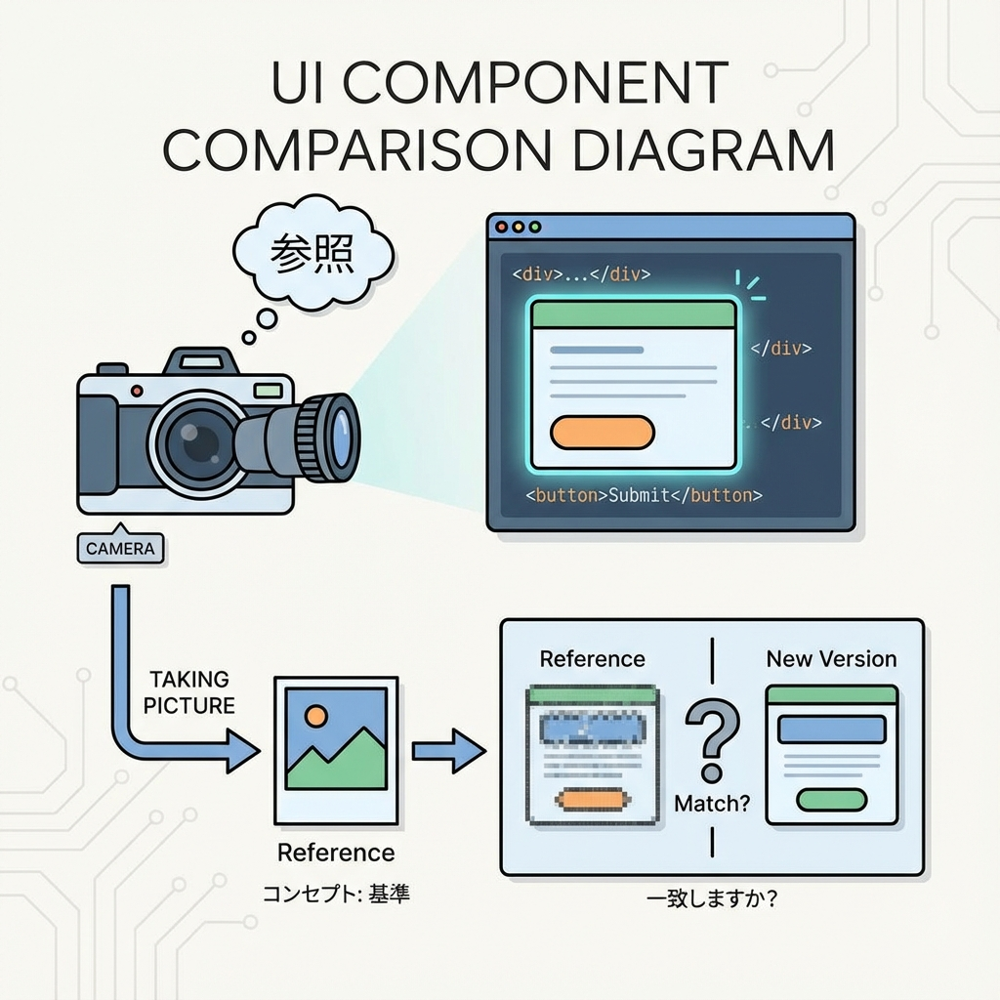
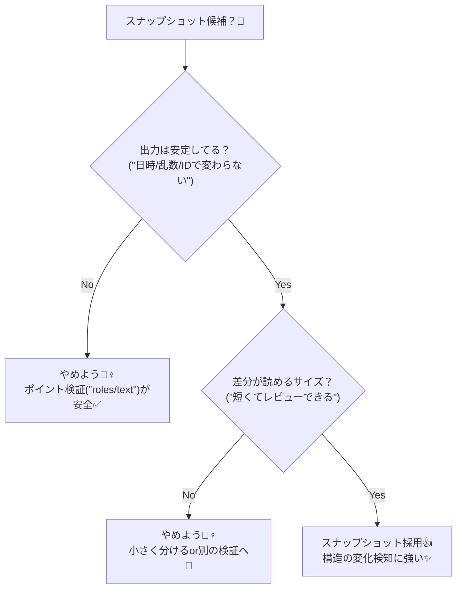

# 第216章：スナップショットは“使いどころだけ”📸

スナップショットテストは、ざっくり言うと **「いまの出力を写真みたいに保存して、次回から同じか比べる」** テストだよ〜📷💡
UI（HTML構造）が **勝手に変わってない？** を検知するのが得意！でも、使い方を間違えると **“更新ボタン連打マン”** になって逆に危険…！😵‍💫💦 ([Vitest][1])

---

## 1) スナップショットって何をしてるの？🤔📸



* テストの中で `toMatchSnapshot()` を使う
* 初回実行で `.snap`（スナップショット）ファイルが作られる
* 次回以降は **「今の出力」vs「保存済み」** を比較して、違ったら落ちる💥 ([Vitest][1])

---

## 2) “使いどころ”の判断チャート🌸（これ超大事！）



---

## 3) スナップショットが向いてる例👍✨

* **小さめの見た目部品**（カード、バッジ、空状態表示など）🪪✨
* **HTML構造が大事**で、変更があったら気づきたいところ（例：見出し階層、ボタン配置）🔍
* **「この形で出したい」** が明確な出力（HTML文字列、メール本文、Markdown変換結果など）🧾

---

## 4) スナップショットを避けた方がいい例🙅‍♀️💦

* 日時・ランダム・IDなどで毎回変わるもの（テストが荒れる😇）
* 文章が頻繁に変わるUI（**差分が“ただの文章修正”** になりがち）📝
* ページまるごと（スナップショットがデカすぎてレビュー不能👀💥）

---

## 5) 実例：React Testing Library + Vitestで“部品だけ”撮る📸🧪

ここでは「小さめの表示部品」をスナップショットにするよ〜😊✨

### ✅ コンポーネント例（`components/ProfileCard.tsx`）

```tsx
"use client";

type Props = {
  name: string;
  department: string;
};

export default function ProfileCard({ name, department }: Props) {
  return (
    <section aria-label="profile card">
      <h2>{name}</h2>
      <p>{department}</p>
      <button type="button">フォローする</button>
    </section>
  );
}
```

### ✅ テスト例（`components/ProfileCard.test.tsx`）

```tsx
import { describe, it, expect } from "vitest";
import { render } from "@testing-library/react";
import ProfileCard from "./ProfileCard";

describe("ProfileCard", () => {
  it("見た目の構造が変わってない（スナップショット）📸", () => {
    const { asFragment } = render(
      <ProfileCard name="みか" department="情報学部" />
    );

    expect(asFragment()).toMatchSnapshot();
  });
});
```

`toMatchSnapshot()` を使うと、Vitest がスナップショットを保存して、次から差分を出してくれるよ📷✨ ([Vitest][1])

---

## 6) スナップショット更新のしかた（WindowsでもOK）🔁💻

見た目を **意図して変更した** ときは、スナップショットも更新する必要があるよ〜！

* watchモード中に **`u` キー**で更新できる⌨️✨
* もしくは **`-u` / `--update`** を付けて実行でも更新できるよ✅ ([Vitest][1])

例：

```bash
npx vitest --watch
```

（差分が出たら `u` を押す✨）

または：

```bash
npx vitest -u
```

---

## 7) “壊れない運用”のコツ3つ🧊✨

1. **小さく撮る📸**（コンポーネント単位で）
2. **差分が読めないなら撮らない👀**（読めない＝守れない）
3. スナップショット更新は **「見た目の変更コミット」とセット**で📦✨
   （スナップショットだけ更新するのは基本NG🙅‍♀️）

---

## 8) ミニ練習🎀（3分でできる！）

1. `ProfileCard` のボタン文言を `フォローする` → `フォロー` に変える✏️
2. テストを実行して **失敗（差分）** を見る👀💥
3. 変更が正しいなら `u`（または `-u`）で更新する🔁✨

これで「スナップショットは便利だけど、更新はレビュー前提」って感覚がつかめるよ〜😊📸✨

[1]: https://vitest.dev/guide/snapshot "Snapshot | Guide | Vitest"
