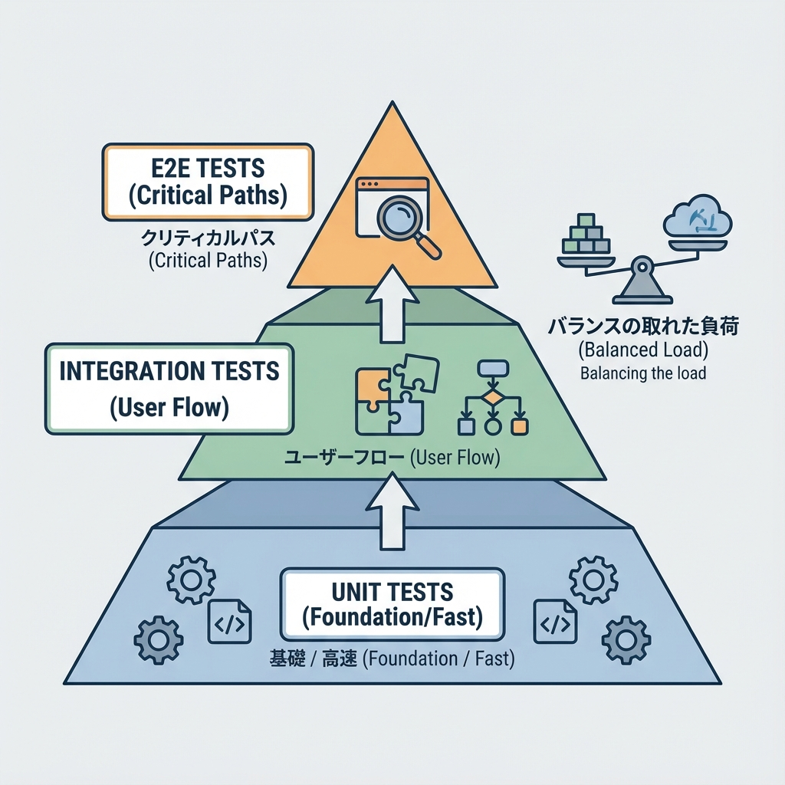
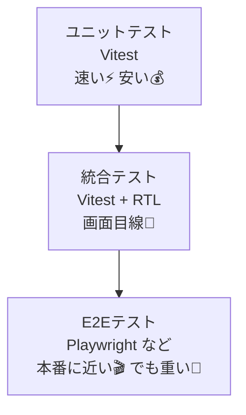
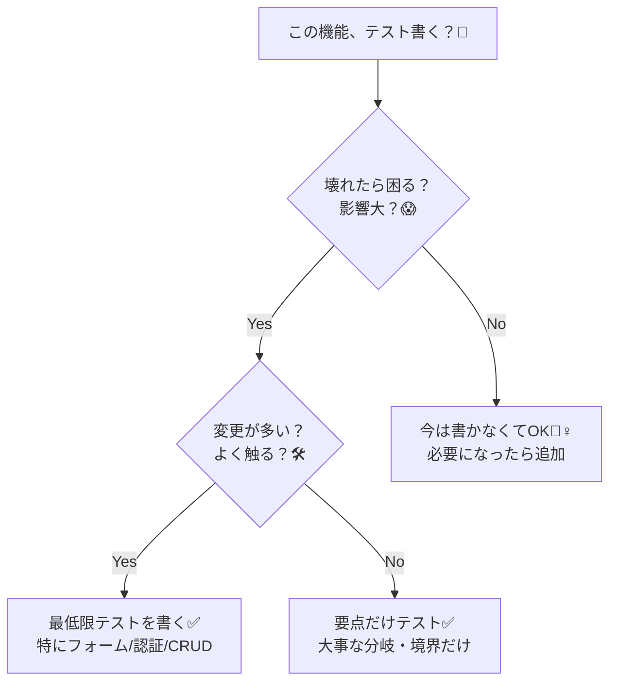

# 第217章：復習：テストは“安心”を買う作業💰

テストって「バグ探し」だけじゃなくて、もっと日常的に **“安心を買う”** ための道具なんだよね😊🫶
この章は、ここまで学んだテスト（Vitest / RTL / E2E）を「どう使い分けるとラクになるか」を、ふわっと整理する復習回だよ〜📚🌸

---

## 1) テスト＝“保険”ってどういうこと？🛡️💡

テストを書いておくと、こんな「安心」が手に入るよ🥹✨

* リファクタしても壊れてないって自信が持てる🧼✨
* うっかりミス（回帰バグ）を先に止められる🛑
* 「デプロイ怖い…😢」が減る🚀
* チーム開発で変更が重なっても落ち着ける👭🧑‍🤝‍🧑

でももちろん、テストにもコストはあるよね🧾💦
だから大事なのは **“全部テストする”じゃなくて、安心が大きい所に絞って買う”** ことだよ💰✨

---

## 2) どこをテストすると“得”しやすい？🎯💎

### ✅ 優先度が高い（保険料が安くて、事故が怖い）

* 認証（ログイン/ログアウト）🔐
* CRUD（作成・更新・削除）📝🗑️
* フォーム（バリデーション、二重送信防止）📨
* ルーティング（ページ遷移、保護ページ）🛣️
* 重要ロジック（計算、整形、変換）🧠

### ⚠️ 優先度が低め（壊れても直しやすい / 変わりやすい）

* 見た目の細かい文言やレイアウトの“ピクセル単位”🎨
* 「今この文言が完全一致するか」みたいなテスト📸💦
  （※文言はしょっちゅう変わるから、壊れやすいのだ…🥲）

---

## 3) 使い分けの復習：ユニット / 統合 / E2E 🧪🧠🎬

ざっくりイメージはこれ👇（上ほど速い・安い、下ほど本番に近い）✨

* **ユニット**：関数・ロジックを細かく守る🧠🛡️
* **統合（UI）**：ユーザー視点で「この画面はこう動く」を守る👀✨
* **E2E**：ログイン→追加→表示、みたいな“流れ”を守る🎬🔁

ポイント：**全部E2Eでやると重い**し、**ユニットだけだと安心しきれない**こともあるよね😵‍💫
だから「ちょうどいい配分」を狙うのがコツだよ〜🍀

---

## 4) “壊れにくいテスト”の共通ルール🧊✨

テストが辛くなる原因って、だいたい「壊れやすい」からなの🥲
壊れにくくするための合言葉はこれ👇

### ✅ 画面テストは「ユーザー目線」👀🫶

* ボタンのクリック、入力、表示…みたいに **人が触る形**で書く🖱️⌨️
* “中の実装”に依存しすぎない（内部stateを覗きすぎない）🙈

### ✅ 1テスト＝1つの安心🎁

* 1個のテストで詰め込みすぎない🍱💦
* 「何が壊れたか」すぐ分かるようにする🔎✨

### ✅ “文言の完全一致”に頼りすぎない📸💥

* 文言は変わる！
* 「役割（button）」「ラベル」「見出し」などで探すのが安定しやすいことが多いよ😉

---

## 5) “今この場面、何を書く？”の判断チャート🧭✨

このチャート、めっちゃ実戦向きだよ😊✨
「壊れたら困る場所」ほど、テストの価値が高い💎

---

## 6) ミニ復習課題（頭の整理用）📝✨

次の機能を作ったとして、どのテストを“1つだけ”買う？💰（理由も添えてね☺️）

1. お問い合わせフォーム（必須チェックあり）📨
2. ブログ記事一覧（表示だけ）📰
3. ログイン後だけ見れるマイページ🔐
4. TODO追加（追加→一覧に表示）➕📋

おすすめの考え方：

* **(1)(3)(4)** は“壊れたら困る”寄りだから優先度高め✅
* **(2)** は表示だけなら、まずは軽めでもOK寄り🙆‍♀️

---

## 7) この章のまとめ🍀✨

* テストは「正しさ」だけじゃなくて **“安心”を買う**もの🛡️💰
* 全部は無理！だから **壊れたら困る所から**やる🎯
* 基本は、軽いテスト（ユニット/統合）で土台を固めて、
  **E2Eは“重要な流れ”だけ**に絞ると気持ちいい🎬✨
* 壊れにくいテストは **ユーザー目線👀** が合言葉🫶

次の章以降は、テストで作った安心を持ったまま「本番運用」へ進むよ〜🚀🌍✨
