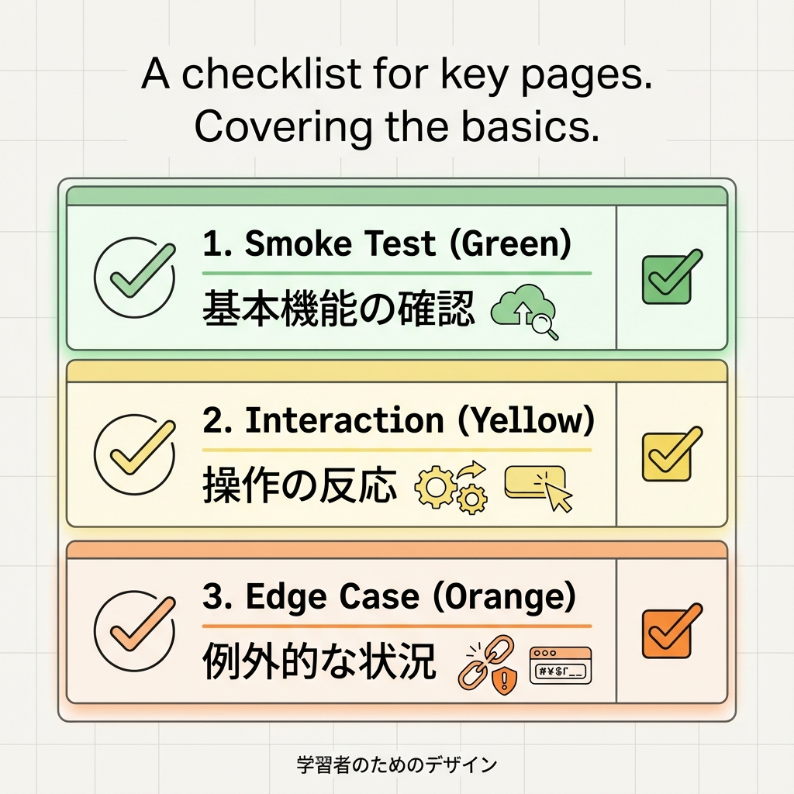
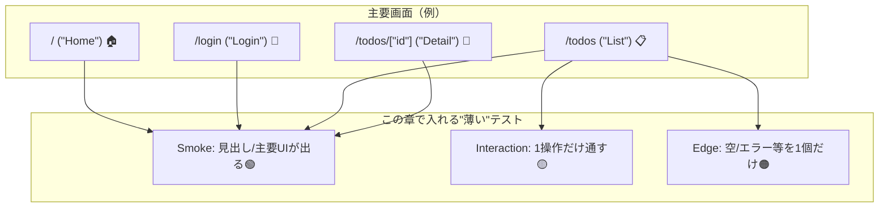

# 第218章：ミニ課題：主要画面のテスト網羅（薄くでOK）✅

この章は「テストを完璧にする！」じゃなくて、**“主要画面を最低限カバーして安心を買う”**のがゴールだよ〜😊🫶
（薄くでOK！でも、ちゃんと効くやつ💪✨）

---

## 🎯 ゴール（この章のクリア条件）✅

主要画面に対して、次の3種類のテストを**必要な分だけ**入れるよ👇

* 🟢 **Smoke（煙）テスト**：表示できる？クラッシュしない？
* 🟡 **操作テスト**：ボタン/フォームなど、最低1つだけ「触れる」確認
* 🟠 **状態テスト**：空データ/エラー表示など、最低1つだけ「分岐」を確認

---

## 🗺️ 何を「主要画面」とする？（例）📌

あなたのアプリの“よく使う画面”を4つくらい選べばOK🙆‍♀️✨
例（TODOアプリ想定）：

* 🏠 Home（`/`）
* 🔐 Login（`/login`）
* 📋 Todo一覧（`/todos`）
* 🔎 Todo詳細（`/todos/[id]`）

「この4つを薄く守る」だけで、安心感が一気に上がるよ〜😆💖

---

## 図解：薄いテスト網羅の考え方🧁🧪





---

## ✅ 先にチェック（Vitestの前提）🔧

* Vitest + Testing Library は Next.js 公式ガイドでも組み合わせが紹介されてるよ🧪✨ ([Next.js][1])
* `vitest.config.mts` の `environment: 'jsdom'` は超大事！（DOMが無いと落ちる😵） ([Next.js][1])
* ちなみに **`async` な Server Component は Vitestだと扱いづらい**ので、そういうのは E2E 寄りで守るのが推奨されてるよ🙆‍♀️ ([Next.js][1])

---

## 🧩 ミニ課題：この順で作ろう（おすすめ）✨

### 1) まず「テスト表」を作る📋🖊️

紙でもメモでもOK！例👇

| 画面            | Smoke（表示） | 操作（1個）        | 状態（1個）  |
| ------------- | --------- | ------------- | ------- |
| `/`           | ✅見出しが出る   | -             | -       |
| `/login`      | ✅見出しが出る   | ✅ログイン押せる（ダミー） | -       |
| `/todos`      | ✅見出しが出る   | ✅追加フォーム送信     | ✅空一覧の表示 |
| `/todos/[id]` | ✅見出しが出る   | -             | -       |

「全部やろう」としないで、**必要なマスだけ✅でOK**😉🌸

---

### 2) Smokeテストを4本入れる🟢🟢🟢🟢

Next.js公式例みたいに、**“見出しが出る”**だけでOK🙆‍♀️ ([Next.js][1])

例：`__tests__/home.test.tsx`

```tsx
import { test, expect } from "vitest";
import { render, screen } from "@testing-library/react";
import Page from "../app/page"; // / のページ

test("Home: 見出しが表示される", () => {
  render(<Page />);
  expect(screen.getByRole("heading", { level: 1 })).toBeDefined();
});
```

💡ポイント

* 文字列に依存しすぎると壊れやすいので、まずは**role中心**が安定だよ😊✨

---

### 3) 操作テストを「1つだけ」通す🟡🖱️

おすすめは「TODO追加フォーム」みたいなやつ🌸
**user-event**で、ユーザーの操作っぽく書けるよ🙌 ([Testing Library][2])

例：フォーム部品（`components/TodoAddForm.tsx`）

```tsx
"use client";

import { useState } from "react";

export function TodoAddForm({ onAdd }: { onAdd: (title: string) => void }) {
  const [title, setTitle] = useState("");

  return (
    <form
      onSubmit={(e) => {
        e.preventDefault();
        onAdd(title);
        setTitle("");
      }}
    >
      <label>
        タイトル
        <input
          aria-label="タイトル"
          value={title}
          onChange={(e) => setTitle(e.target.value)}
        />
      </label>
      <button type="submit">追加</button>
    </form>
  );
}
```

テスト例：`__tests__/todo-add-form.test.tsx`

```tsx
import { test, expect, vi } from "vitest";
import { render, screen } from "@testing-library/react";
import userEvent from "@testing-library/user-event";
import { TodoAddForm } from "../components/TodoAddForm";

test("TodoAddForm: 入力して送信すると onAdd が呼ばれる", async () => {
  const onAdd = vi.fn();
  const user = userEvent.setup();

  render(<TodoAddForm onAdd={onAdd} />);

  await user.type(screen.getByLabelText("タイトル"), "牛乳を買う");
  await user.click(screen.getByRole("button", { name: "追加" }));

  expect(onAdd).toHaveBeenCalledWith("牛乳を買う");
});
```

---

### 4) 状態テストは「空データ」か「エラー」どっちか1個🟠✨

例：一覧表示コンポーネント（`components/TodoListView.tsx`）

```tsx
export function TodoListView({ items }: { items: { id: string; title: string }[] }) {
  if (items.length === 0) {
    return <p role="note">まだTODOがありません</p>;
  }
  return (
    <ul>
      {items.map((t) => (
        <li key={t.id}>{t.title}</li>
      ))}
    </ul>
  );
}
```

テスト例：`__tests__/todo-list-empty.test.tsx`

```tsx
import { test, expect } from "vitest";
import { render, screen } from "@testing-library/react";
import { TodoListView } from "../components/TodoListView";

test("TodoListView: 空のとき案内が出る", () => {
  render(<TodoListView items={[]} />);
  expect(screen.getByRole("note")).toBeDefined();
});
```

---

## 🧪 実行（Windows）💻✨

```bash
npm run test
```

Next.js公式ガイドでも、`npm run test` で Vitest を回す流れが紹介されてるよ🧪 ([Next.js][1])

---

## 🧯 よくあるつまずき（最短で直す）🩹

* 😵 `document is not defined`
  → `vitest.config.mts` に **`environment: 'jsdom'`** が必要だよ（公式手順にもある） ([Next.js][1])

* 😢 `async` な Server Component がテストしにくい
  → 公式でも「async Server Components はユニットテストで扱いづらいのでE2E推奨」って注意があるよ ([Next.js][1])
  ✅対策：**表示用UIを別コンポーネントに切って、そこをテスト**しよう😊

* ✨ `toBeInTheDocument()` みたいな便利アサーションが欲しい
  → Vitest では `@testing-library/jest-dom/vitest` を setup で読み込むやり方がよく使われるよ🧸 ([markus.oberlehner.net][3])

---

## ✅ 提出物（この章の完成チェック）🎁

* ✅ 主要画面（3〜5画面）の **Smokeテスト**がある（最低3本でもOK）🟢
* ✅ **操作テスト**が1本ある（フォーム送信 or クリック）🟡
* ✅ **状態テスト**が1本ある（空 or エラー）🟠
* ✅ `npm run test` が通る🎉

---

必要なら、あなたの今の画面構成（ルート一覧だけでOKだよ📄✨）に合わせて「どのテストをどこに置くか」も、こちらで**章の方針のまま**ピタッと割り当てて書けるよ😊🫶

[1]: https://nextjs.org/docs/app/guides/testing/vitest "Testing: Vitest | Next.js"
[2]: https://testing-library.com/docs/react-testing-library/example-intro?utm_source=chatgpt.com "Example"
[3]: https://markus.oberlehner.net/blog/using-testing-library-jest-dom-with-vitest?utm_source=chatgpt.com "Using Testing Library jest-dom with Vitest"
