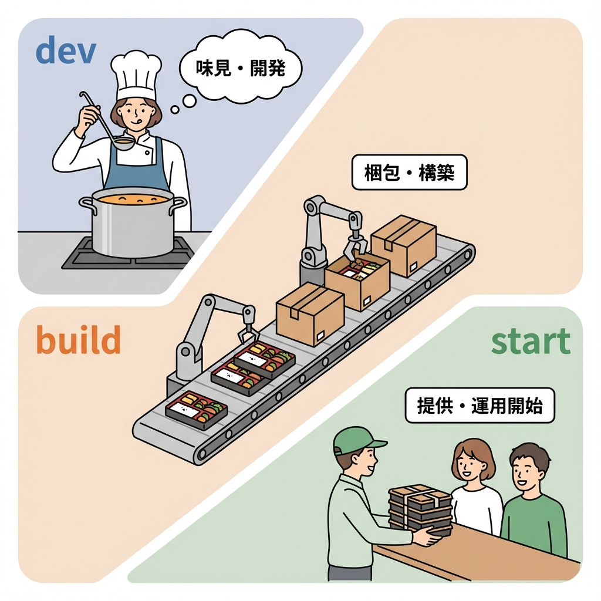
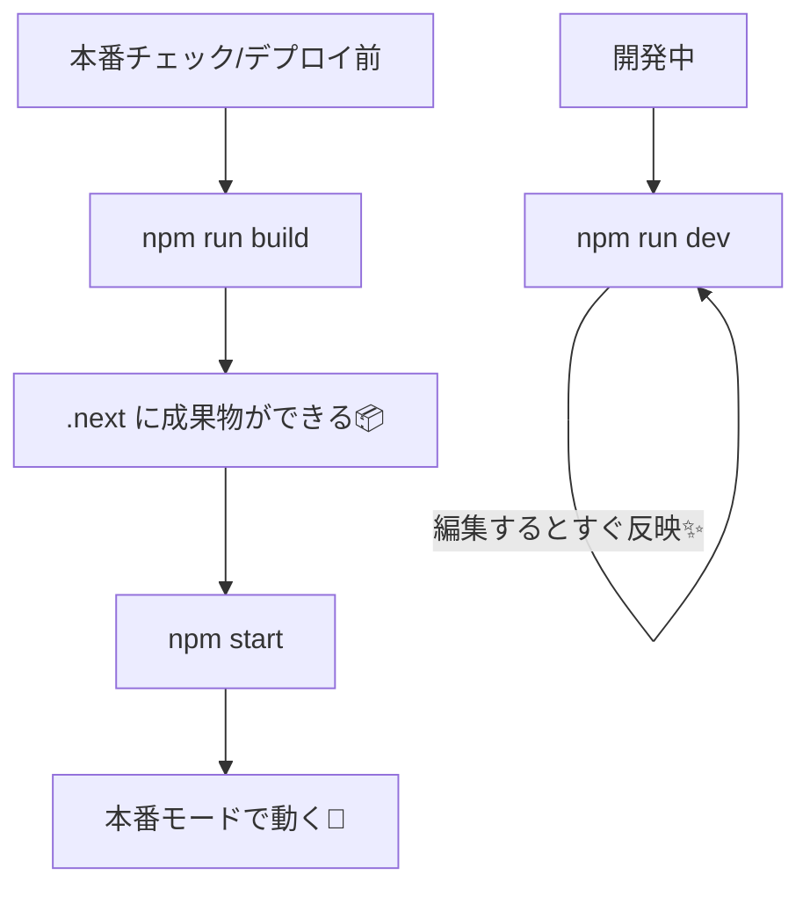

# 第219章：`npm run build` と `npm start` の意味🏗️

「デプロイ前に何をすればいいの？🤔」ってなったら、まずこの2つの意味を押さえると一気に安心します🙌💕

---

## 今日のゴール🎯

* `npm run build` が **何を作るコマンド**なのか分かる🏗️
* `npm start` が **何を動かすコマンド**なのか分かる🚀
* 「開発用 (`dev`)」と「本番用 (`build`→`start`)」の違いがスッキリする🧠✨

---

## まず結論💡（超だいじ！）

* `npm run build` 👉 **本番用に最適化された成果物を作る**（料理で言うと“完成品を作る”🍳）
* `npm start` 👉 **その成果物を本番モードで動かす**（“完成品をお店で出す”🍽️）
* `npm run dev` 👉 **開発モードで動かす**（“試作して味見しながら作る”😋）

---

## 3つのコマンドの関係図🧩（Mermaidで図解）





---

## `npm run build` って何してるの？🏗️👀

一言でいうと…

**「本番用に、速く・軽く・安全に動く形へ“変換”している」**です💪✨

だいたいこんなことが起きます👇（ざっくりイメージでOKだよ〜😊）

* React/Next.js のコードを本番向けにコンパイル🔧
* 使うコードだけに圧縮して軽量化（最適化）📉
* ルート（ページ）を解析して、必要なものを準備🗺️
* （設定次第で）TypeScriptの型チェックやLintが走ることもある✅🧹
* 結果として **`.next/` フォルダ**に本番実行用の成果物ができる📦✨

### `.next/` って何？📁

`npm run build` をすると増えるフォルダで、ここに **本番用の実行データ**が入ります！

* ✅ 生成物（本番で使うビルド成果物）
* ✅ 最適化されたJS/CSS
* ✅ ルーティングやレンダリング用の内部データ
  みたいな感じです📦🧠

---

## `npm start` って何してるの？🚀

`npm start` は…

**「`npm run build` で作った `.next` を使って、本番モードのサーバーを起動する」**です🫶✨

超重要ポイント👇

* ✅ **必ず先に `npm run build` が必要**（作ってないと動かせない！）
* ✅ これは **開発モードじゃない**（ホットリロードとかは基本ないよ🙅‍♀️）
* ✅ “本番に近い状態”をローカルで確認できる👀💕

---

## 実際にやってみよう（Windows）🪟✨

プロジェクトのフォルダでターミナル（VSCodeのターミナルでOK🙆‍♀️）を開いて…

### 1) 本番用を作る🏗️

```bash
npm run build
```

### 2) 本番モードで起動する🚀

```bash
npm start
```

### 3) ブラウザで見る🌈

* [http://localhost:3000](http://localhost:3000) を開く🧡

---

## `dev` と `start` の違い（体感で覚えるやつ）😆✨

* `npm run dev`

  * 編集したら即反映✨（気持ちいい！）
  * 開発のための便利機能が多い🛠️
* `npm start`

  * 反映は即じゃない（ビルド済みを動かすだけ）📦
  * 本番に近い挙動でチェックできる👀✅

---

## よくあるつまずきポイント集🪤💦

### ❌ `npm start` したら怒られた！

だいたいこれ👇

* **ビルドしてない**（`npm run build` が先！）🥺

### ❌ `dev` で動いてるから本番も大丈夫だよね？

開発モードは“便利機能モリモリ”なので、
**本番でだけ出る問題**が隠れてることがあります😵‍💫
👉 デプロイ前に `build → start` で動作確認すると安心だよ〜🫶✨

---

## ミニまとめ🎀

* `npm run build`：本番用の成果物を作る🏗️📦
* `npm start`：その成果物を本番モードで動かす🚀
* デプロイ前は **build→start でローカル最終チェック**が超おすすめ👀✅✨
