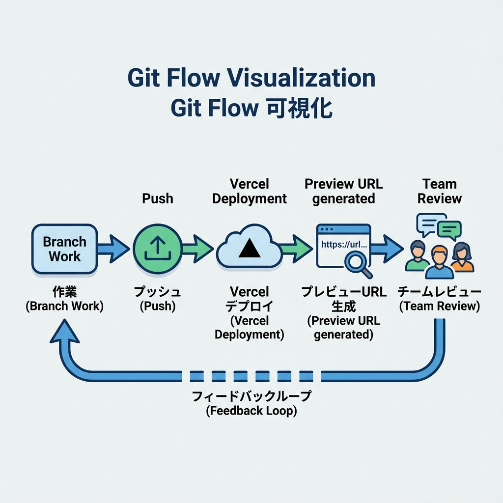
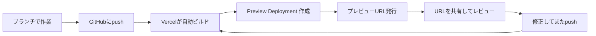

# 第222章：プレビューURLの便利さ（レビュー文化）👀

この章では、**Vercelの「プレビューURL」**を使って、**本番公開前に“みんなで確認する文化”**を作るコツを学ぶよ〜🫶💡
プレビューURLは「この変更だけ反映された“仮の公開URL”」ってイメージでOK🙆‍♀️✨

---

## 1) プレビューURLってなに？🤔🌱

Vercelでは、デプロイが成功すると **そのデプロイ専用のURL（Generated URL）**が自動で作られるよ🔗✨
これが「プレビューURL」になって、**本番に影響ゼロで**動作確認できるのが強い😆💪
（※URLを使える期間は、プロジェクトの保持ポリシーなどの設定に左右されるよ） ([Vercel][1])

---

## 2) なんでそんなに便利なの？🥳📱💻

プレビューURLがあると、こういう“嬉しい”が起きるよ👇✨

* **スマホ実機チェック**が一瞬でできる📱✨（自分のPCだけで確認より安心！）
* **友だち/先輩/先生**にURL送るだけで見てもらえる👭👀
* 「私のPCでは動いたんだけど…」を減らせる😇（環境が近いから！）
* **レビューが早くなる**＝修正も早くなる🚀

---

## 3) どうやってプレビューURLが生まれるの？🧬✨



VercelはGit連携していると、基本こんな感じで動くよ👇
**本番ブランチ以外にpush**したり、**PR作ったり**すると、プレビュー用のデプロイが作られるイメージ！ ([Vercel][2])



---

## 4) やってみよう：PRでプレビューURLを使う👀💖

ここは「ふつうの流れ」を体験すればOK〜🙆‍♀️✨

### 手順🪄

1. 変更用ブランチを作る🌿
2. ちょこっと修正してコミットする✍️
3. GitHubにpushする⬆️
4. PR（Pull Request）を作る📮
5. PR画面で **VercelのPreview** を開く👀✨（URLが出る）

コマンド例（PowerShellでもOK）👇

```bash
git checkout -b feature/preview-url
# 何か変更する（例：テキスト1行変える）
git add .
git commit -m "try preview url"
git push -u origin feature/preview-url
```

> PRを作ると、Vercelがデプロイして、**プレビューURLが見える状態**になりやすいよ（Git連携の強み！） ([Vercel][3])

---

## 5) “レビュー文化”のコツ：見てもらいやすい出し方💌✨

プレビューURLを送るとき、**一言テンプレ**があると強いよ〜😆🫶

### 送るメッセージ例💬

* 「このURL、**スマホでも**見てほしい〜📱🙏」
* 「ヘッダー周り変えたから、**見た目だけ**チェックしてほしい👀✨」
* 「フォーム送信、**1回だけ**試してほしい📮🥺」

### チェックしてほしいポイントを“3つまで”に絞る🎯

* ✅ 見た目（崩れてない？）
* ✅ 動き（ボタン押せる？）
* ✅ 文言（読みやすい？）

「全部見て！」だと相手が疲れちゃうから、**小分け**がやさしさ💗

---

## 6) プレビュー環境だけ設定を変えたい：環境変数の使い分け🔐🧪

Vercelには **Preview用の環境変数**があって、**本番ブランチ以外**のデプロイにだけ適用できるよ🌱
たとえば、Previewはテスト用API、Productionは本番API…みたいに分けられる✨ ([Vercel][4])

---

## 7) うっかり公開っぽく見せたくないとき：保護する🔒🛡️

「まだ見せたくない機能がある…！」ってときは、**プレビューURLにロック**をかけられるよ🔐
Vercelの **Deployment Protection**（パスワード保護など）で、Preview/Productionを守れる仕組みがあるよ🙆‍♀️ ([Vercel][5])

---

## 8) さらに楽しく：プレビュー上にコメントで指摘する📝✨

Vercelには、**Preview Deployment上でコメント**を使ってフィードバックできる機能もあるよ👀🗯️
「このボタンもうちょい右」みたいなのを、画面上で共有できて便利〜！ ([Vercel][6])

---

## 9) ミニ練習🎀（10分でOK）

* ✅ 何か小さな修正をしてPRを作る
* ✅ プレビューURLを開く
* ✅ スマホで開いて、レイアウト崩れがないか見る📱👀
* ✅ “見てほしい点3つ”付きでURLを誰かに送る（自分宛でもOK）💌✨

---

## まとめ🎉

プレビューURLは、**本番を汚さずに**「実物URLで確認」できる最高の仕組みだよ🫶✨
**URLを共有 → フィードバック → 直す → また共有**のループが回り始めると、開発が一気に楽しくなるよ〜🚀💖

[1]: https://vercel.com/docs/deployments/generated-urls?utm_source=chatgpt.com "Accessing Deployments through Generated URLs"
[2]: https://vercel.com/docs/deployments/environments?utm_source=chatgpt.com "Environments"
[3]: https://vercel.com/docs/git/vercel-for-github?utm_source=chatgpt.com "Deploying GitHub Projects with Vercel"
[4]: https://vercel.com/docs/environment-variables?utm_source=chatgpt.com "Environment variables"
[5]: https://vercel.com/docs/deployment-protection?utm_source=chatgpt.com "Deployment Protection on Vercel"
[6]: https://vercel.com/docs/comments/using-comments?utm_source=chatgpt.com "Using Comments with Preview Deployments"
