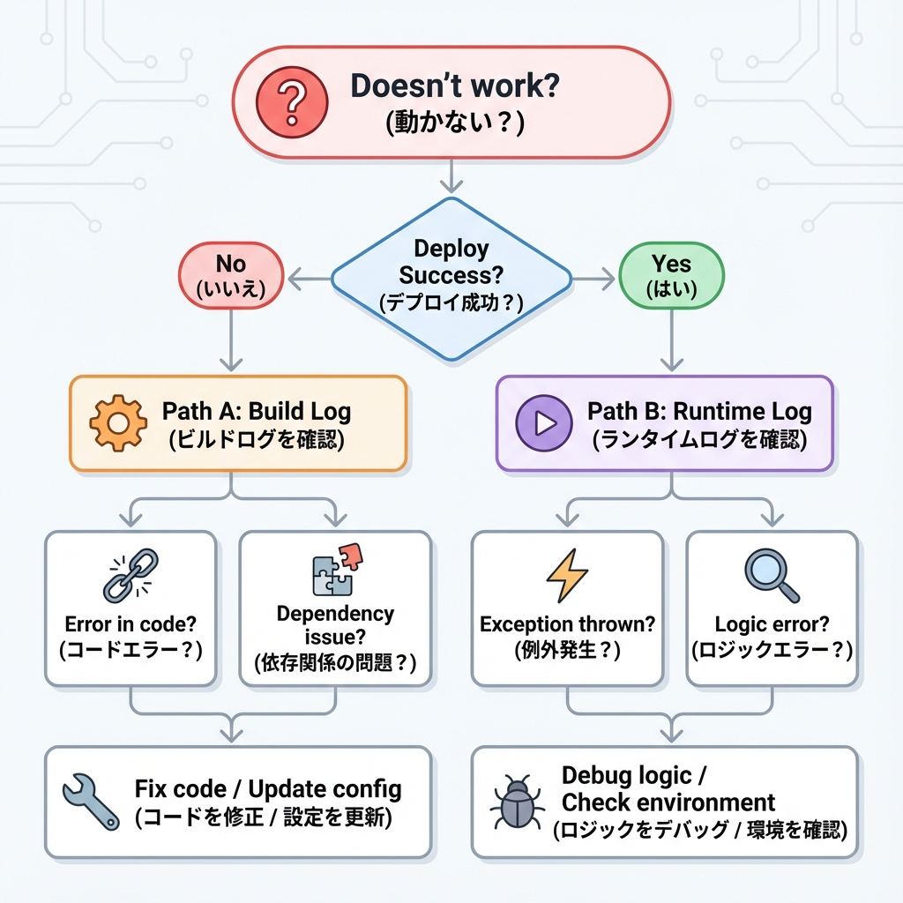
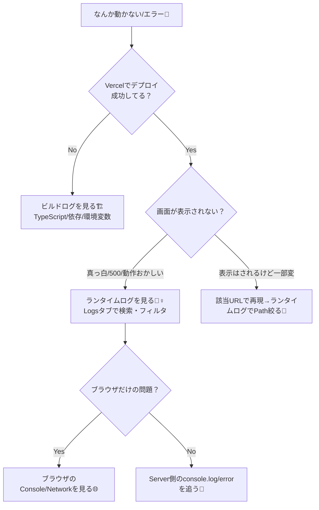

# 第223章：ログの見方（どこで詰まった？）🧭

この章のゴールはこれだよ〜！✨
**「いまの不具合が、ビルドで死んでるのか？実行中に死んでるのか？どのURLで？どの処理で？」**を、ログから特定できるようになること💪🧠

---

## 1) まず最初に：ログは2種類あるよ📌

ざっくり、ここを分けるのが最重要🎯

* **ビルドログ**：デプロイ時の「組み立て」ログ🏗️
  → 例：TypeScriptエラー、依存関係、環境変数が無い、ビルド失敗 など
* **ランタイムログ**：公開後の「動いてる最中」ログ🏃‍♀️
  → 例：アクセスしたら500、APIが落ちる、Server Actionで例外、Middlewareで変、など

Vercelだと、**ランタイムログは Logs タブ**で見れて、**ビルドログはデプロイのタイル（画面）から見る**感じだよ🧭✨ ([Vercel][1])

---

## 2) 迷ったらこの分岐でOK🧠🗺️（図解）



「どこを見るべき？」を最短で決めるフローチャートだよ🎀



---

## 3) ローカル（Windows）で見るログ🪟💻

### ✅ ログが出る場所はここ！

* **ブラウザのConsole**：Client Componentの `console.log` はここ🌈
* **ターミナル（PowerShell）**：Server Component / Route Handler / Server Action の `console.log` は基本こっち🧊🖥️

### よく使うコマンド（開発中）💨

```bash
npm run dev
```

「サーバー側のログがブラウザに出ない！」ってなったら、まずターミナル見てね👀✨

---

## 4) Vercelで見るログ（ここが本題）🚀🧭

### 4-1) ビルドログ🏗️

症状：

* 「デプロイが失敗する」
* 「Build Failed」
* 「Preview URLすら出ない」

→ これは **ビルドログ**を見るやつ！
Vercelでは、**ビルドログはランタイムログとは別**で、デプロイ画面側から確認するよ🧱✨ ([Vercel][1])

---

### 4-2) ランタイムログ🏃‍♀️（公開後の不具合はこっち！）

症状：

* デプロイは成功するのに、アクセスすると **500** とか💥
* 特定のページだけ落ちる
* API（Route Handler）だけ失敗する

→ Vercelの **Logs タブ**で見れるよ📋✨
ここで **検索・フィルタ・共有**までできるのが強い🪄 ([Vercel][1])

さらに、Vercel Functions のログもここで見れるよ〜（console出力は1行ごとにログになる）🧾
※ 1行あたりサイズ上限などもあるよ📏 ([Vercel][2])

---

## 5) Logsタブで「詰まりポイント」を特定するコツ🔎🧠✨

### コツ①：まず **Path（どのURLか）** で絞る🛣️

* `/login` だけ落ちる？
* `/api/todos` だけ落ちる？
* `/posts/123` だけ落ちる？

ここが分かるだけで、原因の範囲が一気に狭まるよ〜😳✨

### コツ②：**ステータスコード**で絞る🚦

* 500（サーバーエラー）
* 404（notFound）
* 401/403（認証系）

### コツ③：Request ID（リクエストID）で追跡する🧵

Vercelのログは **Request IDでフィルタ**できるので、1回のアクセスに紐づくログだけ追えたりするよ🧡 ([Vercel][3])

---

## 6) いい感じのログの出し方（最小セット）🧁✨

### ✅ 「どの処理のログか」わかるように、ラベルを付けよう🏷️

```ts
console.log("[todos:list] start");
console.log("[todos:list] userId=", userId);
```

### ✅ エラーは console.error に寄せる🔥

```ts
try {
  // 何か処理
} catch (e) {
  console.error("[todos:list] failed", e);
  throw e; // 必要なら上に投げる
}
```

> Vercelのランタイムログは、標準出力（console.log等）で出したものが見えるよ🧾✨ ([Vercel][2])

---

## 7) ミニ演習：わざとログを出して、Vercelで追う🎮🧪

### Step 1：Route Handler を1個作る🚪

`app/api/ping/route.ts` を作って👇

```ts
import { NextResponse } from "next/server";

export async function GET() {
  console.log("[ping] called", new Date().toISOString());

  // わざとエラーを起こしてみる（後で消してOK）
  throw new Error("Ping test error 😈");

  // return NextResponse.json({ ok: true });
}
```

### Step 2：ローカルで叩く💥

```bash
npm run dev
```

ブラウザで👇にアクセス
`http://localhost:3000/api/ping`

* ターミナルに `[ping] called ...` が出る✅
* ブラウザはエラーになる（狙い通り）✅

### Step 3：Vercelにデプロイして、同じURLを叩く🌍

Preview/Production のどっちでもOK！

そして **Vercelの Logs タブ**で👇を探す：

* Path が `/api/ping`
* `[ping] called` のログ
* `Ping test error 😈` のエラー

ここまでできたら、「Vercelで不具合追跡できる身体」になってるよ🎉🧠✨

---

## 8) おまけ：fetchが怪しい時のヒント🍵🧊

「どのAPIを叩いてるか分からん…🥺」ってときは、Next.jsの `next.config.js` の **fetchのログ設定**が助けになる場合があるよ（開発中向けのイメージ）📝 ([Next.js][4])

---

## まとめ🎀

* **デプロイ失敗** → まず **ビルドログ**🏗️
* **デプロイ成功なのに動作がおかしい** → **Logsタブ（ランタイムログ）**🏃‍♀️
* Logsは **Path / Status / Request ID** で絞る🔎🧠
* `console.log` は **ラベル付き**で出すと未来の自分が助かる🫶✨

次の章（第224章）は、ログを「見つけた」後に、**エラー監視（Sentry等）で“勝手に集める”世界**に入っていくよ〜🧯📡

[1]: https://vercel.com/docs/logs/runtime?utm_source=chatgpt.com "Runtime Logs"
[2]: https://vercel.com/docs/functions/logs?utm_source=chatgpt.com "Vercel Function Logs"
[3]: https://vercel.com/changelog/improvements-to-runtime-logs?utm_source=chatgpt.com "Improvements to Runtime Logs"
[4]: https://nextjs.org/docs/app/api-reference/config/next-config-js/logging?utm_source=chatgpt.com "logging - next.config.js"
