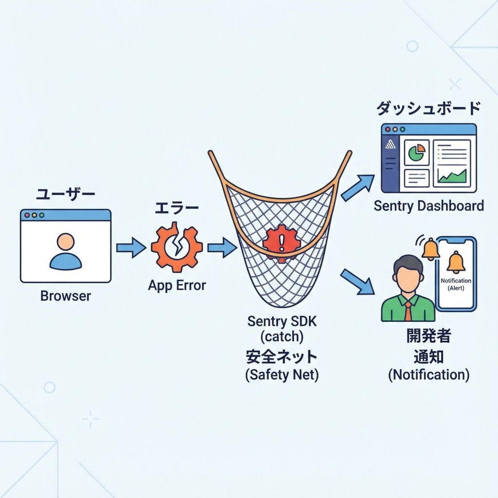
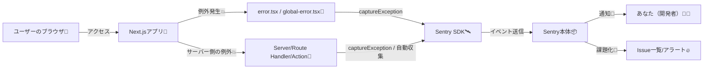

# 第224章：エラー監視（Sentry等）の考え方🧯

「本番でエラー起きてたのに気づかなかった…😱」を防ぐのが、**エラー監視**だよ〜！
Next.jsアプリは公開してからが本番なので、ここは超だいじ💪💕

---

## 1) エラー監視ってなに？なんで必要？🧠🔔

開発中は `console.log()` やターミナルで気づけるけど…
本番ではユーザーの画面でこっそり壊れてても、あなたは気づけないことがあるの🥲

そこで **Sentry** みたいな監視ツールを入れると👇みたいに助かる！

* いつエラー起きた？⏰
* どのページ？どのユーザー？👤
* どの端末・ブラウザ？📱💻
* どのコード行？（スタックトレース）🧵
* 何回起きてる？どれがヤバい？🔥

Sentryは Next.js 向けのガイドやセットアップ手順（Wizard/Manual）を用意してるよ。 ([docs.sentry.io][1])

---

## 2) 監視で見るべき「3点セット」📌✨

エラー監視って言うけど、だいたいこの3つがセットで考えるとラクだよ〜😊

1. **エラー（例外）**：落ちた！壊れた！🧨
2. **パフォーマンス**：遅い…ユーザーが離脱…🐢
3. **リリース/環境**：productionだけ見たい、previewは別にしたい🌱🌳

Sentryは「エラー」だけじゃなく「パフォーマンス計測（Tracing）」もできるよ。 ([docs.sentry.io][2])

---

## 3) 全体像を図でつかもう🗺️✨（Mermaid）





---

## 4) 最短ルート：Sentryを“導入するだけ”やってみよ🚀💖

### ✅ いちばん簡単：Wizard（おすすめ）

Sentry公式は **Wizardでの導入が最速**って案内してるよ。 ([docs.sentry.io][1])

PowerShell（プロジェクト直下）で👇

```bash
npx @sentry/wizard@latest -i nextjs
```

すると、質問に答えながら設定してくれて、例えばこういうファイルが作られたり編集されたりするよ（構成はプロジェクト次第）：

* `sentry.client.config.ts`（ブラウザ側の初期化）
* `sentry.server.config.ts`（サーバー側の初期化）
* `next.config.*` のSentry設定 など ([docs.sentry.io][1])

---

## 5) App Routerで“つまずきやすい”ポイント🪤😵‍💫→😆

### ✅ ポイントA：`error.tsx` / `global-error.tsx` で「拾う」🧯

App Routerのエラーハンドリングは、Next.jsの公式でも `error.tsx` 等で扱う形が説明されてるよ。 ([Next.js][3])

ここで「表示するだけ」になっちゃうと、**Sentryに飛ばない**ことがあるから、**明示的に `captureException`** する流れがよく使われるよ〜（App Routerでは特に話題になりやすい） ([Zenn][4])

例：`app/error.tsx`（雰囲気）

```tsx
"use client";

import { useEffect } from "react";
import * as Sentry from "@sentry/nextjs";

export default function Error({ error, reset }: { error: Error; reset: () => void }) {
  useEffect(() => {
    Sentry.captureException(error);
  }, [error]);

  return (
    <div style={{ padding: 16 }}>
      <h2>ごめんね、エラーが起きちゃった🥲</h2>
      <button onClick={() => reset()}>もう一回やってみる🔁</button>
    </div>
  );
}
```

### ✅ ポイントB：Next.jsの “instrumentation hook” で初期化する流れもある🧵

SentryのNext.js手動セットアップでは、**Next.js 15+（App Router/Turbopack）**前提の説明があるよ。 ([docs.sentry.io][5])
また、Sentry SDKの流れとして **instrumentation hook（`instrumentation.ts`）側へ寄せる**話も出てくることがあるよ。 ([GitHub][6])

> ここはバージョンや構成で変わりやすいので、Wizardの生成物を基本にして、必要なときだけ触るのが安心😊

---

## 6) ちゃんと動いてるか“最速チェック”しよ✅🧪

「入れたつもり」事故を防ぐために、テスト用に一回だけエラー出すのがおすすめ💡

たとえば `app/sentry-test/page.tsx` を作って…

```tsx
export default function Page() {
  throw new Error("Sentry テストだよ〜💥");
}
```

`/sentry-test` にアクセスして、Sentry側にイベントが届けばOK🎉
届かなかったら次の章（ログの見方）とセットで原因追えるよ🧭✨

---

## 7) 本番で超重要：ソースマップ（Source Maps）🗺️🧵

本番で「どの行で落ちたか」が分かると、直す速さが激変するよ⚡
Sentryには Next.jsの **ソースマップ**に関する説明があるし、**Vercel連携でデプロイ時に自動アップロード**する案内もあるよ。 ([docs.sentry.io][7])

ただし注意⚠️
“本番ソースマップを公開しちゃう設定”は、ソースコードが見えちゃうリスクがあるので扱いは慎重にね…！ ([Vercel][8])

---

## 8) 監視を「通知疲れ」させないコツ🧘‍♀️🔕→🔔

おすすめの考え方はこれ👇

* **環境で分ける**：productionだけ強めに通知🌳 / previewは弱め🌱
* **重要度で分ける**：500系は即通知🔥、特定の軽いエラーはまとめる🧺
* **同じエラーは束ねる**：1件ずつ来ると地獄😵‍💫

---

## 9) よくあるハマり集（先に回避しよ）🪤✨

* **`try/catch` で握りつぶしてる**
  → 画面は動くけど、監視には何も来ない😇（必要なら `captureException`）
* **クライアント送信がブロックされる**（広告ブロッカー等）🧱
  → サーバー側でも拾える設計だと安心🧊
* **個人情報を送らない**
  → ユーザー入力をそのままイベントに入れない（マスク/削除）🫶

---

## 10) ミニ課題（10〜15分）🎯💪✨

やることは3つだけ😊

1. `app/error.tsx` で `captureException` を入れる🧯
2. `/sentry-test` を作ってわざと落とす💥
3. Sentryにイベントが届いたら、

   * 「どのページか」
   * 「何回起きたか」
   * 「production/previewどっちか」
     を見てみる👀✨

できたらもう、**“公開しても怖くない”運用の入口**に立ってるよ〜🎉🧡

[1]: https://docs.sentry.io/platforms/javascript/guides/nextjs/?utm_source=chatgpt.com "Sentry for Next.js"
[2]: https://docs.sentry.io/platforms/javascript/guides/nextjs/tracing/?utm_source=chatgpt.com "Set Up Tracing | Sentry for Next.js"
[3]: https://nextjs.org/docs/app/getting-started/error-handling?utm_source=chatgpt.com "Getting Started: Error Handling"
[4]: https://zenn.dev/gef/articles/1d416b1c810a30?utm_source=chatgpt.com "next app router に sentry を導入する"
[5]: https://docs.sentry.io/platforms/javascript/guides/nextjs/manual-setup/?utm_source=chatgpt.com "Manual Setup | Sentry for Next.js"
[6]: https://github.com/getsentry/sentry-javascript/issues/12044?utm_source=chatgpt.com "Next.js docs for v8.0.0 · Issue #12044 · getsentry/sentry- ..."
[7]: https://docs.sentry.io/platforms/javascript/guides/nextjs/sourcemaps/?utm_source=chatgpt.com "Source Maps | Sentry for Next.js"
[8]: https://vercel.com/docs/conformance/rules/NEXTJS_NO_PRODUCTION_SOURCE_MAPS?utm_source=chatgpt.com "NEXTJS_NO_PRODUCTION_S..."
