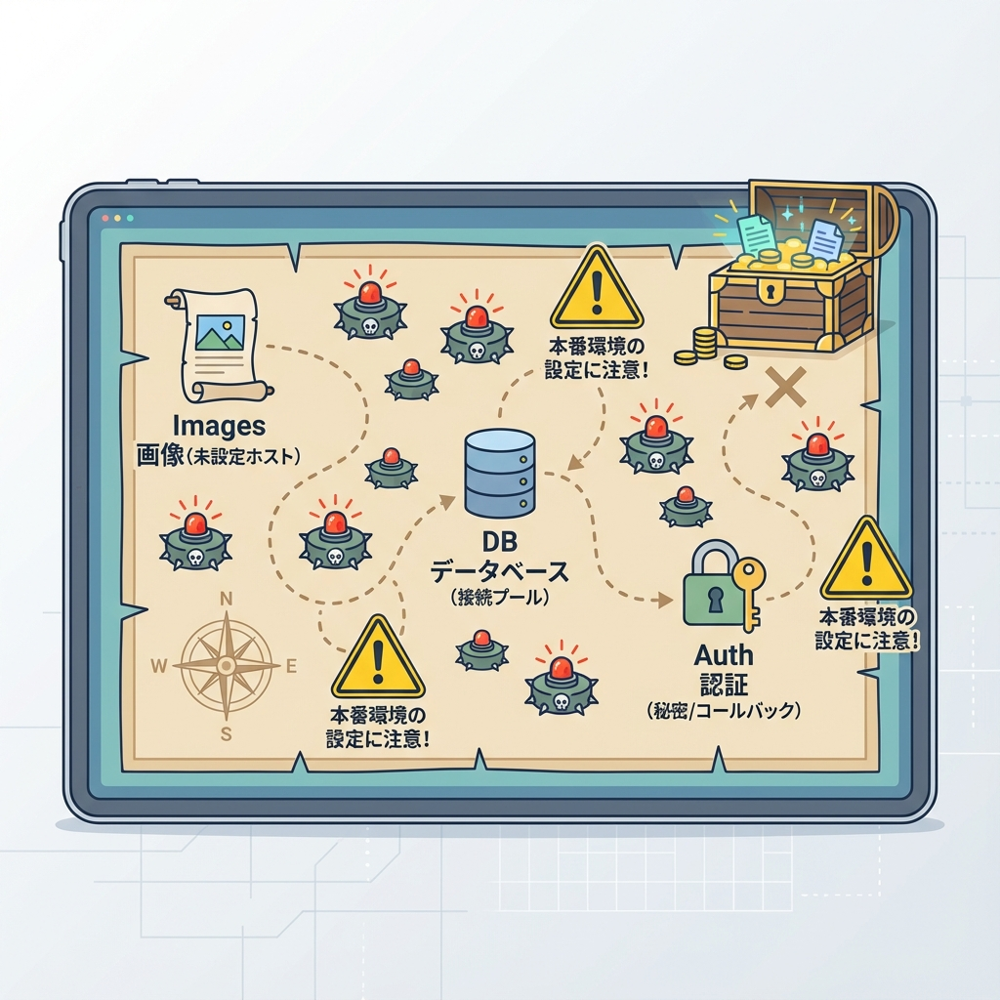
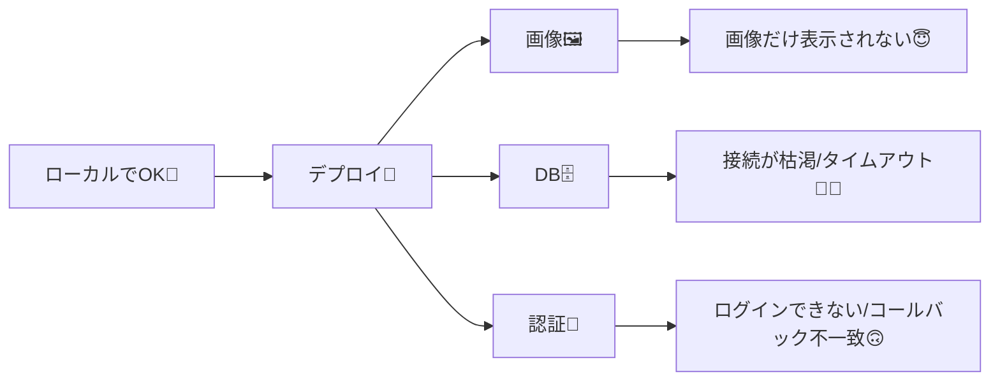

# 第225章：画像/DB/認証の本番設定（罠ポイント）🪤

本番デプロイって、動いた瞬間はうれしいのに…**「画像だけ出ない」「DBだけ落ちる」「ログインだけ死ぬ」**みたいな“部分爆発”が起きがちです🥹💥
この章は、その3つを**先回りで潰す回**だよ〜✨

---

## この章のゴール🎯✨

* 本番で**画像が表示されない**原因をサクッと直せる🖼️🔧
* 本番で**DB接続が詰まる/タイムアウト**を避ける設計が分かる🗄️🚦
* 本番で**認証が失敗**する典型パターンを潰せる🔐🧯

---

## 本番の“地雷マップ”🗺️🪤（だいたいここで踏む）





---

## 1) 画像の本番設定：`next/image` の“許可リスト”罠🖼️🧾🪤

### いちばん多い症状🥲

* ローカルはOKなのに、本番だけ画像が出ない
* コンソールに **unconfigured host** 系のエラーが出る

`next/image` で **外部URLの画像** を使う場合、**そのホストを許可設定**しないと表示できません（セキュリティのため）📛
外部URLは `remotePatterns` に設定が必要だよ、って公式にも明記されています。([Next.js][1])

### 例：`images.remotePatterns` を設定する✅

`next.config.mjs`（または `next.config.ts/js`）にこう書くよ👇

```js
/** @type {import('next').NextConfig} */
const nextConfig = {
  images: {
    remotePatterns: [
      {
        protocol: "https",
        hostname: "images.example.com",
        pathname: "/**",
      },
    ],
  },
};

export default nextConfig;
```

#### 罠ポイント🪤

* `http` と `https` を間違える（`https` で配信されるのに `http` 許可してた、とか）😵
* `pathname` が狭すぎる（`/images/` だけ許可したつもりが実際は `/assets/` だった、など）🌀
* サブドメイン違い（`assets.example.com` と `example.com` は別物）📌 ([Next.js][2])

### ついでに：画像サイズ指定も本番で効く🧠✨

`<Image>` は **width/height（または fill）** の指定が大事！レイアウト崩れ防止になるよ📐
（`srcset` なども自動で最適化してくれる）([Next.js][1])

---

## 2) DBの本番設定：接続プール＆マイグレーションの罠🗄️🪤🧯

### いちばん多い症状🥲

* 本番で突然 **DBタイムアウト**
* たまに動くけど、アクセス増えると **接続が枯渇**
* ビルドやデプロイ時に **マイグレーションだけ失敗**

### 結論（超だいじ）✅

**「アプリが使うURL（プール接続）」と「マイグレーション用URL（直結）」を分ける**のが鉄板です🧱✨
Vercel Postgres + Prisma の公式ガイドでも、`url`（プール）と `directUrl`（直結）を分ける構成になってるよ。([Vercel][3])

#### `schema.prisma` の例（Vercel Postgres想定）🧩

```prisma
datasource db {
  provider  = "postgresql"
  url       = env("POSTGRES_PRISMA_URL")       // ✅ connection pooling
  directUrl = env("POSTGRES_URL_NON_POOLING")  // ✅ direct connection（migrate用）
}
```

### 環境変数の扱い：ローカルと本番を揃える🧪➡️🌍

VercelはプロジェクトにDBを紐づけると環境変数が入ることが多いけど、**ローカルにも同じ値が必要**になるよね。
そのときは Vercel CLI の `vercel env pull` が便利（公式ガイドで手順あり）🧲([Vercel][3])

```bash
vercel env pull .env
```

> `.env.local` 派でもOKだけど、運用ルールはチーム/自分の方針で統一しよ〜📌😊

### PrismaClient：作り方で“接続数”が暴れることがある🧨

開発中（ホットリロード）に PrismaClient を作り直しまくると、接続が増えて死ぬことがあるので、**シングルトン化**が定番です🧊
（本番でも「毎リクエストで重く初期化」しない形にしておくと安心）🧘‍♀️

```ts
// src/lib/prisma.ts
import { PrismaClient } from "@prisma/client";

const globalForPrisma = globalThis as unknown as { prisma?: PrismaClient };

export const prisma =
  globalForPrisma.prisma ??
  new PrismaClient({
    // 必要ならログなどここで
  });

if (process.env.NODE_ENV !== "production") globalForPrisma.prisma = prisma;
```

---

## 3) 認証の本番設定：Secret・URL・プロキシの罠🔐🪤🌐

### いちばん多い症状🥲

* 本番でだけ **「Secretがない」** って怒られる
* OAuthログイン後に **コールバックURL不一致**
* プレビューURLでは動くのに、本番ドメインで変になる🙃

### まず最優先：`AUTH_SECRET`（または互換の `NEXTAUTH_SECRET`）🔑

Auth.js（NextAuth v5系）では **本番で `AUTH_SECRET` が必須**って書かれてるよ。([Auth.js][4])
なので、本番環境変数に **必ず**入れる！💪

```env
AUTH_SECRET="長くてランダムな文字列を入れる！"
```

### OAuthの環境変数：`AUTH_***_ID / SECRET` が基本🎫

v5系は `AUTH_` プレフィックスの推論が強くて、たとえばGitHubならこう👇
（`NEXTAUTH_` も互換で推論されるけど、方針は `AUTH_` に寄せるのがスッキリ）([Auth.js][4])

```env
AUTH_GITHUB_ID="..."
AUTH_GITHUB_SECRET="..."
```

### URLまわりの罠：ホスト自動判定とプロキシ🤹‍♀️

最近は多くの環境でURLは自動判定してくれるけど、**プロキシ配下**などで事故る時があります😵‍💫
その場合は `AUTH_TRUST_HOST=true` が必要になる、と移行ガイドに書かれてるよ。([Auth.js][5])

```env
AUTH_TRUST_HOST="true"
```

### コールバックURL不一致の対策📌

OAuth（GitHub/Google等）は「登録したURL」と「実際に戻ってくるURL」が違うと失敗しがち。
Vercelの公式ガイドでも **コールバックURLと `NEXTAUTH_URL` を揃える**説明があるよ（例では `/api/auth` を使ってる）([Vercel][3])

---

## 本番前の“3分チェック”✅⏱️✨（ここだけやれば事故減る）

* 🖼️ 外部画像を使うなら `remotePatterns` を入れた？（本番URLのホストね！）([Next.js][2])
* 🗄️ Prismaの `url` はプール、`directUrl` は直結で分けた？([Vercel][3])
* 🔐 `AUTH_SECRET` を本番環境変数に入れた？([Auth.js][4])
* 🔁 OAuthのコールバックURL、**プレビューURLと本番URL**で混ざってない？😇

---

## ミニ練習🎮✨（第225章の締め！）

1. 外部画像（例：自分のCDNや画像ホスティング）を1枚表示して、`remotePatterns` を正しく通す🖼️✅
2. `schema.prisma` を **`url + directUrl`** 構成にして、`prisma` クライアントが本番を想定して動く形にする🗄️✅
3. 認証の環境変数（最低 `AUTH_SECRET`）だけは「本番に入ってる状態」を作る🔐✅

これで、デプロイ後の「え、なんでここだけ…😭」がかなり減るよ〜！🎉💕

[1]: https://nextjs.org/docs/app/api-reference/components/image "Components: Image Component | Next.js"
[2]: https://nextjs.org/docs/messages/next-image-unconfigured-host "`next/image` Un-configured Host | Next.js"
[3]: https://vercel.com/kb/guide/nextjs-prisma-postgres "How to Build a Fullstack App with Next.js, Prisma, and Postgres | Vercel Knowledge Base"
[4]: https://authjs.dev/reference/nextjs "Auth.js | Nextjs"
[5]: https://authjs.dev/getting-started/migrating-to-v5 "Migrating to v5"
