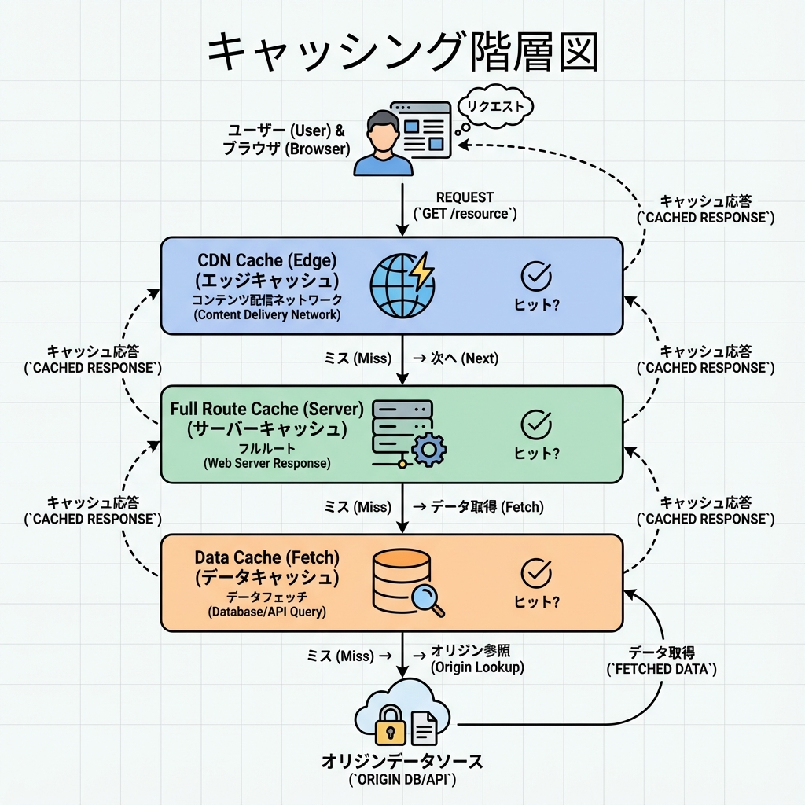
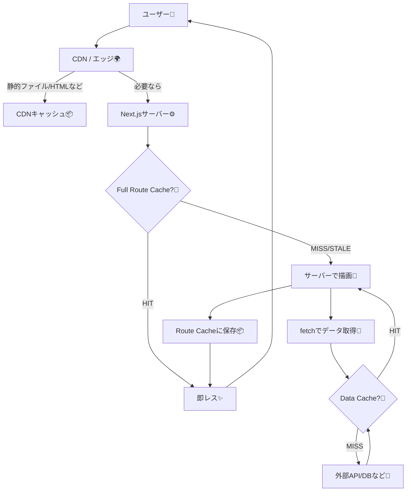
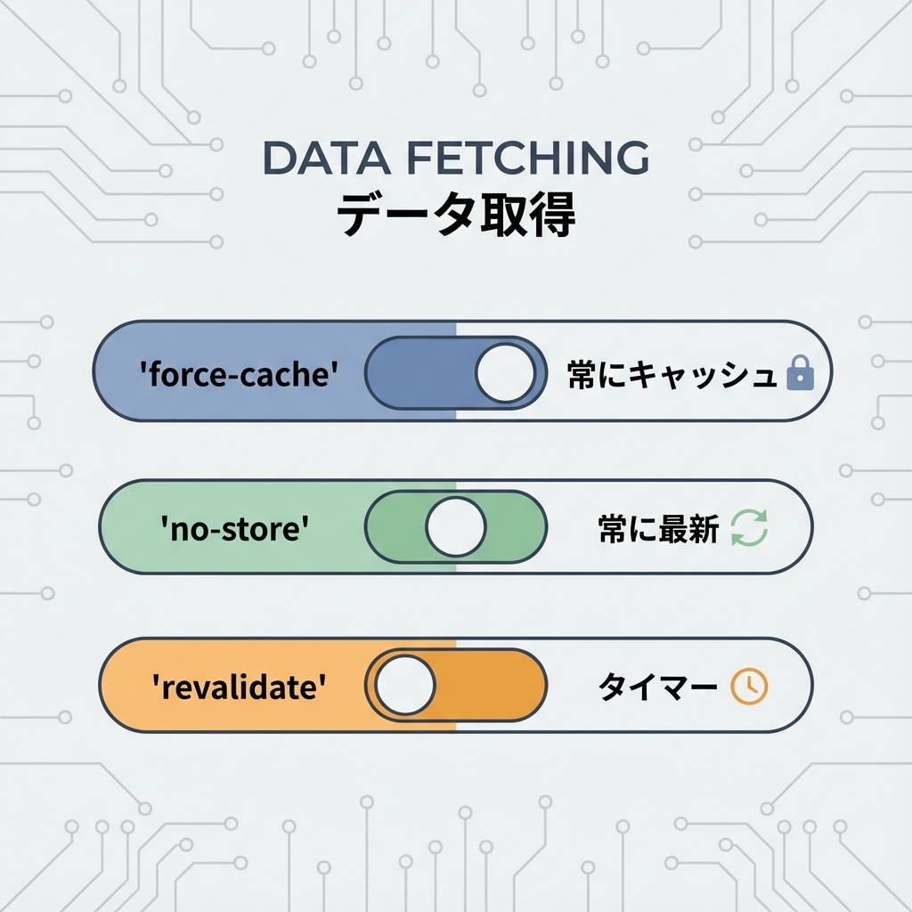
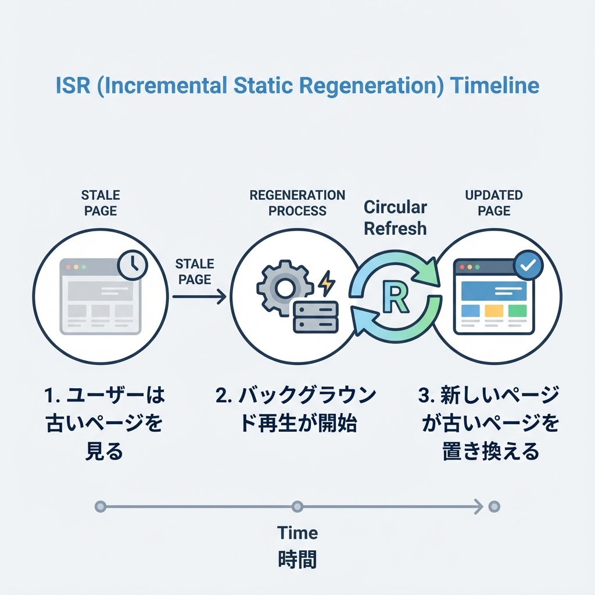

# 第226章：キャッシュと再検証を本番で調整する🧊

本番で「速い✨」と「ちゃんと新しい🆕」を両立させるのが、この章のテーマだよ〜☺️💕

Next.js（App Router）には複数のキャッシュ層があって、どこを・どのくらい・いつ更新するかを決められるんだ🧠✨（Data Cache / Full Route Cache / Router Cache など） ([Next.js][1])

---

## 1) まず全体像：どこにキャッシュがあるの？🗺️🧊





ざっくり言うと👇

* **ページ全体がキャッシュ**される層（Full Route Cache）
* **fetchの結果がキャッシュ**される層（Data Cache）
* **画面遷移をサクサクにする**層（Router Cache）
  って感じだよ🫶 ([Next.js][1])

---

## 2) 「本番で調整」が必要になる理由🥲➡️😌

開発中（dev）って、キャッシュ挙動が本番と違って見えることがあるのね💦
だから **本番っぽく確認したい時は**、ローカルでも

* `next build`
* `next start`

で“本番モード”で動かして確認するのが安心✅ ([Next.js][2])

さらにデバッグ用に、ISRのキャッシュHIT/MISSをログに出す方法もあるよ👇 ([Next.js][2])

---

## 3) 調整のつまみ（超重要）🎛️🧊



### A) 「常に最新」＝キャッシュしない🔥（ダッシュボード向け）

ユーザーごとに変わる画面（例：マイページ、在庫管理）はこれがラク💡

```tsx
// 例：常に最新がほしい（毎回取りに行く）
const res = await fetch("https://example.com/api/me", { cache: "no-store" })
const me = await res.json()
```

また、ルート全体を動的にしたいときは Route Segment Config で指定もできるよ（`force-dynamic` は `cache: 'no-store'` と同等扱い） ([Next.js][3])

```tsx
// app/dashboard/page.tsx
export const dynamic = "force-dynamic"
```

---

### B) 「ほどほどに最新」＝◯秒ごとに更新🕒（ニュース/一覧向け）



「1分くらい古くてもOK、でも速くしたい！」みたいなページに最高✨

Next.jsのISRは「期限切れ後、次のアクセスは古いのを返しつつ裏で再生成→次から新しい」って動きになるよ（stale-while-revalidate） ([Next.js][2])

```tsx
// 例：60秒に1回くらいで更新したい
export const revalidate = 60
```

fetch単位でも「何秒キャッシュするか」を決められるよ（ページ内でAPIごとに調整できる）🧩 ([Next.js][1])

---

### C) 「更新イベントで反映」＝タグ/パスで再検証🔔（CMS/投稿向け）

記事投稿・商品更新みたいに「更新した瞬間に反映したい！」ときの定番✨

#### ✅ タグでまとめて再検証：`revalidateTag`

`revalidateTag` は「タグが付いたデータを“古い扱い”にして、次の訪問で裏更新」って感じ（stale-while-revalidate） ([Next.js][4])
※ 2025年時点では **2引数（'max' など）**が推奨で、1引数は非推奨だよ ([Next.js][4])

```tsx
// 取得側（タグを付ける）
const res = await fetch("https://example.com/api/posts", {
  next: { tags: ["posts"] },
})
```

```ts
// 更新側（Server Actionなどで呼ぶ）
"use server"
import { revalidateTag } from "next/cache"

export async function publishPost() {
  // DB更新など...
  revalidateTag("posts", "max")
}
```

#### ✅ パスでページごと再検証：`revalidatePath`

「このページ（/blog）だけ作り直してね」って指示できる✨
Server Function（Server Action）と Route Handler で挙動の注意があるので、公式の説明どおり使うのが安全だよ🫶 ([Next.js][5])

```ts
"use server"
import { revalidatePath } from "next/cache"

export async function refreshBlog() {
  revalidatePath("/blog")
}
```

---

## 4) ミニ実験：本番モードで「10秒キャッシュ」を体験しよ〜🧪🧊✨

### ゴール🎯

* `/cache-demo` をリロードしても **10秒間は同じ時刻**が出る
* 10秒超えたら、次のアクセスで **裏で更新が走る**感じを体験する

---

### Step 1：今の時刻を返すAPIを作る⏰

```ts
// app/api/now/route.ts
export async function GET() {
  return Response.json({ now: new Date().toISOString() })
}
```

---

### Step 2：10秒キャッシュで表示するページを作る🧊

```tsx
// app/cache-demo/page.tsx
export const revalidate = 10

export default async function Page() {
  const res = await fetch("http://localhost:3000/api/now", {
    // revalidate=10 と合わせて、タグも付けておく（後で手動更新できる）
    next: { tags: ["now"] },
  })

  const data: { now: string } = await res.json()

  return (
    <main style={{ padding: 24 }}>
      <h1>Cache Demo 🧊</h1>
      <p>APIの時刻：{data.now}</p>
      <p>（10秒くらい同じ表示になったら成功〜✨）</p>
    </main>
  )
}
```

> ※ `http://localhost:3000/...` で見せたけど、環境によっては相対パスで書く流儀もあるよ〜（ここは“動きが分かりやすい”優先でOK☺️）

---

### Step 3：本番モードで確認する（超大事）🚀

PowerShellで👇

```powershell
npm run build
npm run start
```

ブラウザで `http://localhost:3000/cache-demo` を開いて、連打リロードしてみてね🔁✨

* だいたい10秒間は同じ時刻
* 10秒を超えたら、次のアクセスで更新が入る（ISRの動き） ([Next.js][2])

---

## 5) 本番（Vercel）での「見える化」👀📮

### ✅ ヘッダーでCDNキャッシュ状況を見る：`x-vercel-cache`

Vercelだと `x-vercel-cache` が `HIT / MISS / STALE` などになって、CDN側の状況が分かるよ📦 ([Vercel][6])
ただし注意⚠️：**Data Cache（fetchのキャッシュ）を使ってても `MISS` になりがち**なので、Data Cacheの命中はログやカスタムヘッダー等で確認してね、って公式にも書いてあるよ〜🫠 ([Vercel][6])

---

## 6) 迷った時の決め方（めちゃ実用）🧠✨

* **ユーザーごとに違う？** → `no-store` / `force-dynamic` 🔥
* **更新は少ないけどアクセス多い？** → `revalidate: 60` 〜 `3600` みたいに長め🕒（公式も“短すぎ注意”って言ってる） ([Next.js][2])
* **更新イベントがある？（投稿/公開/在庫更新）** → `revalidatePath` / `revalidateTag` で“必要な時だけ更新”🔔 ([Next.js][5])

---

次の章（第227章）では、計測の入口（数字で見る📈）に進めるよ〜☺️✨

[1]: https://nextjs.org/docs/app/getting-started/caching-and-revalidating "Getting Started: Caching and Revalidating | Next.js"
[2]: https://nextjs.org/docs/app/guides/incremental-static-regeneration "Guides: ISR | Next.js"
[3]: https://nextjs.org/docs/app/api-reference/file-conventions/route-segment-config "File-system conventions: Route Segment Config | Next.js"
[4]: https://nextjs.org/docs/app/api-reference/functions/revalidateTag "Functions: revalidateTag | Next.js"
[5]: https://nextjs.org/docs/app/api-reference/functions/revalidatePath "Functions: revalidatePath | Next.js"
[6]: https://vercel.com/docs/headers/response-headers "Response headers"
