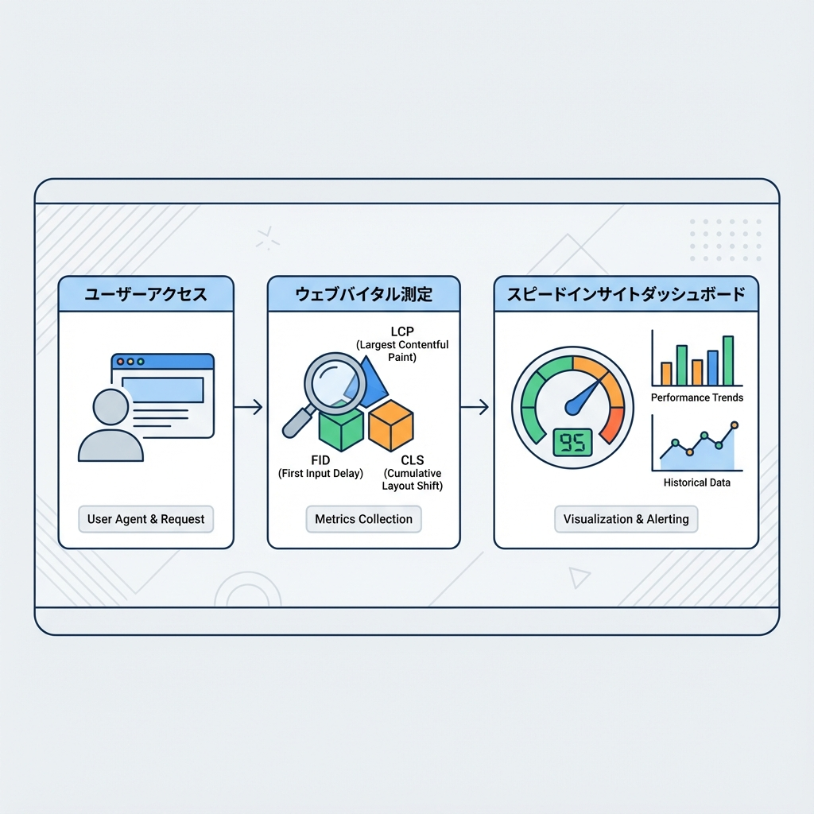

# 第227章：パフォーマンス計測の入口（まず1個だけ）📈

この章は「最初の一歩だけ」やります😊
結論：**Vercel Speed Insights を入れて、Core Web Vitals を“見える化”**しよう〜！🚀 ([Vercel][1])

---

## 1) 今日のゴール🎯

* 本番サイトの **速度（体感）** を「数字」で見えるようにする👀✨
* いきなり全部は追わない！
  まずは **Speed Insights のダッシュボードで 1つの指標**（例：LCP）だけ見る📌

Vercel Speed Insights は **Core Web Vitals ベース**で、サイトの性能を詳しく見られるようにしてくれます🧠 ([Vercel][1])
しかも、**Preview/Production どっちでも計測**できます（便利！）🫶 ([Vercel][1])

---

## 2) ざっくり図解🗺️（何が起きるの？）




---

## 3) 手順（これだけでOK）🛠️✨

### Step A：Vercel 側で Speed Insights を有効化✅

Vercel のプロジェクトを開いて **Speed Insights を Enable**します。([Vercel][1])
（UI操作なのでサクッとできるはず☺️）

---

### Step B：パッケージを入れる📦

プロジェクトのルート（`package.json` がある場所）で👇

```bash
npm i @vercel/speed-insights
```

npm 以外でもOKだけど、この章は npm で進めるね🙂 ([Vercel][1])

---

### Step C：App Router に組み込み（SSRを壊しにくい形）🧩

Next.js（App Router）では、**layout をまるごと Client にしない**のが大事💡
Vercel docs のおすすめは「専用の Client コンポーネントを作る」方式だよ〜！ ([Vercel][1])

#### 1) `app/insights.tsx` を作る✍️

```tsx
'use client';

import { SpeedInsights } from '@vercel/speed-insights/react';
import { usePathname } from 'next/navigation';

export function Insights() {
  const pathname = usePathname();
  return <SpeedInsights route={pathname} />;
}
```

> これで「今どのページが表示されたか」を渡しつつ計測できるイメージだよ📌 ([Vercel][1])

#### 2) `app/layout.tsx` に追加する🏠

（`{children}` の近く、だいたい `</body>` の手前に置けばOK）

```tsx
import type { ReactNode } from 'react';
import { Insights } from './insights';

export default function RootLayout({ children }: { children: ReactNode }) {
  return (
    <html lang="ja">
      <body>
        {children}
        <Insights />
      </body>
    </html>
  );
}
```

これで仕込み完了🎉 ([Vercel][1])

---

## 4) 見る場所（まずここだけ）👀📊

デプロイ後、Vercel のプロジェクト画面で **Speed Insights タブ**を開くと見られます🧭 ([Vercel][1])

最初は欲張らずに👇だけでOK！

* ✅ **トップページ（/）**
* ✅ 指標は **1つだけ**（おすすめ：LCP）

「今の数字（現状）」が取れれば勝ち〜！🏁✨

---

## 5) もし Vercel じゃなく“自前ホスティング”なら？（おまけ）🧷

自前ホストのときは Next.js の `useReportWebVitals` で、好きな分析先に送ることもできます📮 ([Vercel][1])
（この章は “入口” なので、やるなら次の章以降でOKだよ😊）

---

## 6) ミニまとめ🍓

* パフォーマンス改善の前に、**まず計測**📏✨
* 入口は **Vercel Speed Insights**が超ラク💨 ([Vercel][1])
* **1ページ×1指標**だけ見て「基準点」を作ろう📌😊

次の最適化は、数字が出てからで全然OKだよ〜！😆🎀

[1]: https://vercel.com/docs/llms-full.txt "Next.js"
