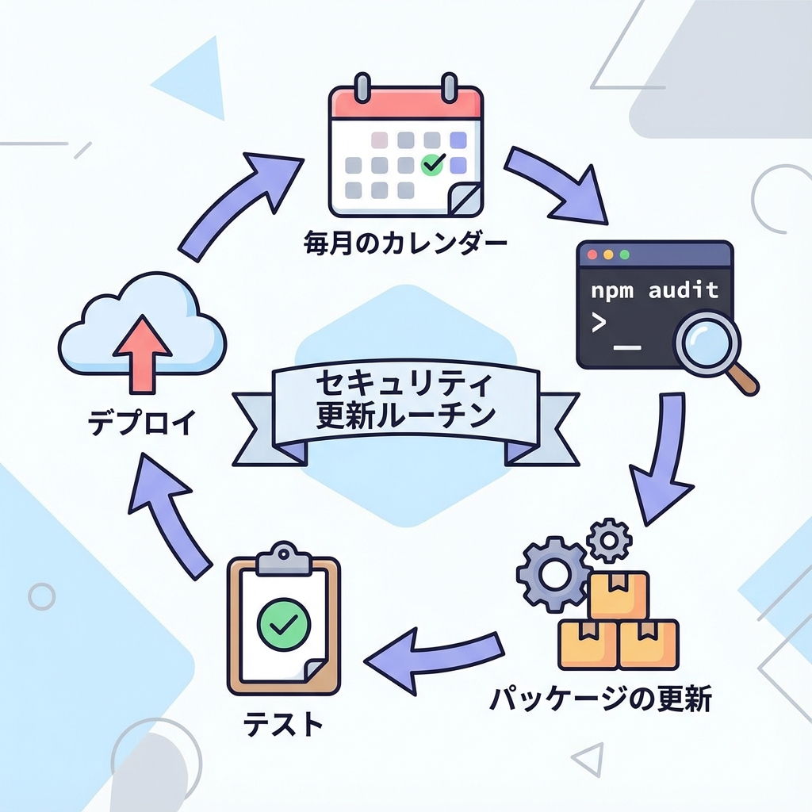
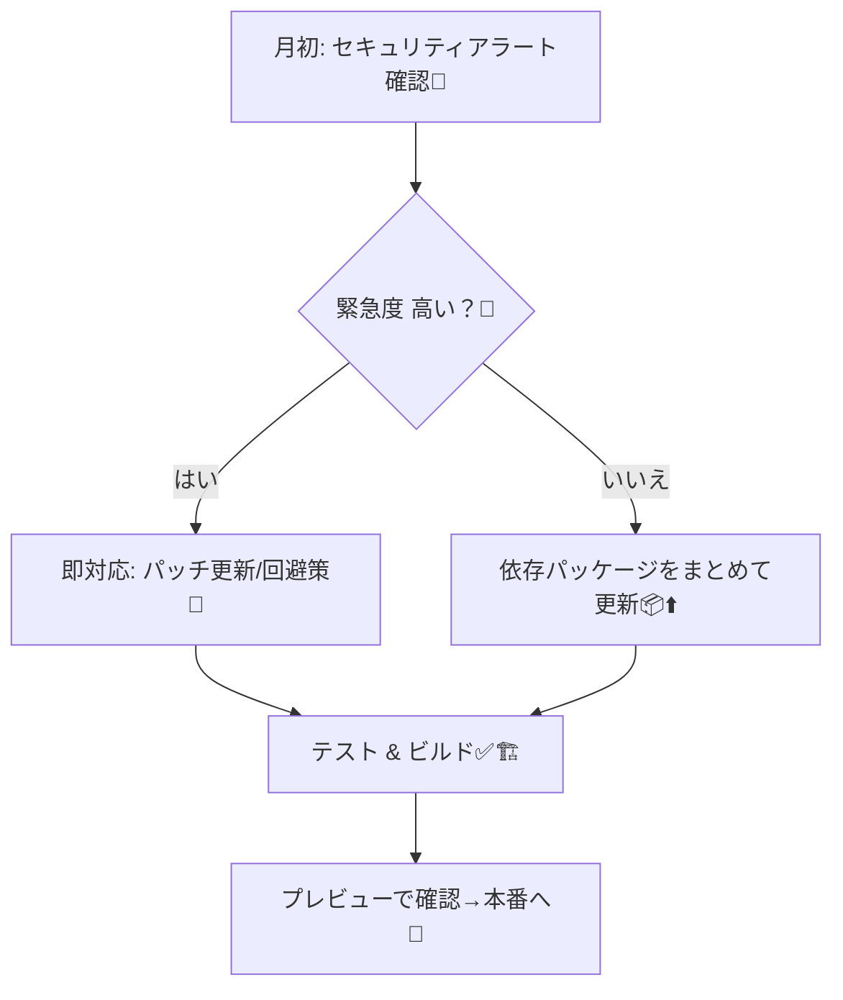
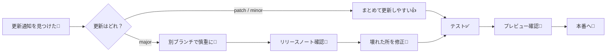

# 第228章：セキュリティアップデート運用（月イチでも）🔁

「セキュリティ対策」って聞くと身構えちゃうけど、実は **“月1ルーティン化”** するだけでかなり強くなります💪😊
Next.js は依存パッケージが多いので、**放置しない仕組み**がいちばん大事です🌱

---

## 1) まず結論：月イチ＋緊急は即対応🚨

* ✅ **月イチ**：まとめて更新して、テストして、安心して運用する🫶
* ⚠️ **緊急（重大な脆弱性）**：見つけたらその日〜数日で対応（後回しNG）💥

---

## 2) 月イチ運用の全体像（これだけ覚えよ〜）🗺️✨





---

## 3) 月イチ30分ルーティン（手順テンプレ）⏱️🎀

### Step 0：専用ブランチを切る🌿

* いきなり main（本流）で作業しないのがコツだよ〜😊

```bash
git checkout -b chore/security-update
```

### Step 1：更新候補を眺める👀

```bash
npm outdated
```

### Step 2：脆弱性チェックする🔍🛡️

```bash
npm audit
```

### Step 3：まずは安全な範囲で自動修正（できる分だけ）🧼

```bash
npm audit fix
```

### Step 4：依存を最新寄せ（必要なときだけ）📦⬆️

「まとめて更新したい」月はこれ👇
（※大きく変わりそうなら後述の“慎重ルール”へ）

```bash
npm update
```

### Step 5：アプリが動くかチェック（最低ライン）✅

```bash
npm run dev
```

### Step 6：テスト＆ビルドで“本番に近い確認”🏗️✨

```bash
npm run test
npm run build
```

### Step 7：コミット→PR→プレビューで確認→マージ🚀

```bash
git add -A
git commit -m "chore: security & deps update"
```

---

## 4) 事故らないための「慎重ルール」🧸🧠

更新には種類があるよ〜👇

* 🟢 **patch / minor**：だいたい安全（まずここを月イチで回す）
* 🟠 **major**：壊れる可能性ある（別枠で丁寧に）



**コツ**💡

* ✅ 1回のPRは“少なめ”が正義（原因特定がラク）🧩
* ✅ ロックファイル（package-lock.json）は一緒に更新する📌
* ✅ 「動いた！」だけじゃなく、ビルドまで通す🏗️✨

---

## 5) 自動化すると超ラク：Dependabot（おすすめ）🤖💌

GitHub を使ってるなら、Dependabot が **「更新PR」を勝手に作ってくれる**よ〜！最高🫶✨
プロジェクトにこのファイルを追加するだけ👇

パス：.github/dependabot.yml

```yaml
version: 2
updates:
  - package-ecosystem: "npm"
    directory: "/"
    schedule:
      interval: "monthly"
    open-pull-requests-limit: 5
    labels:
      - "dependencies"
      - "security"
```

これで毎月、更新PRが届く📮✨
（PRが来たら、さっきの手順でテスト＆ビルドしてOKならマージ！）

---

## 6) “緊急アラート”が来たときの動き方🚨🧯

緊急（Critical/High）っぽい時は、月イチを待たずにこれ👇

1. 🔔 何が危ないか確認（どのパッケージ？影響範囲？）
2. 📦 まずはパッチ更新（最小変更）
3. ✅ テスト＆ビルド
4. 👀 プレビューで最低限の動作確認
5. 🚀 本番へ
6. 📝 対応メモを残す（未来の自分が助かる）

---

## 7) ミニ練習：今月の“セキュリティ更新PR”を作ってみよう🎯✨

やることはこれだけ〜😊💖

* chore/security-update ブランチを作る🌿
* npm audit → npm audit fix をやる🛡️
* npm run build が通るのを確認🏗️
* PRを作って、変更点を短くメモ📝

---

## まとめ：月イチでも「放置しない仕組み」が勝つ🏆🛡️✨

* 🔁 月イチで回すだけで、セキュリティは一気に現実的になる
* 🤖 自動PR（Dependabot）で“やる気”に頼らない
* ✅ テスト＆ビルドまで通して、本番事故を防ぐ

この章のゴールは「毎月やることが決まってる状態」だよ〜！🎀😊
