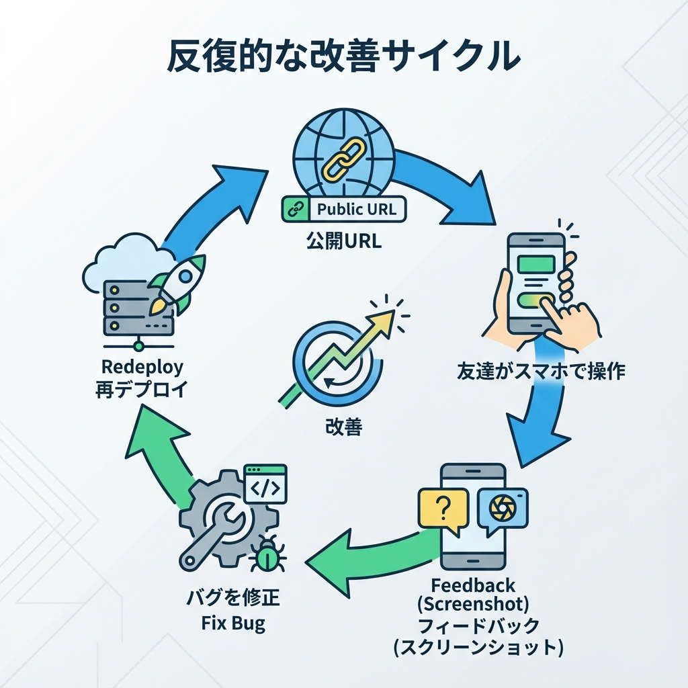
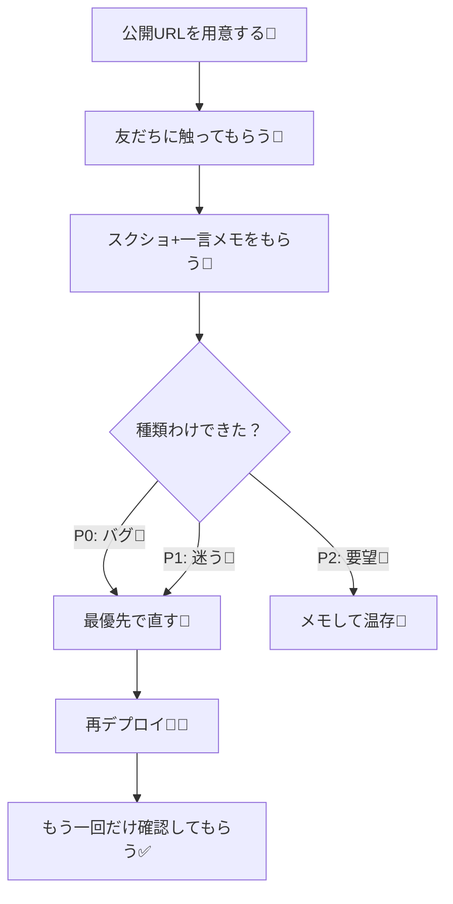
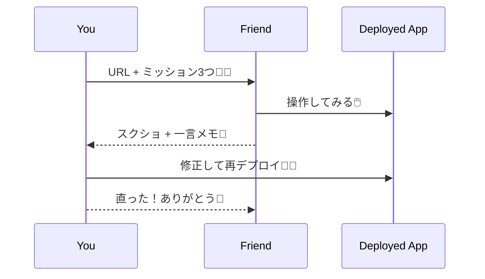

# 第229章：練習：本番に出して“友だちに触ってもらう”📱🧡

今日は「公開したアプリを、友だちに実際に触ってもらって、改善につなげる」回だよ〜！✨  
ここまで来たら、もう“開発者の目”だけじゃ気づけないことが山ほど出てくるよ👀💥

---

## この章のゴール🎯✨
- 友だちにURLを渡して、スマホで触ってもらえる📱
- 「何が分かりにくいか」を回収できる📝
- 直す優先順位を決めて、1回だけ改善して再デプロイできる🔁🚀

---

## 事前チェック✅（5分でOK）
最低限これだけやってから渡すと、事故が減るよ〜😌🫶

````powershell
npm run lint
npm run build
`````

* 主要なページが開ける？🏠📄
* ローディング中が真っ白じゃない？⏳（`loading.tsx`）
* エラー時に詰まない？🧯（`error.tsx`）
* スマホ幅でレイアウト崩れてない？📱（ChromeのデバイスモードでもOK）

---

## 1) 友だち用「ミッション」を3つ作ろう🎮✨

友だちに「自由に触って〜！」だけだと、意外と何も起きないことあるの😂
なので、**短いミッション**を渡すのがコツ！

例（あなたのアプリに合わせて書き換えてね）👇

* ミッションA：トップ → 一覧 → 詳細まで行ってみて📄➡️🔍
* ミッションB：何か1個追加してみて➕✨
* ミッションC：わざと変な入力をしてみて（エラーの出方を見る）🧪🧯

---

## 2) 友だちに送るメッセージテンプレ💌✨

LINEでもDMでもOK！短くてやさしいのが正義🫶

* 送る内容はこの4点だけでOK👇

  1. URL
  2. 所要時間（5〜10分）
  3. ミッション3つ
  4. 返してほしいもの（スクショ＋一言）

例（コピペOK）👇
「これ今作ってるアプリなんだけど、5〜10分だけ触ってほしい〜！🥺✨
①（URL）
ミッション：A→B→Cやってみて、詰まった所があったらスクショ＋一言だけ送ってほしい📱🧡
“良かった所”も1個あったら嬉しい〜！」

---

## 3) 友だちに見てほしいポイント（お願いリスト）👀📌

友だちが困ったら、ここを見てスクショしてもらうと超助かるよ！

* どの画面で「次どうすればいいか分からない」になった？🌀
* ボタンが押しづらい/小さい/見つからない？🖱️📱
* 文言が難しい/冷たい/怖い？😖（“エラー文言”あるある）
* 入力フォーム：どこを埋めればいいか迷う？📝
* 画面がガタガタする/読み込みが長い？⏳💦

---

## 4) フィードバックを「その場で整理」する🧺✨

返ってきた内容は、まずこの3分類にすると迷子にならないよ〜🧠💡

| 種類   | 例                    | 優先度     |
| ---- | -------------------- | ------- |
| 🧨バグ | そもそも動かない / 画面真っ白     | 最優先（P0） |
| 🧭迷う | ボタン見つからない / 意味が分からない | 高（P1）   |
| 🎀要望 | こうだったら嬉しい            | 低〜中（P2） |

コツ：**この章では「P0かP1を1個だけ直す」**でOK！✨
全部直そうとすると、疲れて終わっちゃうからね🥹🫶

---

## 5) “直す→再デプロイ→もう1回だけ触ってもらう”🔁🚀

改善は小さく回すのが勝ち！💪✨
直したら、友だちに「直ったよ〜！ありがとう！」って送って、もう一回だけ確認してもらおう📱🧡

---

## 図解：この章の「改善ループ」🌀✨





---

## 図解：友だちテストのやりとり（イメージ）📨



---

## よくある“本番での落とし穴”あるある🪤😇（軽くでOK）

* 「テスト用データが空」だと、友だちが何も試せない😂
  → 最初からサンプルが見えるUI（空状態の案内）を用意すると親切🌸
* エラー文言が冷たい（例：Internal Server Error）🥶
  → 「ごめんね、もう一回押してみて🙏」みたいにしておくと好感度UP🫶
* スマホでボタンが押しにくい📱
  → ボタンは大きめ＆余白多めが正義✨

---

## ミニ課題🎒✨（提出イメージ）

次の3つをこの章の成果として残そう！🧡

1. 友だちに渡したミッション3つ🎮
2. 返ってきたフィードバックをP0/P1/P2に分類🧺
3. P0かP1を1個だけ直して再デプロイ🔁🚀（できたら最高！）

---

## 今日のゴール達成チェック✅🎉

* [ ] 友だちにURLを送った📨
* [ ] スクショ＋一言が1個以上返ってきた📱📝
* [ ] 直す優先順位が決まった🧠
* [ ] 1個だけ直して出し直した🔧🚀

ここまでできたら、もう“作れる人”だよ〜！😆🧡✨

```
```
