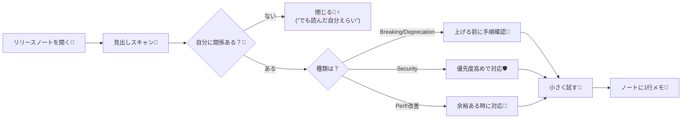

# 第230章：練習：リリースノートを読む習慣（怖くない）📰

リリースノートって、要するに「アップデートの日記」みたいなものだよ〜📔💛
全部を理解しようとすると大変だけど、**“自分に関係あるとこだけ拾う”** なら全然こわくないっ😊🌸

---

## この章のゴール🎯

* リリースノートを **5〜10分でサクッと読める** ようになる⏱️✨
* 「今回は何をすればいい？」が **1行で言える** ようになる📝💡
* アップデートを **事故らずに** 進める小さな型を作る🛡️🚀

---

## まず「どこを読む？」（おすすめ3か所）📍👀

### ① Next.jsのブログ（大きい変更をつかむ）📰

新機能や方針の“まとめ”が読みやすいよ✨ ([Next.js][1])

### ② GitHub Releases（細かい修正・パッチも追える）🔧

「Latest」やバージョンごとに、変更点が並んでるよ📦 ([GitHub][2])

### ③ Upgradingガイド（上げ方が書いてある）🧭

アップグレード手順や注意点がまとまってるから、困ったらここ！ ([Next.js][3])

---

## 「怖くない読み方」：3段階スキャン術👓✨

### レベル1：見出しだけ読む（30秒）⚡

* Breaking / Deprecation（壊れる系）ある？😱
* Security（安全系）ある？🛡️
* Performance（速くなる系）ある？🚀

### レベル2：自分に関係ある単語だけ拾う（3分）🔎

例：

* `Turbopack` / `Middleware` / `Cache` / `Route` / `Server Actions` / `Image` など
  「あ、これ使ってる！」って単語だけでOK🙆‍♀️✨

### レベル3：やることを1つに絞る（1分）✅

* 今すぐ上げる？（セキュリティ/重大）
* 次の開発のタイミングで上げる？（普通の改善）
* 今日は何もしない？（関係ない）

---

## 図解：読む→判断→行動の流れ（これだけでOK）🧠➡️🛠️




---

## 実践①：リリースノート用「1行メモ」テンプレ作ろう📝💕

プロジェクト直下に `release-notes.md` を作って、毎回これだけ書く✨
（**“読む習慣”**の正体は、実はこのメモ✍️😊）

```md
# Release Notes Log 📰

## YYYY-MM-DD
- 対象：Next.js / React / Node など
- ざっくり何が変わった？：
- うちの影響は？（大/中/小）：
- 今日の行動（1つだけ）：例）次の開発でアップグレード用ブランチ作る
```

---

## 実践②：今の環境を“メモれる状態”にする（Windows）🪟✨

プロジェクトのフォルダで PowerShell を開いてね💻💕

### 1) Next.jsのバージョンを見る👀

```bash
npx next --version
```

### 2) 相談用の環境情報を一発で出す（便利！）🧾

```bash
npx next info
```

`next info` はOSやNode/npm、`next`/`react`/`react-dom` の情報をまとめて出してくれるよ🫶 ([Next.js][4])

---

## 実践③：アップデートする時の「安全な型」🛟✨

### A) まずは“アップデート用ブランチ”を作る🌿

事故っても戻れるから安心☺️💕

### B) 公式の上げ方を使う（おすすめ）⬆️

最近は `next upgrade` ってコマンドが用意されてるよ✨ ([Next.js][3])

```bash
next upgrade
```

もし古いNext.jsで `next upgrade` が使えない時は、アップグレード用codemodを使う案もあるよ🧰 ([Next.js][3])

```bash
npx @next/codemod@canary upgrade latest
```

### C) 手で上げるならこれ（最低ライン）🧩

```bash
npm install next@latest react@latest react-dom@latest
```

（Upgradingガイドにもこの形が載ってるよ） ([Next.js][5])

### D) 最後に“動作確認3点セット”✅

```bash
npm run dev
npm run build
npm run start
```

---

## ミニ課題（この章の練習）🎒✨

### 課題：Next.jsのリリースノートを1本だけ読んで、1行メモを書く📝💕

1. Next.jsブログ or GitHub Releases を1つ開く📰 ([Next.js][1])
2. 見出しスキャン（Breaking/Security/Perf）👀
3. 「自分のプロジェクトに関係ある単語」を1つ拾う🔎
4. `release-notes.md` に **1行だけ** 書く✍️✨

   * 例：「次の開発のタイミングで `next upgrade` 試す」みたいな感じでOK🙆‍♀️

---

## よくある不安あるある（大丈夫）🫶🥹

* 「読んだけどよく分からない…」→ **それ普通！** 見出しスキャンできてれば合格💯✨
* 「全部対応しなきゃ？」→ **しないでOK！** 影響あるとこだけで十分😊
* 「いつ読むのがいい？」→ **週1で5分** が最強（習慣は軽さが命）⏱️💕

---

ここまでできたら、第230章クリアだよ〜🎉🎉🎉
次のアップデートから、リリースノートが“敵”じゃなくて“味方”になるはず🫶✨

[1]: https://nextjs.org/blog?utm_source=chatgpt.com "The latest Next.js news"
[2]: https://github.com/vercel/next.js/releases?utm_source=chatgpt.com "Releases · vercel/next.js"
[3]: https://nextjs.org/docs/app/getting-started/upgrading?utm_source=chatgpt.com "Getting Started: Upgrading"
[4]: https://nextjs.org/docs/13/pages/api-reference/next-cli?utm_source=chatgpt.com "API Reference: Next.js CLI"
[5]: https://nextjs.org/docs/app/guides/upgrading/version-16?utm_source=chatgpt.com "Upgrading: Version 16"
