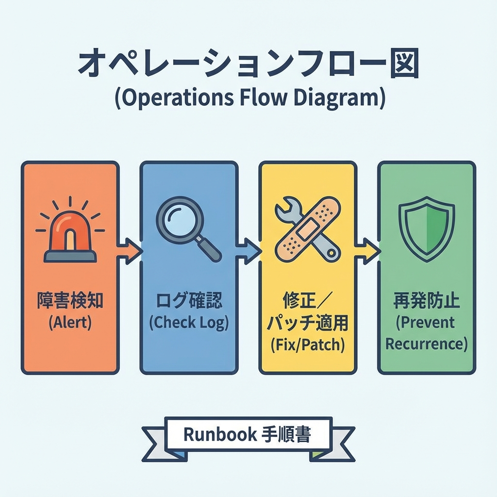
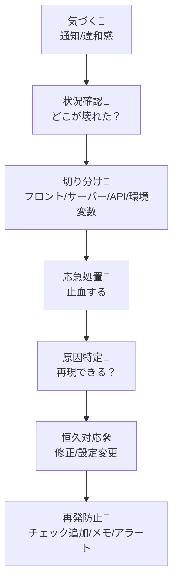
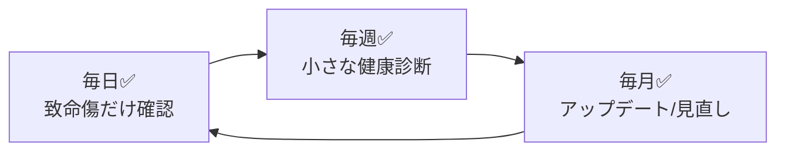

# 第231章：復習：運用は“仕組み化”でラクになる🛠️

ここまでで「作る→デプロイする」までできるようになったので、最後に **公開後の“ラクする技術”＝運用の仕組み化** をまとめるよ〜😆💕

運用っていうのは、ざっくり言うと👇
**「落ちないように見守る」＋「落ちたら早く直す」＋「同じ事故を起こさない」** だよ🧯🔁

---

## この章のゴール🎯✨

* 公開後にやることを **“作業”じゃなく“手順”** に変える🧾✅
* 困ったときに迷わない **チェック順** を作る🧭
* “未来の自分”がラクになる **最低限の運用セット** を完成させる🫶

---

## まず結論：運用がしんどい理由は「毎回考える」から😵‍💫

運用がツラいのは、能力不足じゃなくて、だいたいこれ👇

* 「何から確認すればいいんだっけ？」🤔
* 「どこを見るんだっけ？ログ？設定？URL？」🌀
* 「前に同じの起きた気がするけど、記録ない😇」

だから、解決策はシンプルで👇
**“考える部分”を減らして、手順にする** ✅✨

---

## 仕組み化の全体像（この流れを固定する）🧠➡️🛠️➡️🧾

トラブル対応も、改善も、全部この流れでOKだよ👇





この順番を **Runbook（手順書）** にしておくと、めっちゃラクになるよ〜📘✨

---

## 最低限そろえる「運用3点セット」📦✨

### ① 監視（気づける仕組み）👀🔔

* 「落ちたのに気づかない」が一番つらい😭
* 理想は **“自分から見に行かなくても分かる”** こと✨

最低限はこれでOK👇

* エラー監視（例：Sentryなど）🧯
* パフォーマンスの入口（Core Web Vitals / Speed系）📈
* 重要導線の死活（トップページ / ログイン / API）✅

---

### ② ログ（原因に近づく地図）🪵🧭

* “何が起きたか” が分からないと、ずっと迷子になるよ〜🌀

最低限の考え方👇

* **いつ**（時刻）
* **どこ**（ページ/Route Handler/Action）
* **何が**（例外メッセージ）
* **誰が**（ユーザーIDがあれば最高、ただし個人情報は注意🫣）

---

### ③ 手順書（毎回の脳みそ節約）🧾🧠✨

これが今回の主役！
手順書があると👇

* “焦り” が減る😮‍💨
* 対応が速くなる⚡
* 直したあとに同じ事故が減る🔁✨

---

## 「Runbook（手順書）」のおすすめ置き場所📁💡

プロジェクト内にこういうフォルダを作るのが超おすすめ👇

* `docs/runbook.md`（困ったときの手順書）📘
* `docs/ops-checklist.md`（日次/週次/月次チェック）✅
* `docs/release-checklist.md`（リリース前後の確認）🚀
* `docs/incident-notes.md`（事故メモ：いつ・何が・原因・対策）📝

ポイントは👇
**「探さない」＝「ルールを固定する」** 🔒✨

---

## Runbookの“型”テンプレ（コピペでOK）🧸✨

`docs/runbook.md` に、この形で置いちゃおう👇

```md
# Runbook（運用手順書）

## 1) まず最初に見る（30秒）
- [ ] どのURLで起きてる？（トップ？特定ページ？）
- [ ] いつから？（直前のデプロイは？）
- [ ] 影響範囲は？（全員？一部？ログイン時だけ？）

## 2) 切り分け（2分）
- [ ] フロント表示だけ？（画面崩れ/JSエラー）
- [ ] APIが死んでる？（500/タイムアウト）
- [ ] Server Actions が失敗？（送信で落ちる）
- [ ] 環境変数変えた？（本番の設定差分）

## 3) よくある原因（あるある順）
- [ ] 本番の環境変数が足りない/名前違い
- [ ] 外部APIが落ちてる/レート制限
- [ ] 依存パッケージ更新で破壊
- [ ] キャッシュ/再検証設定の想定違い
- [ ] DB接続・認証設定のミス

## 4) 応急処置（止血）
- [ ] 直前の変更を戻す（ロールバック相当）
- [ ] 影響機能を一時的に無効化（ガードを入れる）
- [ ] エラーメッセージをユーザーに優しくする

## 5) 恒久対応（直す）
- [ ] 再現手順を書ける？
- [ ] 直した内容をPR/コミットに残す
- [ ] 監視/チェックを追加する（再発防止）
```

このテンプレがあるだけで、事故対応のストレスが激減するよ〜🫶✨

---

## “定期作業”も手順にしちゃう（運用チェックリスト）✅📅

「気づいたときにやる」だと忘れるので、やることを固定するよ〜😆



### 毎日（1分でOK）☀️

* エラー監視が増えてない？🧯
* 主要ページが開ける？🏠
* お問い合わせ系が動く？📮

### 毎週（5分）📅

* 直近の変更で怪しいところない？🧪
* パフォーマンスが急に悪化してない？📉
* 事故メモ（incident-notes）を1行でも更新📝✨

### 毎月（30分だけ）🧼

* 依存関係アップデート（まとめて）🔁
* セキュリティ系の注意喚起チェック🛡️
* 使ってない機能・ページを整理（負債を減らす）🧹

---

## ありがちな“公開後トラブル”の対処順（超短縮版）🧯⚡

### ケースA：ページが500になる😭

1. 直前のデプロイ有無を見る🚀
2. エラーログ（サーバー側）を見る🪵
3. 環境変数の不足・名前違いを疑う🔐
4. 外部API/DBの落ちを疑う🌐
5. 応急処置 → 恒久対応へ🛠️

### ケースB：フォーム送信だけ失敗する📨💥

1. Server Actions / API のどっちか確認🔎
2. バリデーションエラー？例外？を分ける🧩
3. ユーザーに“優しいエラー文”が出てるか確認🫶
4. 再発防止：同じ入力でテストを追加✅

---

## ミニ課題（第231章）🎒✨：仕組み化ファイルを1つ作ろう！

次のどれか1つだけでOK（小さく勝つ🏁）👇

* `docs/runbook.md` を作ってテンプレを貼る📘✨
* `docs/ops-checklist.md` を作って「毎日/毎週/毎月」を書く✅
* `docs/incident-notes.md` を作って「1行目だけ」書く📝（例：`2025-12-26: 公開後の運用テンプレ作成`）

できたら勝ち！🎉
**“運用がラクなプロジェクト”は、だいたいこの1枚から始まる** よ〜🫶✨

---

## まとめ🎀✨

* 運用がしんどいのは「毎回考える」から🤯
* **手順書（Runbook）＋チェックリスト＋事故メモ** の3点でラクになる🛠️✅📝
* 仕組み化は、才能じゃなくて **“型”** 💡
* 小さく作って、ちょっとずつ育てるのが最強🌱✨

次の章（第232章）は、いよいよ **公開URLの完成🎉** に向けたミニ課題だね〜！🚀
