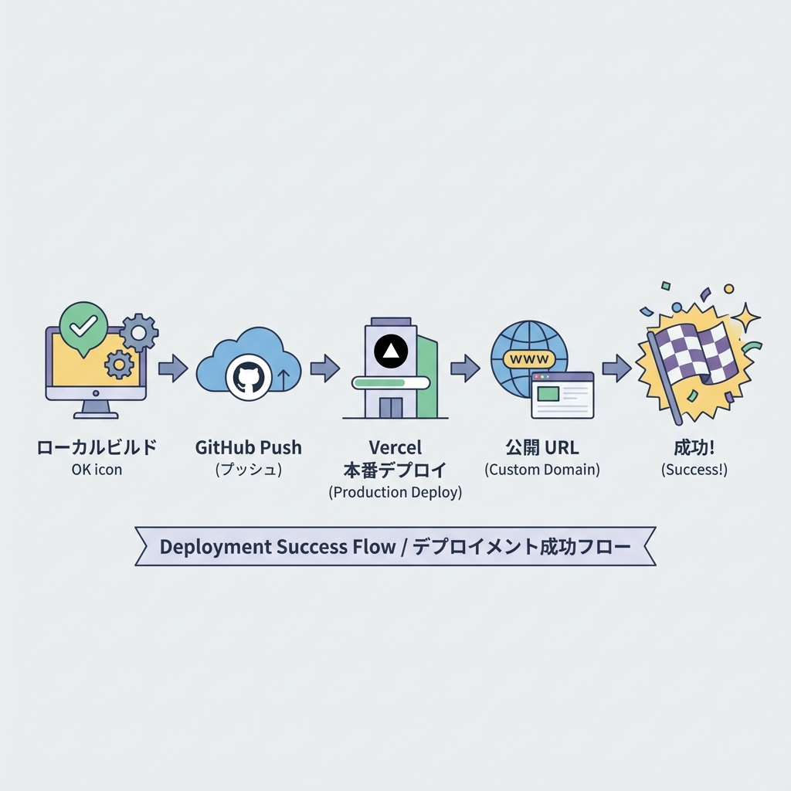
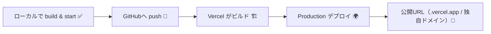
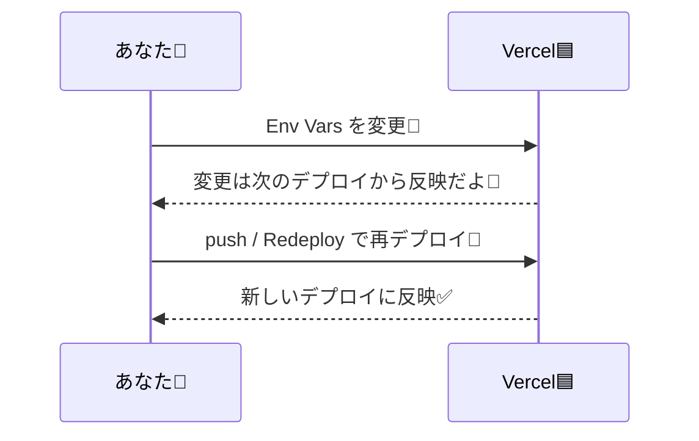

# 第232章：ミニ課題：公開URLを完成させる🎉

ここまで作ったアプリを「だれでも触れるURL」にして、**公開完了！**まで持っていく章だよ〜🙌💕

---

## 🎯 今日のゴール（これができたら合格！）✅

* ✅ **本番用ビルドがローカルで動く**
* ✅ **VercelのProductionにデプロイできている**
* ✅ **公開URLを“人に送れる状態”に整える**（できれば独自ドメインも✨）
* ✅ **最低限の公開前チェックを通す**

---

## ① まずローカルで「本番モード」を動かして確認しよ🧪💻

Next.jsは、本番は **build → start** の順で動くよ〜！🧁
（`dev` と挙動が違うことがあるから、ここ超大事！）([Next.js][1])

### ✅ 手順（Windows / PowerShellでOK）

プロジェクトのフォルダで👇

```powershell
npm run build
npm run start
```

* ブラウザで `http://localhost:3000` を開く👀✨
* 変なエラーが出ないかチェック✅
* 終わったら **Ctrl + C** で止める🛑

### 👀 ここだけチェックしておけば安心ポイント💡

* ✅ 画面が真っ白にならない
* ✅ ルーティング（ページ移動）が全部できる
* ✅ フォーム送信やAPI呼び出しが動く（ある人だけ）
* ✅ 環境変数を使ってる機能が動く（ある人だけ）

---

## ② VercelのProductionにデプロイする🚀🧡

Next.jsはVercelと相性がよくて、**Git連携でデプロイ**が基本だよ〜！([Vercel][2])

### ✅ ざっくり流れ

* GitHubにpush → Vercelがビルド → 公開URLが出る🎁





### ☑️ すでにVercelに繋いである前提での最短手順✨

1. GitHubへ push（main など）🚀
2. VercelのProject画面で **Production のデプロイが成功してるか**見る👀
3. **ProductionのURL**をクリックして動作確認✅

---

## ③ 環境変数（.env系）の“最後の罠”を潰す🔐🪤

本番で「あれ？動かない…😢」の原因、だいたい環境変数です（あるある）🥹

### ✅ Vercel側で確認すること

* Vercelには **Environment Variables** があって、環境（Preview/Productionなど）ごとに値を持てるよ🧩([Vercel][3])
* **環境変数を変更しても、過去のデプロイには反映されない** → つまり、反映させたいなら **再デプロイが必要**🔁([Vercel][4])



---

## ④ 公開URLを「完成形」にする🎀🔗

### A) まずは .vercel.app のURLでOK！🎉

Vercelはデプロイすると自動でURLが出るから、まずはそれで公開完了でOK🙆‍♀️✨

### B) （できたら最高✨）独自ドメインを付ける🌸

やるなら、Vercelの **Settings → Domains** から追加する流れだよ🧭
ざっくり手順はこんな感じ👇([Vercel][5])

* ① Projectを選ぶ
* ② Settings → Domains
* ③ ドメインを追加（例: `example.com`）
* ④ 指示通りにDNSを設定（レジストラ側）
* ⑤ Verify（確認）して完了✅

---

## ⑤ 公開前チェック（ミニ版）✅✨

「最低限これだけ！」のチェックだよ〜🧁
（ちゃんとやりたい人は、Vercel/Next.jsのチェックリストも参考になるよ）([Vercel][6])

### ✅ 公開直前チェックリスト

* 🔗 URLを開いてトップが表示される
* 🧭 主要ページ3つくらいは全部クリックして確認
* 🧯 わざと存在しないURLを開いて、404の挙動が変じゃない
* 📱 スマホ幅（DevTools）でレイアウト崩れが致命的じゃない
* 🔐 秘密情報（APIキーとか）が画面に出てない / リポジトリに入ってない
* ⚡ 体感で重すぎない（画像が激重なら要注意）

---

## ✅ ミニ課題（提出物イメージ）📮🎉

次の3つをそろえたら「公開URL完成！」でクリアだよ〜🙌💕

### 1) Production の公開URL 🔗

* `https://xxxxx.vercel.app` でもOK！
* 独自ドメインがあるならそれが最高✨

### 2) 動作確認メモ（短くてOK）📝

例：

* ✅ トップ表示OK
* ✅ 記事一覧→詳細OK
* ✅ 404 OK

### 3) “友だちに送る用”の一言メッセージ（超大事🥰）💌

例：

* 「スマホでも見れるよ📱✨ ここから触ってみて〜！👉（URL）」

---

## 🎉 クリア判定（これで合格！）✅

* ✅ Production URL が開く
* ✅ 最低限の導線が壊れてない
* ✅ 人に送れる状態になってる

ここまでできたら、もう「公開できる人」だよ〜！🥳🌸

[1]: https://nextjs.org/docs/app/getting-started/installation?utm_source=chatgpt.com "Getting Started: Installation"
[2]: https://vercel.com/docs/frameworks/full-stack/nextjs?utm_source=chatgpt.com "Next.js on Vercel"
[3]: https://vercel.com/docs/environment-variables?utm_source=chatgpt.com "Environment variables"
[4]: https://vercel.com/docs/environment-variables/managing-environment-variables?utm_source=chatgpt.com "Managing environment variables"
[5]: https://vercel.com/docs/domains/working-with-domains/add-a-domain?utm_source=chatgpt.com "Adding & Configuring a Custom Domain"
[6]: https://vercel.com/docs/production-checklist?utm_source=chatgpt.com "Production checklist for launch"
