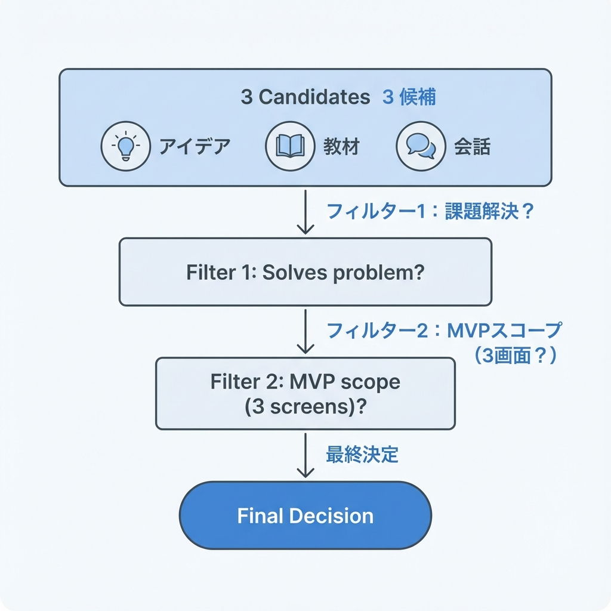
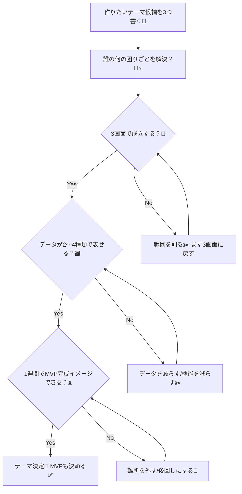

# 第233章：卒業制作テーマ決め（3案から選ぶ）🎯

ここからは「卒業制作」スタートだよ〜！🎓💖
最初にやるべきことは **テーマ決め** 🧠✨
テーマが決まると、次の章（要件・URL設計・DB設計…）がスイスイ進むよ🚀

---

## 1) 今日のゴール🎯💡

* 3つの候補から **どれか1つに決める** ✅
* そして「最低限作る範囲（MVP）」も一緒に決める🧊✨

MVPっていうのは「これだけできたら完成と言える最小セット」だよ🙆‍♀️🌸
（最初から全部盛りしないのがコツ！🍰➡️🍰🍰🍰は後で）

---

## 2) テーマ決めのコツ（失敗しないやつ）🧭🫶

テーマは「好き」だけで決めると、途中で大変になりがち🥲
だからこの3つで選ぶのが最強だよ〜！

* **毎日触っても苦じゃない？**（気分が続く）😊
* **ページ数が増えすぎない？**（迷子にならない）🗺️
* **データがハッキリしてる？**（DB/CRUDに向く）🗃️

---

## 3) 図解：テーマを決める流れ（これで迷子防止）🗺️✨





---

## 4) テーマ候補：この3案から1つ選ぼう🎁💕

ここでは「卒業制作にちょうど良いサイズ感」の3案を用意したよ🧁✨
どれも **一覧→詳細→追加/編集/削除** が自然に入れられる構成だよ👍

---

### 案①：学内イベント共有ボード（Campus Event Board）🎪📅

**こんな人向け**：学内イベントに行きたいのに情報が散らばってる人🫠
**価値**：イベントを見つけやすくして、参加予定も管理できる✨

**最低限（MVP）✅**

* イベント一覧（未来のイベントだけ表示）📋
* イベント詳細（場所/日時/説明）🔍
* イベント投稿（追加）➕（できれば編集/削除も）

**画面イメージ📱**

* `/events` 一覧
* `/events/[id]` 詳細
* `/events/new` 追加

**データ（例）🗃️**

* Event（title, date, place, description）
* Tag（任意。最初は無しでもOK）🏷️

**盛り上げポイント🎀**

* カレンダーっぽいUIにできる📆✨
* OGPやアイキャッチも映える🖼️

**注意ポイント⚠️**

* 検索やフィルタをやりたくなりがち → “後で追加”に回そう✂️

---

### 案②：就活・応募管理トラッカー（Job Hunt Tracker）💼🧋

**こんな人向け**：応募状況がスプレッドシートで崩壊しがちな人📉
**価値**：応募の「いま」を一目で把握できる👀✨

**最低限（MVP）✅**

* 応募一覧（状態ごとに表示）📋
* 応募追加（企業名/職種/状態/メモ）➕
* 応募編集（状態更新がメイン）✏️

**画面イメージ📱**

* `/applications` 一覧
* `/applications/[id]` 詳細
* `/applications/new` 追加

**データ（例）🗃️**

* Application（company, role, status, memo, appliedAt）
* Status は文字列でOK（最初はテーブルにしなくてOK）🧊

**盛り上げポイント🎀**

* “進捗カンバン風”UIにすると映える🪄
* 実用性が高くてポートフォリオに強い💪✨

**注意ポイント⚠️**

* 通知やカレンダー連携を入れたくなる → それは後編に回そう📌

---

### 案③：自炊レシピ＆買い物メモ（Recipe & Grocery Planner）🍳🛒

**こんな人向け**：何作るか毎回悩む人、買い忘れが多い人🥲
**価値**：レシピを貯めて、買い物もラクにする✨

**最低限（MVP）✅**

* レシピ一覧（お気に入り表示）📋
* レシピ追加（材料/手順）➕
* 買い物メモ（チェックできる）✅

**画面イメージ📱**

* `/recipes` 一覧
* `/recipes/[id]` 詳細
* `/grocery` 買い物メモ

**データ（例）🗃️**

* Recipe（title, notes）
* Ingredient（recipeId, name, amount）※最初は “材料は文字列1本”でもOK🧊
* GroceryItem（name, checked）

**盛り上げポイント🎀**

* UIが可愛く作れる（写真とか）📸💗
* 触って楽しい系🥰

**注意ポイント⚠️**

* 画像アップロードをやりたくなる → 最初はテキストだけで完成させよう✂️

---

## 5) 迷ったらこれ！選び方スコア表📊✨

下の表を **5点満点** でサクッとつけてみてね🫶
合計が一番高いやつが、だいたい正解🙆‍♀️

* 楽しさ（続けられそう？）😊
* 1週間でMVP作れそう？⏳
* 画面が3〜5個で収まりそう？📱
* データが分かりやすい？🗃️
* 見せた時に伝わりやすい？👀✨

（メモ帳でこんな感じでOK👇）

```text
案①イベント：楽しさ__ / 作れそう__ / 画面__ / データ__ / 伝わる__ ＝合計__
案②就活：　　楽しさ__ / 作れそう__ / 画面__ / データ__ / 伝わる__ ＝合計__
案③レシピ：　楽しさ__ / 作れそう__ / 画面__ / データ__ / 伝わる__ ＝合計__
```

---

## 6) テーマが決まったら「MVP宣言」しよう📣💖（超重要）

“完成”の定義を先に決めると、挫折しにくいよ🥹✨
おすすめはこれ👇

* **必須機能は3つまで**（それ以外は「できたら」へ）🧊
* **画面は最大5つまで**（まずは3つでもOK）📱
* **データは2〜4種類**（増やすのは後）🗃️

---

## 7) 今日の提出物（これができたらクリア🎉）

以下を **1枚のメモ** にして完成！✅（Notionでもメモ帳でもOK）

```text
【卒業制作テーマ】
- タイトル：
- ひとこと（誰の何を解決？）：
- MVP（必須3つ）：
  1)
  2)
  3)
- 画面（最大5つ）：
  - /xxx
  - /xxx/[id]
  - ...
- データ（2〜4個）：
  - 例：Event, Application, Recipe ...
- 今回やらないこと（禁止リスト）：
  - 例：通知、画像アップロード、複雑検索、SNSログイン...
```

---

## 8) 最後にひとこと🫶🌸

テーマは「完璧」じゃなくてOK！
**“完成させられるテーマ”が正義**だよ👑✨

次の章では、このメモをそのまま使って要件を紙に落としていくよ〜！📝💨
