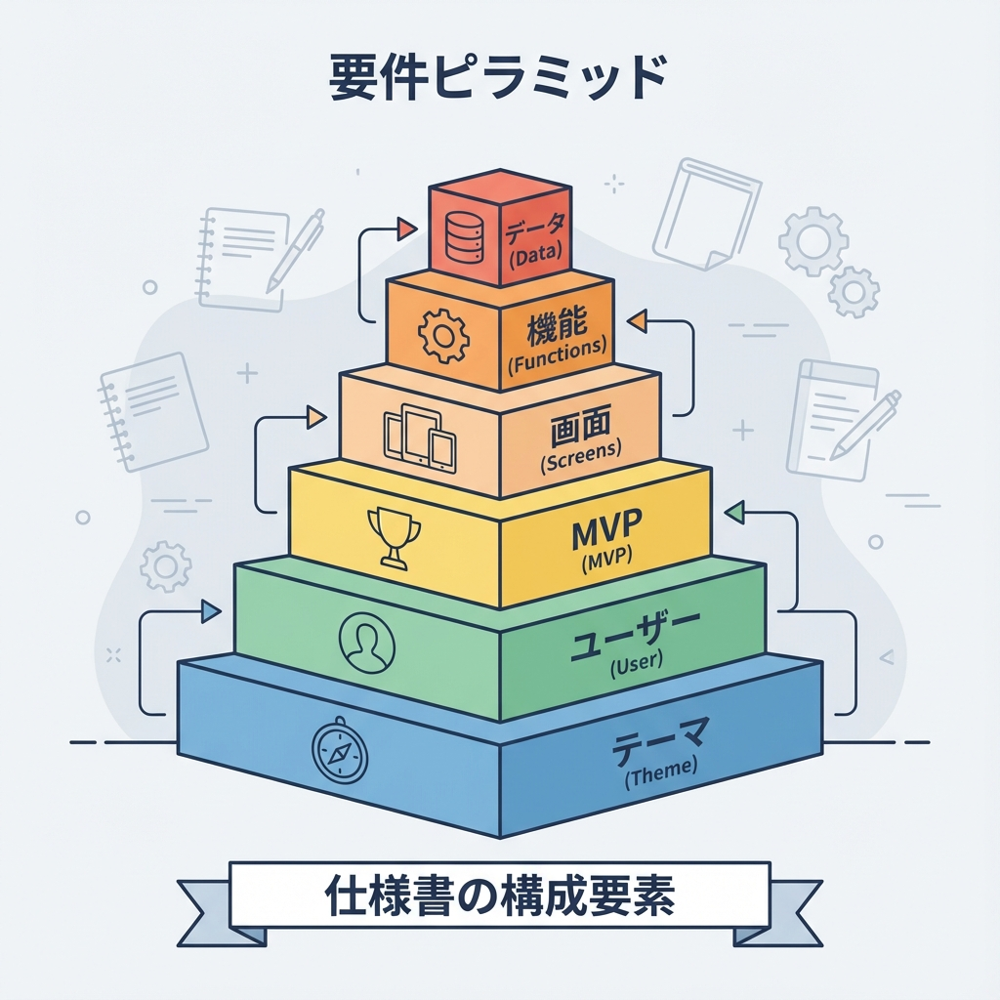
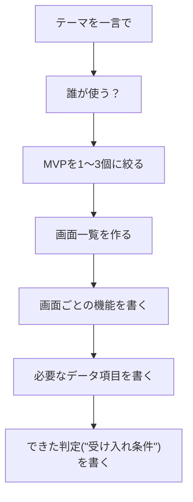
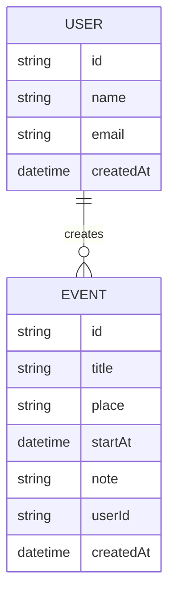

# 第234章：要件を紙に書く（画面/機能/データ）📝

卒業制作って、いきなり作り始めると「なんか違う…😵‍💫」ってなりやすいんだけど、**先に“紙（メモ）に要件を書く”**だけでめちゃくちゃ挫折率が下がるよ〜！🌸
この章は **「作る前に、迷わない地図を作る回」** です🗺️💕

---

## 1) 今日やること（ゴール）🎯

あなたの卒業制作のテーマを、次の3つに分解して書けるようにするよ👇✨

* **画面（どんなページが必要？）** 🖥️📱
* **機能（各画面で何ができる？）** ⚙️
* **データ（どんな情報を保存する？）** 🗃️

---

## 2) まず「MVP（最小で完成）」を決めよう🧁✅

卒業制作は、最初から全部盛りにすると爆死しがち…！💥
なのでまずは **MVP（Minimum Viable Product）**＝「最低限、動いて嬉しい形」を決めます☺️

### MVPの決め方（超かんたん）🪄

* **“ユーザーが一番やりたい1つ”** を中心にする🎯
* 画面は **3〜5枚くらい** にする📄
* 機能は **CRUDのうち、まずRead→Create** が鉄板📚➕

---

## 3) 要件づくりの順番（迷子防止ルート）🧭

この順番で書くとまとまるよ〜！✨

---

## 4) 画面（ページ）一覧を作る📄🖊️

まずは「どんな画面があるか」だけを並べます。中身はまだ薄くてOK🙆‍♀️

### ✅ 画面一覧テンプレ（コピペして埋めてね）🧩

| 画面名  | URL（仮でOK）     | 誰が見る？    | 目的（何のため？） |
| ---- | ------------- | -------- | --------- |
| トップ  | `/`           | 全員       | サービスの入口   |
| 一覧   | `/items`      | ログインユーザー | みんなの投稿を見る |
| 詳細   | `/items/[id]` | ログインユーザー | 1件を詳しく見る  |
| 新規作成 | `/items/new`  | ログインユーザー | 投稿を追加する   |
| ログイン | `/login`      | 全員       | ログインする    |

> URLは次の第235章でちゃんと決めるから、ここでは仮で大丈夫だよ〜😊🫶

---

## 5) 機能（できること）を画面ごとに書く⚙️✨

次に「その画面で何ができるか」を箇条書きでOK！
ポイントは **“ボタンを押したら何が起きる？”** を書くこと👆😆

### ✅ 機能テンプレ（画面1枚ずつ書く）🧩

**画面：〇〇**

* 表示：何を表示する？👀
* 操作：何ができる？🖱️
* バリデーション：何を防ぐ？🛡️
* エラー：失敗したらどうする？🧯

#### 例：一覧画面（/items）📰

* 表示：投稿のタイトル、作成者、作成日
* 操作：詳細へ移動、検索（できれば）
* エラー：取得失敗なら「再読み込み」ボタン
* ローディング：読み込み中はスケルトン or “読み込み中…” ⏳

---

## 6) データ（保存する情報）を書く🗃️📝

「画面」と「機能」が決まると、保存するデータが自然に見えてくるよ〜！✨
ここは**テーブル設計（第236章）**の前準備です💪

### ✅ データ一覧テンプレ（まずは“項目”だけ）📌

**Entity：User（ユーザー）**

* id
* name
* email
* createdAt

**Entity：Item（投稿/メインデータ）**

* id
* title
* body（本文）
* createdAt
* userId（作成者）

> コツ：まずは「必要最低限」だけ！
> 迷ったら「後で足せるもの」は一旦書かない✂️😌

---

## 7) できた判定（受け入れ条件）を書く✅🎉

ここを書くと、完成が見える！✨
**“動いた気がする”じゃなくて、“できたと言える条件”**を作るよ😆

### ✅ 受け入れ条件テンプレ

* [ ] 一覧にデータが表示される
* [ ] 新規作成できて、一覧に反映される
* [ ] 詳細で内容が確認できる
* [ ] バリデーションが働く（空欄は弾く等）
* [ ] 失敗時にエラーメッセージが出る

---

## 8) 1枚にまとめる「要件シート」📄✨（これが最強）

下をそのままコピペして、あなたのテーマで埋めればOKだよ〜！💕

### ✅ 要件シート（コピペ用）🧾

* **プロジェクト名：**
* **一言で：**（例：ゼミ仲間で予定を共有するアプリ）
* **使う人：**（誰が使う？）
* **MVP（最小でできたら嬉しい3つ）：**
  1.
  2.
  3.
* **画面一覧：**（画面名 / URL仮 / 目的）
* **画面ごとの機能：**（各画面に箇条書き）
* **保存するデータ（Entityと項目）：**
* **受け入れ条件（できた判定）：**

---

## 9) 記入例（イメージ）🌷📌

例として「サークルのイベント共有アプリ🎪」で書くとこんな感じ👇

### 画面（例）

| 画面名    | URL（仮）         | 目的            |
| ------ | -------------- | ------------- |
| ログイン   | `/login`       | 参加者だけ使えるようにする |
| イベント一覧 | `/events`      | 直近イベントを確認     |
| イベント詳細 | `/events/[id]` | 場所・時間・持ち物を見る  |
| イベント作成 | `/events/new`  | 幹事がイベント登録     |

### データ（例：2〜3個で十分）🗃️

### 受け入れ条件（例）✅

* [ ] ログインできる
* [ ] イベントを作成できる
* [ ] 一覧に表示され、詳細で確認できる
* [ ] タイトル未入力は保存できず、メッセージが出る

---

## 10) 今日のチェック（ここまでできたら勝ち🏁✨）

最後にこれだけ確認してね😊💕

* [ ] MVPが **1〜3個** に絞れてる🍰
* [ ] 画面が **3〜5枚くらい** に収まってる📄
* [ ] データが **2〜4 Entity** くらいで説明できる🗃️
* [ ] 「できた判定」が書けてる✅

---

必要なら、あなたの卒業制作テーマを1行で教えてくれたら（例：「戦国武将の名言共有アプリ」みたいに🗡️📜）、この第234章の要件シートを**そのテーマ用に“完成形で”埋めた例**も作れるよ〜！😆💖
