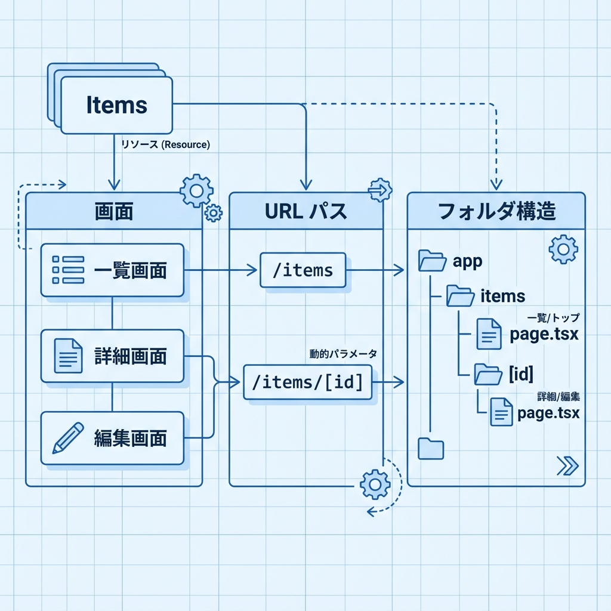
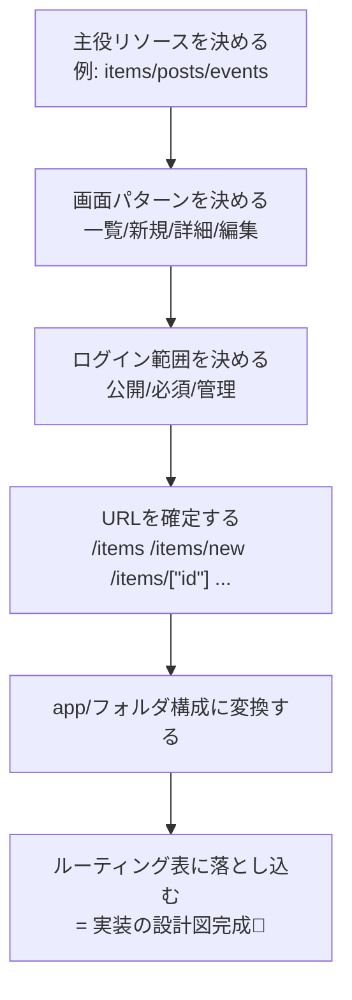

# 第235章：URL設計（ルーティング表を作る）🗺️

卒業制作でいちばん最初にやるとラクになるのが、**URL（画面の住所）を先に決めること**だよ〜！😊
ここで作るのは「ルーティング表」＝ **URLの一覧表**。これがあると、実装で迷子になりにくい🎀

（ちなみに2025年末の最新は Next.js 16.1 が出てるよ〜！📣） ([Next.js][1])

---

## 1) URL設計のゴール🎯

URLは「ユーザーが見る地図」なので、こんな感じを目指すよ👇

* **短い**（深い階層にしすぎない）🪜
* **意味が伝わる**（英単語は “名詞” が基本）📌
* **規則がそろってる**（一覧→詳細→編集が同じ型）🧩
* **権限がわかる**（ログイン必要な場所がはっきり）🔐

---

## 2) “まず決める3点セット”🧠✨

ルーティング表を作る前に、これだけ先に決めると爆速になるよ🚀

### A. アプリの主役（リソース）を決める🧸

例：Todo / Post / Event / Recipe など
→ URLはだいたいこの“主役名詞”を中心に作るよ🍳

### B. 画面パターンを決める📱

だいたいこの5つに落ち着くことが多い！

* 一覧：`/items`
* 新規作成：`/items/new`
* 詳細：`/items/[id]`（動的ルート）🧩 ([Next.js][2])
* 編集：`/items/[id]/edit`
* 設定やプロフィール：`/settings` / `/me`

### C. ログインが必要な範囲を決める🔐

* 公開（誰でもOK）🌿
* ログイン必須（会員だけ）🧤
* 管理者だけ（admin）👑

---

## 3) Next.js（App Router）に落とし込むとこうなる🗂️

Next.jsのApp Routerは「フォルダ＝URL」だよね🏠
動的ルートは `[id]` みたいな **Dynamic Segment** で作れるよ🧩 ([Next.js][2])

たとえば `posts` の例👇

```txt
app/
  posts/
    page.tsx              → /posts（一覧）
    new/
      page.tsx            → /posts/new（新規）
    [id]/
      page.tsx            → /posts/123（詳細）
      edit/
        page.tsx          → /posts/123/edit（編集）
```

---

## 4) ルーティング表（テンプレ）🧾✨

まずはコピペして埋めてOKだよ〜！😆

| 種別    | URL                | 画面の意味 | app/のパス（目安）                    | ログイン  | メモ            |
| ----- | ------------------ | ----- | ------------------------------ | ----- | ------------- |
| Top   | `/`                | トップ   | `app/page.tsx`                 | 任意    | 何のアプリか一瞬で分かる  |
| 一覧    | `/items`           | 一覧    | `app/items/page.tsx`           | 公開/必須 | 検索ある？         |
| 新規    | `/items/new`       | 作成    | `app/items/new/page.tsx`       | 必須    | 作成は基本ログイン     |
| 詳細    | `/items/[id]`      | 詳細    | `app/items/[id]/page.tsx`      | 任意    | `[id]` は動的🧩  |
| 編集    | `/items/[id]/edit` | 編集    | `app/items/[id]/edit/page.tsx` | 必須    | “本人だけ”なら要チェック |
| マイページ | `/me`              | 自分の情報 | `app/me/page.tsx`              | 必須    | よく使う導線        |
| 設定    | `/settings`        | 設定    | `app/settings/page.tsx`        | 必須    | ここに集約すると迷子防止  |

> URLが決まると、必要なフォルダが自然に決まる＝実装が進む！🛼✨

---

## 5) Route Group で“整理だけ”したい時📦（URLは変えない）

「見た目の都合でフォルダを分けたいけど、URLは変えたくない…！」ってあるよね🥺
そんな時は **Route Group** の `(group)` が便利！URLには出ないよ✨ ([Next.js][3])

例：公開エリアとログイン後エリアを、フォルダで分けて管理👇

```txt
app/
  (public)/
    page.tsx        → /
    items/
      page.tsx      → /items
  (authed)/
    dashboard/
      page.tsx      → /dashboard
    settings/
      page.tsx      → /settings
```

⚠️注意：**複数の“root layout”を分ける**と、ルート間移動でフルリロードが起きるケースがあるよ（必要な時だけにしよ〜！） ([Next.js][3])
⚠️注意：別グループで同じURL（例：`(a)/about` と `(b)/about`）は衝突してエラーになるよ〜！ ([Next.js][3])

---

## 6) 図解：URL設計→フォルダが決まる流れ🗺️➡️🗂️





---

## 7) “良いURL”チェックリスト✅💕

ルーティング表ができたら、このチェックしてみてね！

* [ ] 一覧は **複数形 or まとまり名**になってる？（`/posts` みたいに）📚
* [ ] 新規は `new`、編集は `edit` で統一してる？✏️
* [ ] 詳細は `[id]` や `[slug]` の形で統一してる？🧩 ([Next.js][2])
* [ ] “ログイン必須” のURLが散らばってない？（`/dashboard` 配下などに寄せると楽）🔐
* [ ] URLが深くなりすぎてない？（`/a/b/c/d` はつらい🥲）

---

## 8) ミニ課題🎓✨（この章のゴール）

卒業制作のテーマで、**ルーティング表を10本**作ってみてね🫶
最低ラインはこれ👇

* `/`（トップ）
* 一覧
* 新規
* 詳細（動的）
* 編集
* マイページ
* 設定
* 404/エラー方針メモ（URLじゃなくても表のメモ欄でOK✨）
* もう1リソース（例：コメント/いいね/タグ等）
* 管理者エリア（作るなら）

できたら次章（DB設計）がめちゃくちゃ簡単になるよ〜！😆🎉

[1]: https://nextjs.org/blog/next-16-1?utm_source=chatgpt.com "Next.js 16.1"
[2]: https://nextjs.org/docs/app/api-reference/file-conventions/dynamic-routes?utm_source=chatgpt.com "File-system conventions: Dynamic Segments"
[3]: https://nextjs.org/docs/app/api-reference/file-conventions/route-groups?utm_source=chatgpt.com "File-system conventions: Route Groups"
