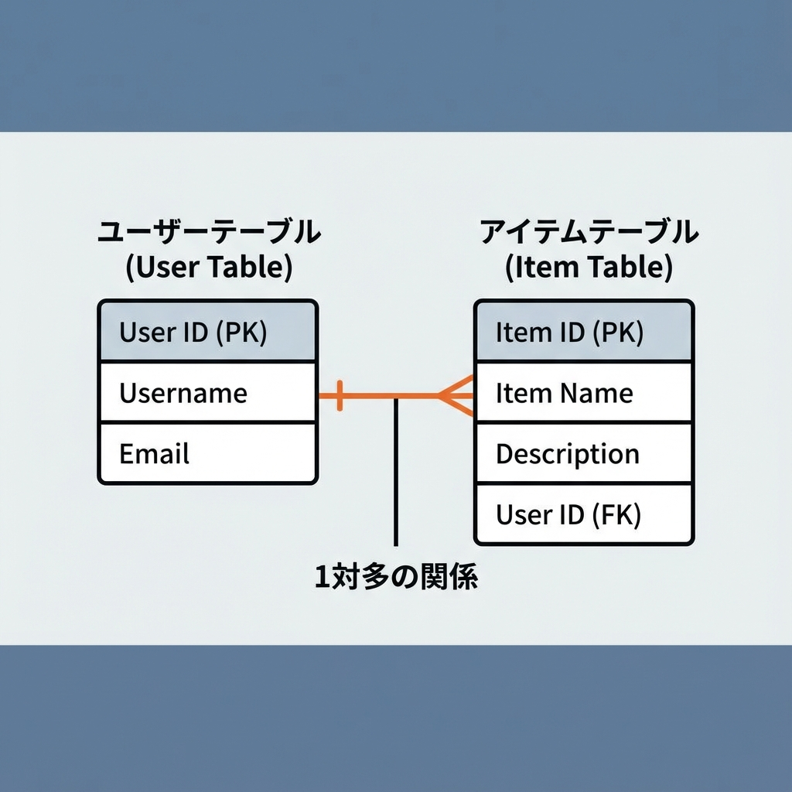
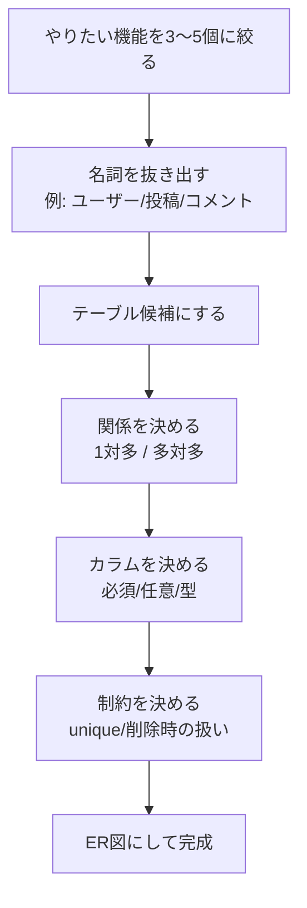
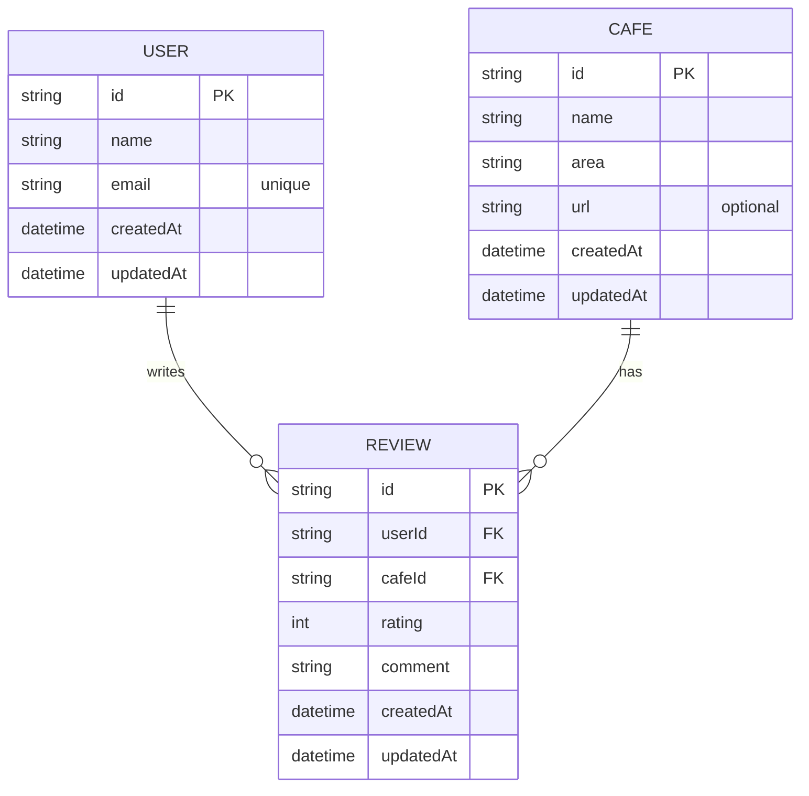

# 第236章：DB設計（テーブル2〜4個で十分）🗃️

卒業制作のDB設計は、**「最小で動く形」**にするのがいちばん強いよ〜！😊🌸
ここでは、**2〜4テーブル**でスッキリまとまる設計の作り方をやっていくね✍️💕

---

## 🎯 この章のゴール

* 「テーブルって何を作ればいいの？」が迷わなくなる🧠✨
* **2〜4テーブル**で卒業制作に十分なDB設計ができる✅
* **1対多 / 多対多**がざっくり描けるようになる🪄

---

## 🧁 まず結論：テーブルは“少ないほど正義”🥰

卒業制作で最初からテーブル増やすと…
「どこで何を保存してるのか分からん😵‍💫」ってなりがち！

だから最初はこれでOK👇

* **2テーブル**：ユーザー＋メインデータ（例：User + Note）📝
* **3テーブル**：ユーザー＋メイン＋履歴/投稿（例：User + Cafe + Review）☕
* **4テーブル**：多対多（中間テーブル）が必要なとき（例：Tag付け）🏷️

---

## 🧭 DB設計の手順（この順でやると迷子にならない）🗺️✨





ポイントは **「画面」より先に「データ」**を決めることだよ😊✨
画面は後からいくらでも直せるけど、DBは後から直すと大変になりがち…！😇

---

## 🧪 例題：カフェメモアプリ（3テーブルで完成）☕📒✨

「キャンパス周辺のカフェをメモして、レビューできる」想定ね🍰💕

### ✅ まず機能を最小にする（例）

* ログイン（ユーザーがいる）🔑
* カフェを登録できる☕
* レビューできる⭐📝

ここから「名詞」を抜き出すと…

* ユーザー
* カフェ
* レビュー

→ **3テーブルでOK！** 🎉

---

## 🧩 テーブル案（最小セット）📌

### 1) users（ユーザー）

* id（主キー）
* name
* email（ユニーク）
* createdAt / updatedAt（作成日/更新日）

### 2) cafes（カフェ）

* id（主キー）
* name
* area（最寄り駅とか）
* url（任意）
* createdAt / updatedAt

### 3) reviews（レビュー）

* id（主キー）
* userId（誰が書いた？）
* cafeId（どのカフェ？）
* rating（1〜5）
* comment
* createdAt / updatedAt

---

## 🧠 関係（リレーション）を決めよう✨

* ユーザー1人はレビューをたくさん書ける → **User 1 : Review 多**
* カフェ1つはレビューをたくさん持てる → **Cafe 1 : Review 多**



---

## 🧷 制約（ルール）をちょい足しすると強い💪✨

最低限おすすめ👇

* **users.email は unique**（同じメールで2人作れない）📧🔒
* **reviews.rating は 1〜5**（これはDBより、まずはサーバー側でバリデーションでもOK）⭐
* **reviews は userId と cafeId を必須**（誰の何のレビューか分からないのは事故）💥

削除の扱い（超大事）も決めとくと安心😊

* ユーザー削除 → その人のレビューはどうする？（消す？残す？）🧹
* カフェ削除 → 紐づくレビューはどうする？（普通は一緒に消すこと多い）🗑️

---

## 🧪 Prismaでのイメージ（雰囲気だけ）🧊✨

※「こういう形になるよ〜」の参考ね😊

```ts
model User {
  id        String   @id @default(cuid())
  name      String
  email     String   @unique
  createdAt DateTime @default(now())
  updatedAt DateTime @updatedAt

  reviews   Review[]
}

model Cafe {
  id        String   @id @default(cuid())
  name      String
  area      String
  url       String?
  createdAt DateTime @default(now())
  updatedAt DateTime @updatedAt

  reviews   Review[]
}

model Review {
  id        String   @id @default(cuid())
  userId    String
  cafeId    String
  rating    Int
  comment   String
  createdAt DateTime @default(now())
  updatedAt DateTime @updatedAt

  user      User @relation(fields: [userId], references: [id])
  cafe      Cafe @relation(fields: [cafeId], references: [id])
}
```

---

## ✅ この章の成果物（これが書けたら勝ち）🏁✨

あなたの卒業制作について、これを埋めてみてね😊📝💕

* テーブルは **2〜4個**にした？
* それぞれのテーブルに

  * 主キー（id）
  * createdAt / updatedAt
    がある？⏰
* 関係は決まった？（1対多 / 多対多）🔗
* unique にしたいものは決めた？（例：email）🔒
* 削除時の扱いを一言で決めた？（消す/残す）🗑️

---

次の章でUI設計に入るとき、今のDB設計があるだけでめっちゃラクになるよ〜！😊💖
