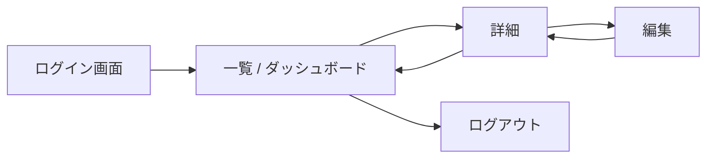
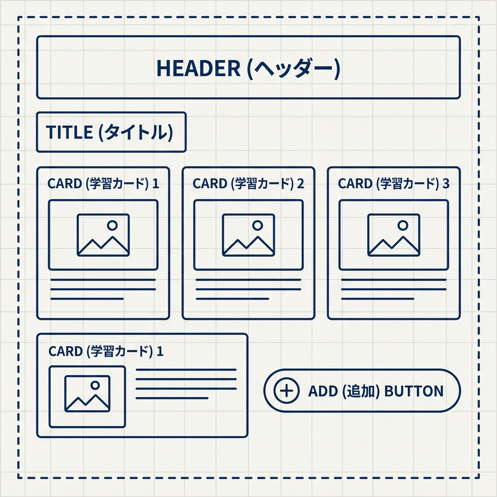
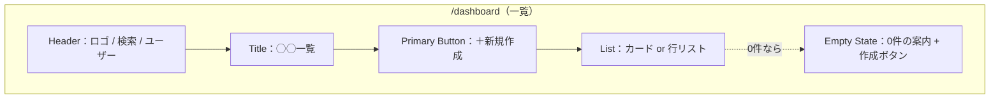
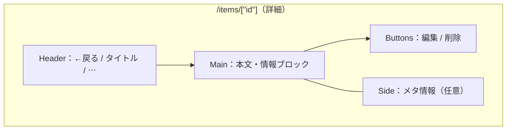
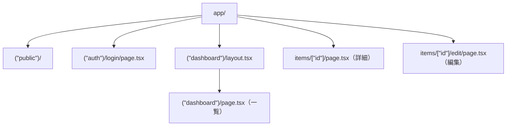

# 第237章：UI設計（まずワイヤーでOK）🧱

卒業制作はここで勝ちます💪✨
**「先にUIの形（画面の配置）を決める」→「実装で迷わない」**が最強ルートです🚀

---

## 1) 今日のゴール🎯

次の3点が揃えばOKです🙆‍♀️✨

* ① **画面一覧**（どのページがあるか）📄
* ② **ユーザー導線**（どんな順で使うか）🧭
* ③ **ワイヤーフレーム**（箱で配置）📦

完成度は低くて大丈夫！むしろ低い方が早いです😆🫶

---

## 2) まず「画面」を洗い出そう🧠📝

卒業制作（ログイン→一覧→詳細→編集→削除）を前提に、最小構成はこれ👇

* 🔑 ログイン
* 🏠 一覧（ダッシュボード）
* 🔍 詳細
* ✏️ 編集（作成もここにまとめてもOK）
* ⚙️ 設定（後回しでもOK）

**ポイント**：迷ったら「必要最低限」だけにする✂️✨
画面が増えるほど、実装とテストが雪だるまになります⛄

---

## 3) ユーザー導線（フロー）を1本にする🧭✨（Mermaid）

「使い方の一本道」を作るとUIが決まりやすいです😊

✅ これができると
「一覧に検索いる？」「編集ボタンどこ？」みたいなUIの迷いが減ります🫶

---

## 4) ワイヤーフレームは「四角」でOK📦✏️

ワイヤーは**デザインじゃなくて設計**だよ〜！🎀
色も画像もいりません🙅‍♀️✨（むしろ邪魔になりがち）

### ワイヤーで決めること（最低限）✅

* 🧱 **ヘッダーに何を置く？**（ロゴ/戻る/ユーザーメニュー）
* 📍 **主役は何？**（一覧なら“リスト”、詳細なら“本文”）
* 🔘 **主要ボタンはどこ？**（右上に統一しがち）
* 📱 **スマホで破綻しない？**（1カラム基本でOK）

---

## 5) 例：ダッシュボード（一覧）ワイヤー🗂️✨（Mermaid）

箱の配置が決まれば、実装は早いです🏎️💨

💡コツ：**空っぽの時（Empty）**を最初に用意すると優しいUIになります🥹🫶

---

## 6) 例：詳細ページのワイヤー🔍📄（Mermaid）

詳細は「読む」画面なので、情報の順番が命です📚✨

✅ ここで決めたいこと

* 🗑️ 削除はどこ？（右上メニュー/下部ボタンなど）
* ⚠️ 危険操作は目立たせすぎない（押し間違い防止）😇

---

## 7) “コンポーネント棚卸し”をする🧩✨

ワイヤーを見ながら「部品」を数えます👀
これやると実装が爆速になります⚡

### よくある部品セット🧺

* 🧭 `Header`（戻る/検索/ユーザー）
* 🧾 `PageTitle`
* 🔍 `SearchBar`
* 🧱 `Card`（一覧の1件）
* 🏷️ `Tag` / `Badge`
* 🔘 `Button`（Primary/Secondary/Danger）
* 🫙 `EmptyState`
* ⏳ `LoadingSkeleton`
* 🧯 `ErrorMessage`

**ポイント**：先に名前を付けると勝ちです📛✨
（名前がある＝作れる）

---

## 8) UIの「状態」を先に用意する⏳🧯✨

卒業制作はここが差になります🌸

* ⏳ Loading（読み込み中）
* 🧯 Error（失敗）
* 📭 Empty（0件）
* ✅ Success（保存できた）
* 📴 Forbidden / Not Found（権限/存在しない）

「通常」だけ作ると、後で泣きます🥲
先にワイヤーで箱だけ置いちゃいましょう📦✨

---

## 9) ワイヤー→Next.jsの画面構成に“翻訳”する🗺️✨（Mermaid）

ワイヤーが固まったら、フォルダに落とすイメージが湧きます💡

※ Route GroupはURLを増やさず整理できるので、卒業制作と相性よいです📦✨

---

## 10) ミニ課題（この章のゴール）🎓📝✨

次の3つを**テキストでOK**なので作ってください💪💕

1. 📄 **画面一覧**（5つ以内）
2. 🧭 **導線フロー**（上のMermaidみたいに1本）
3. 📦 **ワイヤー**（一覧＋詳細の2画面だけでもOK）

できたら、実装中に迷ったときの“地図”になります🗺️✨
「どこに何を置く？」が決まってるだけで、完成率が跳ね上がります😆🚀
