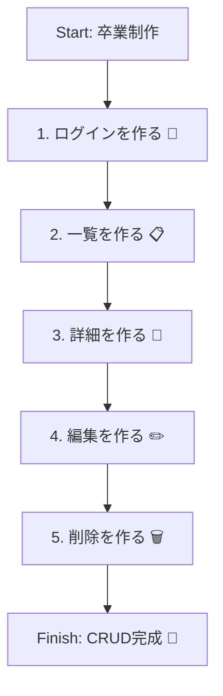
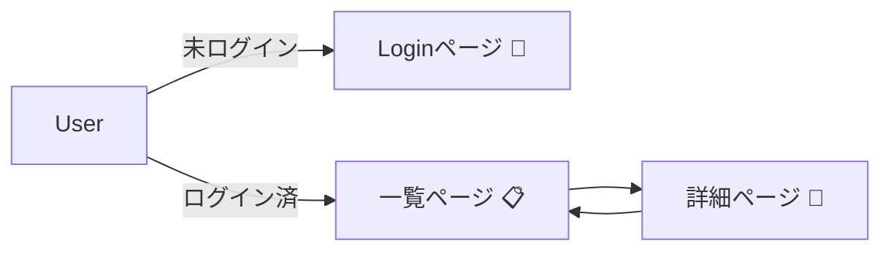

# 第238章：実装順：ログイン→一覧→詳細→編集→削除🔁

卒業制作って、いきなり全部作ろうとすると絶対しんどいです…🥺💦
なのでこの章は「**詰みにくい実装順**」で、サクサク前に進むための手順を決めちゃいます🙌🌸

---

## まず結論：この順番がいちばん安全🧠💡

1. **ログイン（認証）** 🔐
2. **一覧（Read）** 📋
3. **詳細（Read）** 🔎
4. **編集（Update）** ✏️
5. **削除（Delete）** 🗑️

「ログイン → 画面の骨組み → 読める → 書ける」の順番にすると、毎回ちゃんと“動く状態”を保てます😊✨

---

## 全体の流れ（完成までの一本道）🗺️✨（Mermaid）

---

## 0️⃣ 最初に「やることを固定」して迷子防止🧭🧸

ここだけ先に決めると、めちゃ楽になります✨

* **保護エリア（ログイン必須）**：例 `/dashboard` 配下 🏠🔐
* **対象データ**：例 `posts` / `todos` / `notes` どれか📌
* **最低限の画面**：

  * ログインページ `/login` 🔑
  * 一覧 `/dashboard/items` 📋
  * 詳細 `/dashboard/items/[id]` 🔎
  * 編集 `/dashboard/items/[id]/edit` ✏️

---

## 1️⃣ ログイン（認証）を先に作る🔐✨

### なんで最初？🥺

あとから認証を入れると、**全部の画面に修正が波及**しがちで泣きます😭
最初に「入場ゲート」を作ると、その後が安定します💪✨

### やることチェック✅

* `/login` を用意する🔑
* ログイン成功したら `/dashboard` に行ける🚀
* 未ログインで `/dashboard` に行ったら `/login` へ戻される↩️
* ログアウトできる🚪

### できた判定（ミニテスト）🧪

* ブラウザで `/dashboard` 直打ち → `/login` に飛べる✅
* ログイン → `/dashboard` 表示✅
* ログアウト → `/login` に戻る✅

---

## 2️⃣ 一覧（Read）を作る📋✨

ここは「アプリっぽさ」が一気に出て楽しいところ🥰💕

### やることチェック✅

* DBからデータを **一覧で表示** する📥
* 1件ずつ「詳細へ」リンクを出す🔗
* 0件のときの表示も作る（優しさ🥺）🌸

### できた判定（ミニテスト）🧪

* データがある → リストが並ぶ✅
* データがない → 「まだありません」系の案内が出る✅
* 各行クリック → 詳細へ行ける（次の章準備）✅

---

## 3️⃣ 詳細（Read）を作る🔎✨

一覧ができたら、次は「1件表示」！
ここができると、編集・削除が作りやすくなります🙌

### ルートの形（例）🧩

* `/dashboard/items/[id]` ← ここが詳細ページ✨

### やることチェック✅

* `id` で1件取得して表示📄
* 存在しない `id` は 404（not found）にする🚪
* 詳細から「編集へ」リンクを置く✏️🔗

### できた判定（ミニテスト）🧪

* 正しい `id` → 詳細が表示✅
* 存在しない `id` → 404ページ（or notFound）✅

---

## ここまでの状態を図で確認👀✨（Mermaid）

「ログインできて、一覧と詳細が見れる」＝土台完成です🎉

---

## 4️⃣ 編集（Update）を作る✏️✨

いきなり編集をやるとハマりやすいので、**詳細が完成してから**が◎です😊

### 編集の基本方針🧠

* 入力フォームを用意する🧾
* 送信 → サーバー側で更新 → 詳細へ戻す🔁

### やることチェック✅

* 編集ページ `/dashboard/items/[id]/edit` を作る✏️
* 初期値として既存データをフォームに入れる🧸
* 送信で更新できる✅
* バリデーション失敗時にメッセージ表示🫶💬

### できた判定（ミニテスト）🧪

* タイトルを変えて保存 → 詳細に戻る → 反映されてる✅
* 空文字などNG入力 → 丁寧なエラーが出る✅

---

## 5️⃣ 削除（Delete）を作る🗑️✨

最後に削除！これは危ない操作なので、**丁寧さが命**です🥺💦

### やることチェック✅

* 詳細ページに「削除」ボタン🗑️
* 押したら確認（confirm）を挟む⚠️
* 削除後は一覧へ戻す📋↩️
* 失敗したら優しくエラー表示🧯

### できた判定（ミニテスト）🧪

* 削除 → 一覧に戻る → 消えてる✅
* もう存在しないものを削除しようとすると → いい感じに失敗表示✅

---

## 実装順の“理由”を超ざっくりまとめるね🥰📌

* **ログイン**：最初に“門番”を作る🔐（あとから入れると地獄😭）
* **一覧→詳細**：まずは“読める”状態を作る📖✨（画面とデータの接続が安定）
* **編集→削除**：最後に“壊す/変える”操作✏️🗑️（バグの影響が大きいから後回しが安全）

---

## 今日のゴール🏁✨

この章のゴールは「コードを書き切る」じゃなくて、**実装の順番を固定して迷子を防ぐ**ことだよ😊🫶

* ✅ ログインから作る
* ✅ 一覧→詳細で“読める”を完成
* ✅ 編集→削除で“書ける”を追加

この順番で行けば、完成までちゃんと前進できます🙌🎉
