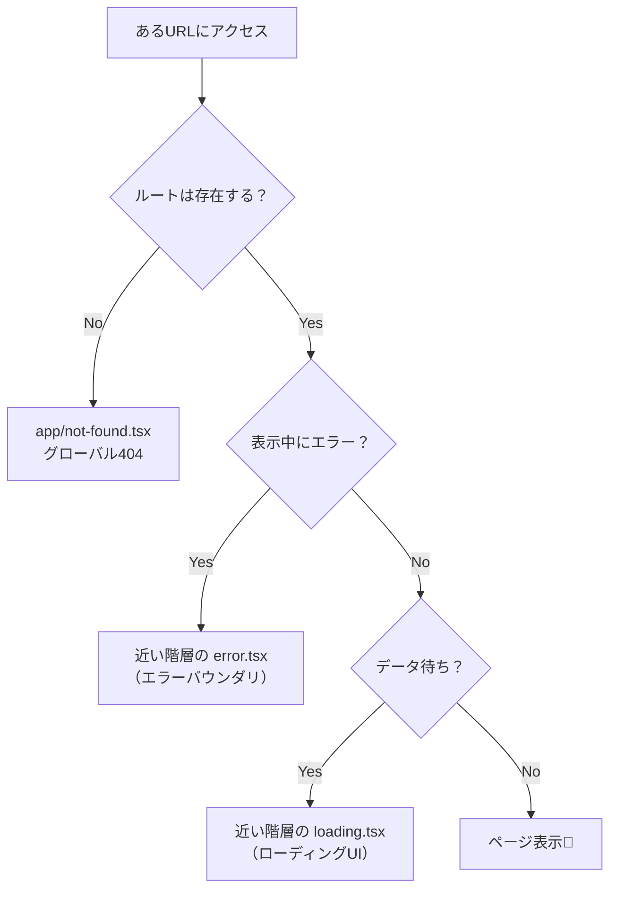

# 第239章：エラー/ローディング/404の仕上げ🧯⏳

卒業制作って、機能が動くだけだと「惜しい！」になりがちで…
**最後の仕上げ（エラー・ローディング・404）**を整えると、一気に“ちゃんとしたアプリ感”が出ます😊🌸

---

## この章でやること ✅✨

* **404ページ**（存在しないページ / データがないとき）を気持ちよくする🚪
* **エラーページ**（例：API失敗、予期せぬ例外）を優しくする🧯
* **ローディング**（待ち時間）を不安にしない⏳
* **どの階層に置くと、どこまで効く？**を理解する🗺️

---

## まず全体像：Next.jsの「3点セット」配置イメージ 🧠📦




* `error.tsx` は **ルートセグメントごとにエラーを隔離**できる仕組みです。`error.tsx` は **Client Component必須**で、`error` と `reset` を受け取ります。 ([Next.js][1])
* `not-found.tsx` は `notFound()` が投げられた時などに使われます。 ([Next.js][2])
* `global-error.tsx` も用意できて、**ルート全体の最後のセーフティネット**になります（これも Client 必須）。 ([Next.js][3])

---

## 1) 404の仕上げ：`app/not-found.tsx` を作る 🚪💖

### ✅ グローバル404（どのURLでも最終的にここ）

`app/not-found.tsx` を作ります。

```tsx
// app/not-found.tsx
import Link from "next/link";

export default function NotFound() {
  return (
    <main style={{ padding: 24 }}>
      <h1 style={{ fontSize: 28, marginBottom: 8 }}>ページが見つからないみたい…🥲</h1>
      <p style={{ marginBottom: 16 }}>
        URLが間違ってるか、ページが移動した可能性があります🙏
      </p>

      <div style={{ display: "flex", gap: 12 }}>
        <Link href="/" style={{ textDecoration: "underline" }}>
          🏠 ホームへ戻る
        </Link>
        <Link href="/dashboard" style={{ textDecoration: "underline" }}>
          📌 ダッシュボードへ
        </Link>
      </div>
    </main>
  );
}
```

💡ポイント

* 404は**責めない文言**が大事🥹🫶
* “戻る場所”を2つくらい置くと親切✨

---

## 2) 「データが存在しない」を404にする：`notFound()` を使う 🔎🚪

URLは存在するけど、**DBやAPIに該当データがない**ときは、ページ側から `notFound()` を呼ぶのが気持ちいいです✨
（`not-found.tsx` は `notFound()` に反応する、という整理です） ([Next.js][2])

例：`/posts/[id]` で記事が無い場合

```tsx
// app/posts/[id]/page.tsx
import { notFound } from "next/navigation";

type Props = {
  params: Promise<{ id: string }>;
};

export default async function PostPage({ params }: Props) {
  const { id } = await params;
  const res = await fetch(`https://example.com/api/posts/${id}`);

  if (!res.ok) {
    // 404相当（データ無し）に寄せたいなら notFound() が分かりやすい
    notFound();
  }

  const post = (await res.json()) as { title: string; body: string };

  return (
    <main style={{ padding: 24 }}>
      <h1>{post.title}</h1>
      <p>{post.body}</p>
    </main>
  );
}
```

---

## 3) エラーの仕上げ：`error.tsx`（近い階層で受ける）🧯✨

`error.tsx` は **そのルートセグメント配下のクラッシュを受け止める壁**です🧱
そして大事：`error.tsx` は **必ず `"use client"` が必要**です。 ([Next.js][1])

例：`app/dashboard/error.tsx`

```tsx
// app/dashboard/error.tsx
"use client";

import { useEffect } from "react";

export default function ErrorPage({
  error,
  reset,
}: {
  error: Error;
  reset: () => void;
}) {
  useEffect(() => {
    // 本番では Sentry 等に送る想定でもOK
    console.error("[dashboard] error:", error);
  }, [error]);

  return (
    <main style={{ padding: 24 }}>
      <h1 style={{ fontSize: 24, marginBottom: 8 }}>ごめんね、エラーが起きちゃった…🧯🥲</h1>
      <p style={{ marginBottom: 16 }}>
        もう一回試すと直ることがあります🙏
      </p>

      <button
        onClick={() => reset()}
        style={{
          padding: "10px 14px",
          borderRadius: 10,
          border: "1px solid #ccc",
          cursor: "pointer",
        }}
      >
        🔁 もう一回ためす
      </button>
    </main>
  );
}
```

* `reset()` は **そのセグメントの再レンダリングを試みる**ための関数です。 ([Next.js][1])

---

## 4) ローディングの仕上げ：`loading.tsx`（待ち時間を可視化）⏳🌸

データ取得があるページは、**真っ白がいちばん不安**です😖
`loading.tsx` を置くと、その区間で待ちUIが出せます✨

例：`app/dashboard/loading.tsx`

```tsx
// app/dashboard/loading.tsx
export default function Loading() {
  return (
    <main style={{ padding: 24 }}>
      <p style={{ fontSize: 18, marginBottom: 10 }}>読み込み中だよ…⏳✨</p>

      {/* なんちゃってスケルトン */}
      <div style={{ display: "grid", gap: 10, maxWidth: 520 }}>
        <div style={{ height: 16, background: "#eee", borderRadius: 8 }} />
        <div style={{ height: 16, background: "#eee", borderRadius: 8 }} />
        <div style={{ height: 16, background: "#eee", borderRadius: 8, width: "70%" }} />
      </div>
    </main>
  );
}
```

---

## 5) 最後の保険：`app/global-error.tsx`（全体が落ちるのを防ぐ）🧯🪂

もしルート全体レベルで大きく崩れたときのために、`global-error.tsx` も置けます。
これは **ルートレイアウト等を置き換えるタイプのエラーUI**で、**Client必須**など制約もあります。 ([Next.js][3])

```tsx
// app/global-error.tsx
"use client";

export default function GlobalError({
  error,
  reset,
}: {
  error: Error;
  reset: () => void;
}) {
  return (
    <html>
      <body style={{ padding: 24 }}>
        <h1>アプリ全体で問題が起きちゃった…🧯💦</h1>
        <p style={{ marginBottom: 16 }}>時間をおいて再試行してね🙏</p>
        <button
          onClick={() => reset()}
          style={{
            padding: "10px 14px",
            borderRadius: 10,
            border: "1px solid #ccc",
            cursor: "pointer",
          }}
        >
          🔁 再試行
        </button>
      </body>
    </html>
  );
}
```

---

## 6) 動作チェック（ここ大事！）🧪✅

### ✅ 404チェック

* 存在しないURLへ：`http://localhost:3000/aaaa` → `app/not-found.tsx` 🚪

### ✅ データ無し404チェック

* 該当データが無いIDで `notFound()` が走る → 404UIに遷移🚪

### ✅ エラーチェック

* 試しにページ内で `throw new Error("test")` してみる → 近い `error.tsx` が出る🧯

### ✅ ローディングチェック

* `fetch` をわざと遅くする（`await new Promise(r => setTimeout(r, 1500))`）→ `loading.tsx` が見える⏳

---

## 仕上げチェックリスト（卒制の完成度が上がるやつ）✅✨

* 404に **戻り先リンクがある**🏠🔗
* エラー画面に **再試行ボタンがある**🔁
* ローディングが **“何してるか”分かる**（読み込み中/取得中など）⏳
* 文言が **優しい**（ユーザーを責めない）🫶
* コンソールログは最低限（本番は監視ツール導入でもOK）🧯

これで「見た目だけのアプリ」じゃなくて、**触ってて安心なアプリ**になります😊🌸

[1]: https://nextjs.org/learn/dashboard-app/error-handling?utm_source=chatgpt.com "Handling Errors - App Router"
[2]: https://nextjs.org/docs/app/api-reference/file-conventions/not-found?utm_source=chatgpt.com "File-system conventions: not-found.js"
[3]: https://nextjs.org/docs/app/api-reference/file-conventions/error?utm_source=chatgpt.com "File-system conventions: error.js"
