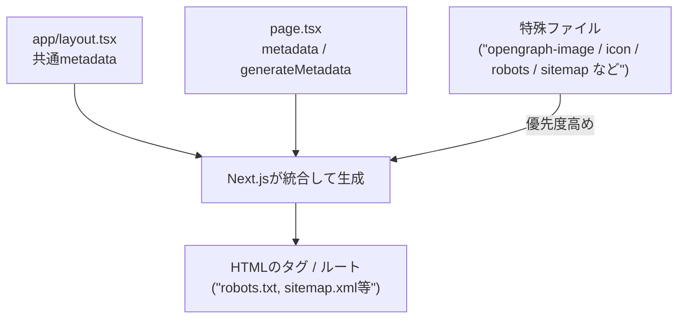

# 第240章：SEO/OGP/画像最適化の仕上げ🔎🖼️

卒業制作って「動く！」だけでもう最高なんだけど…最後に **検索に強く＆シェア映え** するように整えると、完成度がグッと上がるよ〜🥳💖
この章では **SEO（メタデータ）/ OGP（SNSプレビュー）/ 画像最適化** をまとめて“仕上げ”しようね🧁✨

---

## 今日のゴール🎯✨

* ブラウザのタブタイトル＆説明文がちゃんと出る🧠
* SNSでURL貼ったときに、**画像＋タイトル＋説明** がいい感じに出る📣💖
* `/robots.txt` と `/sitemap.xml` が用意できてる🤖🗺️
* 画像が重くならない（表示がガタつかない）🖼️💨

---

## 図解：Next.jsの「メタ情報」ってどこから来るの？🧭




Next.jsは `metadata` / `generateMetadata` / 特殊ファイル（メタデータファイル）で、SEOやOGPを作ってくれるよ〜🪄✨ ([Next.js][1])

---

## 1) まずは共通SEO：`app/layout.tsx` を“整える”🧹✨

サイト全体の **基本プロフィール** をここに置くとスッキリするよ😊💕

ポイントはこのへん👇

* `title` は **template** を使う（ページごとに差し替えやすい）
* `metadataBase` を入れる（OGPのURLが安定しやすい）
* `openGraph` / `twitter` を“共通の土台”として設定する ([Next.js][2])

例（雰囲気サンプル）👇

```tsx
// app/layout.tsx
import type { Metadata } from 'next'

export const metadata: Metadata = {
  metadataBase: new URL('https://example.com'), // ←本番ドメインにしてね✨
  title: {
    default: '卒業制作アプリ',
    template: '%s | 卒業制作アプリ',
  },
  description: '学科生活をちょっと便利にするミニアプリです🌸',
  openGraph: {
    type: 'website',
    siteName: '卒業制作アプリ',
    title: '卒業制作アプリ',
    description: '学科生活をちょっと便利にするミニアプリです🌸',
    images: ['/opengraph-image.png'], // ルートに置く想定
  },
  twitter: {
    card: 'summary_large_image',
    title: '卒業制作アプリ',
    description: '学科生活をちょっと便利にするミニアプリです🌸',
    images: ['/twitter-image.png'],
  },
  alternates: {
    canonical: '/',
  },
}

export default function RootLayout({ children }: { children: React.ReactNode }) {
  return (
    <html lang="ja">
      <body>{children}</body>
    </html>
  )
}
```

---

## 2) ページ別SEO：`metadata` か `generateMetadata` を使う📄✨

* 固定ページ（例：`/about`）→ `export const metadata = { ... }` でOK🙆‍♀️
* 動的ページ（例：`/posts/[id]`）→ `generateMetadata` でタイトルや説明を変えるのがキレイ✨ ([Next.js][2])

例（動的ページの雰囲気）👇

```tsx
// app/posts/[id]/page.tsx
import type { Metadata } from 'next'

type Props = {
  params: Promise<{ id: string }>
}

async function getPost(id: string) {
  // 例：DBやAPIから取る想定
  return { title: `記事 ${id}`, summary: 'この記事は〜〜です！', ogImage: '/opengraph-image.png' }
}

export async function generateMetadata({ params }: Props): Promise<Metadata> {
  const { id } = await params
  const post = await getPost(id)

  return {
    title: post.title,
    description: post.summary,
    openGraph: {
      title: post.title,
      description: post.summary,
      images: [post.ogImage],
    },
    twitter: {
      title: post.title,
      description: post.summary,
      images: [post.ogImage],
    },
  }
}

export default async function Page({ params }: Props) {
  const { id } = await params
  const post = await getPost(id)
  return <main><h1>{post.title}</h1></main>
}
```

---

## 3) OGP画像の仕上げ：`opengraph-image` / `twitter-image`🖼️📣

Next.jsは、**ルートセグメントに置くだけ**でOGP画像タグを作ってくれるよ〜✨ ([Next.js][3])

### いちばん簡単：画像ファイルを置く📁

```txt
app/
  opengraph-image.png
  opengraph-image.alt.txt
  twitter-image.png
  twitter-image.alt.txt
```

* `opengraph-image` / `twitter-image` は、ルートだけじゃなく **各フォルダ（各ルート）** に置いてもOKだよ🙆‍♀️✨ ([Next.js][3])
* サイズの目安は **1200×630**（OGPの定番）📏✨
* 注意：`twitter-image` は **5MB以下**、`opengraph-image` は **8MB以下**（超えるとビルドが失敗するよ😭）([Next.js][3])

### ちょい上級：コードでOGP画像を生成する🪄

```tsx
// app/opengraph-image.tsx
import { ImageResponse } from 'next/og'

export const alt = '卒業制作アプリ'
export const size = { width: 1200, height: 630 }
export const contentType = 'image/png'

export default async function Image() {
  return new ImageResponse(
    (
      <div
        style={{
          width: '100%',
          height: '100%',
          display: 'flex',
          alignItems: 'center',
          justifyContent: 'center',
          fontSize: 72,
          background: 'white',
        }}
      >
        卒業制作アプリ🌸✨
      </div>
    ),
    { ...size }
  )
}
```

（こういう `opengraph-image.tsx` も公式のやり方だよ🙌）([Next.js][3])

---

## 4) アイコン＆manifest：地味だけど完成度アップ🍓✨

### アイコン（タブのやつ！）🧡

`app/` 直下に置く系が多いよ〜（例：`icon.png` / `apple-icon.png` / `favicon.ico`）🧁 ([Next.js][4])

### manifest（ホーム画面追加っぽい情報）📱✨

`app/manifest.json` か `app/manifest.webmanifest` を置く（または `manifest.ts` で生成）だよ〜！ ([Next.js][5])

生成例（TypeScript）👇

```ts
// app/manifest.ts
import type { MetadataRoute } from 'next'

export default function manifest(): MetadataRoute.Manifest {
  return {
    name: '卒業制作アプリ',
    short_name: '卒制アプリ',
    description: '学科生活をちょっと便利にするミニアプリ🌸',
    start_url: '/',
    display: 'standalone',
    background_color: '#ffffff',
    theme_color: '#ffffff',
    icons: [
      { src: '/favicon.ico', sizes: 'any', type: 'image/x-icon' },
    ],
  }
}
```

---

## 5) robots と sitemap を置く🤖🗺️（検索の入口づくり）

### robots：クローラさんへの案内📮

`app/robots.txt` でもいいし、`app/robots.ts` で生成もできるよ〜！ ([Next.js][6])

```ts
// app/robots.ts
import type { MetadataRoute } from 'next'

export default function robots(): MetadataRoute.Robots {
  return {
    rules: {
      userAgent: '*',
      allow: '/',
      disallow: ['/private/'],
    },
    sitemap: 'https://example.com/sitemap.xml',
  }
}
```

### sitemap：URL一覧（検索エンジンに優しい）🗺️✨

`app/sitemap.xml` でもいいし、`app/sitemap.ts` で生成もできるよ〜！ ([Next.js][7])

```ts
// app/sitemap.ts
import type { MetadataRoute } from 'next'

export default function sitemap(): MetadataRoute.Sitemap {
  return [
    {
      url: 'https://example.com/',
      lastModified: new Date(),
      changeFrequency: 'weekly',
      priority: 1,
    },
    {
      url: 'https://example.com/about',
      lastModified: new Date(),
      changeFrequency: 'monthly',
      priority: 0.7,
    },
  ]
}
```

---

## 6) 画像最適化：最後のチェック✅🖼️💨

Next.jsの `<Image />` は、サイズ最適化・レイアウトの安定・遅延読み込み・モダンフォーマットなどを助けてくれるよ〜！ ([Next.js][8])

仕上げチェックはこれ👇✨

* ✅ `width` / `height` をちゃんと指定（ガタつき防止）
* ✅ 画面上部の“いちばん目立つ画像”には `priority` を検討（LCP対策）
* ✅ レスポンシブなら `sizes` を入れてムダ読み込みを減らす📱
* ✅ 外部画像を使うなら `remotePatterns` を設定（セキュリティ的にも大事）([Next.js][9])

例：外部画像を許可👇

```ts
// next.config.ts
import type { NextConfig } from 'next'

const nextConfig: NextConfig = {
  images: {
    remotePatterns: [
      {
        protocol: 'https',
        hostname: 'images.example.com',
        pathname: '/**',
      },
    ],
  },
}

export default nextConfig
```

---

## 最終チェックリスト🎁✨（これが通れば“仕上げ完了”！）

* 🔲 どのページもタブタイトルがいい感じ（`template` 効いてる）
* 🔲 `description` が空じゃない
* 🔲 URLをSNSに貼ったとき、画像＋タイトル＋説明が出る
* 🔲 `opengraph-image.alt.txt` / `twitter-image.alt.txt` も書いた（やさしさ💗）
* 🔲 `/robots.txt` が開ける
* 🔲 `/sitemap.xml` が開ける
* 🔲 画像が多いページでスクロールが重くない
* 🔲 外部画像の `remotePatterns` が最小限になってる（広げすぎない）
* 🔲 `metadataBase` が本番ドメインになってる
* 🔲 「トップの1枚（看板画像）」だけは特に丁寧に最適化した✨

---

ここまでできたら、卒業制作が **“ちゃんと公開される前提のアプリ”** になるよ〜〜！🥹🎉💖

[1]: https://nextjs.org/docs/app/getting-started/metadata-and-og-images?utm_source=chatgpt.com "Getting Started: Metadata and OG images"
[2]: https://nextjs.org/docs/app/api-reference/functions/generate-metadata "Functions: generateMetadata | Next.js"
[3]: https://nextjs.org/docs/app/api-reference/file-conventions/metadata/opengraph-image "Metadata Files: opengraph-image and twitter-image | Next.js"
[4]: https://nextjs.org/docs/app/api-reference/file-conventions/metadata/app-icons?utm_source=chatgpt.com "favicon, icon, and apple-icon - Metadata Files"
[5]: https://nextjs.org/docs/app/api-reference/file-conventions/metadata/manifest "Metadata Files: manifest.json | Next.js"
[6]: https://nextjs.org/docs/app/api-reference/file-conventions/metadata/robots?utm_source=chatgpt.com "robots.txt - Metadata Files"
[7]: https://nextjs.org/docs/app/api-reference/file-conventions/metadata/sitemap?utm_source=chatgpt.com "Metadata Files: sitemap.xml"
[8]: https://nextjs.org/docs/app/getting-started/images?utm_source=chatgpt.com "Getting Started: Image Optimization"
[9]: https://nextjs.org/docs/pages/api-reference/components/image?utm_source=chatgpt.com "Components: Image"
