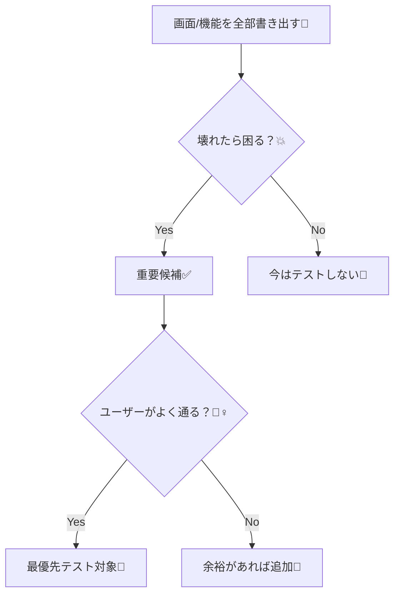
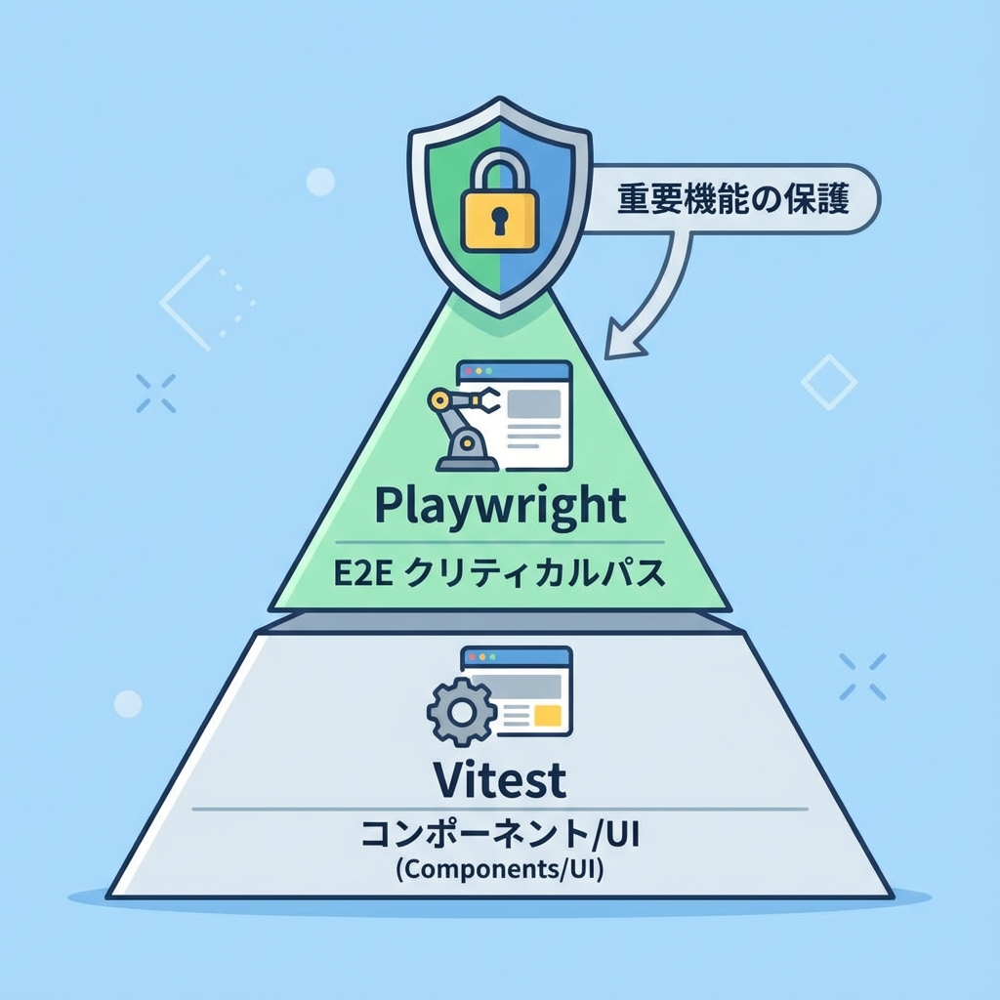
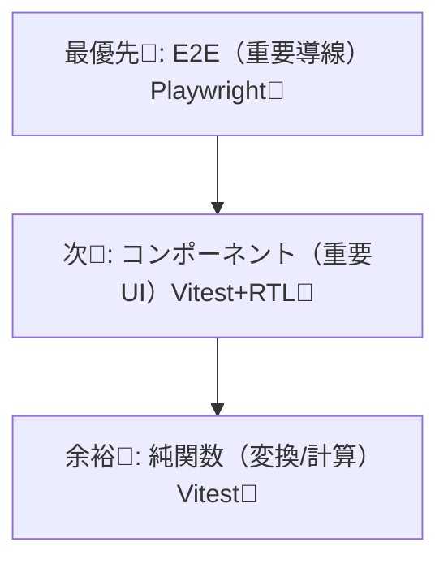

# 第241章：テストを最低限入れる（重要画面だけ）✅

卒業制作って、完成が近づくほど「うっかり壊れ」が増えがち…！😵‍💫
だからこの章は、**“ぜんぶ完璧に”じゃなくて「重要なところだけ守る」**がテーマだよ〜💖

---

### 今日のゴール 🎯✅

* **重要画面（重要導線）を3つ**決める🗺️✨
* それぞれに対して **最低1本のテスト**を入れる🧪
* 「落ちたら直す」の流れを作って、安心して公開へ🚀🌈

---

## 1) まず「重要画面」だけ選ぶ🧠💡

おすすめは **3つに絞る**こと！多いと挫折する🥺💦

* 🧍‍♀️ **ユーザーが一番通る導線**（例：ログイン→一覧）
* 💎 **あなたのアプリの“売り”機能**（例：投稿、予約、検索）
* 💥 **壊れたら詰むところ**（例：保存、削除、決済っぽい処理）

図で考えるとラクだよ👇✨



---

## 2) 最小テストセットはこれでOK 🧁🧪

Next.js（App Router）だと、**“画面の動き”をE2Eで守る**のが強いよ💪✨
（特に `async` な Server Component はユニットテスト側の対応がまだ難しいので、**E2E推奨**って公式も言ってるよ〜）([Next.js][1])

**おすすめ優先度はこれ👇**





---

## 3) Playwright（E2E）を最低1本入れる 🕹️✨

### 3-1. 導入（最短）🚀

公式手順はこれでOK：`npm init playwright` でセットアップできるよ([Next.js][2])

```bash
npm init playwright@latest
```

途中の質問は、だいたいこんな感じでOK（迷ったらコレ）👇

* TypeScript: ✅
* tests フォルダ作成: ✅
* GitHub Actions: 好み（今はどっちでもOK）😌

> ブラウザを自動操作するので、必要ならインストールも走るよ〜🧩

---

### 3-2. 重要導線テスト（例）を書く🧪✅

あなたの卒業制作に合わせて、**「一番大事な動線」**を1本だけ守ろう💖

例：**トップ→ログイン→ダッシュボード表示**（※文言は自分の画面に合わせてね！）

`tests/e2e/critical-flow.spec.ts`

```ts
import { test, expect } from "@playwright/test";

test("重要導線：ログインしてダッシュボードに入れる ✅", async ({ page }) => {
  await page.goto("/");

  // 例：ヘッダーの「ログイン」リンク
  await page.getByRole("link", { name: "ログイン" }).click();

  // 例：フォーム入力（ラベル名はあなたの画面に合わせて）
  await page.getByLabel("メールアドレス").fill("test@example.com");
  await page.getByLabel("パスワード").fill("password");

  await page.getByRole("button", { name: "ログイン" }).click();

  // 例：ログイン後の見出し
  await expect(page.getByRole("heading", { name: "ダッシュボード" })).toBeVisible();
});
```

実行はこれ👇（Playwright導入時に scripts が入ってることも多いよ）

```bash
npx playwright test
```

💡うまくいかない時は、**画面を見ながら**が最強！

```bash
npx playwright test --headed
```

---

## 4) Vitest + React Testing Library（重要UI）を最低1本 🧁🧩

E2Eは“全体の安心”だけど、**フォームやボタンの挙動**は小さくテストできるとさらに安心☺️✨
Next.js公式の Vitest ガイドもこの組み合わせを前提にしてるよ([Next.js][1])

### 4-1. インストール（公式寄り）📦

```bash
npm install -D vitest @vitejs/plugin-react jsdom @testing-library/react @testing-library/dom vite-tsconfig-paths
npm install -D @testing-library/jest-dom @testing-library/user-event
```

`vitest.config.mts`（公式の形＋ちょい足し）

```ts
import { defineConfig } from "vitest/config";
import react from "@vitejs/plugin-react";
import tsconfigPaths from "vite-tsconfig-paths";

export default defineConfig({
  plugins: [tsconfigPaths(), react()],
  test: {
    environment: "jsdom",
    setupFiles: ["./vitest.setup.ts"],
  },
});
```

`vitest.setup.ts`

```ts
import "@testing-library/jest-dom/vitest";
```

`package.json` にスクリプト（なければ追加）

```json
{
  "scripts": {
    "test": "vitest",
    "test:run": "vitest run"
  }
}
```

---

### 4-2. 重要フォームのテスト（例）🧪✨

「空送信できない」「押したら呼ばれる」みたいな**事故りやすい所**を守ろう🛡️💕

例のコンポーネント（卒業制作の“入力フォーム”に置き換えてOK）👇
`components/TodoForm.tsx`

```tsx
"use client";

import { useState } from "react";

export function TodoForm({ onAdd }: { onAdd: (title: string) => void }) {
  const [title, setTitle] = useState("");
  const canSubmit = title.trim().length > 0;

  return (
    <form
      onSubmit={(e) => {
        e.preventDefault();
        if (!canSubmit) return;
        onAdd(title.trim());
        setTitle("");
      }}
    >
      <label>
        タイトル
        <input
          aria-label="タイトル"
          value={title}
          onChange={(e) => setTitle(e.target.value)}
        />
      </label>

      <button type="submit" disabled={!canSubmit}>
        追加
      </button>
    </form>
  );
}
```

テスト👇
`components/TodoForm.test.tsx`

```tsx
import { describe, it, expect, vi } from "vitest";
import { render, screen } from "@testing-library/react";
import userEvent from "@testing-library/user-event";
import { TodoForm } from "./TodoForm";

describe("TodoForm", () => {
  it("空のときは追加できない＆入力したら追加できる ✅", async () => {
    const user = userEvent.setup();
    const onAdd = vi.fn();

    render(<TodoForm onAdd={onAdd} />);

    const button = screen.getByRole("button", { name: "追加" });
    expect(button).toBeDisabled();

    await user.type(screen.getByLabelText("タイトル"), "牛乳を買う");
    expect(button).toBeEnabled();

    await user.click(button);
    expect(onAdd).toHaveBeenCalledWith("牛乳を買う");
  });
});
```

実行👇

```bash
npm test
```

---

## 5) “最低限テスト”チェックリスト ✅🧡

最後に、ここまでできたら合格ライン〜！🎓✨

* [ ] 重要導線のE2Eが **1〜3本**ある🧪
* [ ] 重要フォーム/重要ボタンのテストが **1〜3本**ある🧩
* [ ] テストが落ちたら、まず `--headed` とログで原因が追える👀
* [ ] “直したらテスト通る”の流れができてる🔁✨

---

必要なら、あなたの卒業制作の **画面一覧（例：/login /posts /posts/[id] など）**を教えてくれたら、**「どれを重要画面にするか」**と **E2Eの1本目のシナリオ**をピッタリ一緒に決めて、サンプルもそれ用に作るよ〜😊💖

[1]: https://nextjs.org/docs/app/guides/testing/vitest "Testing: Vitest | Next.js"
[2]: https://nextjs.org/docs/pages/guides/testing/playwright "Testing: Playwright | Next.js"
