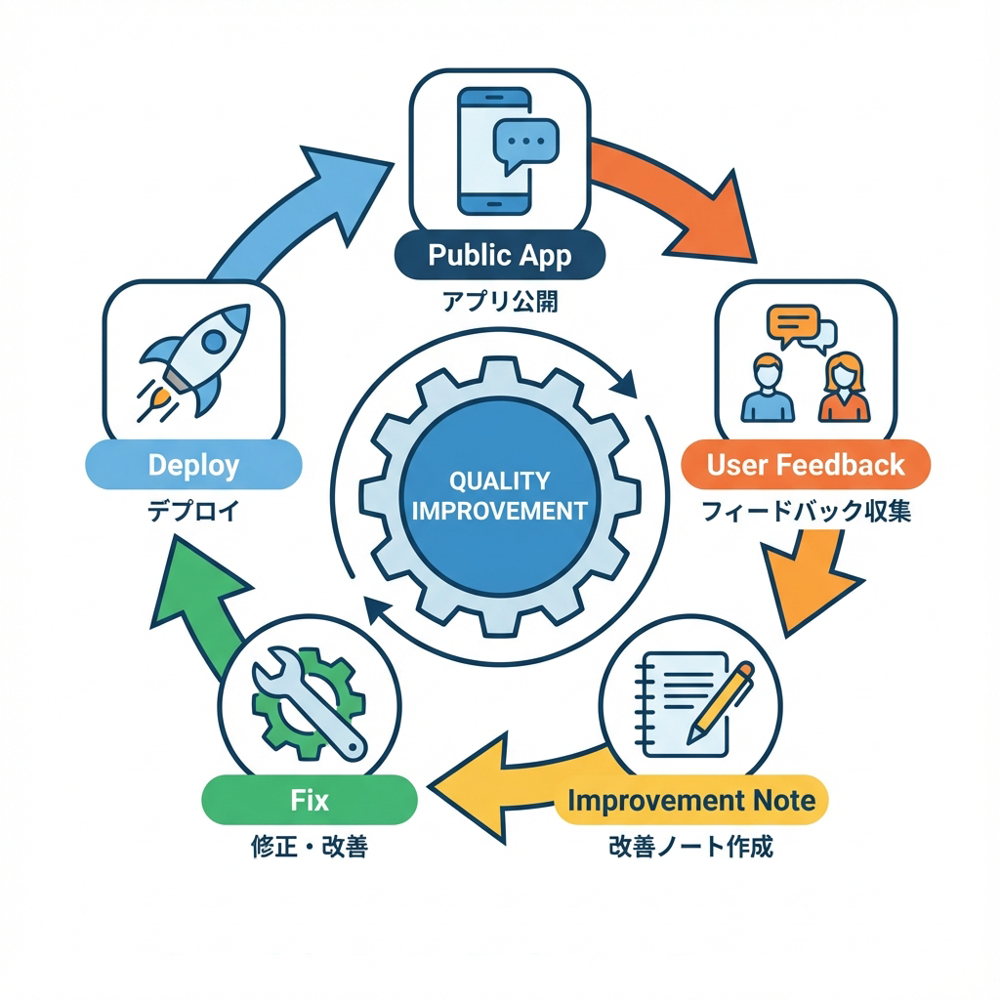
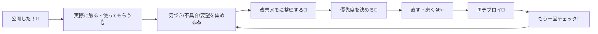

# 第242章：公開して改善点をメモする🧠

公開できたらゴール…じゃなくて「ここから育てるフェーズ」だよ〜！🌱
この章では、**公開後に“どこを直せばもっと良くなるか”を上手に集めて、メモして、次の改善につなげる**やり方をまとめるね😊💕

---

## この章のゴール🎯

* 公開後に見るべきポイントを知る👀✨
* 改善点を「再現できる形」でメモできる📝✅
* 直す順番（優先度）をざっくり決められる📌🔥

---

## 公開後の“改善ループ”の全体像🔁🌈（図解）





---

## 1) 公開直後にまずやる「3点セット」✅✅✅

### ✅① 自分で“本番URL”を最初に通しプレイ🎮

最低ここだけは触ってみてね😊✨

* トップ → 一覧 → 詳細 → 追加/編集/削除（あるなら）
* ログイン/ログアウト（あるなら）🔐
* スマホ幅（ブラウザを細くするだけでOK📱）

### ✅② ちょいチェック（体感をメモ）⏱️

* 「最初の表示、遅くない？」🐢
* 「ボタン押したあと、反応わかる？」👀
* 「どこ押せばいいか迷わない？」🧭

### ✅③ “ログ”の場所だけ把握する🧯

エラーが出た時に「どこ見ればいいか」だけ先に決めとくと強い💪

* デプロイ先のログ（例：ホスティングのログ）📜
* ブラウザのConsole（F12 → Console）🧑‍💻

---

## 2) 改善点は「4種類」に分けるとラク🧺✨

改善メモは、最初からキレイに書かなくてOK！
でも分類だけはすると、あとで迷子にならないよ😊🗺️

* **🐛 バグ**：動かない／エラーになる／意図と違う
* **🧭 迷うUX**：どこ押せばいいかわかりにくい、導線が弱い
* **⚡ 体感速度**：遅い、待ってる感がつらい、読み込みが長い
* **🎨 見た目/文章**：読みにくい、余白、文言が硬い、誤字など

---

## 3) “改善メモ”はこう書くと最強📝🔥（テンプレ）

おすすめは、リポジトリに **`IMPROVEMENTS.md`** を作って残す方法だよ〜😊
（あとでIssueに切り出してもOK👌）

```md
# 改善メモ（公開後）

## 1. タイトル（短く）
- 種別：🐛バグ / 🧭UX / ⚡速度 / 🎨見た目
- 重要度：高 / 中 / 低
- 起きる場所：/ページURL や 画面名
- 再現手順：
  1) ・・・
  2) ・・・
  3) ・・・
- 期待する動き（こうなってほしい）：
- 実際の動き（いまはこうなる）：
- スクショ/動画：あれば最高📷
- メモ：原因の心当たり、直し方の案など
```

💡ポイント：
**「再現手順」があるだけで、未来の自分が助かる**よ〜！😭💖

---

## 4) 優先度の決め方（迷ったらこれ）📌✨

### まずはこの順でOKだよ😊

1. **本番で壊れてる（ユーザーが困る）🐛🔥**
2. **迷って離脱しそう（導線・分かりにくさ）🧭💦**
3. **遅い・待つのがつらい（体感）⚡🐢**
4. **見た目・文章の磨き（仕上げ）🎨✨**

### 超かんたん判定（2問だけ）🧠

* これ、**初見の人が詰む？** 😵‍💫
* これ、**直すのに30分でいける？** ⏳

👉 **“初見が詰む × すぐ直せる”** は最優先で直すと気持ちいいよ🎉💕

---

## 5) フィードバックを集めるコツ（友だち協力編）🤝💬✨

お願いする時は、これだけ言うと集まりやすいよ😊

* 「**3分だけ触って、迷ったところ教えて〜**🙏」
* 「**押したくなったボタン**あった？」👆
* 「**どこがわかりにくい**って感じた？」🧭

💡人は「良かったよ！」で終わりがちだから、**“迷った場所”を聞く**のがコツ✨

---

## 6) ミニ演習（今日やること）📚🎯

* ✅ 本番URLをスマホ幅で触る📱
* ✅ 改善メモを **最低3個** 書く📝（小さいのでOK！）
* ✅ そのうち **“高”を1個だけ** 選ぶ📌
* ✅ 直したら再デプロイして、同じ手順で確認👀🔁

---

## よくある失敗あるある（回避しよ〜😇）

* 「頭の中で覚えておく」→ だいたい忘れる🫠
* 「いきなり全部直す」→ しんどくて止まる😵
* 「完璧になるまで改善メモを書かない」→ 一生書けない🥺

👉 **小さくメモ → 1個直す → すぐ反映** が最強ループだよ🔁💪✨

---

必要なら、今のアプリの内容に合わせて **改善メモの項目（例：ログイン、TODO、記事など）** をあなた専用テンプレに整えて出すよ〜😊📝💕
