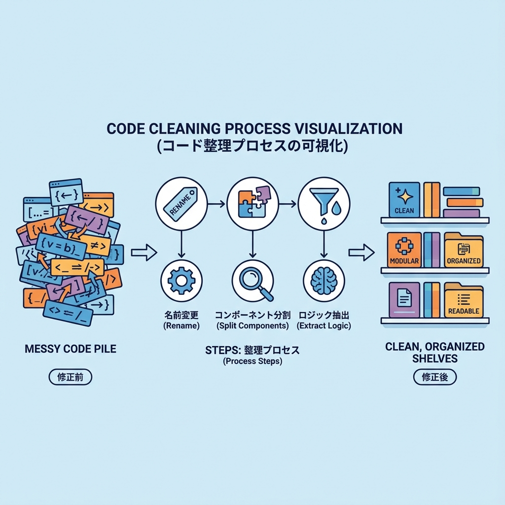
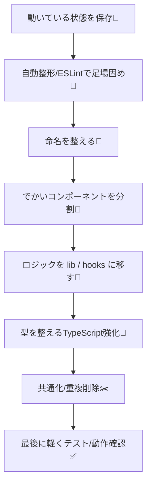
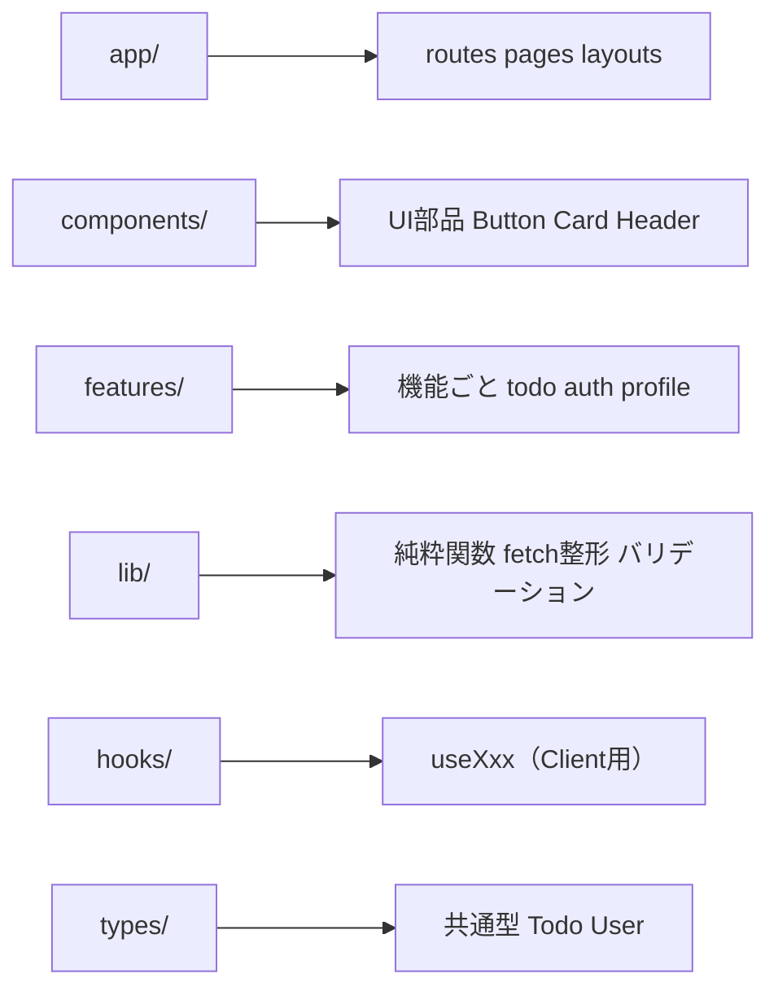

# 第243章：リファクタリング（読めるコードへ）🧼

卒業制作って、動けば動くほど「コードが育ちすぎる」んだよね…🌱💦
この章では、**“動く”を壊さずに、“読みやすい”へ近づける**コツをまとめていくよ〜😊🧹

---

## 1) 今日のゴール 🎯✨

次の状態にするのが目標だよ👇

* ✅ ファイルを開いた瞬間「どこに何があるか」分かる 🗂️
* ✅ 1つのコンポーネントが「やること1つ」になってる 🧩
* ✅ 命名がわかりやすくて、コメントが減る ✍️➡️😌
* ✅ 変更が怖くない（壊れにくい）🛡️

---

## 2) リファクタリングの基本ルール（超だいじ）⚠️💗

### ✅ ルールA：いきなり大改造しない 🚫🏗️

* “一気に綺麗にする”は事故りやすい😵‍💫
* **小さく直して、動作確認して、コミット**が最強💪✨

### ✅ ルールB：「見た目」と「ロジック」を混ぜない 🍹🙅‍♀️

* JSXの中に処理が増えると、読むのがつらい😢
* **計算・整形は外へ**（関数や`lib`へ）🏃‍♀️💨

### ✅ ルールC：同じ形のデータをぐるぐる回す 🔁📦

* “この画面だけ別の形”が増えるとカオス化😇
* 1つの型（`Todo`とか）に寄せるのが正解✨

---

## 3) リファクタリングの進め方（おすすめ手順）🧭✨

まずはこの順番でやると、失敗しにくいよ😊

````



````

---

## 4) まずやる：見た目（コード整形）を揃える 🧼🧷

### ✅ ESLintの自動修正を使う（まずはここから）

ターミナルでこれ👇（プロジェクト直下）

````
```bash
npm run lint
```
````

もし自動修正が用意されてるなら（環境によってはこれもOK）👇

````
```bash
npm run lint -- --fix
```
````

> ここで “一気に差分が出る” のが怖い場合は、整形だけ先にコミットしておくと安心だよ😌🫶

---

## 5) 命名を整えるだけで8割読みやすくなる 📛✨

### ✅ よくある “読みにくい命名” あるある 😵‍💫

* `data`, `data2`, `temp`, `item`, `list2`
* `handleClick2`
* `getData`（何を取るの？どこから？）

### ✅ “読める命名”のコツ 💡

* **名詞 + 役割**：`todos`, `todoItems`, `userSession`
* **動詞 + 対象**：`fetchTodos`, `createTodo`, `deleteTodo`
* **UIはUIとわかる**：`TodoList`, `TodoItem`, `TodoForm`

---

## 6) でかいコンポーネントを分割する 🧩✨（超重要）

### ✅ 分割の目安

* 1ファイルが**150行**を超えてきたら黄色信号🟡
* 1コンポーネントが
  **表示 + データ取得 + バリデーション + 通信 + 状態管理**
  を全部やってたら、ほぼ確実に分けどき🥺

---

## 7) “ありがち地獄”を直す例（Before → After）🧹✨

### Before：JSXの中がロジックだらけ 😭

````
```tsx
export default function TodoRow({ todo }: { todo: any }) {
  return (
    <div>
      <p>
        {todo.title.trim().length === 0 ? "（未入力）" : todo.title.trim()}
      </p>
      <p>
        {todo.done ? "完了✅" : "未完了⏳"}（
        {new Date(todo.createdAt).toLocaleString()}）
      </p>
    </div>
  );
}
```
````

### After：整形は外へ、JSXはスッキリ😊✨

````
```tsx
type Todo = {
  id: string;
  title: string;
  done: boolean;
  createdAt: string; // ISO文字列想定
};

function formatTodoTitle(title: string) {
  const t = title.trim();
  return t.length === 0 ? "（未入力）" : t;
}

function formatCreatedAt(iso: string) {
  return new Date(iso).toLocaleString();
}

export function TodoRow({ todo }: { todo: Todo }) {
  return (
    <div>
      <p>{formatTodoTitle(todo.title)}</p>
      <p>
        {todo.done ? "完了✅" : "未完了⏳"}（{formatCreatedAt(todo.createdAt)}）
      </p>
    </div>
  );
}
```
````

> 「表示するだけ」になったから、読むのが一気にラク〜！😆💕

---

## 8) “置き場所”を決めると迷子が減る 🗂️✨

卒業制作の規模なら、こんな感じが扱いやすいよ👇

````

````

### ✅ 超ざっくり役割

* `components/`：**見た目の部品**（再利用しやすいやつ）🎀
* `features/`：**機能のかたまり**（todo機能まるごと、みたいな）🧠
* `lib/`：**便利関数置き場**（表示整形・API呼び出し・変換）🧰
* `types/`：**型の家**（Todo型があちこちに散らばるのを防ぐ）🏠

---

## 9) Next.js（App Router）っぽい“読みやすさ”のコツ 🧊🎮

### ✅ Server / Client を分けるとスッキリする✨

* **データ取得・DB・認証チェック**：Server側（`app`のServer Component / Server Actions）🧊
* **入力フォームの操作・モーダル開閉・検索UI**：Client側（`"use client"`）🎮

### ✅ “Clientに渡すデータ”はシンプルに 📦

* 変なクラスや関数を混ぜない（渡せなくて詰む原因🥲）
* **文字列・数値・配列・オブジェクト**中心が安心✨

---

## 10) リファクタリング用チェックリスト ✅🧼

できたら、上から順にチェックしていくと気持ちいいよ😆✨

* [ ] **命名が説明になってる**（`data2`がいない）📛
* [ ] **1コンポーネント=役割1つ** 🧩
* [ ] **JSXの中に複雑な式がない**（あっても最小）🧠➡️📦
* [ ] **重複コードが減った**（コピペが消えた）✂️
* [ ] **型が散らばってない**（`Todo`が1つにまとまってる）🧷
* [ ] **エラー表示が丁寧**（ユーザーに優しい文言）🫶
* [ ] **動作確認できた**（最低限でOK）✅

---

## 11) ミニ実践：今日やると強い3つ 💪✨

### 🥇（1）巨大ファイルを1つ選んで、2つに割る 🧩

* 例：`TodoPage` → `TodoList` / `TodoForm`

### 🥈（2）整形関数を`lib/`に移す 🧰

* 例：日付整形、表示用の文字整形、APIレスポンス変換

### 🥉（3）型を`types/`に集める 🧷

* 例：`types/todo.ts` に `export type Todo = ...`

---

## 12) まとめ 🎀✨

リファクタリングは「綺麗にする」じゃなくて、
**未来の自分（とチーム）が困らないようにする作業**だよ😊🫶

ポイントはこれ👇

* 小さく直して、小さく確認✅
* 命名と分割で、読むストレスを減らす📛🧩
* 置き場所（構造）を決めて迷子を防ぐ🗂️✨

次の第244章で、いよいよゴールだよ〜！🎉🚀
