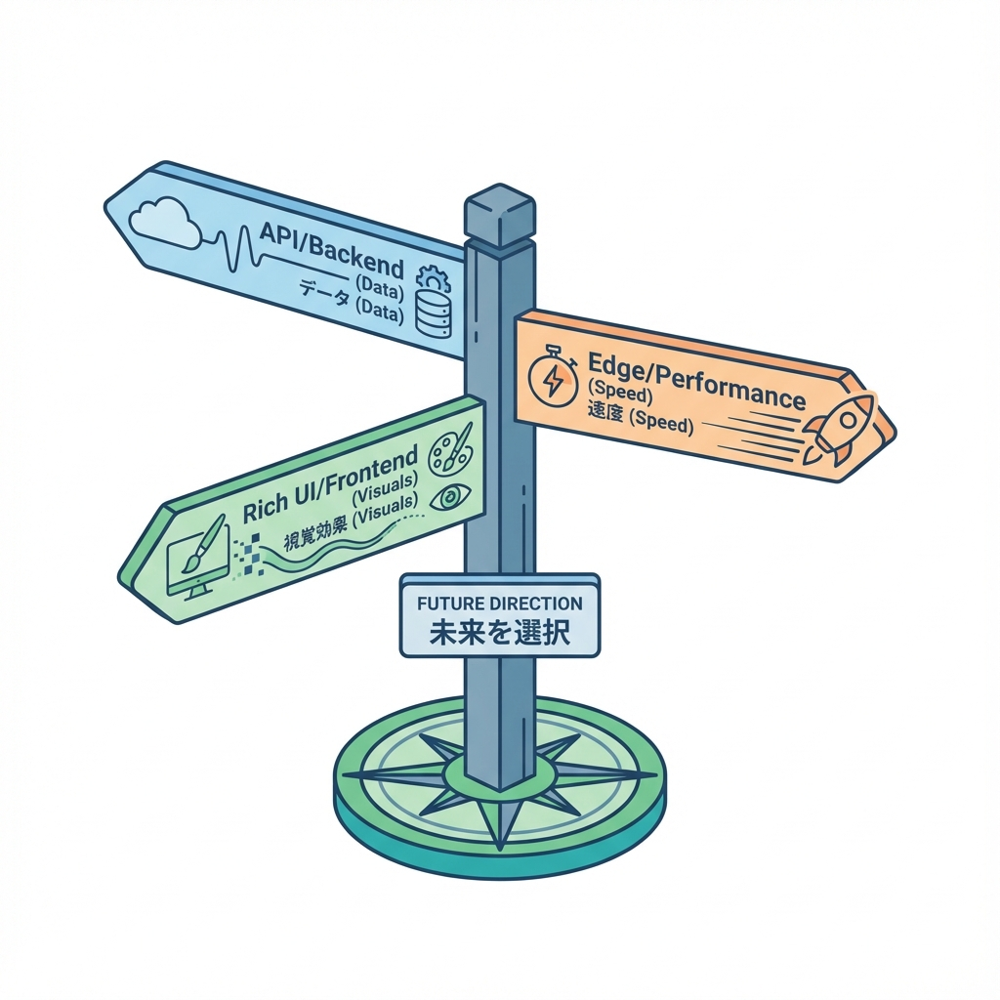
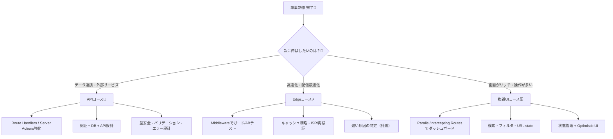

# 第244章：ゴール！次に学ぶ道（API/Edge/複雑UI）🚀🎉

ここまで来たら、もう「Next.jsでアプリを公開して動かせる人」だよ〜！👏✨
この章は **“次にどの方向へ伸ばすと強くなれるか”** を、迷わないように整理する回です🧭💕

---

## この章でやること🧠✨

* 次に学ぶ道を **3コース（API / Edge / 複雑UI）** に分けて理解する🎯
* どれを選ぶべきか、あなたの興味で決められるようになる💡
* それぞれのコースで **小さな次の課題** を用意する🧪✨

---

## 次の道は3つ！あなたはどれ派？🛣️💖





---

# コース①：APIコース📡（「データでアプリっぽさ」爆上げ！）✨

### こういうのが好きなら向いてる😍

* ログインしたら自分のデータが見える👤
* 外部API（天気・地図・SNS・決済など）とつなげたい🌦️🗺️💳
* 「エラー時の返し方」や「型」「安全性」も気持ちよく揃えたい🧼✨

### 次の一歩（おすすめ課題）🧪

**課題A：外部APIを“あなたのAPI”として包んで返す**

* `/api/weather?city=tokyo` みたいな形にして返す☁️
* ついでにエラー時は `{ error: { message, code } }` で統一する🧯

#### 例：Route Handler（超ミニ）

```ts
// app/api/hello/route.ts
import { NextResponse } from "next/server";

export async function GET() {
  return NextResponse.json({ message: "Hello API! 🎉" });
}
```

💡このコースの合言葉：
**「フロントは可愛く、裏側は堅牢に」🛡️💖**

---

# コース②：Edgeコース⚡（「速い・賢い・運用に強い」へ！）

### こういうのが好きなら向いてる😍

* ログイン必須ページを“入口”で止めたい🚧🔐
* 国/言語でリダイレクトしたい🌏➡️
* 「なんか遅い…」をちゃんと改善したい📉➡️📈

### 次の一歩（おすすめ課題）🧪

**課題B：Middlewareで“門番”を作る**

* `/dashboard` はログイン済みだけOKにする🧤
* 未ログインなら `/login` へ誘導する💨

#### 例：middleware（雰囲気だけ）

```ts
// middleware.ts
import { NextResponse } from "next/server";
import type { NextRequest } from "next/server";

export function middleware(req: NextRequest) {
  const isLoggedIn = req.cookies.get("session")?.value;

  if (!isLoggedIn && req.nextUrl.pathname.startsWith("/dashboard")) {
    const url = req.nextUrl.clone();
    url.pathname = "/login";
    return NextResponse.redirect(url);
  }

  return NextResponse.next();
}

export const config = {
  matcher: ["/dashboard/:path*"],
};
```

💡このコースの合言葉：
**「速さは正義。だけど薄く鋭く」✂️⚡**

---

# コース③：複雑UIコース🪟（「ダッシュボード系・操作多め」が得意になる！）

### こういうのが好きなら向いてる😍

* 検索・フィルタ・並び替え・ページングを作りたい🔎🧩
* モーダルで詳細を開きたい🪄
* “押した瞬間反映”みたいな気持ちよさを作りたい✨（Optimistic UI）

### 次の一歩（おすすめ課題）🧪

**課題C：検索・フィルタを「URLと同期」する**

* `?q=cat&tag=cute` みたいにURLで状態を持つ🔗
* リロードしても検索条件が残るの最高🥹💕

#### UIが育つ順番（おすすめ）🌱

1. まずURLで状態を表現（検索条件）🔗
2. 次にローディング・空状態・エラー表示を丁寧に🫶
3. 最後に“押した瞬間反映”を追加✨

💡このコースの合言葉：
**「体験がいいUIは、状態の置き場所で決まる」🧠💖**

---

## どれ選べばいいか迷ったら…🧭💭

迷ったらこの選び方がラクだよ〜😊✨

* **作品を“アプリっぽく”したい** → APIコース📡
* **公開後に強い人になりたい** → Edgeコース⚡
* **見た目と操作で魅せたい** → 複雑UIコース🪟

そして本音を言うと…
**どれ選んでも正解**です🙆‍♀️💕（興味が続くのが最強！）

---

## 次の7日間ミニプラン📅✨（ゆるくでOK！）

* Day1：自分の卒業制作の「弱いところ」を3つメモ📝😌
* Day2：3コースのうち1つ選ぶ🎯
* Day3：そのコースの“課題A/B/C”を着手👩‍💻✨
* Day4：エラー表示・空表示を整える🧯🌿
* Day5：READMEを整える（使い方・URL・スクショ）📘📸
* Day6：小さくリファクタ（命名・分割）🧼✂️
* Day7：友だちに触ってもらってメモ📱💬

---

## 最後に：卒業制作を「作品」にする3点セット🎁✨

* **デモURL**（公開）🌍
* **README**（何ができる？どう動かす？）📘
* **スクショ3枚**（トップ/一覧/詳細）📸📸📸

これ揃うと、急に“ちゃんとした作品”感が出るよ〜！😆💖

---

次の章（第245章）からは「運用保守・エコシステム」なので、ここから一気に“実戦っぽい強さ”が付いてくるよ🛠️✨
どのコースに進みたい気分？📡⚡🪟（今の気分でOKだよ〜😊💕）
