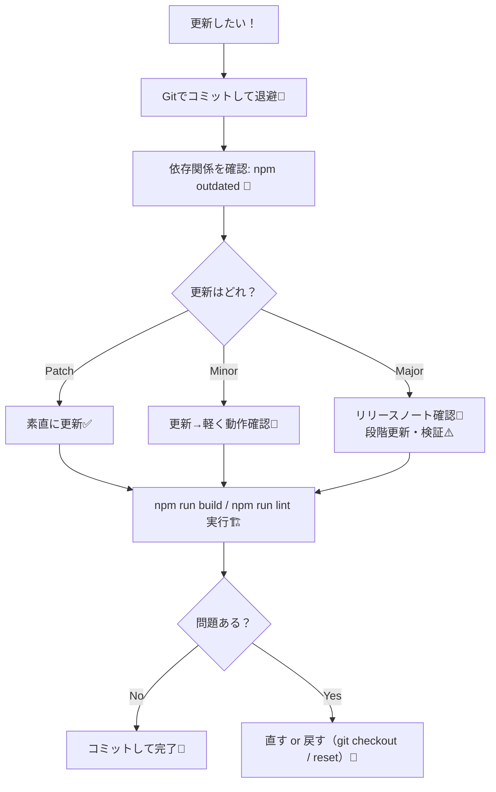
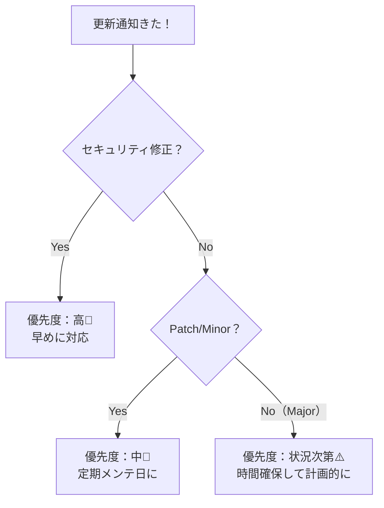

# 第245章：バージョンアップとセキュリティ更新の心得🛡️

Next.js の開発って、作るのは楽しいけど「更新」が地味に大事なんだよね🙂‍↕️
ここをサボると、ある日いきなり **脆弱性⚠️** とか **ビルド失敗😇** が来ます…！

この章では「怖くないアップデート習慣」を作っちゃおう〜！💪💖

---

## この章でできるようになること🎯

* 「今すぐ更新してOK？」を判断できる👀
* 安全に Next.js / 依存関係をアップデートできる🔁
* セキュリティ警告の見方がわかる🧯
* 更新で壊れた時に戻れる（これ超大事）🛟

---

## まず知っておくルール：更新には種類がある🧠

ざっくり、アップデートには3タイプあるよ👇

* **パッチ（Patch）**：バグ修正・セキュリティ修正中心（だいたい安全）✅
* **マイナー（Minor）**：機能追加（基本安全だけど確認）🙂
* **メジャー（Major）**：仕様変更や破壊的変更が入りがち（慎重に！）⚠️

---

## 更新の基本方針（おすすめ）🌷

* **パッチ/マイナーはこまめに**（月1〜2回の習慣が最強）📅✨
* **メジャーは“イベント扱い”**（時間を確保して、段取りを踏む）🎉🧰
* **「壊れても戻せる」状態を作ってから触る**（Gitが命綱）🛟

---

## 安全アップデートの流れ（これをテンプレ化しよ）🧾✨




---

## 実践：更新チェック（Windows / PowerShell）🪟💻

### 1) まずは「何が古い？」を見る👀

```bash
npm outdated
```

ここで出る一覧を見て、まずは **patch/minor っぽい更新から**触るのが安心だよ🙂✨

---

### 2) ふつうの更新（基本これ）🔁

```bash
npm update
```

ただしこれは「範囲指定（package.jsonの ^ や ~ ）の中で」更新される感じだよ📦

---

### 3) Next.js まわりはセットで見る🍱

Next.js は基本この3点セットを意識してね👇

* `next`
* `react`
* `react-dom`

（変にズレると動作が怪しくなることがあるよ😵‍💫）

---

## セキュリティ更新の基本（超大事）🚨🔐

### 1) 警告を見る

```bash
npm audit
```

### 2) 直せるものは自動修正

```bash
npm audit fix
```

### 3) ⚠️これ、基本は最後の手段！

```bash
npm audit fix --force
```

`--force` は **メジャー更新を勝手に入れる**ことがあるから、
「動けばラッキー」じゃなくて「壊れる前提」で扱ってね🥲🧨

---

## “更新が怖い”を消すコツ：テストじゃなくてもOK✅

全部ちゃんとテスト…は大変だから、最低限これだけやろう〜！🌸

### 更新後チェックリスト✅✨

* `npm run dev` で起動する？🌈
* 主要ページを2〜3個クリックして崩れてない？🖱️
* `npm run build` が通る？🏗️
* `npm run lint` が通る？🧹

よく使うコマンド👇

```bash
npm run build
npm run lint
```

---

## “メジャー更新”のやり方（安全運転）🚗💨

メジャー更新はね、いきなり一気にやると事故りがち😇
おすすめはこれ👇

1. **ブランチを切る**（作業場を分ける）🌿
2. **リリースノートを見る**（破壊的変更チェック）📝
3. **段階的に上げる**（飛ばさない）🪜
4. **ビルド＆最低限の動作確認**✅
5. **ダメなら戻す**（ここが最強）🛟

---

## 「今すぐ上げるべき？」判断の早見表🧭



---

## 運用で効く小ワザ集🧰✨

### ✅ 1) “更新日”をカレンダーに入れる📅

月1でいいから「依存関係お掃除デー」作ると、未来が平和🕊️✨

### ✅ 2) 自動でPRを作ってもらう（超ラク）🤖

* **Dependabot（GitHub）**
* **Renovate**

「更新PRが勝手に並ぶ」→「チェックしてマージするだけ」になって最高だよ🥰

### ✅ 3) Node.js も忘れない

Node の更新でビルドが変わることもあるから、
本番とローカルの Node バージョンはなるべく揃えるのがおすすめ🙂‍↕️🔧

---

## ミニ課題🎓✨（15〜25分）

1. `npm outdated` を実行して、古い依存を確認👀
2. `npm update` を実行🔁
3. `npm audit` → `npm audit fix` を実行🛡️
4. `npm run build` が通るか確認🏗️
5. できたら Git にコミット🎉

---

## まとめ🍀

* 更新は「怖いもの」じゃなくて「健康診断」だよ🩺✨
* **パッチ/マイナーはこまめに**、**メジャーは計画的に**🙂⚠️
* **Gitで戻れる状態**を作れば、安心して挑戦できる🛟💖
* セキュリティは `npm audit` で“見える化”→直せるところから対応🛡️

---

次の章（第246章）は、更新の仕組みと相性がいい **「revalidateTagで更新ボタン」**だよ🧊🔘✨
「キャッシュを意図的に更新する」って発想、気持ちよくなってくるから楽しみにしててね😆💗
