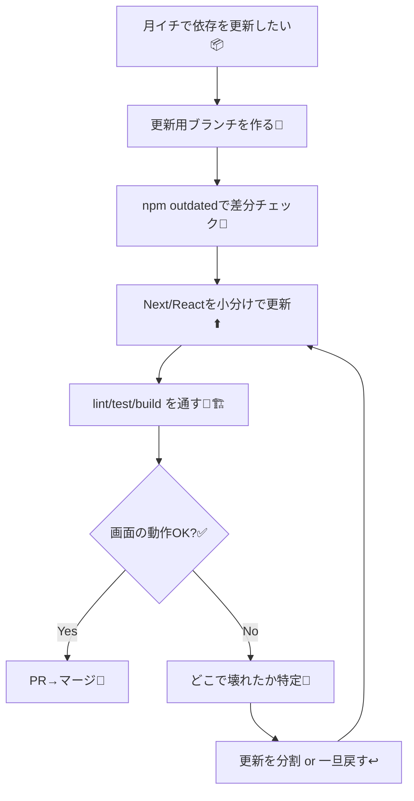

# 第245章：おまけ — Next.jsを安心して育てる「アップデート＆セキュリティ」ルーティン🛡️🔁✨

## 今日のゴール🎯

* 依存関係（Next.js / React など）を**怖がらずに更新**できるようになる😊💪
* 「いつ・何を・どの順番で」更新すれば挫折しにくいかを覚える🧠✨
* **緊急のセキュリティ対応**のときに、最短で動けるようになる🚨🏃‍♀️

---

## なんでこれ必要なの？🥺

Next.jsって成長が早くて、2025年も新しいメジャー/マイナーが普通に出るよ〜！たとえば **Next.js 16** や **16.1** みたいに、改善がどんどん入る感じ📈✨ ([Next.js][1])
あと React も **React 19** が前提になってきてるので、土台はちゃんと追いかけたいね🧁🩷 ([React][2])

さらに大事なのが、RSC（React Server Components）まわりは**セキュリティ情報が出ることがある**って点⚠️
Next.jsのApp Routerは、ページやレイアウトが基本 Server Components（＝サーバー側の仕組みが絡む）だよ〜って公式にも書かれてるから、なおさら「更新＝守り」になる🛡️ ([Next.js][3])

---

## まず覚える！挫折しない更新ルール3つ🧩✨

### ① 更新は「小さく分ける」✂️

いきなり全部更新しないで、まずは

* Next.jsだけ
* Reactだけ
  みたいに分けると、壊れたとき原因がすぐ分かるよ🙆‍♀️✨

### ② 更新前に「セーブポイント」を作る🎮💾

更新前にコミットしておくと、戻れるから安心〜！😆

### ③ 「ふだん更新」と「緊急更新」を分ける🚨🗓️

* ふだん更新：月イチくらいでOK（ルーティン化）☕️
* 緊急更新：セキュリティ情報が出たら即対応⚡️
  React Server Componentsの重大な脆弱性（CVE）が出た例もあるので、「出たらすぐ動く」だけ決めておくと強いよ🛡️🔥 ([React][4])

---

## 図解：月イチ更新の流れ（迷わない版）🗺️✨



---

## 実践：Windowsでやる「安全な更新」手順🪟✨

### 0) 事前にやること（超大事）🧡

* 変更中の作業があるなら、先にコミット or 退避（stash）しよ〜💾

### 1) いまの状態を確認👀

```bash
node -v
npm -v
npm outdated
```

### 2) 更新用ブランチを作る🌿

```bash
git checkout -b chore/deps-update
```

### 3) まずは「Next.jsだけ」更新してみる（例）⬆️

```bash
npm install next@latest
```

### 4) つづいて「Reactだけ」更新してみる⬆️

```bash
npm install react@latest react-dom@latest
```

### 5) チェック（ここが命！）🧪✨

プロジェクトに合わせて、あるやつだけでOKだよ〜！

```bash
npm run lint
npm run test
npm run build
npm run dev
```

* build が通る＝本番に近いチェック🏗️
* dev でページ開いて「よく触る画面」だけ軽く確認👆😊

### 6) OKならコミット💾✨

```bash
git add -A
git commit -m "chore: update next/react deps"
```

---

## 緊急対応モード🚨（セキュリティ情報が出たとき）

React Server Componentsに関する重大な脆弱性が公開され、**すぐアップグレード推奨**になった事例があるよ⚠️ ([React][4])
Next.js側もRSC関連のセキュリティ更新を出してるので、公式ブログのSecurity Updateは定期的に見る価値あり🛡️📰 ([Next.js][5])

### 緊急のときの最短ムーブ🏃‍♀️💨

1. まず公式情報を見る（何を何以上に上げる？）👀
2. すぐ更新
3. build だけでも通す（最低ライン）
4. 可能ならその日のうちにデプロイ

（コマンド例）

```bash
npm install next@latest react@latest react-dom@latest
npm run build
```

---

## つまずきポイントあるある🫠➡️🙂

### ✅ 「更新したらビルド失敗した…」

➡️ 更新を一気にやらず、**Nextだけ更新 / Reactだけ更新**に分けて原因を切り分けよ〜🔎✨

### ✅ 「どれを更新すればいいか分からない…」

➡️ まずは **next / react / react-dom** の3点セットだけでOK🙆‍♀️
他は慣れてからで大丈夫だよ〜🍵

### ✅ 「lockファイルって何…？」

➡️ ざっくり「依存の確定表」！📌
更新したら lock も一緒に変わるのが普通だよ〜（むしろ一緒にコミットする）🧾✨

---

## ミニ課題📝✨（15分でできる）

1. 自分のNext.jsプロジェクトで npm outdated を実行👀
2. next / react / react-dom の差分が出たらメモ🗒️
3. 更新用ブランチを作って、next だけ更新→ build を通す🏗️
4. 余裕があれば react / react-dom も更新して build を通す🎉

---

## まとめ🎀

* 更新は「小分け」「セーブポイント」「チェック（build）」が勝ちパターン🏆✨
* App Routerはサーバー側の仕組みも絡むから、更新は守りにもなるよ🛡️ ([Next.js][3])
* セキュリティ情報が出たときの“緊急ムーブ”だけ決めておくと安心🚨💗 ([React][4])

[1]: https://nextjs.org/blog/next-16?utm_source=chatgpt.com "Next.js 16"
[2]: https://react.dev/blog/2024/12/05/react-19?utm_source=chatgpt.com "React v19"
[3]: https://nextjs.org/docs/app/getting-started/server-and-client-components?utm_source=chatgpt.com "Getting Started: Server and Client Components"
[4]: https://react.dev/blog/2025/12/03/critical-security-vulnerability-in-react-server-components?utm_source=chatgpt.com "Critical Security Vulnerability in React Server Components"
[5]: https://nextjs.org/blog/security-update-2025-12-11?utm_source=chatgpt.com "Next.js Security Update: December 11, 2025"
