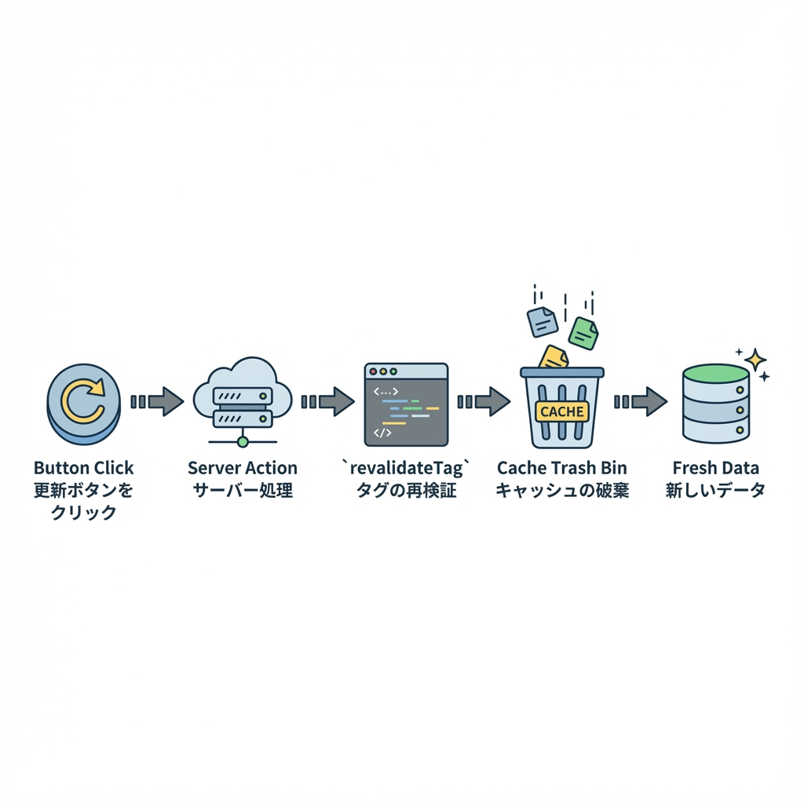
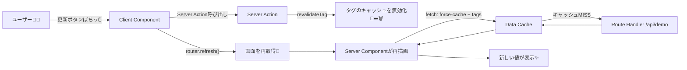

# 第246章：`revalidateTag` で「更新ボタン」を作る🧊

この章では、**キャッシュされたデータにタグ（tag）を付けておいて**、ボタンを押したらそのタグのキャッシュを無効化して **“最新を取り直す”** しくみを作ります☺️🫶
（Next.js公式の `revalidateTag` を使うよ〜！） ([Next.js][1])

---

## 今日つくるもの🎀

* 画面に「サーバーの今の時刻＋ランダム値」を表示⏰🎲
* でも **普通にリロードしても同じ値（キャッシュ）** のまま🧊
* **「更新」ボタン** を押したときだけ、`revalidateTag` でキャッシュを捨てて **新しい値に更新**✨

---

## ざっくり仕組み図（これができれば勝ち）🏆





---

## 0) 先に知っておく大事ポイント3つ🧠✨

### ✅ ① `revalidateTag` は「サーバーでしか」呼べない🙅‍♀️

Server Action / Route Handler で呼べます。Client Component から直はNGです🚫 ([Next.js][1])

### ✅ ② タグは「先につけて」おかないと意味ない🏷️

`fetch(url, { next: { tags: ['demo'] } })` みたいに、**キャッシュ対象にタグ付け**します ([Next.js][1])

### ✅ ③ 2025の `revalidateTag` は「第2引数あり推奨」✨

* 推奨：`revalidateTag('tag', 'max')`（古いのを出しつつ裏で更新＝SWR） ([Next.js][1])
* 1引数だけは **deprecated**（将来消えるかも） ([Next.js][1])
* **更新ボタンで“即更新感”が欲しいとき**は `{ expire: 0 }` が使える（公式の注意書きあり） ([Next.js][1])

> この章の「更新ボタン」は押したらすぐ変わってほしいので、例では **`{ expire: 0 }`** を使います😊
> ただし本気の運用では `updateTag` なども検討してね、というのが公式のニュアンスです📌 ([Next.js][1])

---

## 1) プロジェクト準備（すでにあるならスキップOK）🛠️✨

Windows のターミナル（PowerShell）で👇

```bash
npx create-next-app@latest revalidate-tag-demo
cd revalidate-tag-demo
npm run dev
```

ブラウザで `http://localhost:3000` が開けたらOK🎉

---

## 2) まずは「毎回変わるAPI」を作る（Route Handler）🚪🧪

`app/api/demo/route.ts` を作って、これを入れてね👇

```ts
export async function GET() {
  return Response.json({
    now: new Date().toISOString(),
    lucky: Math.floor(Math.random() * 1000),
  })
}
```

これで `/api/demo` はアクセスするたびに値が変わるはず⏰🎲

---

## 3) キャッシュ付きで取得する（タグ付けもする）🏷️🧊

`app/page.tsx` をこうしてね👇（いったんボタンなしでOK）

```tsx
import RefreshButton from "./refresh-button";

async function getDemo() {
  const res = await fetch("http://localhost:3000/api/demo", {
    cache: "force-cache",
    next: { tags: ["demo-data"] },
  });

  if (!res.ok) throw new Error("API failed");
  return res.json() as Promise<{ now: string; lucky: number }>;
}

export default async function Page() {
  const data = await getDemo();

  return (
    <main style={{ padding: 24, fontFamily: "system-ui" }}>
      <h1>revalidateTag 更新ボタンデモ🧊🔁</h1>

      <p style={{ marginTop: 16 }}>
        <b>now:</b> {data.now} ⏰
      </p>
      <p>
        <b>lucky:</b> {data.lucky} 🎲
      </p>

      <div style={{ marginTop: 20 }}>
        <RefreshButton />
      </div>

      <p style={{ marginTop: 16, opacity: 0.7 }}>
        ※ ふつうに更新（F5）しても変わらないのが正解だよ🧊
      </p>
    </main>
  );
}
```

ポイントはここ👇

* `cache: "force-cache"` で **キャッシュする**（これがないとタグ無効化しても体感しにくいよ） ([Next.js][2])
* `next: { tags: ["demo-data"] }` で **タグ付け**🏷️ ([Next.js][1])

---

## 4) Server Action で `revalidateTag` を呼ぶ🧑‍🍳✨

`app/actions.ts` を作って👇

```ts
"use server";

import { revalidateTag } from "next/cache";

export async function refreshDemoData() {
  // 「更新ボタン」なので、押したら次の取得は“即”取り直してほしい✨
  // 公式: 即時expireが必要なケースでは { expire: 0 } が使えるよ、って書かれてるよ📌
  revalidateTag("demo-data", { expire: 0 });
}
```

* `revalidateTag` は Server Action で呼べます ✅ ([Next.js][1])
* `{ expire: 0 }` についての公式注記もあります ✅ ([Next.js][1])
* タグ名は **大文字小文字を区別**＆長さ制限あり（ここでは気にしなくてOK） ([Next.js][1])

---

## 5) 更新ボタン（Client Component）を作る🖱️💕

`app/refresh-button.tsx` を作って👇

```tsx
"use client";

import { useTransition } from "react";
import { useRouter } from "next/navigation";
import { refreshDemoData } from "./actions";

export default function RefreshButton() {
  const router = useRouter();
  const [isPending, startTransition] = useTransition();

  return (
    <button
      onClick={() => {
        startTransition(async () => {
          await refreshDemoData();   // サーバーでタグを無効化🧊➡️🗑️
          router.refresh();          // 画面を再取得🔄（Server Componentを描き直す）
        });
      }}
      disabled={isPending}
      style={{
        padding: "10px 14px",
        borderRadius: 12,
        border: "1px solid #ccc",
        background: isPending ? "#f3f3f3" : "white",
        cursor: isPending ? "not-allowed" : "pointer",
      }}
    >
      {isPending ? "更新中…⏳" : "更新する🔁✨"}
    </button>
  );
}
```

これで完成〜〜〜！🎉🎉🎉
ボタン押すたびに `now` と `lucky` が変わったら成功です🥳

---

## うまく動かない時のチェック🔍💡

### ✅ DevTools を開いてるなら「Disable cache」をOFFにしてみて🙏

開発中に DevTools の「Disable Cache」や強制リロードをしてると、キャッシュ挙動が崩れやすいです🥲
Next.jsも「開発中はキャッシュ無効化が影響するよ」って説明しています ([Next.js][3])

### ✅ タグ名が一致してる？（スペル＆大文字小文字）🏷️

`tags: ["demo-data"]` と `revalidateTag("demo-data", ...)` が同じか確認👀 ([Next.js][1])

### ✅ `revalidateTag` を Client で呼んでない？🙅‍♀️

Client Component から直呼びはできません（Server Action経由にする） ([Next.js][1])

---

## ちょい理解チェック（ミニ）📝✨

1. `revalidateTag` はどこで呼べる？（Client / Server Action / Route Handler）
2. `revalidateTag` の前に必ず必要なことは？
3. “押したらすぐ更新” っぽくしたいとき、例では第2引数に何を入れた？

---

## まとめ🎀

* `fetch` に `next.tags` を付けてキャッシュへ🏷️🧊 ([Next.js][1])
* Server Action で `revalidateTag(tag, ...)` して無効化🔁 ([Next.js][1])
* `router.refresh()` で画面を描き直して反映✨
* 2025の流儀は **第2引数をちゃんと付ける**（1引数はdeprecated）📌 ([Next.js][1])

---

次の第247章（安全なアップデート手順と codemod 🤖）に行く前に、もしよければこの章の練習として👇もやると超強いよ💪✨

* タグを `demo-data` と `demo-data-2` の2種類にして、ボタンで片方だけ更新してみる🎯

[1]: https://nextjs.org/docs/app/api-reference/functions/revalidateTag "Functions: revalidateTag | Next.js"
[2]: https://nextjs.org/docs/app/getting-started/caching-and-revalidating "Getting Started: Caching and Revalidating | Next.js"
[3]: https://nextjs.org/docs/messages/cache-bypass-in-dev "Caches Bypassed in Development Mode | Next.js"
