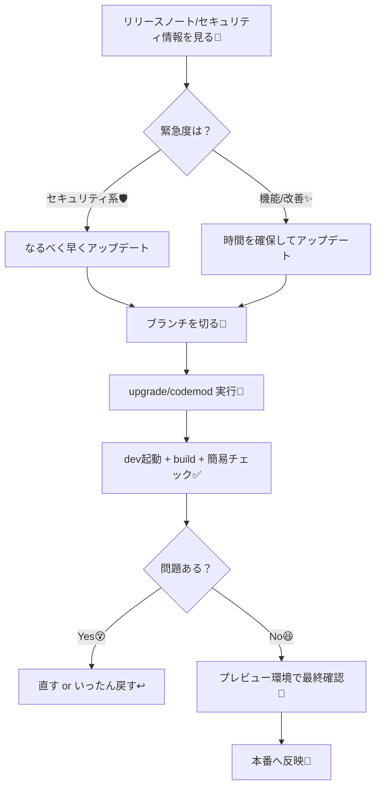

# 第247章：Next.jsを“怖くなく”安全にアップデートするコツ🛡️🔁✨（リリースノート＋codemod）

※アウトラインは第244章までだったけど、ここは「おまけの第247章」として **“アップデート習慣”** を作るよ〜🫶（運用でめっちゃ効く！）

---

## この章のゴール🏁

* 「Next.jsの更新」って聞いてビビらない😖➡️落ち着いて進められる😌✨
* **安全に**アップデートする“型”を覚える🧠✅
* codemod（自動変換）を使って、手作業の地獄を減らす🔥➡️天国へ🪽 ([Next.js][1])

---

## 全体の流れ（これが型！）🗺️



---

## 1) まず「何を見て」アップデートする？📰👀

おすすめはこの2つだけでOK！✨

* **Next.js 公式ブログ（リリース/セキュリティ）**：特にセキュリティ更新は最優先でチェック🛡️ ([Next.js][2])
* **React/Nextのバージョン関係**：App RouterとPages Routerで“Reactの扱い”が違うよ〜⚠️ ([Next.js][3])

（ちなみに、React 19系もちゃんと進んでるよ〜⚛️✨）([React][4])

---

## 2) 事前準備（失敗しないおまじない🪄）

アップデート前に、これだけやると安心度MAX💯

### ✅ 作業用ブランチを切る（超重要！）🌿

* 「うわ、壊れた😱」ってなっても戻れる！

### ✅ いまのバージョン確認👀

```bash
npm ls next react react-dom
```

### ✅ 依存関係の変更が怖いなら、コミットしてから開始📌

* 「アップデート前の状態」を保存しとく感じだよ🧊

---

## 3) アップデート方法は2択！どっち使う？🎯

### A. いまのNext.jsが新しめなら：`upgrade` コマンド✨

公式の案内では、最新へ上げるのに `upgrade` コマンドが使えるよ〜！ ([Next.js][5])

Windowsならこのへんが無難👇（どっちでもOK）

```bash
npx next upgrade
```

または

```bash
npm exec -- next upgrade
```

### B. Next.js 15以前なら：codemodの `upgrade` を使う🤖

公式が「15以前はこっち使ってね」って言ってるやつ！ ([Next.js][5])

```bash
npx @next/codemod@canary upgrade latest
```

---

## 4) codemodって何？（一言でいうと🤖✂️）

**コードをまとめて自動で書き換えてくれる“お掃除ロボ”**だよ〜🧹✨
APIが変更/非推奨になったとき、手で全部探して直すのはつらいからね😭
Next.jsはアップグレード支援のcodemodを用意してくれてるよ！ ([Next.js][1])

### codemodを単体で使う形（雰囲気）

```bash
npx @next/codemod <transform> <path>
```

`--dry` で「実際には書き換えず、試すだけ」もできるよ🧪 ([Next.js 16 日本語ドキュメント][6])

---

## 5) アップデート後のチェック（ここまでがセット✅）

最低限これだけやればOK！✨

### ✅ 開発サーバ起動

```bash
npm run dev
```

### ✅ 本番ビルドできるか

```bash
npm run build
```

### ✅ それでも怖いときは…

* まず **プレビュー環境**（例：VercelのPreview）で動作確認してから本番へ👀✨
  （この“ワンクッション”が安心感すごい🫶）

---

## 6) よくあるハマりどころ（先に知っとくと勝ち😎）

### 😵「Reactのバージョン、どれ使われてるの？」

* **App Router** と **Pages Router** でReactの扱いが違うよ！
  App Routerは“React canaryが内蔵”の扱いになってて、React 19の安定機能も含む…みたいな説明があるよ〜⚛️ ([Next.js][3])

### 😵「セキュリティ更新、あとでいいよね？」

* それはダメ〜〜🫠
  RSCまわりの脆弱性の案内が出ることもあるから、**セキュリティ系は優先**でアップデートが基本だよ🛡️ ([Next.js][2])

### 😵「lintコマンドの扱いが変わってる？」

* リリースによっては `next lint` の扱いが変わった/非推奨の話が出ることがあるよ〜（リリースノートで確認が安心！）📰 ([Next.js][7])

---

## ミニ課題（10〜15分）🎒✨

1. いまのバージョンを確認する👀

```bash
npm ls next react react-dom
```

2. ブランチを切る🌿（Git使ってる前提）

* `upgrade-nextjs` みたいな名前でOK🙆‍♀️

3. 次のどっちかでアップデート実行🤖

* 新しめ：`npx next upgrade` ([Next.js][5])
* 15以前：`npx @next/codemod@canary upgrade latest` ([Next.js][5])

4. `npm run dev` と `npm run build` が通ればクリア🎉✨

---

## まとめ🎀

* アップデートは「気合い」じゃなくて「手順の型」💪✨
* **リリースノート確認 → ブランチ → upgrade/codemod → dev/buildチェック → プレビュー → 本番**
* codemodは“手作業の地獄”を減らしてくれる神アイテム🤖🫶 ([Next.js][1])

次は、アップデートで出がちな「型エラーの直し方」みたいな章も作れるよ〜😆🔧（でも今回は第247章だけね！）

[1]: https://nextjs.org/docs/app/guides/upgrading/codemods?utm_source=chatgpt.com "Upgrading: Codemods"
[2]: https://nextjs.org/blog/security-update-2025-12-11?utm_source=chatgpt.com "Next.js Security Update: December 11, 2025"
[3]: https://nextjs.org/docs?utm_source=chatgpt.com "Next.js Docs | Next.js"
[4]: https://react.dev/blog/2025/10/01/react-19-2?utm_source=chatgpt.com "React 19.2"
[5]: https://nextjs.org/docs/app/getting-started/upgrading?utm_source=chatgpt.com "Getting Started: Upgrading"
[6]: https://nextjsjp.org/docs/app/guides/upgrading/codemods?utm_source=chatgpt.com "Codemods | Next.js 16 日本語ドキュメント"
[7]: https://nextjs.org/blog?utm_source=chatgpt.com "The latest Next.js news"
