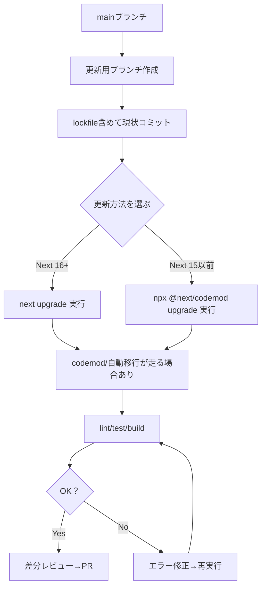

# 第247章：安全なアップデート手順と codemod 🤖

この章は「Next.jsの更新が怖くなくなる」ための、**安全な手順（型）**と、**自動で直してくれる codemod の使い方**を覚える回だよ〜！🧸💻✨
※Next.jsは頻繁に更新＆セキュリティ情報も出るので、**安全に素早く更新できる力**がめちゃ大事だよ🛡️🔥 ([Next.js][1])

---

## 1) まず知ろう：codemodって何？🤖🧹

**codemod = コードを自動で書き換えるお掃除ロボ**だよ✨
Next.jsの公式codemodは、アップグレード時にありがちな「設定の移行」「廃止APIの置き換え」などを手伝ってくれるよ🧩

例：`ImageResponse` の import を自動で直すcodemod（`next-og-import`）みたいなやつがあるよ📸
`next/server` → `next/og` に変換してくれる感じ！ ([Next.js][2])

---

## 2) “安全に更新する型”チェックリスト ✅🧊

更新って、実は「作業」より「順番」が命だよ〜！🔁✨
（この順番にすると、失敗しても戻れる💪）

### ✅ 安全アップデート手順（おすすめテンプレ）

1. **作業ブランチを作る**🌿（戻れるように）
2. **いまの状態を固定**📌（`npm install`済み＆lockfileコミット）
3. **更新の方法を選ぶ**（`next upgrade` か `codemod upgrade`）🤖
4. **codemodを実行**（必要なら）🧹
5. **lint / test / build を通す**🧪🏗️
6. **差分を読む**👀（設定ファイル・middleware周りは要チェック）
7. **動作確認**（主要画面だけでOK）🧭
8. **コミットしてPR**🎀（レビューが最強の保険）

---

## 3) 図解：安全アップデートの流れ 🗺️✨（Mermaid）




---

## 4) 実際のコマンド（WindowsでOK）🪟✨

### A. まず「自分のNext.jsのバージョン」を見る👀

* `package.json` の `dependencies` に `next` が書いてあるから確認してね📦

---

### B. Next.js を “最新” に上げる方法（2パターン）⬆️

#### ✅ パターン1：`next upgrade`（使えるならこれがラク）✨

Next.jsの公式ドキュメントでは、最新へ上げる方法として `next upgrade` が案内されてるよ🧸 ([Next.js][3])

```bash
next upgrade
```

> これは **Next.js 16以降で使える**想定のコマンドだよ（ドキュメント上、15以前は別手段が必要と明記されてる） ([Next.js][3])

---

#### ✅ パターン2：codemodで「アップグレード一式」（Next.js 15以前など）🤖

Next.js 15以前は `next upgrade` が使えないので、公式はこの形を案内してるよ👇 ([Next.js][3])

```bash
npx @next/codemod@canary upgrade latest
```

この upgrade codemod は、例えばこんな移行を手伝ってくれるよ🧰

* `next.config.js` を新しい `turbopack` 設定へ寄せる
* `next lint` → ESLint CLI への移行
* deprecated な middleware 慣習の移行
* `unstable_` が外れたAPIの更新
  …などなど！ ([Next.js][4])

---

## 5) “個別codemod”もあるよ（必要な時だけ）🧩✨

「全部アップグレード」じゃなくて、**特定の変更だけ直したい**ときに使うよ〜！

例：`next-og-import`（Dynamic OG画像関連の import 移行）📸 ([Next.js][2])

```bash
npx @next/codemod@latest next-og-import .
```

---

## 6) アップデート後に必ずやる3点セット 🧪🏗️✨

最低限これだけやると安心度が一気に上がるよ〜！🫶

```bash
npm run lint
npm run test
npm run build
```

* **`build` が通る＝本番にかなり近いチェック**✅
* 逆に「devは動くけどbuildで死ぬ」ってよくあるある😇💥

---

## 7) よくあるハマりどころ（先に知っておくと勝ち）🪤😺

* **設定ファイルの差分が大きい**（`next.config.*` 周り）→ いったん落ち着いて差分を見る👀
* **lintコマンド周りが変わる**→ codemodが直してくれることがある（でも最終確認は人間）🤝 ([Next.js][4])
* **セキュリティ更新が来る**→ “後でやろう”が一番危ないやつ😵
  例：2025-12-11 に Next.js のセキュリティアップデートが出てるよ（RSCプロトコルの脆弱性関連）🛡️ ([Next.js][1])

---

## 8) ミニ練習：安全アップデートを“型通り”にやってみよう 🎮✨

### ✅ やること（20〜30分くらいの気持ちで）

1. Gitで更新用ブランチ作る🌿
2. `npx @next/codemod@canary upgrade latest` を実行🤖
3. `npm run build` まで通す🏗️
4. 変更されたファイルTOP3をメモ📝（例：`next.config.*`, `eslint` 系, middleware系）

---

## まとめ 🎀✨

* **安全アップデートは「順番ゲー」**だよ🔁
* **codemodは公式のお助けロボ**🤖🧹
* まずは **ブランチ → lockfile → upgrade/codemod → build** の型だけ覚えればOK！🫶
* Next.jsは 2025-12-18 に 16.1 の発表も出てるので、更新の波はこれからも来るよ〜🌊✨ ([Next.js][5])

---

次の章（第248章）は **`revalidatePath` vs `revalidateTag`** 🔁✨
「更新の仕組み」を使い分けられると、運用が一気に上手くなるよ〜！😊

[1]: https://nextjs.org/blog/security-update-2025-12-11?utm_source=chatgpt.com "Next.js Security Update: December 11, 2025"
[2]: https://nextjs.org/docs/app/guides/upgrading/codemods?utm_source=chatgpt.com "Upgrading: Codemods"
[3]: https://nextjs.org/docs/app/getting-started/upgrading?utm_source=chatgpt.com "Getting Started: Upgrading"
[4]: https://nextjs.org/docs/app/guides/upgrading/version-16?utm_source=chatgpt.com "Upgrading: Version 16"
[5]: https://nextjs.org/blog/next-16-1?utm_source=chatgpt.com "Next.js 16.1"
