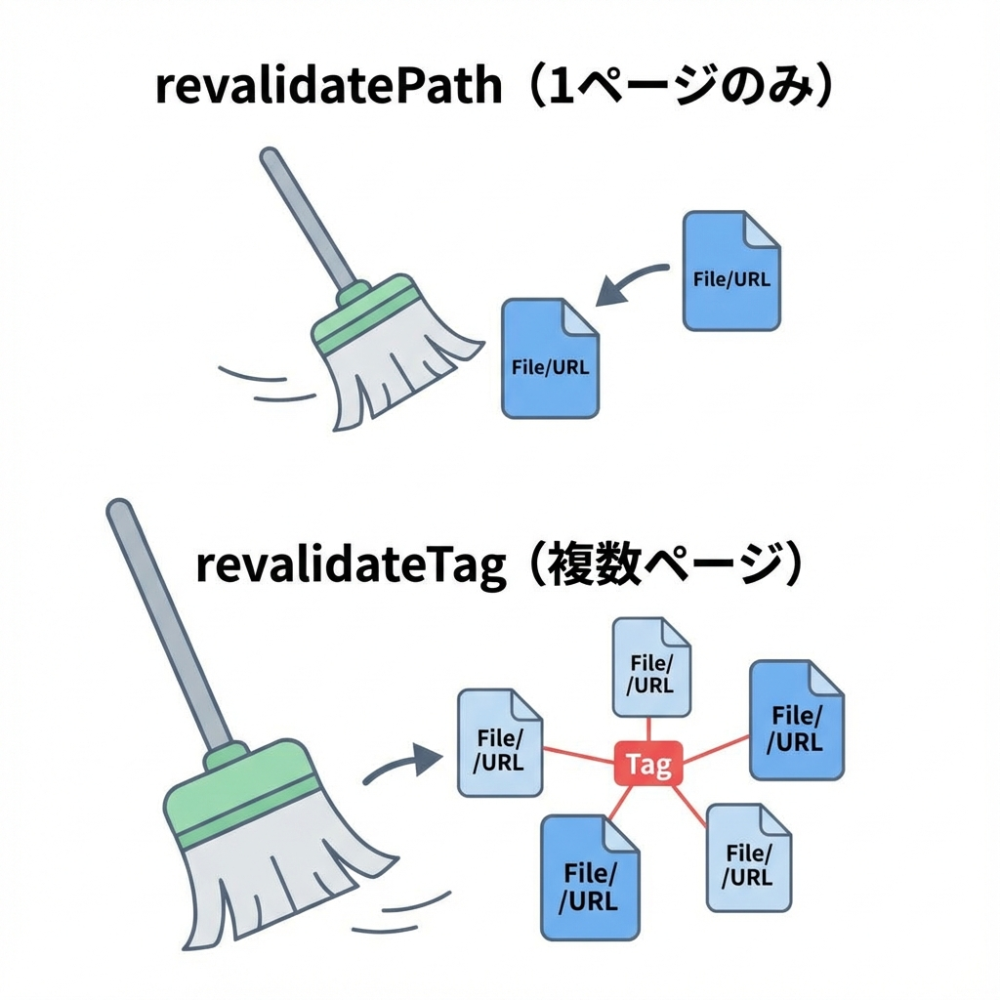
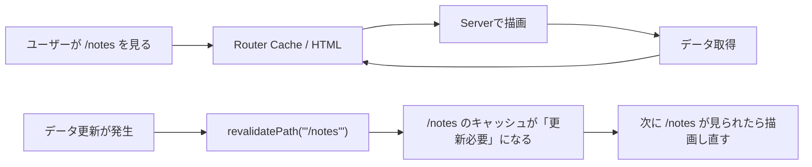
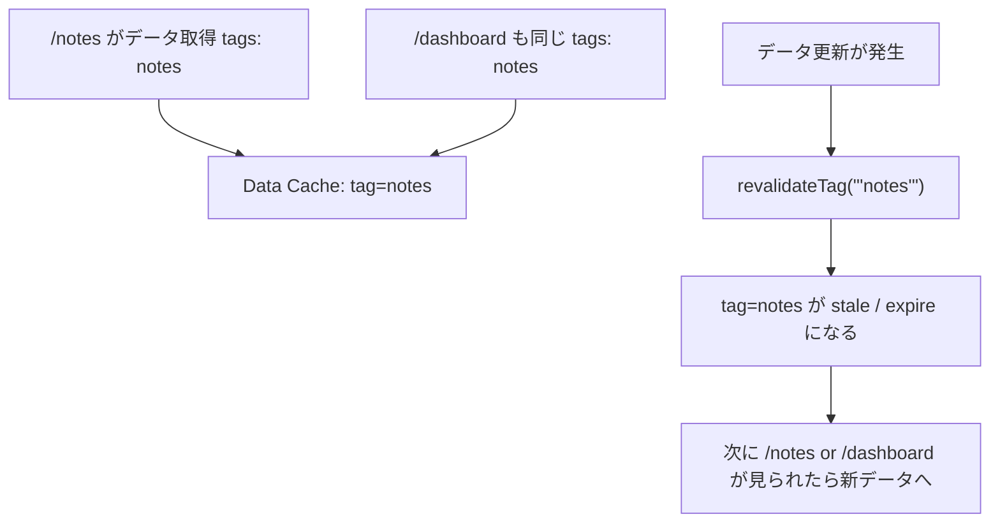
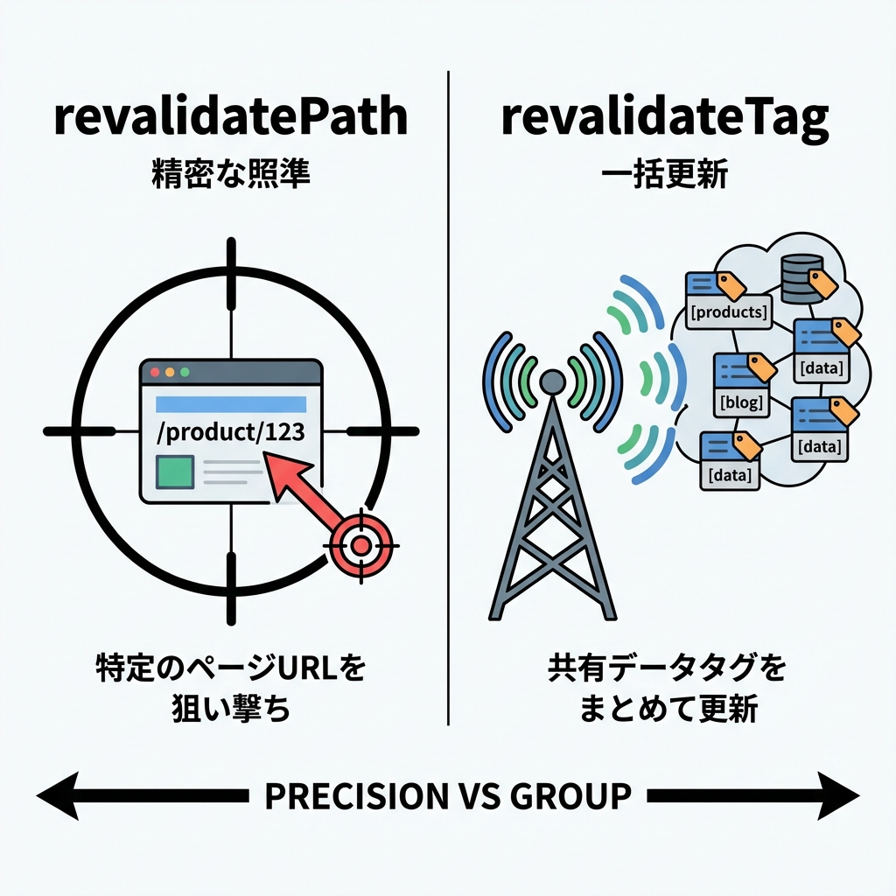

# 第248章：`revalidatePath` vs `revalidateTag` 🔁

この章は、「更新したのに画面が変わらない😇」を気持ちよく解決する回だよ〜！💪😊
Next.js（App Router）はキャッシュが賢いぶん、**“更新の合図”** をちゃんと出してあげるのが大事なんだ🌱

---

## 今日のゴール 🎯💖

* `revalidatePath` と `revalidateTag` の **違い** を言えるようになる🗣️✨
* それぞれを **どんな時に使うか** 判断できるようになる🧠✅
* ミニアプリで **実際に動かして体感** する🚀💕

---

## まず結論！どっち使う？🧁

* **`revalidatePath('/notes')`**：
  👉 **特定のURL（ページ/レイアウト）を更新したい**ときに使う✨（ページ単位）
* **`revalidateTag('notes')`**：
  👉 **同じデータを使ってる複数ページをまとめて更新したい**ときに使う✨（データ単位） ([Next.js][1])

さらに大事ポイント👇
`revalidateTag` は基本 **「次にそのページが見られたときに更新」**（stale-while-revalidate 的な動き）になるよ〜🫧 ([Next.js][2])

---

## イメージ図で理解しよ〜🧠🎀




### `revalidatePath`：ページ（パス）を狙い撃ち🎯



### `revalidateTag`：データ（タグ）をまとめて更新📦✨





---

## ハンズオン：差が一瞬でわかるミニアプリ作るよ💻✨

### 0) プロジェクト作成（Windows / PowerShell）🪟💡

```bash
npx create-next-app@latest revalidate-demo
cd revalidate-demo
npm run dev
```

ブラウザで `http://localhost:3000` を開けたらOK〜🎉

> キャッシュの挙動は開発中と本番で違うことがあるよ！
> ちゃんと体感したい時は最後に `npm run build && npm start` もやってね🏁✨

---

## 1) “メモ一覧”のダミーデータ置き場を作る🗃️📝

`app/lib/notesStore.ts` を作成👇

```ts
export type Note = { id: string; text: string; createdAt: number };

// 開発用の簡易ストア（再起動すると消えるよ）
declare global {
  // eslint-disable-next-line no-var
  var __notes: Note[] | undefined;
}

const notes: Note[] = globalThis.__notes ?? [];
if (!globalThis.__notes) globalThis.__notes = notes;

export function listNotes(): Note[] {
  return [...notes].sort((a, b) => b.createdAt - a.createdAt);
}

export function addNote(text: string): Note {
  const note: Note = { id: crypto.randomUUID(), text, createdAt: Date.now() };
  notes.push(note);
  return note;
}
```

---

## 2) Route Handler（API）を作る🚪✨

`app/api/notes/route.ts` を作成👇

```ts
import { listNotes } from "@/app/lib/notesStore";

export async function GET() {
  return Response.json({
    notes: listNotes(),
    serverNow: Date.now(),
  });
}
```

---

## 3) データ取得を「キャッシュあり」にする🧊✨

Next.js は `fetch` が **常にキャッシュされるわけじゃない**ので、
今回は体感用に `cache: 'force-cache'` を付けてキャッシュさせるよ🧊 ([Next.js][3])

---

## 4) Server Action を3種類作る（比較用）🔁🧪

`app/lib/actions.ts` を作成👇

```ts
"use server";

import { revalidatePath, revalidateTag } from "next/cache";
import { addNote } from "@/app/lib/notesStore";

function readText(formData: FormData) {
  return String(formData.get("text") ?? "").trim();
}

// A) revalidatePath：/notes だけ更新したい
export async function addWithPath(formData: FormData) {
  const text = readText(formData);
  if (!text) return;

  addNote(text);

  // 今見てるページを更新したいとき強い✨
  revalidatePath("/notes");
}

// B) revalidateTag：同じタグのデータをまとめて更新したい
export async function addWithTag(formData: FormData) {
  const text = readText(formData);
  if (!text) return;

  addNote(text);

  // 学習用に「すぐ期限切れ」で分かりやすくする✨
  revalidateTag("notes", { expire: 0 });
}

// C) 実務で気持ちいい：今のページ即更新 + 他ページも次回更新
export async function addBestPractice(formData: FormData) {
  const text = readText(formData);
  if (!text) return;

  addNote(text);

  revalidatePath("/notes");
  revalidateTag("notes", "max"); // stale-while-revalidate 的に更新 :contentReference[oaicite:3]{index=3}
}
```

> `revalidatePath` は、Server Functions から呼ぶと「見てるページがすぐ更新される」挙動があるよ（※挙動は今後変わる予定あり）📝 ([Next.js][1])

---

## 5) /notes ページ（フォーム3つで比較）🧁💬

`app/notes/page.tsx` を作成👇

```tsx
import Link from "next/link";
import { addBestPractice, addWithPath, addWithTag } from "@/app/lib/actions";

async function fetchNotes() {
  const res = await fetch("http://localhost:3000/api/notes", {
    cache: "force-cache",
    next: { tags: ["notes"] },
  });
  return res.json() as Promise<{ notes: { id: string; text: string; createdAt: number }[]; serverNow: number }>;
}

export default async function NotesPage() {
  const data = await fetchNotes();

  return (
    <main style={{ padding: 24, fontFamily: "system-ui" }}>
      <h1>Notes 📝✨</h1>

      <p>
        <Link href="/">← Home</Link> / <Link href="/dashboard">Dashboard →</Link>
      </p>

      <p>サーバー時刻: {new Date(data.serverNow).toLocaleString()}</p>

      <section style={{ display: "grid", gap: 12, marginTop: 16, maxWidth: 520 }}>
        <form action={addWithPath} style={{ display: "flex", gap: 8 }}>
          <input name="text" placeholder="メモ（revalidatePath）" style={{ flex: 1, padding: 8 }} />
          <button type="submit">追加A🎯</button>
        </form>

        <form action={addWithTag} style={{ display: "flex", gap: 8 }}>
          <input name="text" placeholder="メモ（revalidateTag）" style={{ flex: 1, padding: 8 }} />
          <button type="submit">追加B🏷️</button>
        </form>

        <form action={addBestPractice} style={{ display: "flex", gap: 8 }}>
          <input name="text" placeholder="メモ（Best）" style={{ flex: 1, padding: 8 }} />
          <button type="submit">追加C🌈</button>
        </form>
      </section>

      <hr style={{ margin: "20px 0" }} />

      <h2>一覧 📚</h2>
      <ul>
        {data.notes.map((n) => (
          <li key={n.id}>
            {n.text} <small>({new Date(n.createdAt).toLocaleTimeString()})</small>
          </li>
        ))}
      </ul>
    </main>
  );
}
```

---

## 6) /dashboard ページ（同じタグのデータを使う）📊🏷️

`app/dashboard/page.tsx` を作成👇

```tsx
import Link from "next/link";

async function fetchNotes() {
  const res = await fetch("http://localhost:3000/api/notes", {
    cache: "force-cache",
    next: { tags: ["notes"] },
  });
  return res.json() as Promise<{ notes: { id: string; text: string; createdAt: number }[]; serverNow: number }>;
}

export default async function DashboardPage() {
  const data = await fetchNotes();
  const top3 = data.notes.slice(0, 3);

  return (
    <main style={{ padding: 24, fontFamily: "system-ui" }}>
      <h1>Dashboard 📊✨</h1>

      <p>
        <Link href="/">← Home</Link> / <Link href="/notes">Notes →</Link>
      </p>

      <p>サーバー時刻: {new Date(data.serverNow).toLocaleString()}</p>
      <p>メモ総数: {data.notes.length} 件 🧁</p>

      <h2>最新3件 🕒</h2>
      <ol>
        {top3.map((n) => (
          <li key={n.id}>{n.text}</li>
        ))}
      </ol>
    </main>
  );
}
```

---

## 7) Home にリンクを置く🏠🔗

`app/page.tsx` を置き換え👇

```tsx
import Link from "next/link";

export default function Home() {
  return (
    <main style={{ padding: 24, fontFamily: "system-ui" }}>
      <h1>revalidate デモ 🌟</h1>
      <ul>
        <li>
          <Link href="/notes">Notes 📝</Link>
        </li>
        <li>
          <Link href="/dashboard">Dashboard 📊</Link>
        </li>
      </ul>

      <p style={{ marginTop: 16 }}>
        2タブで開いて比較すると最高だよ〜！🫶✨
      </p>
    </main>
  );
}
```

---

# 動かし方（おすすめ手順）🚀💖

1. `http://localhost:3000/notes` と `http://localhost:3000/dashboard` を **2タブで開く** 🗂️✨
2. `/notes` で **追加A🎯（revalidatePath）** を押す

   * `/notes` は更新されやすい✨
   * `/dashboard` はそのまま…になりやすい😇（同じデータでも、タグまでは触ってないから） ([Next.js][1])
3. `/notes` で **追加B🏷️（revalidateTag）** を押す

   * 次にそれぞれのページを見たとき、タグのデータが更新される動き✨ ([Next.js][2])
4. 最後に **追加C🌈（Best）** を押す

   * 「今のページはすぐ反映」＋「他ページも次回から新しい」になって気持ちいい💯 ([Next.js][1])

---

## `revalidatePath` の細かい注意（地雷回避）💣➡️🌸

* `revalidatePath('/product/[slug]', 'page')` みたいに、**動的セグメントを含むパターン**を指定するなら `type` が必須だよ✅ ([Next.js][1])
* `type: 'layout'` にすると、そのレイアウト配下がまとめて対象になることもあるよ（強いけど範囲広い💪） ([Next.js][1])

---

## まとめ：実務での選び方🍰✨

* **画面Aだけ更新したい** → `revalidatePath('/a')` 🎯
* **複数画面が同じデータを共有** → `revalidateTag('data')` 🏷️
* **ユーザー体験もデータ整合性も両取り** →
  `revalidatePath(今の画面)` ＋ `revalidateTag(共有データ)` 🌈✨ ([Next.js][1])

---

## おまけ課題（5分）🧩💖

* `/dashboard` に「最新1件だけ表示」欄を追加してみよ〜🕒✨
* `addWithPath` のとき、**Dashboardが更新されない**のを体感できたら勝ち🏆😊

---

次の章（第249章）はログ設計📝だから、
この章で作ったデモに「いつ更新が走ったか」をログ出すと理解がさらに深まるよ〜！🌟

[1]: https://nextjs.org/docs/app/api-reference/functions/revalidatePath "Functions: revalidatePath | Next.js"
[2]: https://nextjs.org/docs/app/api-reference/functions/revalidateTag "Functions: revalidateTag | Next.js"
[3]: https://nextjs.org/docs/app/getting-started/caching-and-revalidating "Getting Started: Caching and Revalidating | Next.js"
