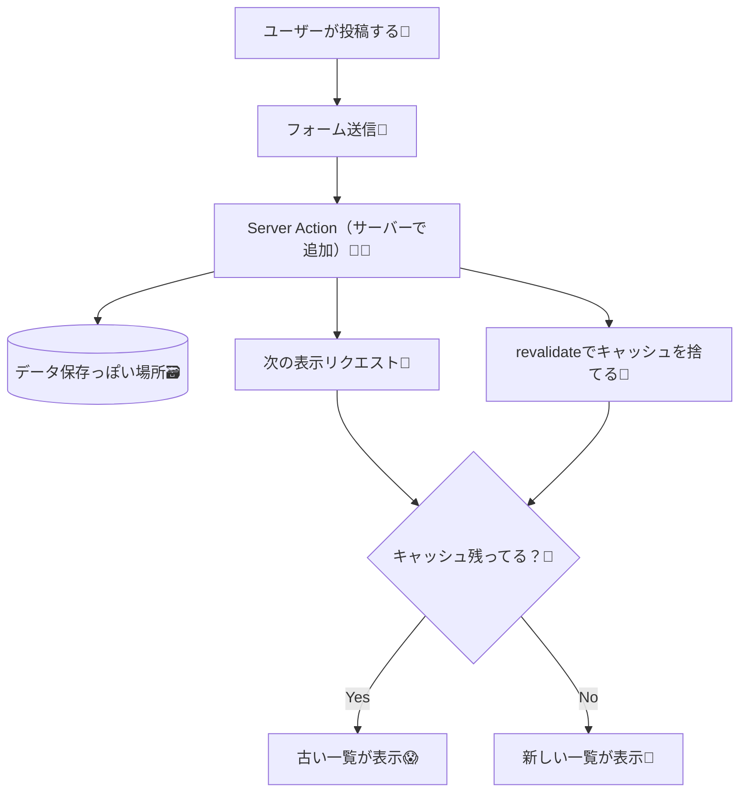

## 第248章：キャッシュで「更新されない😱」を卒業！`revalidatePath` / `revalidateTag` 入門🧊🔁✨

※アウトラインは全244章までだけど、リクエスト通り「第248章（追加の発展回）」として作るね📚💨

---

### この章のゴール🎯

* Server Actionsで投稿（追加）したあとに、**一覧がちゃんと最新になる**ようにできる😊✨
* 「なんで追加したのに画面が変わらないの…？😢」の理由がわかる🧠💡
* `revalidatePath()` と `revalidateTag()` の使い分けがざっくりできる👍

---

## 1) まず状況を図でイメージしよ🧊➡️😱➡️🔁

「Next.jsは賢いから、同じ結果をキャッシュして速くしてくれる⚡」
でも、そのせいで **“データを追加しても古いまま”** が起きることがあるよ〜！🥲



---

## 2) 今日つくるミニアプリ🌸

**「一言掲示板」**みたいなやつ📝✨

* 上に投稿フォーム
* 下に投稿一覧
* 追加したら、**一覧が即・最新になる**🎉

---

## 3) 実装：ファイルを3つ作るよ📁✨

> もし `src/` がある構成なら、`src/app/...` のように読み替えてね😊

### A. `lib/posts-store.ts`（超簡易“保存場所”）🗃️

※これは学習用の簡易ストアだよ（本番はDBにするのが普通）🫶

```ts
// lib/posts-store.ts
export type Post = {
  id: string;
  text: string;
  createdAt: number;
};

const store: Post[] = [
  { id: "p1", text: "はじめての投稿だよ〜🌸", createdAt: Date.now() },
];

export function listPosts(): Post[] {
  // 新しい順にして返す
  return [...store].sort((a, b) => b.createdAt - a.createdAt);
}

export function addPost(text: string) {
  const trimmed = text.trim();
  if (!trimmed) return;

  store.unshift({
    id: `p_${Math.random().toString(36).slice(2)}`,
    text: trimmed,
    createdAt: Date.now(),
  });
}
```

---

### B. `lib/posts-cached.ts`（キャッシュされる“取得”側🧊）

ここがポイント！✨
`unstable_cache` を使って、**投稿一覧をキャッシュ**してみるよ🧊
そしてあとで `revalidateTag("posts")` で壊す（無効化する）よ🔁

```ts
// lib/posts-cached.ts
import { unstable_cache } from "next/cache";
import { listPosts, type Post } from "./posts-store";

export const getPostsCached = unstable_cache(
  async (): Promise<Post[]> => {
    return listPosts();
  },
  ["posts-list-cache-key"],
  {
    tags: ["posts"], // ← このタグが超大事✨
  }
);
```

---

### C. `app/posts/actions.ts`（Server Actionで追加🧑‍🍳）

まずは **わざと** revalidate なしで書くよ（あとで直す）😈🧊

```ts
// app/posts/actions.ts
"use server";

import { addPost } from "@/lib/posts-store";

export async function addPostAction(formData: FormData) {
  const text = String(formData.get("text") ?? "");
  addPost(text);

  // 👇最初はわざと何もしない（キャッシュが残って更新されない問題を体験）
  // 追加はできてるのに、一覧が古いまま…になることがある😱
}
```

---

### D. `app/posts/page.tsx`（ページ本体）📄✨

```tsx
// app/posts/page.tsx
import { addPostAction } from "./actions";
import { getPostsCached } from "@/lib/posts-cached";

export default async function PostsPage() {
  const posts = await getPostsCached();

  return (
    <main style={{ maxWidth: 720, margin: "40px auto", padding: 16 }}>
      <h1 style={{ fontSize: 28, fontWeight: 700 }}>ひとこと掲示板📝✨</h1>

      <form action={addPostAction} style={{ marginTop: 16, display: "flex", gap: 8 }}>
        <input
          name="text"
          placeholder="ひとこと書いてね😊"
          style={{
            flex: 1,
            padding: "10px 12px",
            borderRadius: 10,
            border: "1px solid #ccc",
          }}
        />
        <button
          type="submit"
          style={{
            padding: "10px 14px",
            borderRadius: 10,
            border: "1px solid #ccc",
            background: "white",
            cursor: "pointer",
          }}
        >
          投稿する📨
        </button>
      </form>

      <section style={{ marginTop: 24 }}>
        <h2 style={{ fontSize: 18, fontWeight: 700 }}>投稿一覧📚</h2>

        <ul style={{ marginTop: 12, paddingLeft: 18 }}>
          {posts.map((p) => (
            <li key={p.id} style={{ marginBottom: 8 }}>
              {p.text}{" "}
              <small style={{ opacity: 0.6 }}>
                ({new Date(p.createdAt).toLocaleString()})
              </small>
            </li>
          ))}
        </ul>
      </section>
    </main>
  );
}
```

---

## 4) 「更新されない😱」をちゃんと体験するコツ🧪

開発（`npm run dev`）だと挙動が優しくて、問題が見えづらいことがあるよ〜🥺

なので一度これで確認してみてね👇（プロダクション寄りの動き）✨

```bash
npm run build
npm start
```

そして `http://localhost:3000/posts` を開いて投稿！📨
もし「追加したのに一覧が変わらない😱」が出たら成功！（今から直すよ！）

---

## 5) 解決！`revalidateTag` / `revalidatePath` を入れる🔁✨

### ✅おすすめ：まずはこの2つセットで覚えよ🫶

* `revalidateTag("posts")`：**データ側のキャッシュ（タグ）**を捨てる🧊✂️
* `revalidatePath("/posts")`：**そのページのキャッシュ**も捨てる🧊✂️

`app/posts/actions.ts` をこう変更👇

```ts
// app/posts/actions.ts
"use server";

import { addPost } from "@/lib/posts-store";
import { revalidatePath, revalidateTag } from "next/cache";

export async function addPostAction(formData: FormData) {
  const text = String(formData.get("text") ?? "");
  addPost(text);

  // ✅ データ取得のキャッシュ（tags: ["posts"]）を無効化
  revalidateTag("posts");

  // ✅ /posts ページ自体のキャッシュも無効化（保険✨）
  revalidatePath("/posts");
}
```

これで投稿後、次の表示で **最新の一覧**になりやすいよ🎉🎉🎉

---

## 6) 使い分けの超ざっくりルール🧠💡

* **`revalidateTag`**：
  「同じデータをいろんな場所で使ってる」時に強い💪✨（タグでまとめて更新）
* **`revalidatePath`**：
  「このページだけ更新したい」時に手っ取り早い🏃‍♀️💨

迷ったらこの章では **両方でOK**！😊🌸

---

## 7) よくあるハマり集😵‍💫🧯

* `revalidateTag()` を **ページの中（描画中）**に書いちゃう🙅‍♀️
  → **Server Actionの中**に書くのが基本だよ🧑‍🍳✨
* 「そもそもキャッシュされてない」場合🤔
  → devだと分かりにくいので、さっきの `npm run build` → `npm start` が効く👍
* この章のストアは**学習用**🧸
  → 本番はDB（Prisma等）にしようね🗃️✨（ここでは割愛！）

---

## 8) ミニ課題🎒✨（5分）

1. 投稿の横に「削除🗑️」ボタンをつけてみよ（Server Actionで削除）
2. 削除後に `revalidateTag("posts")` と `revalidatePath("/posts")` を呼んで、一覧が即反映されるか確認👀✨

---

### この章のまとめ🎀

* キャッシュのせいで「更新されない😱」が起きることがある
* Server Actionの最後に

  * `revalidateTag()`（データキャッシュ）
  * `revalidatePath()`（ページキャッシュ）
    を呼ぶと、最新表示に戻せる🔁✨

次は「一覧だけじゃなく、詳細ページやトップにも同じデータが出る」ケースで、`revalidateTag` がさらに気持ちよく効いてくるよ〜😆🌸
