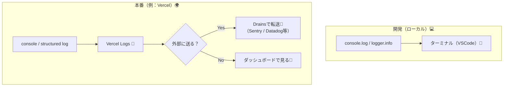
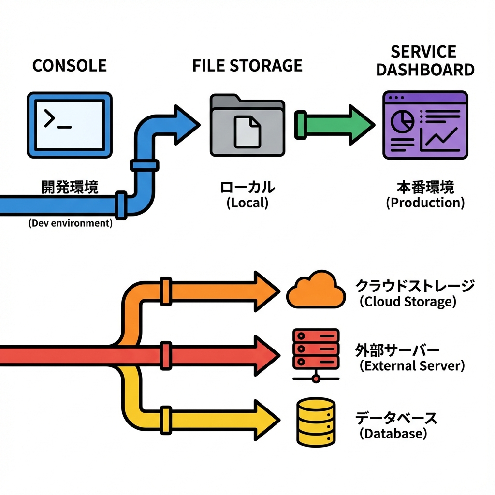
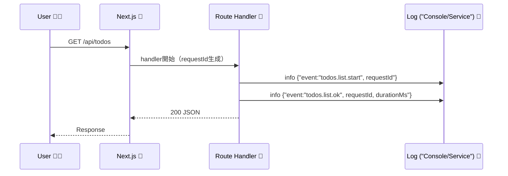

# 第249章：ログ設計：何をどこに出す？（Console/File/Service）📝

アプリが育ってくると、**「なんか遅い…😢」「たまに落ちる…😱」「本番だけ変…😵」**が必ず来ます。
そのとき助けてくれるのが **ログ（log）** だよ〜！🛟💕

---

## この章のゴール🎯🌸

* **何をログに出すべきか**がわかる🧠✨
* **どこに出すべきか（Console / File / Service）**を使い分けられる🔁
* Next.js（App Router）で使える **“ちょうどいいログ”の型**を作れる📦💕

---

## 1) まず結論：ログは「設計」が9割🥺✨

ログは「いっぱい出すほど良い」じゃなくて、
**“あとで自分が助かる形で、必要十分に出す”**のが正解だよ〜🙆‍♀️💡

### ログに出すと強いもの（おすすめ）💪✨

* ✅ **いつ**（timestamp）
* ✅ **どこで**（route / action / file）
* ✅ **なにが起きた**（event名）
* ✅ **結果**（success / failure）
* ✅ **どのユーザー/リクエストか**（requestId / userId ※注意あり）
* ✅ **どれくらいかかった**（durationMs）

### ログに出しちゃダメ寄り（危険）🚫🔐

* ❌ パスワード、トークン、Cookieそのまま🍪💥
* ❌ クレカ、住所、電話番号、メール等の生データ📮😱
* ❌ 個人情報が直接わかる文字列（必要ならマスク）🎭

---

## 2) 「どこに出す？」3択の考え方🧭✨

* **Console**：開発〜本番の基本（まずここ）🖥️
* **File**：自己ホスト/社内サーバー運用で強い📁
* **Service**：本番運用の最終形（検索・通知・可視化）🌍📈





Vercel には「Drains」でログやトレース等を外部へ流せる仕組みがあるよ〜🚰✨（プラン条件あり）([Vercel][1])

---

## 3) ログレベルのおすすめ（迷ったらこれ）🎚️✨

| レベル     | いつ使う？         | 例            |
| ------- | ------------- | ------------ |
| `debug` | 開発中の細かい確認🔍   | 変数・分岐の確認     |
| `info`  | 通常イベント✅       | 作成成功、ページ表示   |
| `warn`  | すぐ死なないけど怪しい⚠️ | リトライ発生、想定外入力 |
| `error` | 失敗・例外🔥       | API失敗、DB失敗   |

本番は **`info/warn/error`中心**、`debug` は必要なときだけ出すのがいい感じ🫶✨

---

## 4) Next.jsで「ログ設計」をやるときのポイント🧩✨

### A. “構造化ログ”に寄せる（検索しやすい）🔎✨

文字列だけじゃなくて、**オブジェクト（JSON）**で出すと後で超ラク！🥹💕

例：

* `event: "todo.create"`
* `requestId`
* `route`
* `durationMs`

### B. “同じリクエストのログ”をまとめられるようにする（requestId）🧵✨

「このリクエストの最初から最後まで追いたい」ってなるので、**requestId** があると勝ちます🏆✨



### C. fetchのログも“必要なら”ONにする（開発向け）🧊✨

Next.js は `next.config.js` の `logging.fetches.fullUrl` で、開発時の fetch ログをちょい強化できるよ（※ fetch周り中心）([Next.js][2])

---

## 5) 実装：まずは “logger.ts” を作ろう📦✨（Pinoで構造化）

ここは「最小で強い」形にするよ〜！💪💕

### 5-1. インストール📦

（PowerShellでもOK🙆‍♀️）

```bash
npm i pino
```

> ※今回はまずサーバー側中心（Route Handler / Server Actions）で使う想定だよ🧊✨
> クライアント側は “個人情報を送らない” を徹底して、必要最小にするのが安全🥺🔐

---

### 5-2. `lib/logger.ts` を作る🧸✨

プロジェクト直下に `lib/` を作って、`logger.ts` を作成してね✍️💕

```ts
// lib/logger.ts
import pino from "pino";

const isProd = process.env.NODE_ENV === "production";

export const logger = pino({
  level: isProd ? "info" : "debug",
  base: {
    app: "next-app",
  },
  redact: {
    // うっかり混ざりがちな秘密情報を隠す例だよ🔐
    paths: ["req.headers.authorization", "req.headers.cookie"],
    remove: true,
  },
});
```

ポイント🌸

* `level` を環境で切り替え🎚️
* `redact` で秘密っぽいものを隠す（最初から守る）🛡️✨

---

## 6) 使ってみる：Route Handlerでログ🚪🧾✨

例として `app/api/todos/route.ts` を作るよ📁✨

```ts
// app/api/todos/route.ts
import { logger } from "@/lib/logger";

type Todo = { id: string; title: string };

const todos: Todo[] = [
  { id: "1", title: "牛乳を買う🥛" },
  { id: "2", title: "レポート提出📄" },
];

export async function GET() {
  const requestId = crypto.randomUUID();
  const started = Date.now();

  logger.info({ event: "todos.list.start", requestId, route: "/api/todos" });

  try {
    // 例：ちょい待たせてみる⏳（デモ）
    await new Promise((r) => setTimeout(r, 150));

    const durationMs = Date.now() - started;
    logger.info({ event: "todos.list.ok", requestId, durationMs, count: todos.length });

    return Response.json({ requestId, todos });
  } catch (err) {
    const durationMs = Date.now() - started;
    logger.error({ event: "todos.list.fail", requestId, durationMs, err });

    return new Response("Internal Server Error", { status: 500 });
  }
}
```

こうすると、ログが **「イベント名」で追える**ようになるよ〜🔎✨
`requestId` がレスポンスにも入ってるから、ユーザーから「このIDのとき変でした🥺」って言われたら追跡しやすい👍💕

---

## 7) Fileに出すのはいつ？どうやる？📁✨（自己ホスト向け）

ローカルや自己ホストでは **ファイルログ**も便利だよ📁💕
でも、**サーバーレス（例：Vercel）**はディスクが永続じゃないことが多くて相性が微妙なこともあるよ🥺（その場合はService推奨）🌍✨

「自己ホストで `logs/app.log` に出したい」例：

```ts
// lib/logger.ts（ファイル出力もしたい場合の例）
import pino from "pino";
import path from "node:path";

const isProd = process.env.NODE_ENV === "production";

export const logger = pino(
  {
    level: isProd ? "info" : "debug",
    base: { app: "next-app" },
  },
  // 追記：ファイルに書く（自己ホスト向け）
  pino.destination({
    dest: path.join(process.cwd(), "logs", "app.log"),
    sync: false,
  })
);
```

> `logs` フォルダは先に作ってね📁✨
> さらに運用するなら **ローテーション（肥大化対策）**も考えると安心🧹

---

## 8) 本番はServiceへ（検索・通知・可視化）🧯📈✨

本番運用だと「ログを**検索**したい」「エラーを**通知**したい」「グラフで見たい」ってなるよね🥺💡
そのときは **ログ/エラー監視サービス**が強いよ〜！🌍✨

* Vercel は Drains で外部へ流せる🚰✨([Vercel][1])
* Sentry は Next.js向けガイドがあって、エラーやトレースの導入がしやすいよ🧯([docs.sentry.io][3])

---

## 9) ちいさい設計ルール（これだけ守ると強い）🧠🫶✨

### ✅ ルール1：イベント名を固定する📛

例：

* `todo.create.start`
* `todo.create.ok`
* `todo.create.fail`

### ✅ ルール2：ログの形をそろえる📦

毎回入れるフィールド例：

* `event`, `requestId`, `route`, `durationMs`

### ✅ ルール3：ユーザー識別は“直接”入れない（基本）🔐

必要なら **hash化**とか **内部IDだけ**にするのが安全🛡️✨

---

## 10) 練習ミニ課題✍️💕（10〜15分）

1. `app/api/todos/route.ts` に `POST` を追加して、
   　`event: "todo.create.*"` を `start/ok/fail` で3つ出してみよう➕🧾✨
2. `durationMs` を必ず入れる⏱️
3. 入力 `title` はそのまま全部出さず、`titleLength` だけログにする（安全）🔐✨

---

## まとめ🎉✨

* ログは **「何を」「どこへ」**を決めるだけで、未来の自分が救われる🛟💕
* Console → File → Service の順で、必要に応じて強化していけばOK🪜✨
* Next.jsでも **構造化ログ + requestId** が超おすすめ🧵🔎✨
* Vercel運用なら Drains、エラー追跡なら Sentry みたいなService連携が王道だよ〜🌍🚰🧯([Vercel][1])

次の章（第250章）は、いよいよ **Sentry等のエラー追跡の概念**に入っていくよ🧯✨
この章の `logger` があると、導入がめっちゃスムーズになるはず〜！😆💕

[1]: https://vercel.com/docs/drains?utm_source=chatgpt.com "Working with Drains"
[2]: https://nextjs.org/docs/app/api-reference/config/next-config-js/logging?utm_source=chatgpt.com "logging - next.config.js"
[3]: https://docs.sentry.io/platforms/javascript/guides/nextjs/?utm_source=chatgpt.com "Sentry for Next.js"
