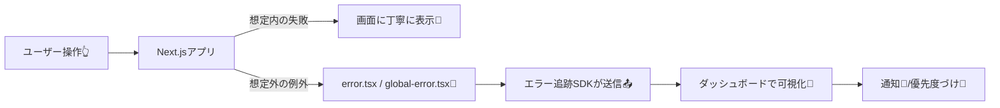
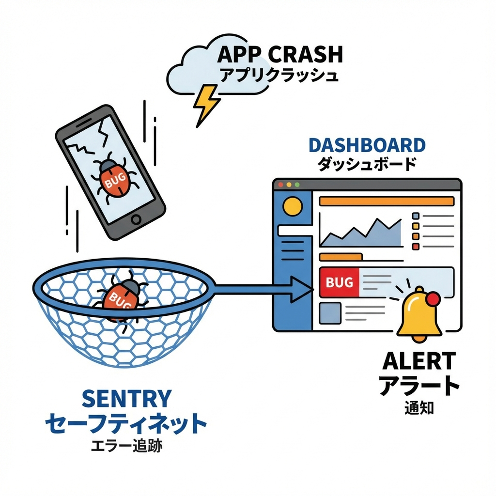

# 第250章：エラー追跡の導入（Sentry等の概念）🧯

本番で「え、昨日まで動いてたのに…😱」ってなるの、あるあるだよね…！
この章では **“エラーを見つけて、原因に近づく仕組み”＝エラー追跡** の考え方と、Next.jsでの超基本の入れ方をやさしくまとめるよ〜🫶

---

## 1) エラー追跡ってなに？🤔📌

ざっくり言うと…

* アプリで起きたエラーを **自動で集めて** 📥
* 同じ原因っぽいエラーを **まとめて** 🧺
* 「いつ / どの画面 / どの環境で」起きたかを **見える化** 👀
* 必要なら通知（Slack/メール）🔔

…してくれるサービスのことだよ✨（Sentry、Bugsnag、Rollbar…など）

---

## 2) console.log だけじゃダメなの？🥲🪵

`console.error` は開発中は便利なんだけど、本番だと…

* ユーザーのPCで起きたエラーは、基本こっちに届かない😢
* 「何回起きた？」「どの画面？」「どのOS？」が分かりにくい🌀
* 直ったのかどうか追いづらい🔁

だから **“本番の健康診断”** としてエラー追跡が強いの💪🩺

---

## 3) Next.jsのエラーは大きく2種類🧠🧯

Next.jsはエラーを **大きく2系統** に分けて考えるのが基本だよ〜！ ([Next.js][1])

* **想定内のエラー（expected errors）**
  例：フォームのバリデーション失敗、APIが404、権限がない…など
  → “エラー表示”として丁寧に返す（例外として投げない） ([Next.js][1])

* **想定外の例外（uncaught exceptions）**
  例：バグ、ぬるぽ、想定してないデータ…
  → `error.tsx`（エラーバウンダリ）で受け止める ([Next.js][1])

---

## 4) まず覚える：`error.tsx` は「落下防止ネット」🕸️🧯

Next.js（App Router）では、各ルート配下に `error.tsx` を置くと、その範囲のクラッシュを受け止めてくれるよ✨
しかもエラーバウンダリは **Client Component必須** だから、`'use client'` が必要！ ([Next.js][1])

さらに大事ポイント👇
**クリックなどのイベントハンドラ内のエラーは、エラーバウンダリが拾わない** よ！
（なので手動で `try/catch` して送ることがある） ([Next.js][1])

---

## 5) 仕組みの全体像（図でイメージ）🧁🖼️





---

## 6) 導入の流れ（例：Sentry）🚀🐾

ここからは **Sentryを例** にするね！（“Sentry等”なので、考え方は他サービスでも同じだよ🙆‍♀️）

### 6-1) まずは「自動セットアップ（Wizard）」が楽ちん🤖✨

Sentryは `wizard` コマンドで、必要ファイルや設定を自動生成してくれる流れが一般的だよ〜 ([Sentry Docs][2])

PowerShellでプロジェクト直下に移動して👇

```bash
npx @sentry/wizard@latest -i nextjs
```

実行すると、環境によってはこんなファイル（または近いもの）が増えるよ👇

* `sentry.client.config.ts` / `sentry.server.config.ts`（生成される構成がある） ([Zenn][3])
* `src/instrumentation.ts`（最近の流れで出やすい） ([Zenn][3])
* `app/global-error.tsx` など（エラーUI側の導線） ([Zenn][3])

※Sentry SDK v8以降は **instrumentation hook** を使う方向が強くなってる、という移行情報もあるよ ([Zenn][4])
（ここは「Wizardがいい感じにやってくれる」って覚え方でOK🙆‍♀️）

---

### 6-2) 環境変数（DSN）を入れる🔐🧾

`.env.local` に入れることが多いよ（Wizardが案内してくれることもある）

```env
NEXT_PUBLIC_SENTRY_DSN="あなたのDSN"
```

環境（local / preview / production）を分けておくと、あとで超助かるよ〜！ ([Zenn][3])

---

## 7) Next.jsの「エラー画面」でSentryへ送る（超重要）📨🧯

### 7-1) `app/global-error.tsx` で “最後の砦” を作る🏰

Next.jsの `global-error.tsx` は、ルートのエラーを扱える特別ファイルだよ。
**`<html>` と `<body>` が必要**なのも特徴！ ([Next.js][1])

例（Sentryに送る版）👇

```tsx
'use client'

import { useEffect } from 'react'
import * as Sentry from '@sentry/nextjs'

export default function GlobalError({
  error,
  reset,
}: {
  error: Error & { digest?: string }
  reset: () => void
}) {
  useEffect(() => {
    // ✅ ここでエラー追跡へ送る
    Sentry.captureException(error)
  }, [error])

  return (
    <html>
      <body style={{ padding: 24, fontFamily: 'system-ui' }}>
        <h2>ごめんね、エラーが起きちゃったみたい…🥺🧯</h2>
        <p>時間をおいてもう一回試してみてね🙏</p>
        <button onClick={() => reset()} style={{ padding: 10 }}>
          もう一回やる🔁
        </button>
      </body>
    </html>
  )
}
```

※`error.tsx`（ルート配下ごとのエラー）でも同じ発想でOK！
Next.jsの例でも「useEffectでログ送信しよう」って書かれてるよ ([Next.js][1])

---

### 7-2) クリックイベントのエラーは “自分で捕まえる” 🫳💥

さっき言った通り、イベント内の例外はエラーバウンダリが拾わないことがあるよ ([Next.js][1])
だからこうする👇

```tsx
'use client'

import * as Sentry from '@sentry/nextjs'

export function BoomButton() {
  return (
    <button
      onClick={() => {
        try {
          throw new Error('わざとエラー💥')
        } catch (e) {
          Sentry.captureException(e)
        }
      }}
      style={{ padding: 10 }}
    >
      わざとエラー投げる💥
    </button>
  )
}
```

---

## 8) “まずここだけ” 運用のコツ3つ🧠✨

### ✅ コツ1：環境（local / preview / production）を分ける🌱🌿🌳

本番だけ通知したい！ができるから便利だよ〜 ([Zenn][3])

### ✅ コツ2：パフォーマンス計測の割合（`tracesSampleRate`）は最初は控えめに📉

設定例によっては `tracesSampleRate: 1.0`（100%送信）になってることがあって、上限に当たりやすい注意があるよ ([note（ノート）][5])
最初は 0.1 とか、必要になったら上げる…でもOK🙆‍♀️

### ✅ コツ3：「直したのにまた出た」を防ぐために、再現条件メモ📝

Sentry等の画面で「いつ・どこで・何回」を見ながら
再現条件（URL、操作、ログイン有無）をメモすると爆速で直せるよ🏃‍♀️💨

---

## 9) ミニ課題（15〜30分）🎒✨

### 🎯 ゴール：本番っぽく “エラーが飛んだのを確認” する

1. Wizardで導入する（Sentry例：`npx @sentry/wizard@latest -i nextjs`） ([note（ノート）][5])
2. `.env.local` にDSNを入れる
3. `app/global-error.tsx` に `Sentry.captureException(error)` を追加
4. わざとエラーを起こす（例：`throw new Error(...)`）
5. Sentry等のダッシュボードの **Issues** に出たら勝ち🎉🥳

---

次の章（第251章）は「バンドルサイズ計測」📦📈だから、
この章で “運用の目” を入れておくと、アプリが一気にプロっぽくなるよ〜😆✨

[1]: https://nextjs.org/docs/app/getting-started/error-handling "Getting Started: Error Handling | Next.js"
[2]: https://docs.sentry.io/platforms/javascript/guides/nextjs/?utm_source=chatgpt.com "Sentry for Next.js"
[3]: https://zenn.dev/keitakn/articles/add-sentry-to-nextjs-vercel?utm_source=chatgpt.com "Next.js + VercelとSentryを連携させる"
[4]: https://zenn.dev/spacemarket/articles/sentry-migration-v8?utm_source=chatgpt.com "Next.jsのプロジェクトでSentryを7.xから8.xにアップデートする"
[5]: https://note.com/tabelog_frontend/n/n7f6822ae0c0d?utm_source=chatgpt.com "Next.jsにSentryを導入した際の課題と解決策について"
