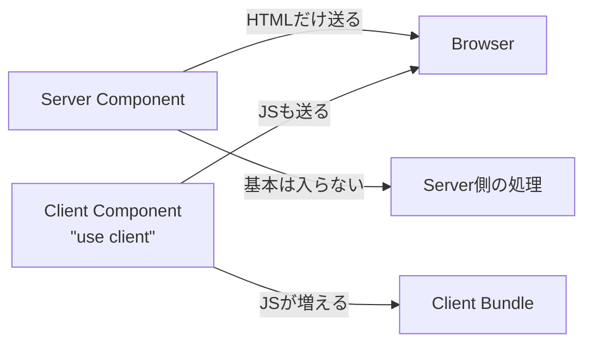
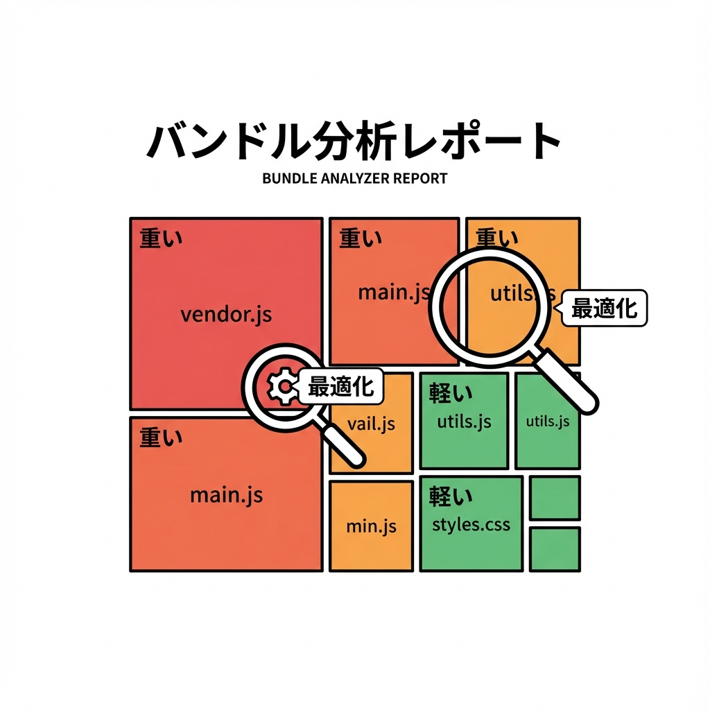

# 第251章：バンドルサイズなどパフォーマンス計測の基礎（@next/bundle-analyzer）📈

この章は「**重い原因を当てずっぽうで直さない**」がテーマだよ〜！😊
まず **計測 → 犯人特定 → 直す → もう一回計測** の流れを作っちゃおう💪✨
（バンドルが小さいほど、読み込みが速くなって体感も良くなるよ🌸） ([Next.js][1])

---

## 1) そもそも「バンドル」ってなに？📦

Next.jsは、あなたのアプリを **ブラウザ用（client）** と **サーバー用（server）** にいい感じにまとめて（＝バンドルして）最適化してくれるよ✨
ただし、依存ライブラリの使い方次第で **急にドカンと重く** なることがあるの😇 ([Next.js][1])

イメージはこんな感じ👇



* **Client Component** に重いライブラリがいると、ブラウザにJSがたくさん届いちゃう🥲
* 逆に **Server Componentでできる処理** をサーバー側に寄せると、クライアントが軽くなることが多いよ🌟 ([Next.js][1])

---

## 2) @next/bundle-analyzer を入れる🧰✨

### Step A：インストール（dev依存でOK）📦

VSCodeのターミナルでこれ👇

```bash
npm i -D @next/bundle-analyzer
```

Next.js公式ガイドでも、このプラグイン方式が紹介されてるよ✅ ([Next.js][1])

---

### Step B：next.config に設定を書く📝

プロジェクト直下に `next.config.js`（または既存のファイル）を用意して、こんな感じ👇

```js
const withBundleAnalyzer = require("@next/bundle-analyzer")({
  enabled: process.env.ANALYZE === "true",
})

/** @type {import('next').NextConfig} */
const nextConfig = {
  // いつものNext.js設定があればここに書くよ
}

module.exports = withBundleAnalyzer(nextConfig)
```

この形が公式の基本形だよ〜！ ([Next.js][1])

---

## 3) 計測してレポートを開く🔍🧠

### いちばん大事：ANALYZE=true で build する✨

公式の例はこう👇（ただしWindowsは書き方がちょい違うの注意！） ([Next.js][1])

#### ✅ Windows（コマンドプロンプト cmd）

```bat
set ANALYZE=true && npm run build
```

#### ✅ Windows（PowerShell）

```powershell
$env:ANALYZE="true"; npm run build
```

#### ✅ いちばんラク（Windowsでも事故りにくい）：cross-env を使う💖

Windowsの環境変数がややこしい問題を避けられるよ〜！✨ ([Zenn][2])

1. cross-env 入れる

```bash
npm i -D cross-env
```

2. `package.json` にスクリプト追加

```json
{
  "scripts": {
    "dev": "next dev",
    "build": "next build",
    "start": "next start",
    "analyze": "cross-env ANALYZE=true next build"
  }
}
```

3. 実行！

```bash
npm run analyze
```

---

### レポートってどうなるの？👀

ビルド後、**ブラウザでレポートが複数タブ開く**（だいたい3つ）よ📊✨
（ポップアップブロックしてると開かないことがあるから、その時は許可してね🙆‍♀️） ([Next.js][1])

---

## 4) レポートの見方（ここがコツ！）🧩🔍

見る順番はこれがオススメ👇

1. **まず「client」っぽいレポートを見る**（体感に直結しやすいから）🧠💨
2. **四角がデカい＝重い** だよ📦
3. デカい四角をクリックして、**どのパッケージが太ってるか**探す👮‍♀️🔎

「犯人っぽい名前」あるある👇（見つけたらニヤッとしよう😼）

* アイコン系（大量export）
* チャート/グラフ系
* Markdown/ハイライト系
* WYSIWYGエディタ系



---

## 5) “重い原因”の定番パターンと対処🎯✨

### パターンA：重い処理を Client Component でやってる😵‍💫

たとえば「ハイライト」「Markdown変換」「データ加工」みたいな“見た目のための重処理”がクライアントに乗ると、JSが増えがち🥲
ブラウザAPIが不要なら **Server Component に寄せる**のが効くことがあるよ🌿 ([Next.js][1])

### パターンB：大量export系ライブラリ（特にアイコン）🧱

「めっちゃ便利だけど、全部入りが読み込まれてた」みたいなやつ💦
Next.jsには **`optimizePackageImports`** で“必要分だけ”に寄せる考え方があるよ✅ ([Next.js][1])

### パターンC：その画面でしか使わないのに、最初から読み込んでる📦➡️📱

* そのページでしか使わない重いUIは **動的import（必要な時だけロード）** が効くこと多いよ✨
  （例：チャート、モーダル、リッチエディタ）

---

## 6) ミニ練習：改善の「型」を体に入れる💃✨

### ゴール🎯

「改善して軽くなった！」を **数値で確認**する✅

1. いまの状態で `npm run analyze` してスクショ📸
2. レポートで **一番デカい四角のライブラリ名**をメモ📝
3. 次のどれかを1個やる👇

   * そのライブラリを **Client → Server** に寄せられないか検討
   * “その画面だけ”なら **動的import** にしてみる
   * アイコン系なら `optimizePackageImports` を検討
4. もう一回 `npm run analyze` して、**四角が小さくなったか**比べる📉✨

---

## おまけ：2025っぽい最新の計測もチラ見👀（超さらっと）

Next.js v16.1以降は、Turbopackの **実験的Bundle Analyzer** もあるよ！
コマンドはこれ👇（より「どこからimportされてるか」追いやすい方向） ([Next.js][1])

```bash
npx next experimental-analyze
```

---

次の章（第252章）で、こういう計測を **CI/CDで自動化**して「重くなったら気づける」ようにしていくよ🤖💖

[1]: https://nextjs.org/docs/app/guides/package-bundling "Guides: Package Bundling | Next.js"
[2]: https://zenn.dev/maiamitorio/articles/2f3b4adc5d79c2?utm_source=chatgpt.com "Next.jsでBundle analyzerを使う方法 (windowsの人)"
