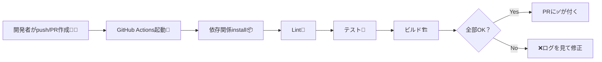
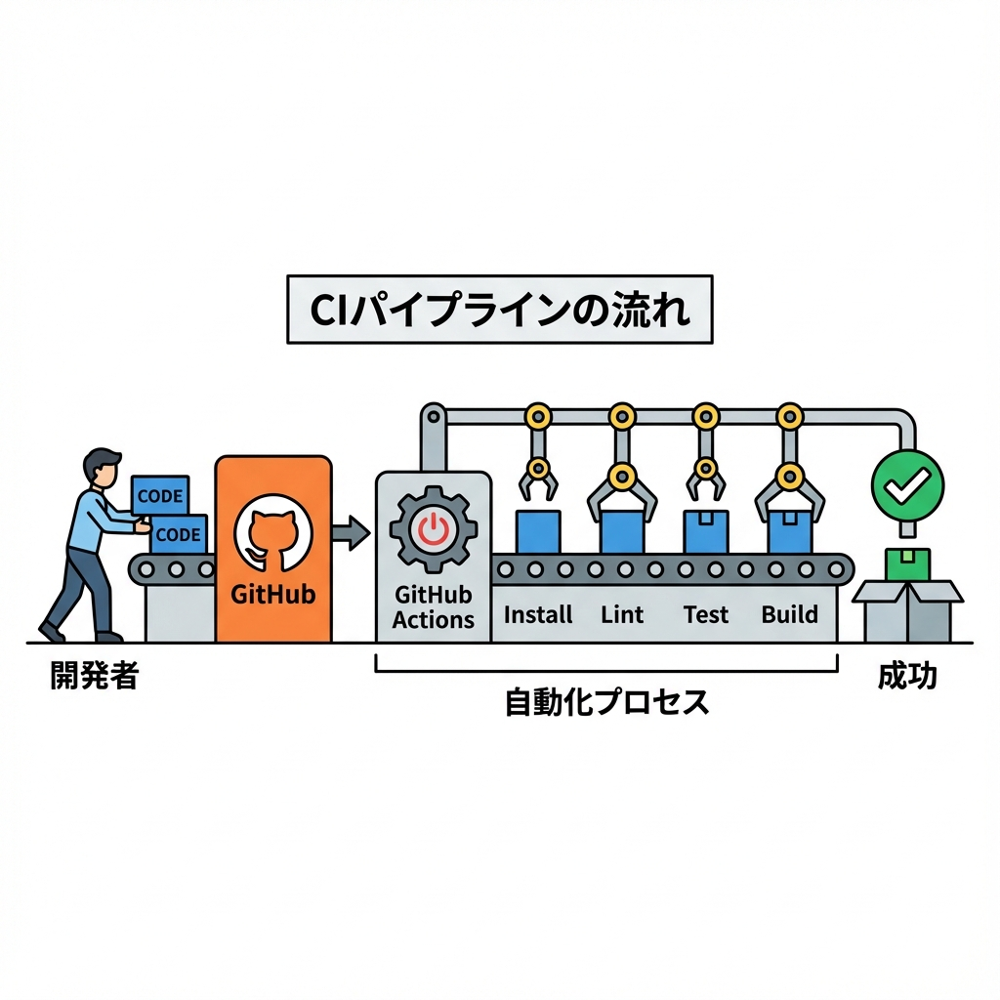

# 第252章：CI/CDパイプラインの役割（GitHub Actions等）🤖

### 今日のゴール🎯

この章が終わると…

* CI / CD が「何のためにあるのか」がスッキリわかる✨
* Next.jsプロジェクトに**最小のCI（自動チェック）**を入れられる✅
* 「デプロイ（CD）はどう考える？」の基本もつかめる🚀

---

## 1) CI/CDって結局なに？🍙

**CI（継続的インテグレーション）**：コードをGitHubに上げたら、**自動でチェック（lint / テスト / ビルド）**して壊れてないか確認する仕組み✅
**CD（継続的デリバリー/デプロイ）**：チェックを通ったら、**本番や検証環境に出すところまで**を自動化する考え方🚀

GitHub Actions は、このCI/CDを自動化できる仕組みだよ〜🤖✨ ([GitHub Docs][1])
「CD」って言っても **“自動で本番に出す”**（Deployment）までやる場合と、**“出せる状態にする”**（Delivery）までの場合があるよ〜🧠 ([GitHub][2])

---

## 2) なんで必要なの？（3つだけ覚えよ）🫶

1. **壊れたまま main に入るのを防ぐ**🛡️
2. **“私のPCでは動くのに…”問題を減らす**😇
3. **チームでも1人開発でも安心して進められる**（未来の自分が助かる）💖

---

## 3) GitHub Actionsの基本パーツ🧩

* **Workflow（ワークフロー）**：自動化のレシピ全体🍳（例：CI）
* **Job（ジョブ）**：並列/順番で動くまとまり🧱（例：build job）
* **Step（ステップ）**：1個ずつの作業🧹（例：npm ci）

---

## 4) Next.jsで「最低限やるCI」セット✅✨

Next.js（2025の最新想定）だと、まずはこれが鉄板💪

* 依存関係を入れる：`npm ci` 📦
* Lint：`npm run lint` 🧹
* テスト：`npm test`（あるなら）🧪
* ビルド：`npm run build` 🏗️

あと大事なのが **Node.jsのバージョン**！
Next.jsは最低 Node.js **20.9以上**が必要だよ🧠 ([Next.js][3])

---

## 5) 図でつかむ：PRが出たときの流れ🧠➡️✅





---

## 6) ハンズオン：CIを1本入れてみよう（Windows）🛠️💖

### 手順①：ファイルを作る📁

プロジェクト直下にこれを作るよ👇
`.github/workflows/ci.yml`

### 手順②：中身をコピペ（最小CI）✂️✨

```yaml
name: CI

on:
  pull_request:
  push:
    branches: [main]

concurrency:
  group: ci-${{ github.ref }}
  cancel-in-progress: true

jobs:
  test:
    runs-on: ubuntu-latest

    steps:
      - name: Checkout
        uses: actions/checkout@v4

      - name: Setup Node.js
        uses: actions/setup-node@v4
        with:
          node-version: "20"
          cache: "npm"

      - name: Install dependencies
        run: npm ci

      - name: Lint
        run: npm run lint

      - name: Test (if present)
        run: npm test --if-present

      - name: Build
        run: npm run build
```

### 手順③：コミットしてpushする🧡

PowerShellの例だよ👇

```bash
git add .github/workflows/ci.yml
git commit -m "Add CI workflow"
git push
```

すると、GitHubの **Actionsタブ**で動いて、PRにも✅/❌が付くよ〜！🎉

---

## 7) 超重要：lintコマンド事情（2025）⚠️🧹

最近のNext.jsでは、`next lint` が整理されていて、

* Next.js 15.5 で `next lint` は非推奨になり、**eslint/biome を直接呼ぶ方針**に移行🏃‍♀️ ([Next.js][4])
* Next.js 16 では `next lint` が削除されて、**eslint/biome を直接使う**のが前提になったよ🧠 ([Next.js][5])

だからCIは **`npm run lint`** にしておくのが安全🙆‍♀️（中身が eslint でも biome でもOK）

---

## 8) 失敗したときの見方👀🔍

Actionsで❌になったら、まずここだけ見ればOK！

* **どのStepで落ちた？**（Lint / Test / Build）
* **エラーメッセージの最初の1〜3行**（原因が出やすい）
* **ローカルで同じコマンドを実行**して再現する

  * `npm run lint`
  * `npm run build`

---

## 9) CD（デプロイ）はどうする？2つの考え方🚀✨

### ① いちばんラク：VercelのGit連携に任せる🌈

GitHubに繋ぐだけで

* PRごとに **Preview URL** が自動でできる
* main にマージしたら **本番へ自動反映**
  みたいな体験ができるよ📦🚀 ([Vercel][6])

この場合のおすすめは👇

* **GitHub Actions：CI（テスト・ビルドの品質チェック）**
* **Vercel：デプロイ担当**
  って分けるやり方🫶

### ② Actionsでデプロイまでやる（ちょい上級）🤖🔥

「本番デプロイもActionsで管理したい」なら
Secrets（トークン）を使ってデプロイする形になるよ🔐
※Secretsの扱いはめちゃ大事（漏れたら事故😱）

---

## 10) ミニ課題🎓✨（できたら強い）

1. `npm run typecheck` を追加してみよ🧠（TSなら超安心）
2. main ブランチに「CIが通らないとマージできない」ルールを付けてみよ🛡️
   （GitHubのBranch protectionで設定できるよ〜）

---

## まとめ💐

* **CI**は「壊してないか自動で確認する保険」🛡️
* **CD**は「出すところまでを仕組み化する」🚀
* Next.jsはまず **Install → Lint → Test → Build** のCIでOK✅
* 2025環境では **Node 20.9+** を意識してね✨ ([Next.js][3])

次章（第253章）で「Vercel以外のデプロイ（Docker/Self-hosting）」に入ると、ここで作ったCIがさらに効いてくるよ〜！🐳💪

[1]: https://docs.github.com/articles/getting-started-with-github-actions?utm_source=chatgpt.com "Understanding GitHub Actions"
[2]: https://github.com/resources/articles/ci-cd?utm_source=chatgpt.com "What is CI/CD?"
[3]: https://nextjs.org/docs/app/getting-started/installation?utm_source=chatgpt.com "Getting Started: Installation"
[4]: https://nextjs.org/blog/next-15-5 "Next.js 15.5 | Next.js"
[5]: https://nextjs.org/blog/next-16 "Next.js 16 | Next.js"
[6]: https://vercel.com/docs/git/vercel-for-github?utm_source=chatgpt.com "Deploying GitHub Projects with Vercel"
