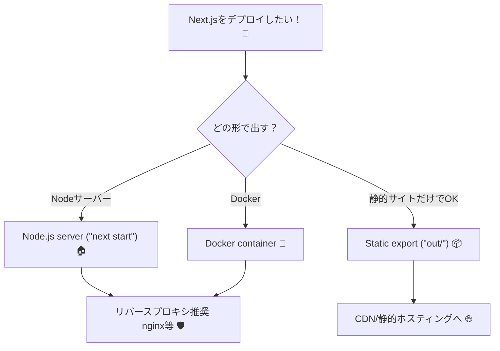
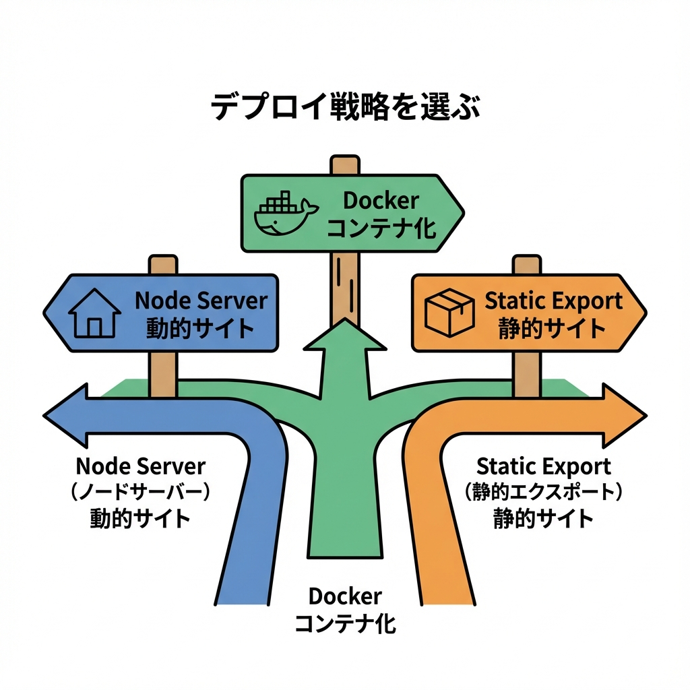
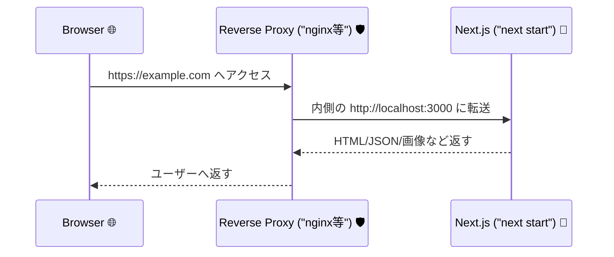

# 第253章：Vercel以外のデプロイ（Docker/Self-hosting 概念）🐳

この章では「Vercelじゃない場所に Next.js を置くとき、何をどう考えればいいか」を、ふわっと全体像 → 具体例（Node / Docker）でつかみます😊💡
Next.jsは **Nodeサーバー / Docker / 静的書き出し / プラットフォーム別アダプタ** みたいに複数の出し方があります。([Next.js][1])

---

## 今日のゴール🎯✨

* 「Vercel以外」って言われたときに、選択肢がパッと出る🧠💡
* **Nodeサーバーで動かす** と **Dockerで動かす** の違いがわかる🐳🏠
* 最低限の“本番の形”（ビルド→起動、環境変数、リバースプロキシ）を説明できるようになる🗣️✨

---

## まず全体像：Vercel以外の3ルート🛣️✨



* **Nodeサーバー（next start）**：いちばん素直。機能もフルで使える🍵([Next.js][2])
* **Docker**：環境ごと固めて運べる。複数台・移設・再現性に強い🐳([Next.js][3])
* **Static export**：HTML/JS/CSSとして書き出して置く。だけど使える機能が限定されることがある📦([Next.js][1])



---

## 1) Nodeサーバーで動かす（Self-hostingの基本）🏠✨

### ざっくり流れ🌸

1. 本番用ビルド（`next build`）
2. 本番サーバー起動（`next start`）
3. （推奨）リバースプロキシの後ろで運用（nginx等）🛡️([Next.js][4])

Next.js公式も「自前で出すなら、Nextサーバーを直接インターネットに晒すより、リバースプロキシ推奨だよ〜」っていう方向です🛡️✨([Next.js][4])

### ローカルで“本番モード”を試す（超だいじ）✅

開発用 `npm run dev` と、本番用 `npm run start` は別物なので、本番モード起動を一回はやっておくと安心だよ〜😊

```bash
npm run build
npm run start
```

※ `start` は `next start` を呼びます（これが本番サーバー）([Next.js][2])

---

## 2) リバースプロキシってなに？🛡️（超ざっくりでOK）

### イメージ図🧠✨



リバースプロキシがいると嬉しいこと（ふんわり）😊

* 変なリクエストや遅い攻撃を“門番”がさばく🛡️
* HTTPS（証明書）や圧縮などをまとめて担当できる🔒
* Next.jsは「描画」に集中できる🧠✨([Next.js][4])

---

## 3) 環境変数（本番で絶対つかうやつ）🔐✨

* `.env.local` はローカル用（基本Gitに入れない）
* 本番は **ホスティング側の環境変数設定** に入れるのが定番🔐
* ブラウザ側に渡してOKな変数だけ `NEXT_PUBLIC_` を付けるよ〜🌸([Next.js][5])

---

## 4) Dockerで動かす（“箱に入れて運ぶ”）🐳📦✨

Dockerのいいところは「このアプリはこの環境で動きます！」って丸ごと運べること🐳✨
Next.jsはDockerでもフル機能対応だよ〜([Next.js][3])

### Dockerは“開発中”より“本番用”が向いてる（特にWindows）🪟💡

公式でも「ローカル開発は普通に `npm run dev` が速いよ、Dockerは本番や本番相当テストに使うのがおすすめ」って話が出ています🐳💭([Next.js][6])

---

## 5) Dockerの定番：`output: "standalone"` で軽くする🪶✨

Next.jsはビルド時に「本番に必要なファイルだけ」を集めてくれるモードがあります。
`.next/standalone` が作られて、Dockerイメージが軽くなりやすいです📦✨([Next.js][7])

`next.config.js`（または `next.config.mjs`）にこれ：

```js
/** @type {import('next').NextConfig} */
const nextConfig = {
  output: "standalone",
};

export default nextConfig;
```

⚠️注意：`next/image` を本番で最適化するなら **sharp推奨**、standaloneなら **sharp必須** っていう注意があるよ〜（エラー回避！）📸🧯([Next.js][8])

---

## 6) 例：Next.js（standalone）用 Dockerfile（王道）🐳✨

※これは「概念＋動く形」を掴む用のサンプルだよ😊
（細かい最適化は現場でやればOK！）

```dockerfile
# ---------- 1) deps ----------
FROM node:20-bookworm-slim AS deps
WORKDIR /app

COPY package.json package-lock.json ./
RUN npm ci

# ---------- 2) builder ----------
FROM node:20-bookworm-slim AS builder
WORKDIR /app

COPY --from=deps /app/node_modules ./node_modules
COPY . .

# 本番ビルド（standalone出力）
RUN npm run build

# ---------- 3) runner ----------
FROM node:20-bookworm-slim AS runner
WORKDIR /app
ENV NODE_ENV=production

# standalone成果物をコピー
COPY --from=builder /app/.next/standalone ./
COPY --from=builder /app/.next/static ./.next/static
COPY --from=builder /app/public ./public

# server.js がエントリになる（standaloneの特徴）
EXPOSE 3000
CMD ["node", "server.js"]
```

ビルド＆起動はこれ👇

```bash
docker build -t my-next-app .
docker run -p 3000:3000 my-next-app
```

Next.js公式も「Dockerで build → run できるよ」って流れを案内しています🐳🚀([Next.js][3])

---

## 7) Dockerで“キャッシュ/ISR”ってどうなるの？🧊🔁

ここ、地味に大事ポイント！✨
Next.jsのキャッシュやISRの“共有キャッシュ”は、デフォルトだと **サーバーのディスク** に保存されます。自前運用（NodeでもDockerでも）だと、まずはそれで動きます🧊([Next.js][4])

でも…

* コンテナを複数台に増やす（水平スケール）
* すぐコンテナが入れ替わる（揮発的）

みたいな運用になると「キャッシュ置き場どうする？」が課題になりがち。
Next.jsはキャッシュ置き場や共有を調整できる仕組みも用意されています🧠🧊([Next.js][9])

---

## 8) よくある落とし穴🪤（先に知ると勝ち！）

* `npm run dev` のまま本番に出しちゃう（開発用サーバーです😵‍💫）
  → 本番は `npm run build` → `npm run start` が基本🍵([Next.js][2])
* リバースプロキシ無しで直公開しちゃう
  → 門番（nginx等）推奨🛡️([Next.js][4])
* standaloneで `sharp` 入れてなくて画像でコケる📸🧯
  → standaloneは `sharp` 必須！([Next.js][8])
* “カスタムサーバー”にすぐ逃げたくなる
  → だいたい `next start` で足りるし、カスタムサーバーは最終手段。しかも standalone と併用できないよ〜⚠️([Next.js][10])

---

## ミニ演習🎒✨（やったら一気に理解進むよ！）

### 演習A：ローカルで本番モード起動してみる🧪

1. ビルド

```bash
npm run build
```

2. 起動

```bash
npm run start
```

3. いつもの `localhost:3000` を開いて、表示できたらOK🎉

### 演習B：Dockerで“本番と同じ形”を作る🐳

1. `output: "standalone"` を入れる([Next.js][7])
2. Dockerfileを置く
3. `docker build` → `docker run` で起動できたらクリア🎉

---

## まとめ🎀✨

* Vercel以外のデプロイは、まず **Node / Docker / Static export** のどれかに分けて考えると迷子にならないよ🧭([Next.js][1])
* 自前運用は **リバースプロキシ推奨**（Next.jsを守る門番🛡️）([Next.js][4])
* Dockerは **standalone** を使うと軽く作りやすい📦✨([Next.js][7])
* standaloneで `next/image` 使うなら **sharp必須**📸🧯([Next.js][8])

---

次の章（第254章）は「運用中の“困った”をどう直す？」のトラブルシューティング💡なので、今回の“出し方”が頭に入ってると超スムーズだよ〜😊✨

[1]: https://nextjs.org/docs/app/getting-started/deploying?utm_source=chatgpt.com "Getting Started: Deploying"
[2]: https://nextjs.org/docs/pages/getting-started/deploying?utm_source=chatgpt.com "Getting Started: Deploying"
[3]: https://nextjs.org/docs/14/app/building-your-application/deploying?utm_source=chatgpt.com "Building Your Application: Deploying"
[4]: https://nextjs.org/docs/app/guides/self-hosting?utm_source=chatgpt.com "Guides: Self-Hosting"
[5]: https://nextjs.org/docs/pages/guides/environment-variables?utm_source=chatgpt.com "Guides: Environment Variables"
[6]: https://nextjs.org/docs/app/guides/local-development?utm_source=chatgpt.com "How to optimize your local development environment"
[7]: https://nextjs.org/docs/13/app/api-reference/next-config-js/output?utm_source=chatgpt.com "next.config.js Options: output"
[8]: https://nextjs.org/docs/messages/sharp-missing-in-production?utm_source=chatgpt.com "Sharp Missing In Production"
[9]: https://nextjs.org/docs/app/api-reference/config/next-config-js/incrementalCacheHandlerPath?utm_source=chatgpt.com "next.config.js: cacheHandler"
[10]: https://nextjs.org/docs/app/guides/custom-server?utm_source=chatgpt.com "Guides: Custom Server"
