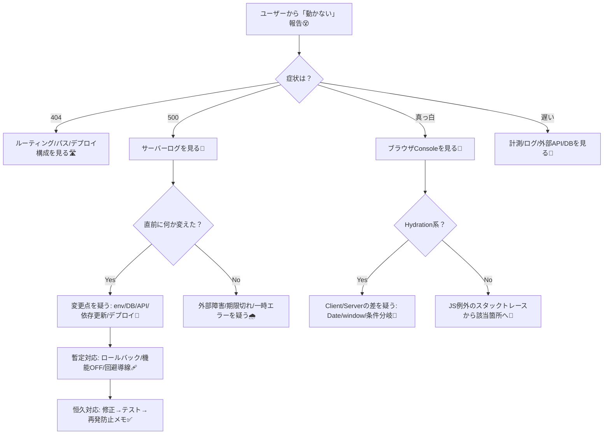
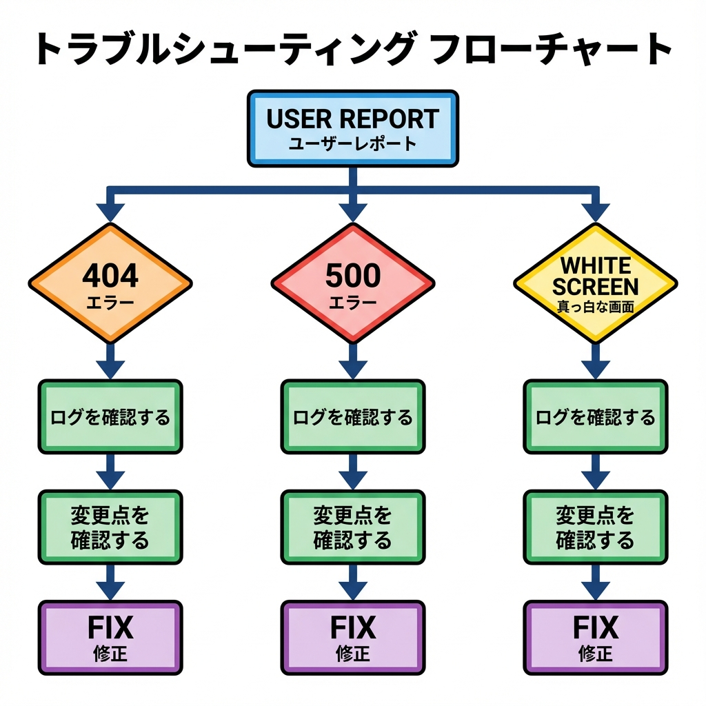

# 第254章：運用中の「困った」に対処するトラブルシューティング💡

運用ってね、「バグをゼロにする」より **“困ったときに早く落ち着ける”** のが大事だよ〜🙂✨
この章は **トラブルが起きたときの動き方（型）** を作る回だよ！🛠️💕

---

## 1) 今日のゴール🎯✨

* 何か起きても **パニックにならずに** 進める手順を持つ🧘‍♀️🌿
* 「どこを見る？」「何を切り分ける？」が **秒で判断**できるようになる⏱️👀
* **暫定対応 → 恒久対応** の流れがわかる🔁🏗️

---

## 2) トラブル対応の“型”🧩（これだけ覚えて！）

トラブルはだいたいこの順で勝てるよ💪✨

1. **影響範囲の確認**（どのページ？全ユーザー？一部？）🌍👥
2. **症状の分類**（404？500？真っ白？遅い？）🧠
3. **ログを見る**（サーバーログ + ブラウザログ）📝👀
4. **直近の変更を見る**（デプロイ、環境変数、DB、外部API）🧾🔎
5. **切り分ける**（原因候補を半分にしていく）✂️
6. **暫定対応**（止血：戻す/無効化/逃がす）🩹
7. **恒久対応**（修正＋テスト＋再発防止）🧱✅

---

## 3) まず見るべき場所リスト🗺️👀

### サーバー側（重要💥）

* **デプロイ先のログ**（本番ログ）📝
* **API / Server Actions のエラー**🧯
* **DB接続エラー**🔌
* **環境変数が入ってるか**🔐

### ブラウザ側（ユーザー視点）

* DevTools の **Console**（エラー文）🧨
* **Network**（APIが 500/401/404 になってない？）📡
* **真っ白**ならまず Console を見る👀⚡

---

## 4) 切り分けフローチャート（困ったらこれ）🧭🧯





---

## 5) よくあるトラブル10連発🔥（症状→チェック→対処）

### ① 本番だけ 500 になる🧯

**チェック✅**

* ログに「環境変数がない」系が出てない？🔐
* DB接続エラー（タイムアウト/接続数上限）出てない？🔌
* 外部APIが落ちてない？📡

**ありがち原因💥**

* `.env.local` はローカルだけ、本番に入れてない
* `NEXT_PUBLIC_` 付け忘れ（クライアントで読む系）
* DBの接続数が足りない/URL間違い

**対処🛠️**

* 本番の環境変数設定を見直す
* 外部APIは失敗しても落ちないように `try/catch` で守る🛡️

---

### ② 404が増えた（ページが見つからない）🚪

**チェック✅**

* そのページ、`app/xxx/page.tsx` ある？📁
* URLを変えた？（リンク先が古い）🔗
* Route Group `(group)` の理解違いない？📦

**対処🛠️**

* リンク先を総点検（特にヘッダー/フッター）👀
* `not-found.tsx` に案内を入れてユーザー救出🧭🫶

---

### ③ 画面が真っ白😨（でもサーバーは生きてる）

**チェック✅**

* ブラウザ Console に赤いエラー出てない？🟥
* “Hydration failed” 系？🧊
* `window` や `document` を Server 側で触ってない？🌐

**対処🛠️**

* ブラウザAPI使うコンポーネントは `"use client"` を付ける🎮
* Server/Clientで値がズレるやつ（例: `new Date()`）は要注意⏰

---

### ④ 画像が表示されない / `next/image` で落ちる🖼️💥

**チェック✅**

* 外部画像なら `next.config` の許可設定いる場合あるよ（ドメイン）🌍
* 画像URLが本番で違ってない？（http/https）🔒

**対処🛠️**

* まずは `` に切り替えて原因切り分けしてもOK（暫定）🩹
* 本命は設定を正す🏗️

---

### ⑤ ログインがループする🔁😵

**チェック✅**

* Cookie/SameSite/Secure の設定が本番で変わってない？🍪
* リダイレクト条件が「常に未ログイン判定」になってない？🚦

**対処🛠️**

* 「どこでログイン判定してるか」を1箇所に寄せる🧱
* Middleware と Server 側の二重判定の整合性を見る🧤🧠

---

### ⑥ Server Actions が動かない / 失敗する📨💥

**チェック✅**

* フォームの `action={...}` が正しい？🧾
* 例外が握りつぶされてない？（ログ出してる？）📝
* 本番環境で必要な権限（DB/外部API）がある？🔑

**対処🛠️**

* 失敗時にユーザーへ優しいメッセージ＋ログを残す🫶🧯
* 送信中UI（連打防止）も忘れずに🖱️

---

### ⑦ キャッシュが効きすぎ/効かなすぎで混乱🧊😵‍💫

**チェック✅**

* `fetch` のキャッシュ設定（default / `no-store` / `revalidate`）どうなってる？🧠
* 「更新したのに反映されない」なら **再検証** の設計を見る🔁

**対処🛠️**

* 「更新系の後に `revalidatePath` / `revalidateTag`」の導線を入れる（前章の復習だね）🧊✨
* まずは暫定で `cache: "no-store"` にして切り分けるのもアリ🩹

---

### ⑧ 外部APIが落ちて全体が落ちる📡💥

**チェック✅**

* 外部APIの失敗で `throw` して全体が500になってない？🧨
* タイムアウトが長すぎない？🐢

**対処🛠️**

* “外部が落ちても、画面は生きる” 設計にする（部分表示＋案内）🫶
* `Suspense` / `error.tsx` で区間を守る🧯⛑️

---

### ⑨ DB接続で死ぬ（特に本番だけ）🔌😇

**チェック✅**

* 接続数上限、コネクションプール、タイムアウト⏳
* サーバーレス環境だと「接続貼りすぎ」になりがち⚠️

**対処🛠️**

* 接続を使い回す設計（クライアント生成位置の見直し）🧱
* まずは “どのリクエストで増えるか” をログで特定📝

---

### ⑩ “遅い” と言われた🐢📉

**チェック✅**

* どのページ？どの操作？いつから？（再現条件）🧠
* Network で遅いのは API？画像？JS？📡🖼️
* 計測できてる？（前章の bundle analyzer やログ設計が効く）📈

**対処🛠️**

* まず「遅い場所」を特定してから手を入れる（闇雲は負ける）🙅‍♀️
* “外部API待ち” が多いなら並列化/キャッシュ/タイムアウトを検討⚡

---

## 6) Windowsでできる「まずこれ」コマンド集🪟💻

### ローカルで本番に近い起動をする🏗️

```bash
npm run build
npm start
```

### 依存関係を整える（詰まったら一回）🧹

```bash
rm -r node_modules
del package-lock.json
npm i
```

### 環境情報をメモする（バグ報告で強い）📝

```bash
node -v
npm -v
npx next info
```

> ✅ ポイント：**「ローカル dev は動くのに本番だけ死ぬ」** は、だいたい **環境変数/権限/キャッシュ/ビルド差** が原因になりがちだよ〜🔎✨

---

## 7) インシデントメモのテンプレ🗒️（これ書くだけで強くなる）

* 発生日時：
* 症状：404 / 500 / 真っ白 / 遅い（どれ？）
* 影響範囲：全体？一部？どのURL？
* 再現手順：
* 直前の変更：デプロイ / env / DB / 依存更新 / 外部API
* ログ（重要な行だけ）：
* 暫定対応：
* 恒久対応：
* 再発防止：テスト追加 / 監視追加 / 手順書更新

これ残すと、未来の自分が泣いて喜ぶよ😭💕（ほんと）

---

## 8) ミニ練習🎮✨（わざと事故って直す）

### お題：環境変数がなくて500になるケースを体験🧯

1. どこかで `process.env.SOME_KEY` を使ってるとする🔐
2. `.env.local` からそのキーを消す
3. もう一回 `npm run build` → `npm start`
4. エラーを見つけたら、**「ログで原因を特定 → 修正 → 再確認」** をやってみよ✅✨

---

## 9) まとめ🎁✨

* まずは **症状を分類**（404/500/真っ白/遅い）🧠
* 次に **ログを見る**（サーバー + ブラウザ）📝👀
* そして **直前の変更** を疑う🔎
* 最後に **暫定→恒久** で勝つ🩹🏗️

---

次の章（第255章）からは、**状態管理**の話に入るよ〜🧬✨
その前に、もし「最近よく出るエラー例（例えばHydrationとかDBとか）」があれば、症状コピペしてくれたら **この章の型で一緒に切り分け練習**できるよ🫶🧯💕
