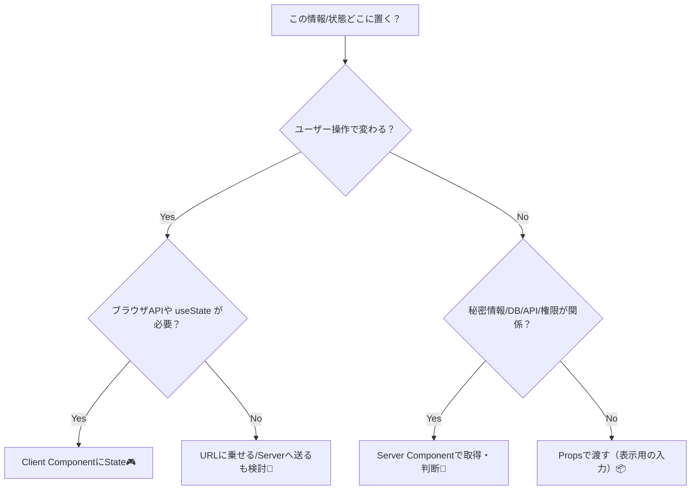
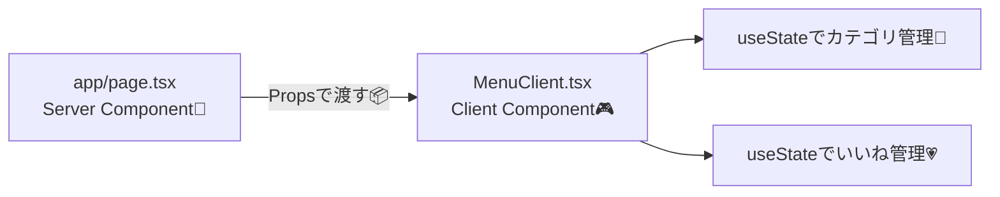

# 第255章：Server ComponentsとクライアントStateの境界線（どこまでProps？どこからState？）🪣

この章はひとことで言うと…
**「データはサーバー寄り、操作の気持ちはクライアント寄り」**です😊🧠💡

---

## 今日のゴール 🎯✨

* **Server Component（サーバー）** と **Client Component（ブラウザ）** の役割を分けられるようになる🧊🎮
* 「これは **Props** で渡す？それとも **State** で持つ？」が判断できるようになる🧭✨
* “境界線”をまたぐときの注意点（シリアライズ）を知る📦⚠️

---

## まず結論！境界線はこの3ルールでOK 🙆‍♀️✨

### 1) サーバーに置くもの（Server Components）🧊

* DBやAPIからの取得（fetch）📥
* 認証や権限チェック🔐
* 秘密情報（APIキーなど）🤫
* “最初に見せる画面”の組み立て（初期HTML）🏗️

✅ **理由：ブラウザにJSを送らずに済みやすくて速い**⚡

### 2) クライアントに置くもの（Client Components）🎮

* クリック、入力、開閉、タブ切り替え…みたいな操作🖱️⌨️
* `useState` / `useEffect` / ブラウザAPI（`localStorage` など）🌐
* その場のUI気分：「いいね」「選択中」「開いてる」💗📌

✅ **理由：ユーザー操作はブラウザで起きる**から！

### 3) 迷ったらコレ 🧭

* **みんなに同じ結果**でOK → サーバー寄り🧊
* **その人の操作で変わる** → クライアント寄り🎮
* **URLで共有・ブクマしたい** → URL（search params）寄り🔗✨（後の章で深掘りするよ）

---

## 図解：どっちに置く？判断フローチャート 🧠➡️🧊🎮




---

## Props と State の違い（超やさしく）🧸✨

* **Props**：外から渡される「材料」🥕
  → *最初から決まってることが多い*（データ・設定など）
* **State**：コンポーネントの「記憶」🧠
  → *ユーザー操作で変化する*（開閉・入力中・選択中など）

---

## 実装して体で覚えよう！ミニ例：カフェメニュー☕🍰（サーバー取得＋クライアント操作）

やることはこれ👇✨

* メニュー一覧は **サーバー**で用意🧊
* 「カテゴリ絞り込み」「いいね」は **クライアントState**で操作🎮💗

### ① ファイルを作る 📁✨

#### `app/page.tsx`（Server Componentのまま）🧊

```tsx
import MenuClient from "@/components/MenuClient";

type MenuItem = {
  id: number;
  name: string;
  category: "drink" | "food";
};

async function getMenuItems(): Promise<MenuItem[]> {
  // 本当はDBやAPIでもOK！（今は学習用に固定データ🍩）
  return [
    { id: 1, name: "抹茶ラテ", category: "drink" },
    { id: 2, name: "ほうじ茶ラテ", category: "drink" },
    { id: 3, name: "チーズケーキ", category: "food" },
    { id: 4, name: "ガトーショコラ", category: "food" },
  ];
}

export default async function Page() {
  const items = await getMenuItems();

  return (
    <main style={{ padding: 24, fontFamily: "sans-serif" }}>
      <h1>カフェメニュー ☕🍰</h1>
      <p>カテゴリで絞って、気に入ったら「いいね」してね💗</p>

      {/* Server → Client へ「材料（Props）」を渡す📦 */}
      <MenuClient items={items} />
    </main>
  );
}
```

#### `components/MenuClient.tsx`（Client Component）🎮

```tsx
"use client";

import { useMemo, useState } from "react";

type MenuItem = {
  id: number;
  name: string;
  category: "drink" | "food";
};

type Props = {
  items: MenuItem[];
};

export default function MenuClient({ items }: Props) {
  const [category, setCategory] = useState<"all" | MenuItem["category"]>("all");
  const [likedIds, setLikedIds] = useState<Set<number>>(() => new Set());

  const filteredItems = useMemo(() => {
    if (category === "all") return items;
    return items.filter((x) => x.category === category);
  }, [items, category]);

  const toggleLike = (id: number) => {
    setLikedIds((prev) => {
      const next = new Set(prev);
      if (next.has(id)) next.delete(id);
      else next.add(id);
      return next;
    });
  };

  return (
    <section style={{ marginTop: 16 }}>
      <div style={{ display: "flex", gap: 12, alignItems: "center" }}>
        <label>
          カテゴリ：
          <select
            value={category}
            onChange={(e) => setCategory(e.target.value as typeof category)}
            style={{ marginLeft: 8 }}
          >
            <option value="all">ぜんぶ✨</option>
            <option value="drink">ドリンク☕</option>
            <option value="food">フード🍰</option>
          </select>
        </label>

        <div>
          いいね数：<strong>{likedIds.size}</strong> 💗
        </div>
      </div>

      <ul style={{ marginTop: 12, paddingLeft: 18 }}>
        {filteredItems.map((item) => {
          const liked = likedIds.has(item.id);
          return (
            <li key={item.id} style={{ marginBottom: 10 }}>
              <span style={{ marginRight: 8 }}>
                {item.category === "drink" ? "☕" : "🍰"} {item.name}
              </span>

              <button
                type="button"
                onClick={() => toggleLike(item.id)}
                style={{
                  padding: "4px 10px",
                  borderRadius: 12,
                  border: "1px solid #ccc",
                  cursor: "pointer",
                }}
              >
                {liked ? "いいね済み💖" : "いいね🤍"}
              </button>
            </li>
          );
        })}
      </ul>
    </section>
  );
}
```

### ② 動かす ▶️✨

ターミナルで（Windowsでも同じだよ😊）

```bash
npm run dev
```

ブラウザで `http://localhost:3000` を開いて、絞り込み＆いいねが動けば成功🎉🎉🎉

---

## 図解：Server→Clientの境界ってこういう感じ 🧊➡️🎮



---

## ここが超大事！「Server→Clientに渡せるProps」注意点⚠️📦

Server ComponentからClient Componentに渡すPropsは、基本的に **“JSONっぽい形”** が安全だよ😊✨

* ✅ 文字列 / 数字 / 真偽値 / `null`
* ✅ 配列 / プレーンなオブジェクト

⚠️ `Date` / `Map` / `Set` / 関数 / クラスインスタンス みたいなのは、そのままだと困ることがあるので、**文字列にしたり形を整える**のがおすすめだよ🧼✨

---

## よくあるハマり集 🪤😵‍💫（先に回避！）

### ❌ Server Componentで `useState` したくなる

→ それは **Client Component** の仕事🎮✨
対策：`"use client"` を付けたコンポーネントに移す！

### ❌ “全部Clientにしちゃえ！”ってなる

→ 動くけど、JSが増えて重くなりやすい🥲📦
対策：**データ準備はサーバー、操作だけクライアント** の分業が気持ちいい💐

### ❌ Propsが巨大になって管理つらい

→ “境界線がズレてる”サインかも🧭
対策：

* 表示のためのデータ → Props
* その場の操作の記憶 → State
* 共有したい条件 → URLやサーバー保存（次の章以降で✨）

---

## ミニ課題（5〜15分）🏃‍♀️💨✨

1. 「いいね」ボタンの横に **“取消”** っぽい文言を付けてみる🧼
2. カテゴリに `dessert` を増やして、メニューも追加してみる🍨✨
3. 余裕があれば：いいね済みの行だけ **太字**にしてみる💪💗

---

## まとめ 🍀✨

* **サーバー（RSC）**：データ取得・権限・初期表示の土台🧊
* **クライアント（"use client"）**：操作・入力・その場の記憶（State）🎮
* **Props**は材料、**State**は気持ち（変化する記憶）🥕🧠
* 境界線を意識すると、アプリがスッキリして強くなるよ💪✨

次の第256章は、**Zustand/Jotaiに初期値を注入する（Hydrationパターン）**で、さらに“状態管理っぽさ”が出てくるよ〜🐻✨
