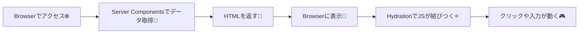
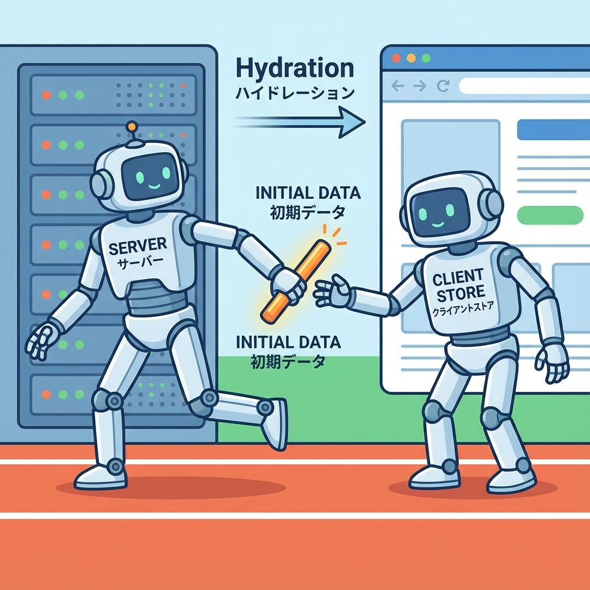
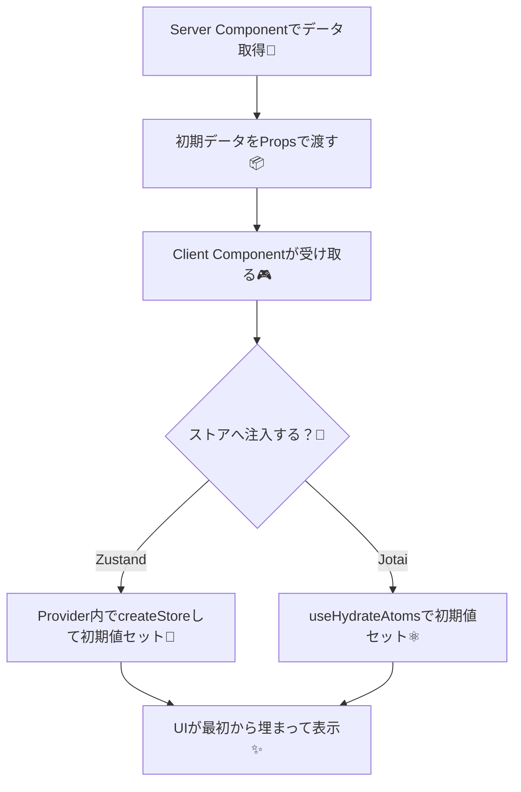
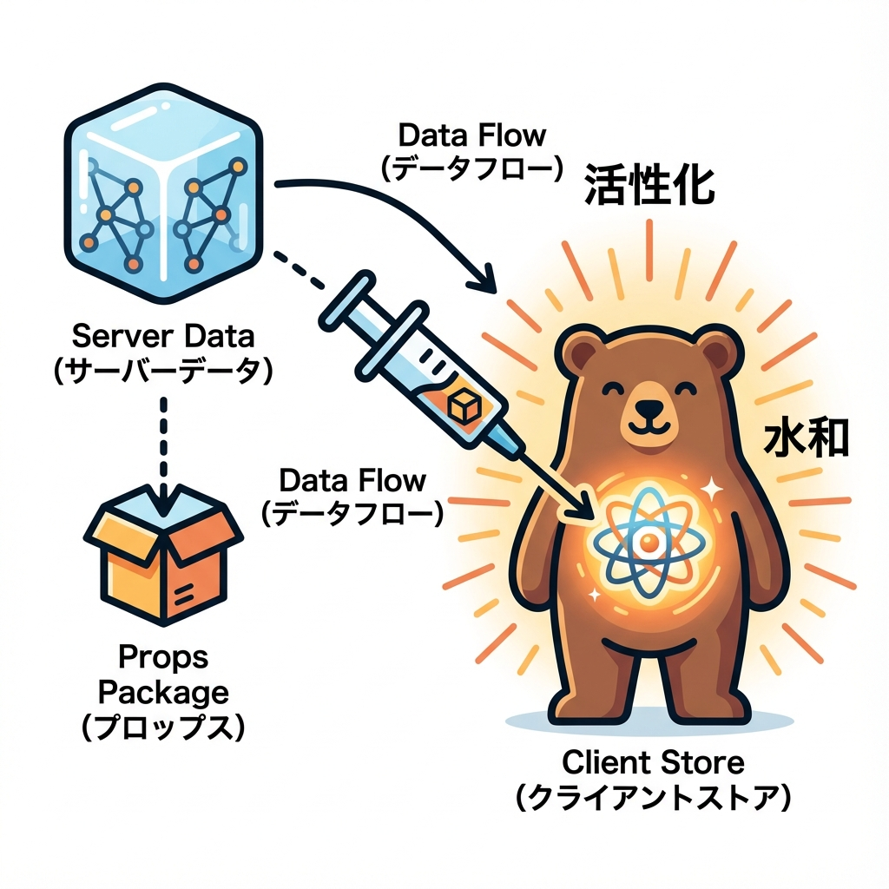

# 第256章：Zustand/Jotaiへの初期値注入（Hydrationパターン）🐻

この章は「**サーバーで取った最初のデータ**を、**クライアントのストア（Zustand/Jotai）に最初だけ注入する**」練習だよ〜！✨
これができると、初回表示がスムーズになって「一瞬空っぽ→あとから表示」の違和感が減ります😊🫶

---

## 今日のゴール🎯✨

* サーバー側（Server Component）で取得したデータを、クライアント側ストアに入れる🧊➡️🐻
* **Hydrationエラー**（表示の不一致）を避けるコツを知る🚫💥
* Zustand版・Jotai版の「よくある型」を手に入れる🧰💖

---

## まず「Hydration」ってなに？💧🤔

Next.js（App Router）は、最初にサーバーがHTMLを作って返してくれて、そのあとブラウザがJSで「操作できる状態」に仕上げます✨
この「**仕上げ作業**」が Hydration（ハイドレーション）だよ〜🧃



ここで、**サーバーが出したHTML** と **クライアントが最初に描く内容** がズレると…
「Hydration failed」みたいな警告が出たりします😵‍💫💦

---

## なぜ「初期値注入」が必要？🧠✨

たとえば「お気に入り講義リスト📚💗」を表示したいとして、

* サーバー：DB/APIからお気に入りを取って、最初から表示したい🧊
* クライアント：ボタンでお気に入りON/OFFしたい❤️↔️🩶（状態管理が欲しい）

このとき、クライアント側ストアが最初「空」だと…

* 初回表示：空っぽ😶
* ちょっと後：データが入って表示😮

みたいにチラつきやすいの。
だから「サーバーで取った初期データを、最初にストアへ入れる」＝初期値注入が効くよ💪✨

---

# ✅ Zustand版：初期値注入（Hydrationパターン）🐻🧊

ZustandはNext.jsでは「**グローバルなストアを共有しない**」のが大事だよ〜！
（リクエスト間で混ざるのを防ぐため） ([Zustand Documentation][1])

## 1) インストール📦✨

```bash
npm i zustand
```

---

## 2) ストアを「工場関数」で作る🏭🐻

**ポイント：createStore（vanilla）で“作れる形”にして、Providerの中で1回だけ作る！**✨

`src/stores/todoStore.ts`

```ts
import { createStore } from "zustand/vanilla";

export type Todo = {
  id: string;
  title: string;
  done: boolean;
};

export type TodoState = {
  todos: Todo[];
  toggle: (id: string) => void;
};

export type TodoStore = ReturnType<typeof createTodoStore>;

export function createTodoStore(initial?: Partial<TodoState>) {
  const defaultState: TodoState = {
    todos: [],
    toggle: () => {},
  };

  return createStore<TodoState>()((set, get) => ({
    ...defaultState,
    ...initial,
    toggle: (id) => {
      set({
        todos: get().todos.map((t) =>
          t.id === id ? { ...t, done: !t.done } : t
        ),
      });
    },
  }));
}
```

---

## 3) Provider（Client Component）で初期値を注入する💉✨

`src/components/TodoStoreProvider.tsx`

```tsx
"use client";

import React, { createContext, useContext, useRef } from "react";
import { useStore } from "zustand";
import { createTodoStore, type Todo, type TodoState, type TodoStore } from "@/stores/todoStore";

const TodoStoreContext = createContext<TodoStore | null>(null);

type Props = {
  initialTodos: Todo[];
  children: React.ReactNode;
};

export function TodoStoreProvider({ initialTodos, children }: Props) {
  const storeRef = useRef<TodoStore | null>(null);

  // ⭐ここが超重要：最初の1回だけストアを作って初期値を入れる
  if (!storeRef.current) {
    storeRef.current = createTodoStore({ todos: initialTodos });
  }

  return (
    <TodoStoreContext.Provider value={storeRef.current}>
      {children}
    </TodoStoreContext.Provider>
  );
}

export function useTodoStore<T>(selector: (state: TodoState) => T) {
  const store = useContext(TodoStoreContext);
  if (!store) throw new Error("TodoStoreProvider が見つからないよ🥺");
  return useStore(store, selector);
}
```

---

## 4) UI（Client Component）で使う🎮✨

`src/components/TodoList.tsx`

```tsx
"use client";

import { useTodoStore } from "@/components/TodoStoreProvider";

export function TodoList() {
  const todos = useTodoStore((s) => s.todos);
  const toggle = useTodoStore((s) => s.toggle);

  return (
    <div style={{ display: "grid", gap: 8 }}>
      {todos.map((t) => (
        <button
          key={t.id}
          onClick={() => toggle(t.id)}
          style={{
            textAlign: "left",
            padding: 12,
            borderRadius: 12,
            border: "1px solid #ddd",
            background: "white",
            cursor: "pointer",
          }}
        >
          {t.done ? "✅" : "⬜"} {t.title}
        </button>
      ))}
    </div>
  );
}
```

---

## 5) Server Component（page）で初期データを取って渡す🧊➡️🐻

`src/app/page.tsx`

```tsx
import { TodoStoreProvider } from "@/components/TodoStoreProvider";
import { TodoList } from "@/components/TodoList";

async function getInitialTodos() {
  // ここは本当はDBやAPIでもOK🧊
  return [
    { id: "1", title: "レポート提出する📄", done: false },
    { id: "2", title: "コンビニで買い物する🍙", done: true },
    { id: "3", title: "ゼミの資料読む📚", done: false },
  ];
}

export default async function Page() {
  const todos = await getInitialTodos();

  return (
    <main style={{ maxWidth: 520, margin: "40px auto", padding: 16 }}>
      <h1>TODO（初期値注入版）🐻🧊</h1>
      <p>最初からリストが出て、クリックで切り替えできるよ〜✨</p>

      <TodoStoreProvider initialTodos={todos}>
        <TodoList />
      </TodoStoreProvider>
    </main>
  );
}
```

---

# ✅ Jotai版：初期値注入（Hydrationパターン）⚛️🧊

Jotaiは `useHydrateAtoms` で「サーバーで取った初期値を、最初の描画で注入」できます✨
（これは **クライアント側で使うHook** だよ） ([Jotai][2])

## 1) インストール📦✨

```bash
npm i jotai
```

---

## 2) Atomを作る⚛️🧩

`src/atoms/todoAtoms.ts`

```ts
import { atom } from "jotai";

export type Todo = {
  id: string;
  title: string;
  done: boolean;
};

export const todosAtom = atom<Todo[]>([]);

export const toggleTodoAtom = atom(null, (get, set, id: string) => {
  const current = get(todosAtom);
  set(
    todosAtom,
    current.map((t) => (t.id === id ? { ...t, done: !t.done } : t))
  );
});
```

---

## 3) Hydrator（Client Component）で初期値を注入💉✨

`src/components/TodoHydrator.tsx`

```tsx
"use client";

import React from "react";
import { useHydrateAtoms } from "jotai/utils";
import { todosAtom, type Todo } from "@/atoms/todoAtoms";

type Props = {
  initialTodos: Todo[];
  children: React.ReactNode;
};

export function TodoHydrator({ initialTodos, children }: Props) {
  // ⭐初回だけ注入するイメージ
  useHydrateAtoms([[todosAtom, initialTodos]]);
  return <>{children}</>;
}
```

> 補足：`useHydrateAtoms` は「基本、初回Hydration向け」だよ〜。
> 画面遷移などで「値が変わる」ケースは、別途 `useEffect` で同期したい場面もあるよ。 ([GitHub][3])

---

## 4) UI（Client Component）で使う🎮✨

`src/components/TodoListJotai.tsx`

```tsx
"use client";

import { useAtomValue, useSetAtom } from "jotai";
import { todosAtom, toggleTodoAtom } from "@/atoms/todoAtoms";

export function TodoListJotai() {
  const todos = useAtomValue(todosAtom);
  const toggle = useSetAtom(toggleTodoAtom);

  return (
    <div style={{ display: "grid", gap: 8 }}>
      {todos.map((t) => (
        <button
          key={t.id}
          onClick={() => toggle(t.id)}
          style={{
            textAlign: "left",
            padding: 12,
            borderRadius: 12,
            border: "1px solid #ddd",
            background: "white",
            cursor: "pointer",
          }}
        >
          {t.done ? "✅" : "⬜"} {t.title}
        </button>
      ))}
    </div>
  );
}
```

---

## 5) Server Component（page）で初期値を渡す🧊➡️⚛️

`src/app/page.tsx`（Zustandの代わりにJotai版を置く例）

```tsx
import { TodoHydrator } from "@/components/TodoHydrator";
import { TodoListJotai } from "@/components/TodoListJotai";

async function getInitialTodos() {
  return [
    { id: "1", title: "ミーティング準備する📝", done: false },
    { id: "2", title: "洗濯する🧺", done: true },
  ];
}

export default async function Page() {
  const todos = await getInitialTodos();

  return (
    <main style={{ maxWidth: 520, margin: "40px auto", padding: 16 }}>
      <h1>TODO（Jotai 初期値注入版）⚛️🧊</h1>

      <TodoHydrator initialTodos={todos}>
        <TodoListJotai />
      </TodoHydrator>
    </main>
  );
}
```

---

## 図解：この章でやってる「初期値注入」の流れ💉🧊








---

## よくある落とし穴💥（ここだけ注意してね🥺）

* `"use client"` を付け忘れて、Hookが使えない😵‍💫
* 初期値に `Date` / `Map` / `Set` みたいな「そのままJSONにできないもの」を入れてしまう📦💥（まずはシンプルに！）
* Zustandを**ファイル先頭でグローバルに1個だけ作る**（リクエスト間で混ざりやすい）🚫🐻 ([Zustand Documentation][1])
* Jotaiの `useHydrateAtoms` に「あとから変わる値」を期待しすぎる（基本は初回注入向け）⚛️🧊 ([Jotai][2])

---

## ミニ課題🎒✨（10〜20分）

「お気に入り講義リスト📚💗」を作ろう！

* サーバーで `initialFavorites` を返す（配列でOK）🧊
* クライアントで「♡/♥ ボタン」でON/OFFできるようにする❤️↔️🩶
* ZustandかJotaiどっちかでOK（両方できたら天才🥳）

ヒント💡
「初期値注入」したあと、クリックでストア更新できたら勝ち〜！🏁✨

---

## まとめ🎀

* **Serverで取った初期データ**を、**Clientのストアに最初だけ注入**するのがHydrationパターン💉🧊
* Zustandは「Providerでストアを1回だけ生成」が王道🐻✨ ([Zustand Documentation][4])
* Jotaiは `useHydrateAtoms` でスッと注入できる⚛️✨ ([Jotai][2])

---

次の第257章は「Route Handlers / Server Actions からストアを更新」だね🤝✨
もし今の時点で「ZustandとJotai、どっちが合いそう？」って相談もしたければ、用途（TODO？検索フィルタ？カート？）を1行で言ってくれたら、サクッとおすすめ出すよ〜😊💖

[1]: https://zustand.docs.pmnd.rs/guides/nextjs?utm_source=chatgpt.com "Setup with Next.js - Zustand"
[2]: https://jotai.org/docs/utilities/ssr?utm_source=chatgpt.com "SSR — Jotai, primitive and flexible state management for ..."
[3]: https://github.com/pmndrs/jotai/discussions/2337?utm_source=chatgpt.com "Use Jotai in Next.js app router #2337"
[4]: https://zustand.docs.pmnd.rs/guides/initialize-state-with-props?utm_source=chatgpt.com "Initialize state with props - Zustand"
