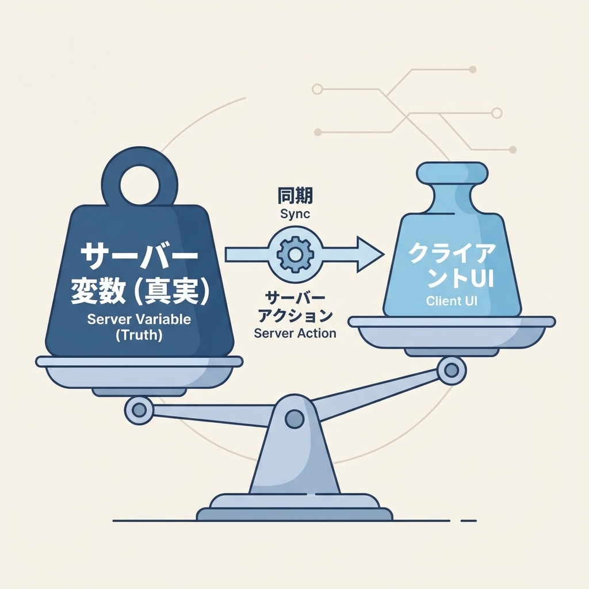
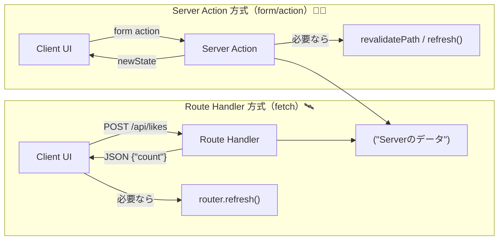
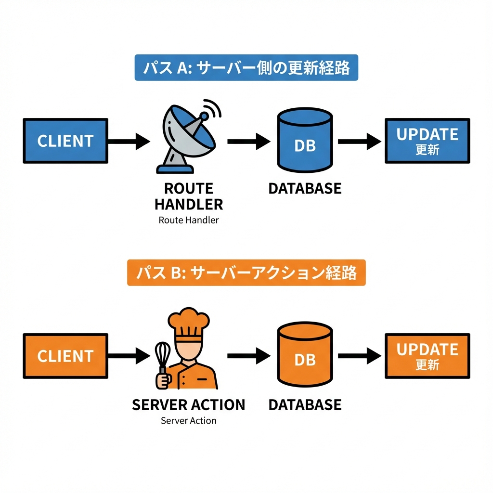

# 第257章：Route Handlers/Server ActionsからのState更新🤝

この章は「**サーバーに更新お願いして、画面の状態（state）を気持ちよく最新化する方法**」をやるよ〜！😊🫶
Next.js（App Router）だと、更新ルートが大きく **2つ** あるよ👇

* **Route Handlers（API）方式**：`fetch("/api/...")` して、返ってきた結果で state を更新する🛰️
* **Server Actions 方式**：`<form action={...}>` で送って、返ってきた結果で state を更新する🧑‍🍳

（※キャッシュや再描画の考え方もチラッと触れるよ💡） ([Next.js][1])

---

## 全体イメージ図🗺️✨（Route Handler と Server Action）






* `router.refresh()` は「今のルートをサーバーに取りに行って、Server Components を再描画」してくれるよ🔄（stateは基本そのまま） ([Next.js][2])
* `revalidatePath()` は「指定パスのキャッシュを無効化して、次の訪問（or refresh など）で新しくする」イメージだよ🧊➡️✨ ([Next.js][3])
* Server Actions からは `refresh()` 関数でクライアントルータ更新もできるよ（使える場所は Server Actions の中だけ）🪄 ([Next.js][4])



---

## ハンズオン🎮：いいね（Like）カウンターを2方式で作る👍💖

### できあがる画面イメージ🌸

* Route Handler 版：ボタン押す → `/api/likes` にPOST → 返ってきた `count` で state 更新✨
* Server Action 版：ボタン押す → Server Action 実行 → 返ってきた state で更新✨

---

# 1) サーバー側の「データ置き場」を作る🗄️（簡易版）

> 今回は説明用に **メモリ上の変数** を使うよ（本番はDBに置くのが基本だよ〜！）😇

**`app/_lib/likes.ts`**

```ts
import "server-only";

let likesCount = 0;

export async function getLikesCount() {
  return likesCount;
}

export async function incrementLikes() {
  likesCount += 1;
  return likesCount;
}

export async function resetLikes() {
  likesCount = 0;
  return likesCount;
}
```

`server-only` を入れておくと、うっかりクライアントで使っちゃう事故を減らせるよ🚧✨

---

# 2) Route Handler（API）を作る🛰️

**`app/api/likes/route.ts`**

```ts
import { NextResponse } from "next/server";
import { getLikesCount, incrementLikes, resetLikes } from "@/app/_lib/likes";

export const dynamic = "force-dynamic"; // キャッシュで混乱しにくくする用✨

export async function GET() {
  const count = await getLikesCount();
  return NextResponse.json({ count });
}

export async function POST() {
  const count = await incrementLikes();
  return NextResponse.json({ count });
}

export async function DELETE() {
  const count = await resetLikes();
  return NextResponse.json({ count });
}
```

`dynamic = "force-dynamic"` は「このルートは毎回動的にね！」の指定だよ🧊対策に便利✨ ([Next.js][5])

---

# 3) Server Action を作る🧑‍🍳（useActionState 用）

`useActionState` を使うと、Server Action が **`prevState` を第一引数で受け取る**形になるよ🧠✨ ([Next.js][6])

**`app/actions/likes.ts`**

```ts
"use server";

import { incrementLikes, resetLikes } from "@/app/_lib/likes";
import { revalidatePath } from "next/cache";

export type LikeState = {
  count: number;
  message: string | null;
};

export async function updateLikes(prevState: LikeState, formData: FormData): Promise<LikeState> {
  try {
    const intent = formData.get("intent");

    if (intent === "inc") {
      const count = await incrementLikes();
      revalidatePath("/state-update");
      return { count, message: "いいね +1 したよ〜！👍💖" };
    }

    if (intent === "reset") {
      const count = await resetLikes();
      revalidatePath("/state-update");
      return { count, message: "リセットしたよ🧹✨" };
    }

    return { ...prevState, message: "なに押した！？😳" };
  } catch {
    return { ...prevState, message: "失敗しちゃった…🥲 もう一回やってみて！" };
  }
}
```

---

# 4) クライアント：Route Handler 方式のコンポーネント🛰️

**`app/state-update/_components/LikeWithRouteHandler.tsx`**

```tsx
"use client";

import { useState } from "react";
import { useRouter } from "next/navigation";

type Props = {
  initialCount: number;
};

export function LikeWithRouteHandler({ initialCount }: Props) {
  const [count, setCount] = useState(initialCount);
  const [pending, setPending] = useState(false);
  const [msg, setMsg] = useState<string | null>(null);

  const router = useRouter();

  const call = async (method: "POST" | "DELETE") => {
    setPending(true);
    setMsg(null);

    try {
      const res = await fetch("/api/likes", { method });
      if (!res.ok) throw new Error("Request failed");

      const data: { count: number } = await res.json();
      setCount(data.count);
      setMsg("更新OK〜！✨");

      // Server Component 側の表示も最新化したい時は refresh すると安心👍
      router.refresh();
    } catch {
      setMsg("通信失敗…🥲（サーバー起動してる？）");
    } finally {
      setPending(false);
    }
  };

  return (
    <section style={{ border: "1px solid #ddd", padding: 12, borderRadius: 12 }}>
      <h3>Route Handler 方式🛰️</h3>

      <p>いいね数：<b>{count}</b> 👍</p>

      <div style={{ display: "flex", gap: 8 }}>
        <button onClick={() => call("POST")} disabled={pending}>
          {pending ? "更新中…⏳" : "👍 +1"}
        </button>

        <button onClick={() => call("DELETE")} disabled={pending}>
          {pending ? "更新中…⏳" : "🧹 リセット"}
        </button>
      </div>

      {msg && <p style={{ marginTop: 8 }}>{msg}</p>}
    </section>
  );
}
```

`router.refresh()` の説明は公式にもあるよ〜🔄✨ ([Next.js][2])

---

# 5) クライアント：Server Action 方式のコンポーネント🧑‍🍳

**`app/state-update/_components/LikeWithServerAction.tsx`**

```tsx
"use client";

import { useActionState } from "react";
import { updateLikes, type LikeState } from "@/app/actions/likes";

type Props = {
  initialCount: number;
};

export function LikeWithServerAction({ initialCount }: Props) {
  const initialState: LikeState = { count: initialCount, message: null };

  const [state, formAction, pending] = useActionState(updateLikes, initialState);

  return (
    <section style={{ border: "1px solid #ddd", padding: 12, borderRadius: 12 }}>
      <h3>Server Action 方式🧑‍🍳</h3>

      <p>いいね数：<b>{state.count}</b> 👍</p>

      <form action={formAction} style={{ display: "flex", gap: 8 }}>
        <button name="intent" value="inc" disabled={pending}>
          {pending ? "送信中…⏳" : "👍 +1"}
        </button>

        <button name="intent" value="reset" disabled={pending}>
          {pending ? "送信中…⏳" : "🧹 リセット"}
        </button>
      </form>

      {state.message && <p style={{ marginTop: 8 }}>{state.message}</p>}
    </section>
  );
}
```

`useActionState(action, initialState, ...)` の形は React 公式でもこの形だよ〜🧠✨ ([react.dev][7])
Next.js のフォームガイドも `useActionState` 前提で書かれてるよ📮 ([Next.js][6])

---

# 6) ページを作る🏠✨

**`app/state-update/page.tsx`**

```tsx
import { getLikesCount } from "@/app/_lib/likes";
import { LikeWithRouteHandler } from "./_components/LikeWithRouteHandler";
import { LikeWithServerAction } from "./_components/LikeWithServerAction";

export default async function StateUpdatePage() {
  const count = await getLikesCount();

  return (
    <main style={{ padding: 16, display: "grid", gap: 12 }}>
      <h1>State 更新デモ🤝✨</h1>

      <p style={{ margin: 0 }}>
        「Route Handler」か「Server Action」どっちでも更新できるよ👍💖
      </p>

      <div style={{ display: "grid", gap: 12, gridTemplateColumns: "repeat(auto-fit, minmax(280px, 1fr))" }}>
        <LikeWithRouteHandler initialCount={count} />
        <LikeWithServerAction initialCount={count} />
      </div>

      <p style={{ opacity: 0.75 }}>
        ※今回は説明用にメモリ上でカウントしてるよ〜！本番はDBにしようね😇🗄️
      </p>
    </main>
  );
}
```

---

## 動かし方（Windows）🪟💻✨

PowerShell でプロジェクト直下から👇

```bash
npm run dev
```

ブラウザで `http://localhost:3000/state-update` を開いて、ボタン連打してみてね😆👍💖

---

## もう一段理解するための「超大事ポイント」3つ💡✨

1. **更新の真実（ソース・オブ・トゥルース）はどこ？** 🧠

* 今回は「サーバーの変数」が真実だよ🗄️
* だからクライアントは「結果をもらって state を合わせる」感じ😊

2. **Route Handler 方式は“自分で state を更新する”** 🛠️

* `fetch` の戻り値（JSON）を `setState` して最新化するのが基本！

3. **Server Components の表示も最新にしたいなら refresh 系が効く** 🔄

* クライアントから `router.refresh()`（公式説明あり） ([Next.js][2])
* Server Action の中なら `refresh()` 関数もある（使える場所に制限あり） ([Next.js][4])
* キャッシュ無効化なら `revalidatePath()`（次の訪問/更新で効くイメージ） ([Next.js][3])

---

## ミニ課題🎓✨（10〜20分でOK！）

### 課題A：+10ボタン作ってみよ😆➕🔟

* Route Handler：`POST /api/likes` を10回呼ばずに、`POST /api/likes?by=10` みたいにしてみる（クエリ読む練習🕵️）
* Server Action：`intent="inc10"` を追加して分岐してみる

### 課題B：エラー表示を丁寧にする🫶🥲

* `res.ok` が false の時、`status` を表示してみる
* Server Action 側は `message` を「もう一回押してね🙏」みたいにする

---

## よくあるつまずき🪤😵‍💫

* **`fetch("/api/likes")` が 404** 👉 `app/api/likes/route.ts` の場所が合ってるか確認！📁
* **Server Action が動かない** 👉 ファイル先頭に `"use server"` があるか、そして Client Component から呼んでるか確認！🧑‍🍳
* **表示が更新されない気がする** 👉 `router.refresh()` を入れると「Server 側の見た目」も揃いやすいよ🔄 ([Next.js][2])
* **キャッシュで混乱** 👉 まずは `dynamic = "force-dynamic"` みたいに“動的に固定”して学ぶのがラク！🧊➡️🔥 ([Next.js][5])

---

## まとめ🎁✨

* **Route Handlers**：`fetch → JSON → setState` で更新🛰️
* **Server Actions**：`useActionState → action結果で state 更新` が気持ちいい🧑‍🍳
* **サーバー表示も揃える**：`router.refresh()` / `revalidatePath()` /（Server Action内の）`refresh()` を使い分け🔄🧊 ([Next.js][2])

次の章（Optimistic UI）に行くと「押した瞬間に先に増やす✨」みたいな“体験の良さ”まで作れるよ〜！🥳💖

[1]: https://nextjs.org/docs/app/guides/caching?utm_source=chatgpt.com "Guides: Caching"
[2]: https://nextjs.org/docs/app/api-reference/functions/use-router?utm_source=chatgpt.com "Functions: useRouter"
[3]: https://nextjs.org/docs/app/api-reference/functions/revalidatePath?utm_source=chatgpt.com "Functions: revalidatePath"
[4]: https://nextjs.org/docs/app/api-reference/functions/refresh?utm_source=chatgpt.com "Functions: refresh"
[5]: https://nextjs.org/docs/app/api-reference/file-conventions/route-segment-config?utm_source=chatgpt.com "File-system conventions: Route Segment Config"
[6]: https://nextjs.org/docs/app/guides/forms?utm_source=chatgpt.com "How to create forms with Server Actions"
[7]: https://react.dev/reference/react/useActionState?utm_source=chatgpt.com "useActionState"
