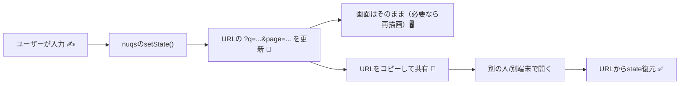
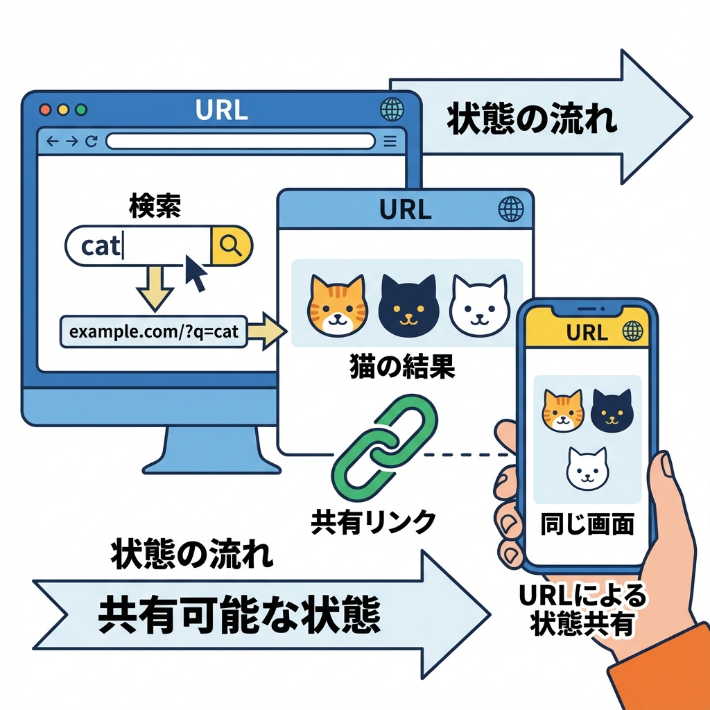
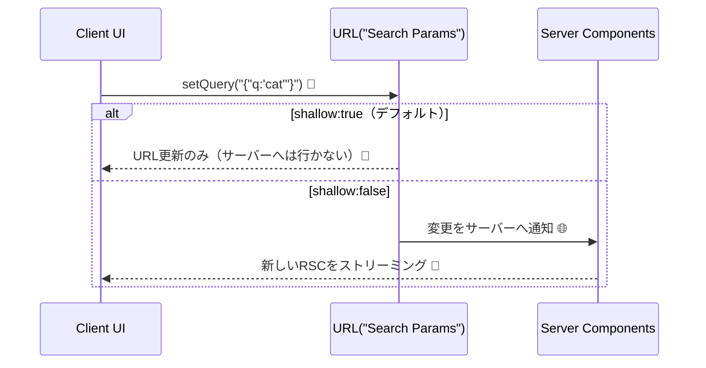

# 第258章：URL State Management（`nuqs`を活用する）🔗

この章は「検索条件・ページ番号・並び替え」みたいな **UIの状態をURL（`?q=...`）に保存して管理**するやつだよ〜😊
URLに入ってると、**リロードしても状態が残る**し、**URLをコピペして同じ画面を共有**できて最高👍

---

## 1) URL Stateってなに？🤔💡

たとえば商品一覧で…

* 検索ワード：`q=cat` 🐱
* ページ番号：`page=3` 📄
* 並び替え：`sort=price` 💰

みたいな状態を **URLに入れておく**イメージ✨
すると「このURL開いて〜📎」だけで、同じ状態を再現できるよ！





---

## 2) `nuqs`って何が嬉しいの？🧁

`nuqs`は、**`useState`みたいな書き心地**で、状態をURLのクエリ文字列に同期できるライブラリだよ✨
`useQueryState('name')` みたいに使うと、URLの `?name=...` と同期される感じ！ ([nuqs.dev][1])

しかも、数値とかも **パーサー（`parseAsInteger`など）**で型っぽく扱えるのが気持ちいい〜🧠✨ ([nuqs.dev][1])

---

## 3) セットアップ（Next.js App Router）🛠️✨

### 3-1. インストール 📦

ターミナル（PowerShellでもOK）で：

```bash
npm install nuqs
```

`nuqs@^2` は Next.js（App Router含む）をサポートしてるよ〜 ([nuqs.dev][2])

### 3-2. `NuqsAdapter` を RootLayout に付ける（重要！）🧩

`nuqs` v2 は、Next.jsで使うとき **`NuqsAdapter` で全体をラップ**する必要があるよ！ ([nuqs.dev][3])

`app/layout.tsx`（または `src/app/layout.tsx`）をこう👇

```tsx
import { NuqsAdapter } from 'nuqs/adapters/next/app'
import type { ReactNode } from 'react'

export default function RootLayout({ children }: { children: ReactNode }) {
  return (
    <html lang="ja">
      <body>
        <NuqsAdapter>{children}</NuqsAdapter>
      </body>
    </html>
  )
}
```

---

## 4) 実装してみよう：検索＋ページ番号をURLで管理 🔎📄✨

今回は `/products` を作って、検索とページをURLに入れちゃうよ〜！

### 4-1. `app/products/page.tsx`（ページ側）

```tsx
import ProductsClient from './products-client'

export default function ProductsPage() {
  return (
    <main style={{ padding: 24 }}>
      <h1>商品一覧 🛍️</h1>
      <ProductsClient />
    </main>
  )
}
```

### 4-2. `app/products/products-client.tsx`（クライアント側）

* `q` と `page` をまとめて管理するために `useQueryStates` を使うよ✨ ([nuqs.dev][4])
* `withDefault` を使うと `null` 対策がラクになるよ〜😊 ([nuqs.dev][1])
* `setQuery(null)` で、このフックが管理してるキーをまとめて消せるよ🧹 ([nuqs.dev][4])

```tsx
'use client'

import * as React from 'react'
import { useQueryStates, parseAsInteger, parseAsString } from 'nuqs'

const ITEMS = Array.from({ length: 120 }, (_, i) => ({ id: i + 1, name: `Item ${i + 1}` }))

export default function ProductsClient() {
  const [{ q, page }, setQuery] = useQueryStates(
    {
      q: parseAsString.withDefault(''),
      page: parseAsInteger.withDefault(1),
    },
    {
      // 入力のたびに履歴が増えると大変なので、基本はreplaceが安心👌
      // （nuqsのデフォルトも replace 寄りの考え方だよ） :contentReference[oaicite:7]{index=7}
      history: 'replace',
    }
  )

  const pageSize = 12

  const filtered = React.useMemo(() => {
    const s = q.trim().toLowerCase()
    if (!s) return ITEMS
    return ITEMS.filter((x) => x.name.toLowerCase().includes(s))
  }, [q])

  const maxPage = Math.max(1, Math.ceil(filtered.length / pageSize))
  const safePage = Math.min(Math.max(1, page), maxPage)

  React.useEffect(() => {
    if (safePage !== page) {
      void setQuery({ page: safePage })
    }
  }, [page, safePage, setQuery])

  const start = (safePage - 1) * pageSize
  const pageItems = filtered.slice(start, start + pageSize)

  return (
    <div style={{ display: 'grid', gap: 12 }}>
      <label style={{ display: 'grid', gap: 6 }}>
        検索（名前）🔎
        <input
          value={q}
          placeholder="例：Item 2"
          onChange={(e) => void setQuery({ q: e.target.value, page: 1 })}
          style={{ padding: 8 }}
        />
      </label>

      <div>いまのURL状態： q =「{q || '(空)'}」 / page = {safePage} 📎</div>

      <ul
        style={{
          display: 'grid',
          gridTemplateColumns: 'repeat(3, minmax(0, 1fr))',
          gap: 8,
          listStyle: 'none',
          padding: 0,
          margin: 0,
        }}
      >
        {pageItems.map((item) => (
          <li key={item.id} style={{ border: '1px solid #ddd', borderRadius: 8, padding: 10 }}>
            #{item.id} {item.name} 🛍️
          </li>
        ))}
      </ul>

      <div style={{ display: 'flex', gap: 8, alignItems: 'center' }}>
        <button onClick={() => void setQuery({ page: Math.max(1, safePage - 1) })} disabled={safePage <= 1}>
          ◀ 前
        </button>

        <span>
          {safePage} / {maxPage} 📄
        </span>

        <button onClick={() => void setQuery({ page: Math.min(maxPage, safePage + 1) })} disabled={safePage >= maxPage}>
          次 ▶
        </button>

        <button onClick={() => void setQuery(null)} style={{ marginLeft: 'auto' }}>
          条件を全部クリア 🧹
        </button>
      </div>
    </div>
  )
}
```

✅ これで、検索するとURLが `?q=...&page=...` に変わるよ！
URLコピペで同じ状態に戻れるはず〜📎✨

---

## 5) よく使うオプション（ここ超大事）⚙️✨

`nuqs`はデフォルトでこんな動きになってるよ👇

* **クライアントだけでURL更新（サーバーにリクエストしない）**
* **履歴は `replace`（履歴が増えにくい）**
* **スクロールは勝手に上へ戻さない**
* **URL更新はブラウザに合わせて間引き（throttle）** ([nuqs.dev][5])

### 履歴：`history: 'replace' | 'push'` 🧭

* `'replace'`：入力しても履歴が増えない（基本これが安心） ([nuqs.dev][5])
* `'push'`：状態変化ごとに履歴が積まれて「戻る」で状態が戻せる（タブ切替・モーダルとかに向く）
  ※やりすぎると「戻るボタン壊れた😇」ってなるので注意！ ([nuqs.dev][5])

### サーバーも更新したい：`shallow: false` 🌐

`shallow: false` にすると、URL変更をサーバーにも知らせて **RSC側も再レンダリング**させられるよ！ ([nuqs.dev][5])



### 検索ボックスは「最後の入力だけURLに反映」したい😵‍💫➡️😊

入力って連打になるから、`limitUrlUpdates: debounce(500)` が便利！
しかも **UIのstateは即時更新で、URL更新だけ遅らせる** っていう設計なのがありがたい✨ ([nuqs.dev][5])

```tsx
'use client'

import { useQueryState, parseAsString, debounce } from 'nuqs'

export function SearchBox() {
  const [q, setQ] = useQueryState(
    'q',
    parseAsString.withDefault('').withOptions({ history: 'replace' })
  )

  return (
    <input
      value={q}
      onChange={(e) =>
        void setQ(e.target.value, {
          // 空に戻す時は即反映、それ以外は0.5秒待つ💤
          limitUrlUpdates: e.target.value === '' ? undefined : debounce(500),
        })
      }
      placeholder="検索…🔎"
    />
  )
}
```

---

## 6) おまけ：URLのキーを短くできる（`urlKeys`）✂️🔗

「コードでは `searchText` って呼びたいけど、URLは `q` がいい！」みたいなときに使える✨
`useQueryStates` の `urlKeys` で変換できるよ〜 ([nuqs.dev][4])

---

## 7) よくあるハマり 🧯😵‍💫

* `NuqsAdapter` を付け忘れて動かない（v2は必須だよ〜） ([nuqs.dev][3])
* `useQueryState(s)` を使うファイルに `'use client'` を書き忘れる（フックなのでクライアント側！） ([nuqs.dev][1])
* 検索入力で `history: 'push'` にして「戻る」がカオス（検索は基本 `replace` がおすすめ） ([nuqs.dev][5])

---

## まとめ 🥳🎉

* URLに状態を入れると「共有」「復元」「デバッグ」が強くなる🔗
* `nuqs`は `useState`っぽく書けるのが楽ちん🧁 ([nuqs.dev][1])
* v2は `NuqsAdapter` が必要！ ([nuqs.dev][3])
* 検索は `history: 'replace'` + debounce が気持ちいい💤 ([nuqs.dev][5])

---

## ミニ課題 🎓✨（10〜20分でOK！）

次の状態をURLに入れて管理してみてね👇（全部できたら超えらい！🥹🫶）

* `q`：検索文字 🔎（debounceつき）
* `page`：ページ番号 📄（1始まり）
* `sort`：`'new' | 'price'` みたいな並び替え 💰
* 「クリア」ボタンで全部消す 🧹

できたら、そのURLをコピペして **リロードしても同じ状態**になるか確認してみよ〜📎✨

[1]: https://nuqs.dev/docs/basic-usage "Basic usage | nuqs"
[2]: https://nuqs.dev/docs/installation "Installation | nuqs"
[3]: https://nuqs.dev/docs/adapters "Adapters | nuqs"
[4]: https://nuqs.dev/docs/batching "useQueryStates | nuqs"
[5]: https://nuqs.dev/docs/options "Options | nuqs"
