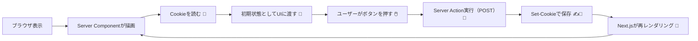
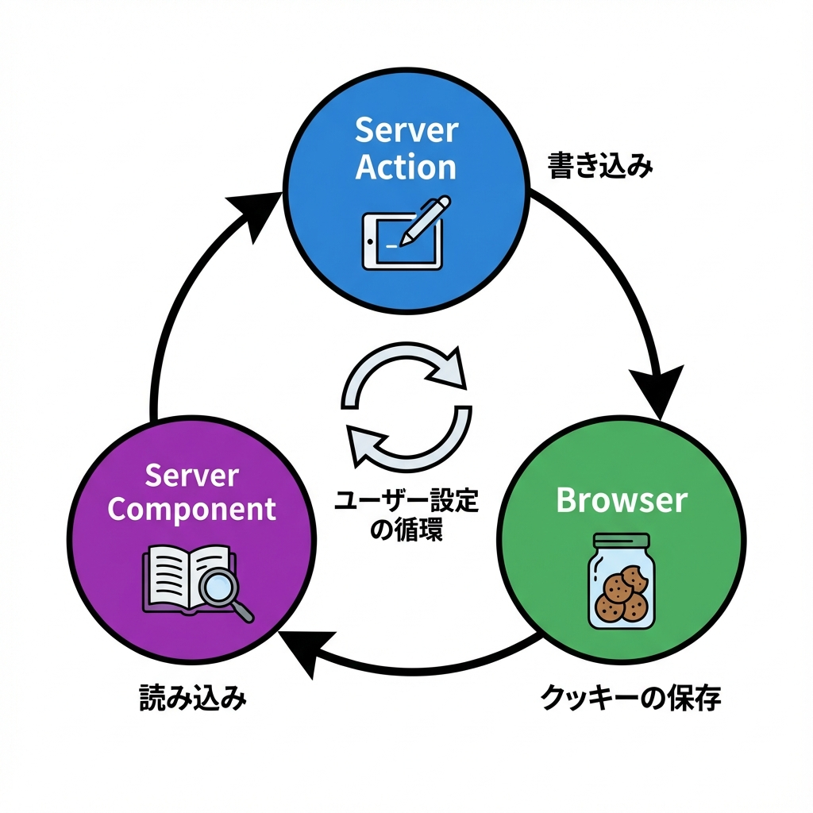

# 第259章：Cookieをストアの永続化に使う（サーバーサイドでの読み書き）🍪

今日のゴールはこれです👇😊
**「表示モード（カード/リスト）」を Cookie に保存して、ページを更新しても覚えておく**ミニ機能を作ります🎀

---

## 1) Cookieって、なにが嬉しいの？🍪🤔

Cookie は「ブラウザに保存される小さなメモ」みたいなものです📒✨
Next.js だと、

* **サーバー側**：リクエストと一緒に送られてくる Cookie を読める👀
* **サーバー側**：レスポンスで `Set-Cookie` を返して「これ保存してね！」ってお願いできる📮

…という形で **“サーバーから見える永続化”** ができるのが強みです💪
`localStorage` と違って、**最初の表示（SSR）から好みを反映しやすい**のがポイントです🌸

> 注意：`cookies()` は **Dynamic API** なので、ページやレイアウトで使うと「動的レンダリング寄り」になります🌀（キャッシュ挙動に影響） ([Next.js][1])

---

## 2) 重要ルール（ここだけ覚えて〜！）🧠✨

### ✅ ルールA：読むのは Server Component でOK 👀

`app/page.tsx` とか `layout.tsx`（Server Component）で読めます🙆‍♀️ ([Next.js][1])

### ✅ ルールB：**書く（set/delete）は Server Action か Route Handler だけ** ✍️

Cookie は **HTTPヘッダー**で設定するので、**`.set()`/`.delete()` は Server Action / Route Handler でやる**必要があります🍪📨 ([Next.js][1])

### ✅ ルールC：最近は `cookies()` が async だよ（awaitする）⏳

公式例でも `(await cookies())` になってます👀 ([Next.js][1])

---

## 3) 全体の流れを図でつかむ🗺️✨（Mermaid）



> Server Action で Cookie を set/delete すると、Next.js は **ページ/レイアウトをサーバーで再レンダリング**して UI を更新してくれます🔁 ([Next.js][1])



---

## 4) ハンズオン：表示モードをCookieで覚える📦🍪

### 作るファイル一覧🗂️

* `app/actions.ts`（Server Action で Cookie を保存）
* `app/view-mode-switcher.tsx`（ボタンUI：Client Component）
* `app/page.tsx`（Cookie を読んで表示）

---

### 4-1) `app/actions.ts` を作る（Cookieを書き込む）✍️🍪

```ts
'use server'

import { cookies } from 'next/headers'

type Mode = 'card' | 'list'

function toMode(value: unknown): Mode | null {
  return value === 'card' || value === 'list' ? value : null
}

export async function setViewMode(formData: FormData) {
  const mode = toMode(formData.get('mode'))
  if (!mode) return

  const cookieStore = await cookies()

  cookieStore.set('viewMode', mode, {
    path: '/',                 // どのページでも使えるようにする
    maxAge: 60 * 60 * 24 * 30, // 30日
    sameSite: 'lax',
    // secure: true,           // 本番HTTPSで使う時にON（localhostだと効かないことがあるよ⚠️）
    // httpOnly: true,         // JSから読ませたくないならON（UI設定ならOFFでもOK）
  })
}
```

ポイント🎯

* `path: '/'` を忘れると「特定ページだけ有効」になって、え？ってなりがちです😵‍💫
* `secure: true` は **HTTPS のとき**に使うのが安全（開発中は外すのが無難）🧊

---

### 4-2) `app/view-mode-switcher.tsx`（Client側の操作UI）🎛️✨

```tsx
'use client'

import { setViewMode } from './actions'

type Props = {
  currentMode: 'card' | 'list'
}

export default function ViewModeSwitcher({ currentMode }: Props) {
  return (
    <form action={setViewMode} style={{ display: 'flex', gap: 8, alignItems: 'center' }}>
      <button
        type="submit"
        name="mode"
        value="card"
        aria-pressed={currentMode === 'card'}
        style={{
          padding: '8px 12px',
          borderRadius: 8,
          border: '1px solid #ccc',
          background: currentMode === 'card' ? '#eee' : 'white',
          cursor: 'pointer',
        }}
      >
        🃏 カード表示
      </button>

      <button
        type="submit"
        name="mode"
        value="list"
        aria-pressed={currentMode === 'list'}
        style={{
          padding: '8px 12px',
          borderRadius: 8,
          border: '1px solid #ccc',
          background: currentMode === 'list' ? '#eee' : 'white',
          cursor: 'pointer',
        }}
      >
        📋 リスト表示
      </button>

      <span style={{ opacity: 0.7 }}>いま：{currentMode === 'card' ? 'カード' : 'リスト'} ✨</span>
    </form>
  )
}
```

ここ、地味に良いところ💡
`<form action={...}>` なので、**JSがまだ読み込まれてなくても送信できる**動きになりやすいです📨（堅い✨）

---

### 4-3) `app/page.tsx`（Server側でCookieを読む）👀🍪

```tsx
import { cookies } from 'next/headers'
import ViewModeSwitcher from './view-mode-switcher'

type Mode = 'card' | 'list'

function normalizeMode(value: string | undefined): Mode {
  return value === 'list' ? 'list' : 'card'
}

export default async function Page() {
  const cookieStore = await cookies()
  const mode = normalizeMode(cookieStore.get('viewMode')?.value)

  return (
    <main style={{ padding: 24, fontFamily: 'system-ui' }}>
      <h1 style={{ fontSize: 24, marginBottom: 8 }}>学科掲示板（ミニ）🎓💬</h1>
      <p style={{ marginBottom: 16 }}>
        Cookieで「表示モード」を覚えるよ〜🍪✨（更新しても残る！）
      </p>

      <ViewModeSwitcher currentMode={mode} />

      <hr style={{ margin: '16px 0' }} />

      {mode === 'card' ? (
        <section style={{ display: 'grid', gridTemplateColumns: 'repeat(3, minmax(0, 1fr))', gap: 12 }}>
          {['数学', '文学', '情報'].map((x) => (
            <article key={x} style={{ border: '1px solid #ddd', borderRadius: 12, padding: 12 }}>
              <h2 style={{ margin: 0 }}>{x} 📘</h2>
              <p style={{ margin: '8px 0 0', opacity: 0.8 }}>カードっぽい見た目🫶</p>
            </article>
          ))}
        </section>
      ) : (
        <ul style={{ lineHeight: 2 }}>
          {['数学', '文学', '情報'].map((x) => (
            <li key={x}>{x} 📌（リスト表示）</li>
          ))}
        </ul>
      )}
    </main>
  )
}
```

---

## 5) 動いたかチェック✅🍪

1. `npm run dev` で起動🌈
2. ボタン押して表示が切り替わる🎛️
3. **ページ更新（F5）しても同じ表示が続く** → 成功🎉
4. Chromeなら DevTools → Application → Cookies を見ると `viewMode` がいるはず👀🍪

---

## 6) よくあるハマりポイント集🪤😵‍💫

* **Q：押したのに反映が遅い/変わらない**
  → Cookie の set は **Server Action / Route Handler でしかできない**よ！Server Component に `.set()` 書いてない？👀 ([Next.js][1])

* **Q：cookie が保存されない**
  → `secure: true` を localhost（http）で使ってない？⚠️（本番HTTPS向け）
  → `path: '/'` がないと「そのページだけ」になって見失うことあるよ〜🫠

* **Q：`cookies()` でエラー**
  → 今どきは `const cookieStore = await cookies()` が基本✨ ([Next.js][1])

---

## 7) もう一歩：Route Handlerで書くパターン（参考）🚪🍪

「Server Actionじゃなくて、APIにして叩きたい！」ってときは Route Handler でもOKです🙆‍♀️
その場合、レスポンス側で `Set-Cookie` を付けるイメージになります📦
`NextResponse` はレスポンスの Cookie（Set-Cookie）を操作できます🍪 ([Next.js][2])

---

## 8) ミニ練習問題（おすすめ）📚✨

1. Cookie 名を `viewMode` → `campusViewMode` に変えてみる🍪
2. 期限を「7日」にしてみる⏳
3. もう1つ追加：`fontSize`（small/medium/large）も Cookie に保存してみる🔤✨

---

## まとめ🎀

* Cookie は「**サーバーから読める永続化**」ができるのが強い🍪✨
* **読む：Server Component OK**、**書く：Server Action / Route Handler 限定**✍️ ([Next.js][1])
* 書いた後は Next.js が再レンダリングして UI を合わせてくれる🔁 ([Next.js][1])

次の章で「Context APIをどう使う？」に行く前に、Cookieで“状態の地盤”が作れるようになった感じです😊🧱✨

[1]: https://nextjs.org/docs/app/api-reference/functions/cookies "Functions: cookies | Next.js"
[2]: https://nextjs.org/docs/app/api-reference/functions/next-response "Functions: NextResponse | Next.js"
