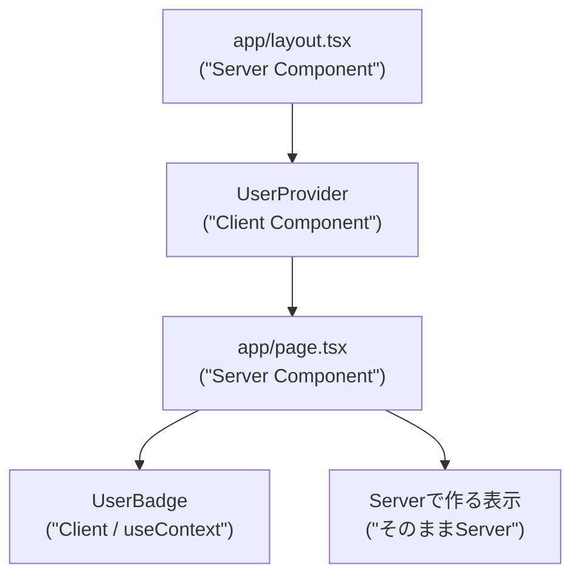
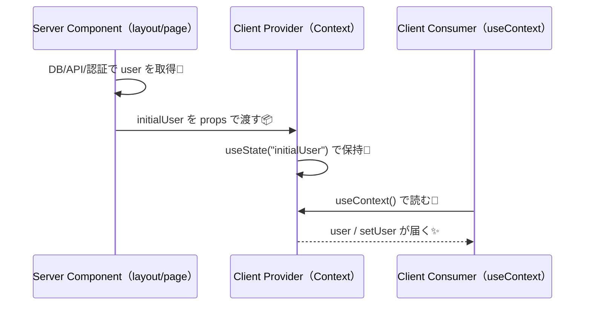

# 第260章：Context API は Server Components 時代にどう使う？🔦

この章は一言でいうと…
**「Context は “クライアントの世界” の道具なので、Server Components（RSC）からは直接使えないよ！でも “橋渡し” すれば気持ちよく使えるよ！」** です😊
Next.js（App Router）では **ページやlayoutは基本 Server Component** なので、ここを勘違いしやすいんだよね〜！ ([Next.js][1])

---

## まず結論 🎯（ここだけ覚えれば勝ち✨）

* ✅ **Context（createContext / useContext）は Client Component で使うもの**
* ✅ **Server Component からは Context を作れない＆読めない**（やるとエラー） ([Next.js][2])
* ✅ でも **Server → Client に props で初期値を渡して、Client 側の Provider で配る**のはOK🙆‍♀️ ([Vercel][3])
* ✅ Provider をアプリ全体に置くと **そこが “クライアント化” しやすい**ので、できれば **必要な範囲だけ**に置くのがおすすめ🧠✨（後で解説するね）

---

## 図解：Server/Client の境界と Context の住みか 🧊🎮



ポイント💡

* `UserProvider` は **Client** だから Context を扱える🎮
* `page.tsx` は **ServerのままでもOK**🍵（ただし Server は Context を読めないよ！）


---

## よくある地雷 💣：「Server Component で createContext しちゃった！」

たとえばこれ👇（**やりがち**）

```tsx
// ❌ app/bad-context.tsx（Server扱い）
import { createContext } from "react";

export const BadContext = createContext(null);
```

これをやると Next.js は **「Server Component で createContext 使ってるよ」**ってエラーにしてくれます⚠️
対処はシンプルで、**Context定義ファイルを Client Component にする（"use client"）**です。 ([Next.js][2])

---

## 実践：Serverで取った「ユーザー情報」を Context で配る 👤🌸

### 完成イメージ ✨

* Server（`layout.tsx`）でユーザーを取得（ここではダミーでOK😊）
* Client（`UserProvider`）に `initialUser` を props で渡す
* Client（`UserBadge`）が `useContext` で表示＆ボタンで切替🔁

---

### 1) ファイル構成（この形にするよ📁）

```text
app/
  layout.tsx
  page.tsx
  lib/
    getUser.ts
  user-context.tsx
components/
  UserBadge.tsx
```

---

### 2) Server側：ユーザー取得（ダミーでOK）👩‍💻🍵

```ts
// app/lib/getUser.ts
export type User = {
  name: string;
  faculty: string;
};

export async function getUser(): Promise<User | null> {
  // 本当はDBや認証から取る想定だよ😊
  return { name: "あおい", faculty: "経済学部" };
}
```

---

### 3) Client側：Context と Provider を作る 🔦✨

```tsx
// app/user-context.tsx
"use client";

import React, { createContext, useContext, useMemo, useState } from "react";
import type { User } from "@/app/lib/getUser";

type UserState = {
  user: User | null;
  setUser: (u: User | null) => void;
};

const UserContext = createContext<UserState | null>(null);

export function UserProvider({
  initialUser,
  children,
}: {
  initialUser: User | null;
  children: React.ReactNode;
}) {
  const [user, setUser] = useState<User | null>(initialUser);

  const value = useMemo(() => ({ user, setUser }), [user]);

  return <UserContext.Provider value={value}>{children}</UserContext.Provider>;
}

export function useUser() {
  const ctx = useContext(UserContext);
  if (!ctx) throw new Error("useUser must be used within <UserProvider />");
  return ctx;
}
```

ここが超重要✅

* `"use client"` があるから Context を使える🎮
* Server から渡すのは **シリアライズできる普通のデータ**（文字/数値/配列/プレーンobject）にしよう📦✨
  （関数とかクラスとかDateそのままとかは避けよ〜）

---

### 4) Server layout で Provider を挟む 🧱✨

```tsx
// app/layout.tsx
import "./globals.css";
import { UserProvider } from "./user-context";
import { getUser } from "./lib/getUser";

export default async function RootLayout({
  children,
}: {
  children: React.ReactNode;
}) {
  const user = await getUser();

  return (
    <html lang="ja">
      <body>
        <UserProvider initialUser={user}>{children}</UserProvider>
      </body>
    </html>
  );
}
```

この形は **Next.jsでも推奨される “Client Provider を Server から包む” パターン**だよ🙆‍♀️ ([Vercel][3])

---

### 5) Client：Contextを読むコンポーネントを作る 👤🔦

```tsx
// components/UserBadge.tsx
"use client";

import { useUser } from "@/app/user-context";

export function UserBadge() {
  const { user, setUser } = useUser();

  return (
    <div style={{ display: "flex", gap: 12, alignItems: "center" }}>
      <p>👤 {user ? `${user.name}（${user.faculty}）` : "ゲスト"}</p>

      <button
        type="button"
        onClick={() =>
          setUser(user ? null : { name: "あおい", faculty: "経済学部" })
        }
      >
        {user ? "ログアウトっぽくする🚪" : "ログインっぽくする🔑"}
      </button>
    </div>
  );
}
```

---

### 6) Server：ページで表示してみる 🏫🌸

```tsx
// app/page.tsx
import { UserBadge } from "@/components/UserBadge";

export default function Page() {
  return (
    <main style={{ padding: 24 }}>
      <h1>学内ポータル（ミニ）🌸</h1>

      <UserBadge />

      <p>この文章は Server Component で描画されてるよ🍵</p>
    </main>
  );
}
```

---

## 図解：データが流れる道 📨➡️🧠➡️🔦



---

## Provider は「どこに置く？」のコツ 📍✨

* ✅ **UI全体に関わるもの**（テーマ・言語・ログイン表示など）だけ、上の方に置く
* ✅ それ以外は **必要な画面グループの layout にだけ置く**のがキレイ🧼
  例：`app/(portal)/layout.tsx` だけ `UserProvider` を置く、みたいにね📦

Vercelのガイドでも「RSCはContextを直接扱えないので、Client Providerで包む」方針がはっきり書かれてるよ〜！ ([Vercel][3])

---

## まとめ 🌟（この章の合言葉）

* **Context は Client の道具**🎮
* **Server は Context を作れない・読めない**🧊 ([Next.js][2])
* **Serverで取った値 → props → Client Provider → Clientで useContext** が王道🔦✨

---

## ミニ課題 🎀（5〜10分でOK）

1. `UserBadge` の横に「学年」も表示してみよ📛
2. `setUser` の切替を、ボタン2個（ログイン/ログアウト）にしてみよ🔘🔘
3. Provider を RootLayout じゃなくて Route Group の layout に移す想像をしてみよ📦🧠
   （「どこまでがProviderの影響範囲？」を考えられると一気に強くなるよ✨）

---

次の第261章は **Optimistic UI（useOptimistic）**で「操作した瞬間に反映される✨」体験を作る話だから、ここ（Contextの置き場所感覚）がめちゃ効いてくるよ〜！🚀

[1]: https://nextjs.org/docs/app/getting-started/server-and-client-components?utm_source=chatgpt.com "Getting Started: Server and Client Components"
[2]: https://nextjs.org/docs/messages/context-in-server-component?utm_source=chatgpt.com "createContext in a Server Component"
[3]: https://vercel.com/kb/guide/react-context-state-management-nextjs?utm_source=chatgpt.com "Using React Context for State Management with Next.js"
